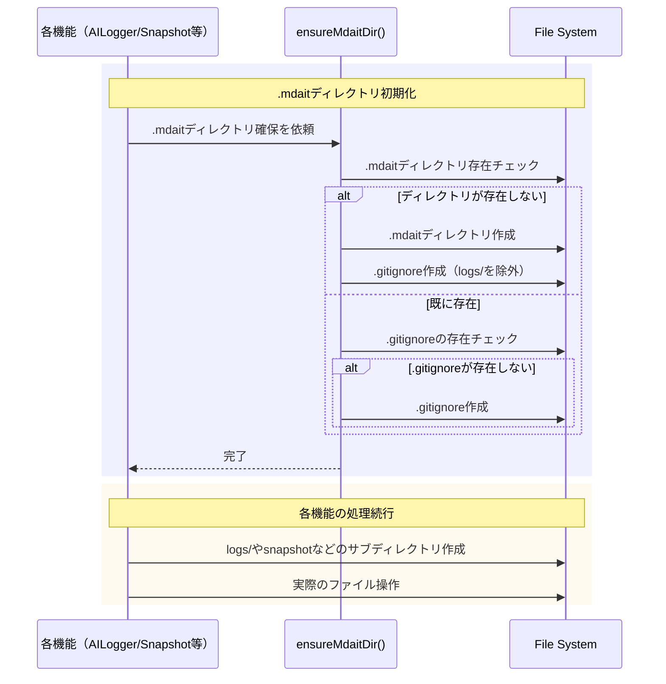

# 作業チケット: .mdaitディレクトリ作成時の.gitignore自動生成

## 1. 概要と方針

.mdaitディレクトリ初回作成時に`.mdait/.gitignore`を自動生成し、logsディレクトリを除外する。専用の初期化関数を作成し、各機能から呼び出す形で実装する。

## 2. シーケンス図

## 3. 考慮事項

- **冪等性**: 複数回呼び出されても安全に動作すること
- **既存環境への影響**: 既に.mdaitディレクトリが存在する環境でも、.gitignoreが無い場合は追加する
- **パフォーマンス**: 初回のみファイルシステムアクセスが発生する実装とする
- **エラーハンドリング**: .gitignore作成失敗時も本機能には影響させない（ベストエフォート）
- **テストへの影響**: 既存のテストコードで.mdaitディレクトリを作成している箇所を確認

## 4. 実装計画と進捗

- [x] utils/mdait-dir.ts に初期化関数を実装
- [x] ai-stats-logger.ts に初期化関数を統合
- [x] snapshot-manager.ts に初期化関数を統合
- [x] その他の.mdait利用箇所に統合
- [x] 単体テストを実装
- [x] 既存テストが正常動作することを確認
- [x] wishlist.mdから該当項目を削除
