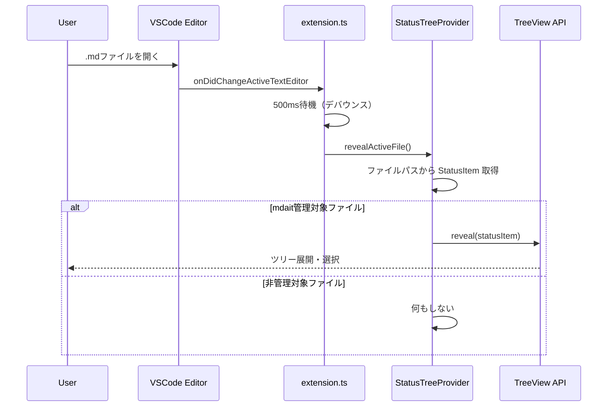

# 作業チケット: ステータスパネル自動同期

## 1. 概要と方針

エディタで開いているファイルに応じてステータスパネルのツリーを自動的に展開・選択する機能を追加する。VSCodeエクスプローラと同等の動作を実現し、ユーザーが現在作業中のファイル位置を視覚的に把握しやすくする。

## 2. シーケンス図

## 3. 考慮事項

- デバウンス処理（500ms）により、連続したファイル切り替え時のパフォーマンスを確保
- mdait管理対象外のファイルが開かれた場合は何もしない
- `TreeView.reveal()` は非同期処理のため、エラーハンドリングを適切に行う
- `TreeView.reveal()` を使用するには`TreeDataProvider.getParent()`の実装が必須
- ステータスツリーが初期化されていない場合の処理
- 設定機能は実装しない（常に有効）

## 4. 実装計画と進捗

- [x] StatusTreeProviderに `revealActiveFile(filePath)` メソッドを追加
- [x] StatusTreeProviderに `getParent(element)` メソッドを追加（reveal()使用に必須）
- [x] extension.tsで `onDidChangeActiveTextEditor` イベントをリッスン
- [x] デバウンス処理の実装（500ms）
- [x] mdait管理対象ファイルの判定ロジック実装
- [x] エラーハンドリングとログ出力
- [x] 動作確認とテスト
