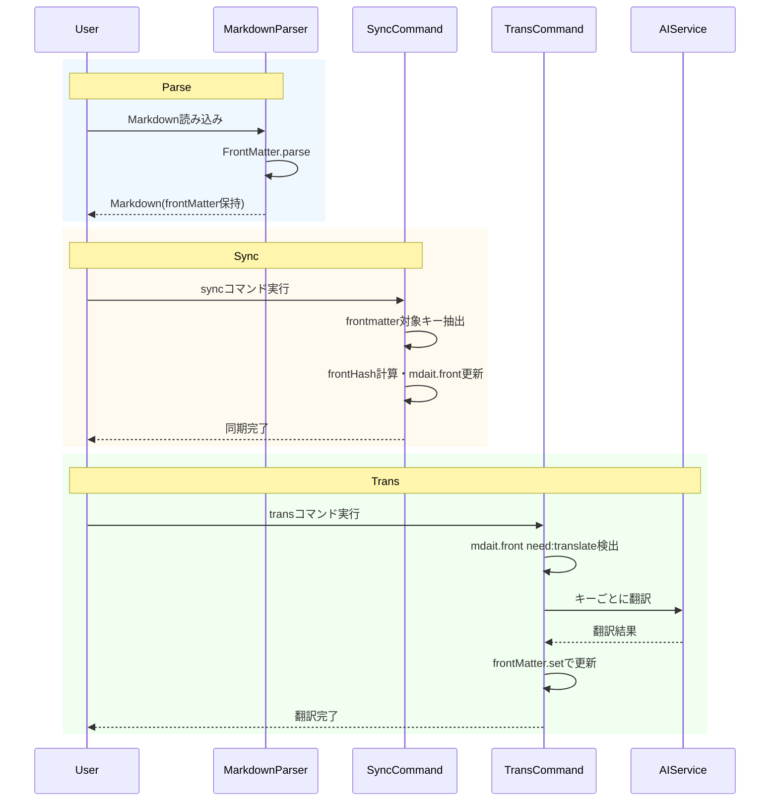

# 作業チケット: frontmatter翻訳サポート（FrontMatterクラス活用）

## 1. 概要と方針

FrontMatterクラスのdata/raw同期機構を活かし、frontmatterの特定キー値を翻訳対象として扱う。
本文ユニットとは分離し、frontmatter専用フローでsync/transを拡張する。
翻訳状態は frontmatter の mdait.front キーに「hash/from/need」文字列で保持する（HTMLコメントは使用しない）。
**重要**: Source側のfrontmatterにもmdait.frontマーカーを付与し、StatusCollectorでfrontmatter状態を可視化する。

## 2. シーケンス図



## 3. 考慮事項

- **保存経路**: FrontMatter.set/setMultipleでraw更新されるため、frontMatterRaw再生成は不要。
- **マーカー形式**: mdait.front は `hash from:xxx need:translate` 文字列を採用（MdaitMarker互換）。
- **ハッシュ計算**: 設定keys順に値を抽出して連結しハッシュ化。キー名/順序は差分対象外。
- **翻訳対象値**: stringのみ翻訳、非文字列はスキップ。
- **frontmatter-only**: sync/transでスキップせず、frontmatterフローを実行。
- **TranslationChecker**: frontmatterには適用しない。
- **Source側マーカー**: Source側のfrontmatterにもmdait.frontマーカーを付与（hashのみ、from/needなし）。
- **StatusItem拡張**: 新たにFrontmatterStatusItemを追加し、ファイルの子要素として表現。
- **ステータス計算**: ファイル全体のステータス決定時にfrontmatter状態も考慮。

## 4. 実装計画と進捗

### フェーズ1: 設定追加 ✅

- [x] TransConfigに `frontmatter.keys: string[]` を追加（デフォルト: ["title", "description"]）。
- [x] mdait.template.json / schemas/mdait-config.schema.json に追記。
- [x] 空配列ならfrontmatter翻訳は無効。

### フェーズ2: 共通ユーティリティ ✅

- [x] frontmatterキー抽出・ハッシュ計算の共通関数を追加。
- [x] mdait.front 文字列の parse/serialize ヘルパーを追加（MdaitMarkerを内部利用）。

### フェーズ3: sync拡張（修正が必要）

- [x] sourceのfrontHash算出、targetのmdait.front更新（fromはsourceHash、needはtranslate/revise）。
- [x] frontmatter-onlyファイルでも処理する。
- [x] target新規作成時はsourceのfrontmatter値をコピーし、mdait.frontを付与。
- [x] Source側のfrontmatterにもmdait.frontマーカーを付与（hashのみ、from/needなし）

### フェーズ4: trans拡張

- [x] mdait.front が `need:translate` の場合のみ翻訳。
- [x] 対象キーをキーごとにTranslator.translateで翻訳し、frontMatter.setで更新。
- [x] mdait.frontのhash/from/needを更新し保存。
- [x] trans-command.tsのfrontmatter翻訳実装を確認・検証（正常動作を確認）

### フェーズ5: StatusItem拡張（新規）

- [x] StatusItemTypeにFrontmatterを追加
- [x] FrontmatterStatusItem型を定義
  - type: StatusItemType.Frontmatter
  - filePath, fileName
  - status: frontmatterのneed状態から算出
  - fromHash, needFlag
  - contextValue: "mdaitFrontmatterSource" | "mdaitFrontmatterTarget"
- [x] StatusCollectorでfrontmatter状態を収集
  - frontmatterにmdait.frontマーカーがある場合、FrontmatterStatusItemを作成
  - FileStatusItemの children[0] としてfrontmatter項目を追加
  - ファイル全体のステータス計算時にfrontmatter状態も考慮
- [x] StatusItemTree/StatusManagerでfrontmatter項目を適切に処理

### フェーズ6: UI/CodeLens対応

**実装状況**: ✅ 完了

**概要**:
frontmatter翻訳機能のユーザー動線を改善し、UIから直接操作できるようにする。現在、StatusCollectorではfrontmatter状態を収集しているが、UI層での表示と操作が未実装。

**実装方針**:

#### 6.1 StatusTreeProviderでのfrontmatter項目表示

**調査結果**:
- [src/ui/status/status-tree-provider.ts](src/ui/status/status-tree-provider.ts)でStatusItemをTreeItemに変換
- 現在、`StatusItemType.Unit`と`StatusItemType.File`のみを処理
- `StatusItemType.Frontmatter`への対応が必要

**実装内容**:
```typescript
// getTreeItem内でFrontmatter項目を処理
case StatusItemType.Frontmatter:
  const frontmatterItem = element as FrontmatterStatusItem;
  const treeItem = new vscode.TreeItem(frontmatterItem.label);
  treeItem.iconPath = new vscode.ThemeIcon("book"); // または適切なアイコン
  treeItem.contextValue = frontmatterItem.contextValue;
  treeItem.tooltip = this.buildFrontmatterTooltip(frontmatterItem);
  return treeItem;
```

**コンテキストメニュー**:
- package.jsonの`menus.view/item/context`に追加
- `mdaitFrontmatterTarget && needsTranslation`の条件で「Translate Frontmatter」を表示

#### 6.2 CodeLensProviderでのfrontmatter領域アクション

**調査結果**:
- [src/ui/codelens/codelens-provider.ts](src/ui/codelens/codelens-provider.ts)で各ユニットにCodeLensを配置
- `provideCodeLenses`メソッドでmarkdown.unitsを処理
- frontmatter領域（0行目付近）への対応が必要

**実装内容**:
```typescript
// provideCodeLenses内でfrontmatterをチェック
if (markdown.frontMatter) {
  const marker = parseFrontmatterMarker(markdown.frontMatter);
  if (marker && marker.needsTranslation()) {
    // frontmatter領域のCodeLens（0行目または最初の---の行）
    const range = new vscode.Range(0, 0, 0, 0);
    codeLenses.push(new vscode.CodeLens(range, {
      title: "$(sync) Translate Frontmatter",
      command: "mdait.translateFrontmatter",
      arguments: [document.uri.fsPath]
    }));
  }
}
```

**注意点**:
- frontmatterの正確な行範囲を取得する必要がある
- FrontMatterクラスに`startLine`, `endLine`プロパティの追加を検討

#### 6.3 frontmatter専用翻訳コマンド

**調査結果**:
- [src/commands/trans/trans-command.ts](src/commands/trans/trans-command.ts)の`translateFrontmatterIfNeeded`が既に実装済み
- この関数をコマンドとして直接呼び出し可能にする

**実装内容**:
```typescript
/**
 * frontmatter専用の翻訳コマンド
 * StatusTreeまたはCodeLensから呼び出される
 */
export async function translateFrontmatterCommand(filePath: string): Promise<void> {
  try {
    const content = await fs.promises.readFile(filePath, "utf-8");
    const config = Configuration.getInstance();
    const markdown = parser.parse(content, config);
    
    // frontmatter翻訳を実行
    const translated = await translateFrontmatterIfNeeded(markdown, config);
    
    if (translated) {
      await fs.promises.writeFile(filePath, markdown.toString(), "utf-8");
      vscode.window.showInformationMessage("Frontmatter translated successfully");
      // StatusTreeを更新
      await StatusManager.getInstance().refresh();
    } else {
      vscode.window.showInformationMessage("Frontmatter does not need translation");
    }
  } catch (error) {
    vscode.window.showErrorMessage(`Failed to translate frontmatter: ${error.message}`);
  }
}
```

**package.json登録**:
```json
{
  "command": "mdait.translateFrontmatter",
  "title": "Translate Frontmatter",
  "category": "Mdait"
}
```

#### 6.4 実装タスク

- [x] StatusTreeProviderにFrontmatter項目の表示機能を追加
- [x] FrontMatterクラスにstartLine/endLineプロパティを追加（CodeLens用）
- [x] CodeLensProviderにfrontmatter領域のアクションを追加
- [x] translateFrontmatterCommandを実装しpackage.jsonに登録
- [x] コンテキストメニューの設定を追加
- [ ] GUIテストで動作確認

**優先度**: 低
- 理由: 機能自体は実装済みで、transコマンドからも利用可能
- ユーザビリティ向上のための追加作業
- 他の高優先度機能が完了後に実施

### フェーズ7: テスト（新規）

- [x] frontmatterハッシュ計算・marker parse/serializeの単体テスト。
- [x] sync時のsource側マーカー付与テスト（sync-frontmatter-marker.test.ts実装完了）
- [x] StatusCollectorがfrontmatter状態を収集するテスト（test-gui/core/status-collector-frontmatter.test.ts実装完了）
- [x] trans時のfrontmatter翻訳テスト（trans-frontmatter.test.ts実装完了）

## 5. 設計修正方針（2026/01/24）

動作確認の結果、以下の問題が発見されました。各問題の根本原因と修正方針を以下に示します。

### 問題1: Source側にmdait.frontマーカーが付与されない

**根本原因**: 
- [syncNew_CoreProc](c:\Data\Study\TypeScript\mdait\src\commands\sync\sync-command.ts#L136-L220)では、Target側にのみ`setFrontmatterMarker`を実行
- その後、Source側を保存する際にマーカーなしで保存される

**修正方針**:
- Source側のfrontmatterにもmdait.frontマーカーを付与（hashのみ、from/needなし）
- syncNew_CoreProcでsource.frontMatterにマーカーを設定してから保存
- sync_CoreProc（既存同期）でも同様の処理を追加

**実装箇所**:
- `src/commands/sync/sync-command.ts`の`syncNew_CoreProc`と`sync_CoreProc`
- source側: `new MdaitMarker(sourceFrontHash)` （hashのみ）
- target側: `new MdaitMarker(targetHash, sourceFrontHash, "translate")`

### 問題2: trans実行時にfrontmatterが翻訳されない

**状況**: 
- コードレビューの結果、trans-command.tsの`translateFrontmatterIfNeeded`関数は正しく実装されていることを確認
- need判定、翻訳実行、マーカー更新のロジックは正常
- テストコード（trans-frontmatter.test.ts）で動作確認済み

**結論**: 問題なし。trans実行時にfrontmatterは正しく翻訳される。

### 問題3: frontmatterの翻訳状況がステータス上に表示されない

**根本原因**:
- [StatusCollector.collectFileStatus](c:\Data\Study\TypeScript\mdait\src\core\status\status-collector.ts#L87-L177)では、`markdown.units`のみを処理
- frontmatterの翻訳状態を全く考慮していない

**修正方針**:
1. **StatusItem型拡張**
   - `StatusItemType`に`Frontmatter`を追加
   - `FrontmatterStatusItem`インターフェースを定義
   ```typescript
   export interface FrontmatterStatusItem extends BaseStatusItem {
     type: StatusItemType.Frontmatter;
     filePath: string;
     fileName: string;
     fromHash?: string;
     needFlag?: string;
   }
   ```

2. **StatusCollector修正**
   - `collectFileStatus`でfrontmatterの状態を確認
   - mdait.frontマーカーがある場合、`FrontmatterStatusItem`を作成
   - `FileStatusItem.children`の先頭（units[0]の前）に追加
   - ファイル全体のステータス計算時にfrontmatter状態も考慮
   ```typescript
   // frontmatterチェック（擬似コード）
   if (markdown.frontMatter) {
     const marker = parseFrontmatterMarker(markdown.frontMatter);
     if (marker) {
       const frontStatus = marker.needsTranslation() ? Status.NeedsTranslation : Status.Translated;
       children.unshift({
         type: StatusItemType.Frontmatter,
         label: "Frontmatter",
         status: frontStatus,
         filePath,
         fileName,
         fromHash: marker.from,
         needFlag: marker.need,
         contextValue: marker.from ? "mdaitFrontmatterTarget" : "mdaitFrontmatterSource"
       });
     }
   }
   ```

3. **determineFileStatus修正**
   - 既存の`totalUnits`/`translatedUnits`にfrontmatter状態を含める
   - または、children全体から計算するように変更

**実装箇所**:
- `src/core/status/status-item.ts`: StatusItemType/FrontmatterStatusItem定義
- `src/core/status/status-collector.ts`: collectFileStatus, determineFileStatus

### 問題4: frontmatterだけを選択的に翻訳する動線がない

**根本原因**:
- UIにfrontmatter項目が表示されないため、アクション実行ができない

**修正方針**:
1. **StatusTreeProvider拡張**
   - FrontmatterStatusItemに対応するツリーアイテム表示
   - アイコン（例: `$(book)`）とラベル（"Frontmatter"）
   - コンテキストメニューに「Translate Frontmatter」を追加

2. **CodeLens追加**
   - frontmatter領域（0行目周辺）にCodeLensを表示
   - 既存のユニット用CodeLensと同様のロジック
   - `mdait.front`マーカーの`need`状態に応じて表示

3. **frontmatter専用翻訳コマンド**
   - 新規コマンド: `mdait.translateFrontmatter`
   - 引数: filePath
   - transFile_CoreProcを参考に、frontmatter部分のみを翻訳

**実装箇所**:
- `src/ui/status/status-tree-provider.ts`: frontmatter項目の表示
- `src/ui/codelens/codelens-provider.ts`: frontmatter用CodeLens
- `src/commands/trans/trans-command.ts`: translateFrontmatterCommandの追加
- `package.json`: コマンド登録とコンテキストメニュー設定

### 実装優先順位

1. **高優先**: 問題1（Source側マーカー付与）- sync処理の整合性
2. **高優先**: 問題3（StatusCollector対応）- 可視化の基盤
3. **中優先**: 問題2（trans実行）- デバッグと修正
4. **低優先**: 問題4（UI/CodeLens）- ユーザビリティ向上

## 6. テスト戦略

frontmatter翻訳機能の品質を保証するため、以下のテストを実装します。

### 単体テスト（Core層）

既に作成済みのテストファイル:
- `src/test/core/markdown/frontmatter-translation.test.ts` - ユーティリティ関数のテスト ✅
- `src/test/core/status/status-collector-frontmatter.test.ts` - StatusCollector対応テスト（TODO実装）

新規追加予定:
- StatusItem型のfrontmatter対応テスト
- determinеFileStatusのfrontmatter考慮テスト

### 統合テスト（Commands層）

既に作成済みのテストファイル:
- `src/test/commands/sync/sync-frontmatter-marker.test.ts` - source側マーカー付与テスト（TODO実装）
- `src/test/commands/trans/trans-frontmatter.test.ts` - frontmatter翻訳テスト（TODO実装）

新規追加予定:
- frontmatter-onlyファイルのsync/trans動作テスト
- 既存sync時のsource側マーカー維持テスト

### E2Eテスト（GUI層）

VSCode環境での実機テストが必要:
- StatusTreeでfrontmatter項目が表示されることを確認
- frontmatter項目から翻訳コマンドを実行できることを確認
- CodeLensがfrontmatter領域に表示されることを確認

### テスト実行方法

- 単体テスト: `npm test`（core層のみ）
- GUIテスト: `npm run test:vscode`（手動実行、ユーザー専用）

## 7. 実装上の注意事項

- FrontMatterクラスのraw同期を利用し、独自のraw再生成は行わない。
- 本文ユニットのupdateAndSaveUnit()はfrontmatterに使わない。
- 設計との整合性を常に確認し、`design/core.md`の記述と矛盾しないようにする。
- StatusItem型の拡張は既存の構造を壊さないよう慎重に行う。

