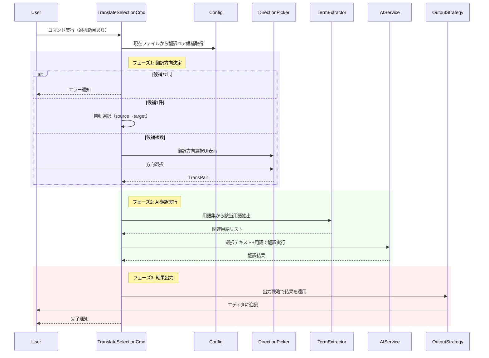

# 作業チケット: オンデマンド翻訳実装

## 1. 概要と方針

エディタの選択範囲をmdait管理外で一時的に翻訳する軽量機能を実装。マーカーレス・履歴管理なしで、用語集を活用した高品質な翻訳を提供。翻訳方向は常にtransPairのsource→targetに従い、出力戦略パターンで拡張性を確保。

## 2. シーケンス図

## 3. 考慮事項

### 翻訳方向の推定
- ファイルがsourceDir/targetDirのどちらにあっても、常にsource→target方向
- 例：enディレクトリで選択中でも、transPair={ja→en}なら「日本語→英語」として扱う
- 複数候補がある場合はQuickPickで選択させる

### 用語集統合
- 既存の`TranslationTermExtractor`を再利用（trans/term-extractor.ts）
- 選択テキストから関連用語を抽出し、AIプロンプトに含める
- 用語統一を図り、transコマンドと同等の翻訳品質を確保

### 出力戦略の拡張性
- OutputStrategyインターフェースで出力先を抽象化
- Phase 1: AppendBelowStrategy（選択範囲の下に1行空白を開けて追記）
- Phase 2以降: ClipboardStrategy、NewTabStrategy等を追加可能

### エラーハンドリング
- 選択範囲なし → `translateSelection.noSelection`
- 該当transPairなし → `translateSelection.noCandidates`
- AI翻訳失敗 → エラー通知とログ出力
- キャンセル → サイレント終了

### 既存コードとの整合性
- AIServiceBuilderを活用してプロバイダー構築
- l10nシステムでメッセージを多言語対応
- package.jsonにコマンド登録（`when`句で選択範囲チェック）

## 4. 実装計画と進捗

### コア実装
- [ ] `src/commands/trans-selection/`ディレクトリ作成
- [ ] `output-strategy.ts`: OutputStrategyインターフェース定義
- [ ] `strategies/append-below-strategy.ts`: AppendBelowStrategy実装
- [ ] `direction-picker.ts`: getCandidateDirections()とpickTranslationDirection()実装
- [ ] `trans-selection-command.ts`: translateSelectionCommand()実装

### AI翻訳統合
- [ ] AIServiceBuilderでAIサービス構築
- [ ] TranslationTermExtractorで用語抽出
- [ ] 翻訳プロンプト構築（テキスト+用語リスト）
- [ ] AI翻訳実行とエラーハンドリング

### VS Code統合
- [ ] `package.json`にコマンド登録（`mdait.translateSelection`）
- [ ] エディタコンテキストメニューに追加（`when: editorHasSelection`）
- [ ] l10nメッセージ追加（bundle.l10n.json/bundle.l10n.ja.json）

### 設計ドキュメント更新
- [ ] `design/commands.md`にtrans-selectionセクション追加

### テスト
- [ ] 単体テスト: getCandidateDirections()のロジック検証
- [ ] 単体テスト: AppendBelowStrategyの動作確認
- [ ] 統合テスト: 翻訳方向選択UIのシナリオテスト
- [ ] 統合テスト: 用語集統合の動作確認

### 完了条件
- [ ] 選択範囲から翻訳方向を自動推定し、翻訳が正常に完了する
- [ ] 複数候補時にQuickPickで選択可能
- [ ] 選択範囲の下に翻訳結果が追記される
- [ ] 用語集が正しく適用される
- [ ] エラーケースで適切なメッセージが表示される
