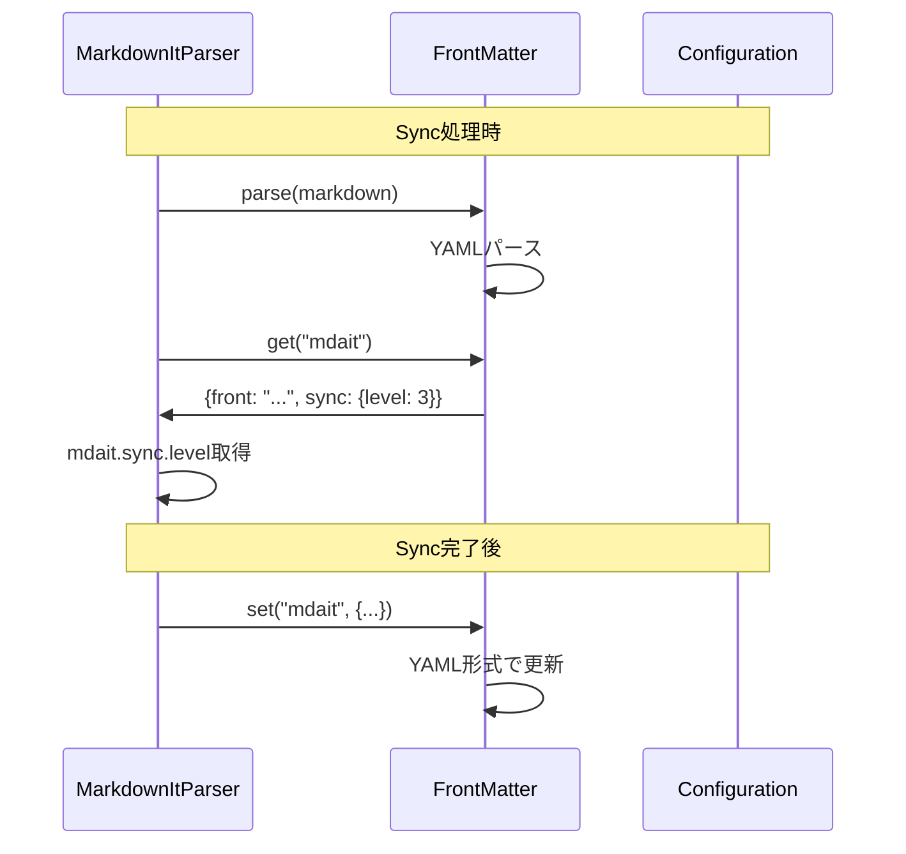

# 作業チケット: frontmatter設定キーの階層化

## 1. 概要と方針

現在フラットな構造になっている `mdait.front` と `mdait.sync.level` を、すべて `mdait:` の下に階層構造で配置する。

- 変更前: `mdait.front`, `mdait.sync.level`
- 変更後: `mdait.front`, `mdait.sync.level` (YAMLのネスト構造)

```yaml
mdait:
  front: abc123de from:def456gh need:translate
  sync:
    level: 3
```

後方互換性は考慮せず、一括で新形式に変更する。

## 2. シーケンス図



## 3. 考慮事項

- **階層構造のみ**: フラット構造との互換性は考慮せず、完全にネスト構造に移行
- **ドット記法アクセス**: `"mdait.sync.level"`のような記法で階層的にアクセス
- **raw文字列の再生成**: データ変更時は常に全体を再生成（gray-matterを使用）
- **エッジケース処理**: 既存非オブジェクト値の上書き検証、空キーのバリデーション
- **空オブジェクトのクリーンアップ**: `delete()`実行時に親オブジェクトも削除
- **テストデータ**: テストファイル内のfrontmatterをすべて新形式に更新
- **ドキュメント**: 設計ドキュメントから旧形式の痕跡をすべて削除

## 4. 実装計画と進捗

### 4.1 コア機能の修正
- [x] `FrontMatter`クラスでネスト構造のアクセスをサポート
- [x] ドット記法による階層アクセス実装（`get`, `set`, `delete`, `has`）
- [x] エッジケース処理とバリデーション追加
- [x] 空オブジェクトの自動クリーンアップ実装
- [x] 部分更新ロジックを削除し、常に全体再生成に簡略化
- [x] `_pendingChanges`を削除（不要になったため）

### 4.2 テストコードの修正
- [x] `sync-frontmatter-marker.test.ts`: テストデータを新形式に更新
- [x] `frontmatter-sync-logic.test.ts`: テストデータを新形式に更新
- [x] `trans-frontmatter.test.ts`: テストデータを新形式に更新
- [x] `sync-command.test.ts`: `mdait.sync.level`を使用するテストを更新

### 4.3 ドキュメントの更新
- [x] `design/config.md`: frontmatterセクションを新形式に更新（旧形式削除）
- [x] `design/core.md`: マーカー説明を新形式に更新
- [ ] `design/command_sync.md`: 新形式の説明を確認
- [ ] `design/command_trans.md`: 新形式の説明を確認

### 4.4 統合テスト
- [ ] すべてのユニットテストが合格することを確認
- [ ] sync処理が正しく動作することを確認
- [ ] trans処理が正しく動作することを確認

