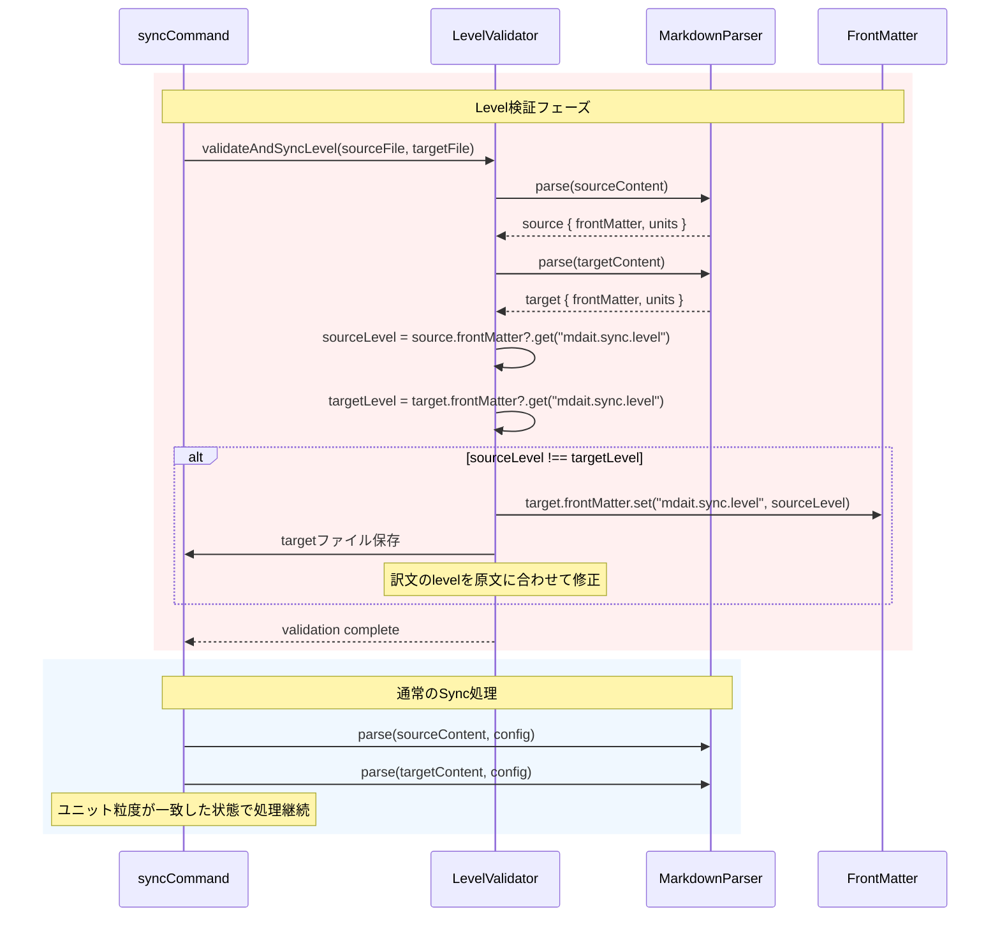

# 作業チケット: frontmatter level同期検証

## 1. 概要と方針

syncコマンド実行時に、原文と訳文のfrontmatterで`mdait.sync.level`の設定値が異なる場合、ユニット境界の粒度が合わなくなり、マーカーの対応付けが破綻する。これを防ぐため、**sync処理の前処理として原文と訳文のlevel設定を検証し、異なる場合は原文の設定を優先して訳文を自動修正**する機能を追加する。

原文優先の原則に基づき、訳文は常に原文のlevel設定に従う。

## 2. シーケンス図

## 3. 考慮事項

- **原文優先の原則**: 訳文は原文に従うべきであるため、levelの不一致時は常に原文の設定を優先
- **新規ターゲット作成時**: `syncNew_CoreProc`では訳文が存在しないため、検証不要
- **既存ターゲット同期時**: `sync_CoreProc`の冒頭で検証を実行
- **frontmatterなしの場合**: どちらか一方にfrontmatterがない場合も含め、以下のロジックで処理:
  - 原文にlevel設定あり、訳文になし → 訳文にfrontmatterを作成してlevel設定
  - 原文にlevel設定なし、訳文にあり → 訳文のlevel設定を削除（config.sync.levelを使用）
  - 両方なし → 何もしない（config.sync.levelを使用）
- **設定値の型検証**: level値がnumberであることを確認
- **エラーハンドリング**: level設定の書き込みに失敗した場合、syncを継続せずエラーとして報告

## 4. 実装計画と進捗

- [x] `src/core/markdown/level-sync.ts`新規作成
  - `syncLevelSettings(sourceFrontMatter, targetContent)`関数実装
  - frontmatterのlevel値を取得・比較するロジック
  - 不一致時に訳文のfrontmatterを修正してコンテンツ返却
- [x] `src/commands/sync/level-validator.ts`新規作成
  - `validateAndSyncLevel(sourceFile, targetFile)`関数実装
  - ファイルI/O処理とlevel-syncへの委譲
- [x] `sync_CoreProc`関数の修正
  - パース前に`validateAndSyncLevel`を呼び出す
- [x] テストの実装
  - level一致時のケース
  - level不一致時の自動修正ケース
  - frontmatterなしのケース
  - 片方だけlevel設定があるケース
  - 型エラーのケース
- [x] リファクタリング
  - コアロジックを`level-sync.ts`に分離してテスト可能に
  - vscode依存を`level-validator.ts`に集約
