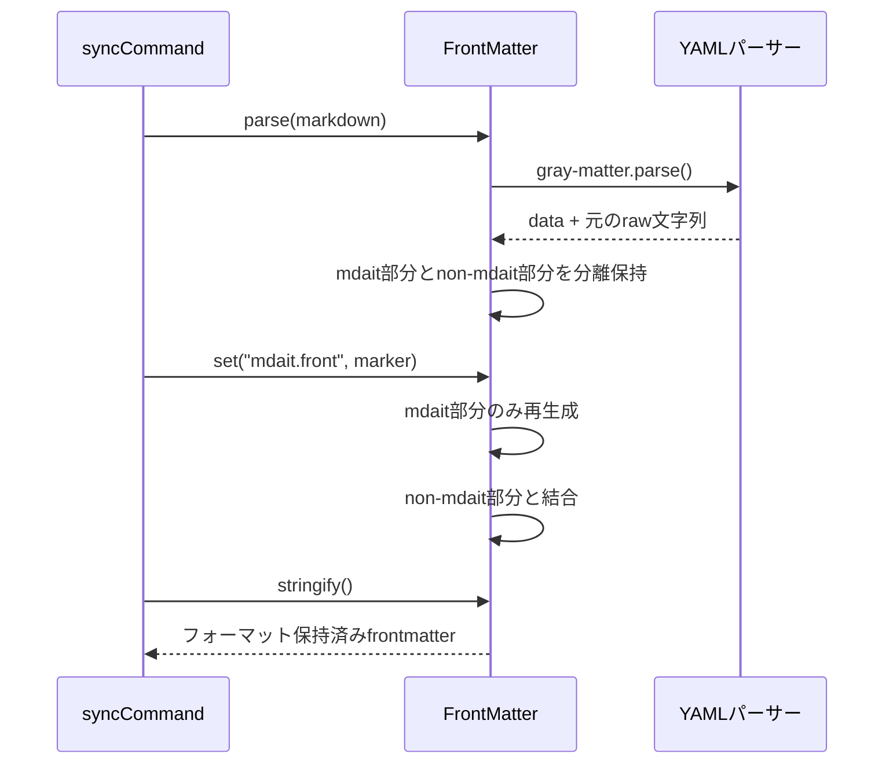

# 作業チケット: frontmatter元フォーマット保持

## 1. 概要と方針

sync実行時にmdait管理外のfrontmatterフィールドが再フォーマットされてしまう問題を修正する。mdait名前空間のみを更新対象とし、それ以外のフィールドは元のYAMLフォーマットを完全に保持する。

## 2. シーケンス図

## 3. 考慮事項

- **YAMLの境界検出**: `mdait:`キーの開始・終了を正確に検出する必要がある
- **インデント・改行**: 元のフォーマットと整合性を保つ
- **エッジケース**:
  - frontmatterが`mdait`のみの場合
  - frontmatterに`mdait`が存在しない場合
  - `mdait`がfrontmatterの先頭・中間・末尾にある場合
  - 複雑なネスト構造や配列を含む場合
- **既存機能への影響**: `get()`, `set()`, `delete()`, `has()`などの既存メソッドの動作は変更しない

## 4. 実装計画と進捗

- [x] `FrontMatter`クラスに`_nonMdaitRaw`フィールド追加
- [x] `parse()`メソッドでmdait部分とnon-mdait部分を分離
- [x] `_updateRaw()`メソッドで部分更新ロジック実装
- [x] エッジケースを網羅したユニットテスト作成
- [x] 既存テストの実行確認

## 5. 実装内容

### 主要な変更点

1. **`FrontMatter`クラスの拡張**:
   - `_nonMdaitRaw`フィールドを追加し、mdait管理外のフィールドの元の文字列表現を保持
   - コンストラクタに`nonMdaitRaw`パラメータを追加

2. **`parse()`メソッドの修正**:
   - `extractNonMdaitRaw()`関数を使用してmdait管理外の部分を抽出
   - 抽出した`nonMdaitRaw`をコンストラクタに渡す

3. **`_updateRaw()`メソッドの再設計**:
   - mdait部分とnon-mdait部分を分離（`separateMdaitData()`）
   - mdait部分のみを`gray-matter`で再生成
   - non-mdait部分は元のフォーマットを維持
   - `mergeFrontmatterParts()`で両方を結合

4. **新規ヘルパー関数**:
   - `extractNonMdaitRaw()`: frontmatterからmdait管理外の部分を抽出
   - `separateMdaitData()`: データオブジェクトをmdait部分とnon-mdait部分に分離
   - `mergeFrontmatterParts()`: non-mdait部分とmdait部分を結合

### テストカバレッジ

`front-matter-format-preservation.test.ts`で以下のエッジケースを網羅：
- mdait管理外のフィールドのフォーマット保持（配列のインライン記法など）
- mdaitフィールドが先頭・中間・末尾にある場合
- frontmatterにmdaitが存在しない場合
- frontmatterがmdaitのみの場合
- 複雑なネスト構造を持つfrontmatter
- mdaitフィールドを削除した場合
- 空白を含むfrontmatter

### 設計との整合性

- [design/core.md](../design/core.md)に「フォーマット保持」の説明を1行追加
- すべての既存テスト（95個）が合格
- 新規テスト（10個）も合格
