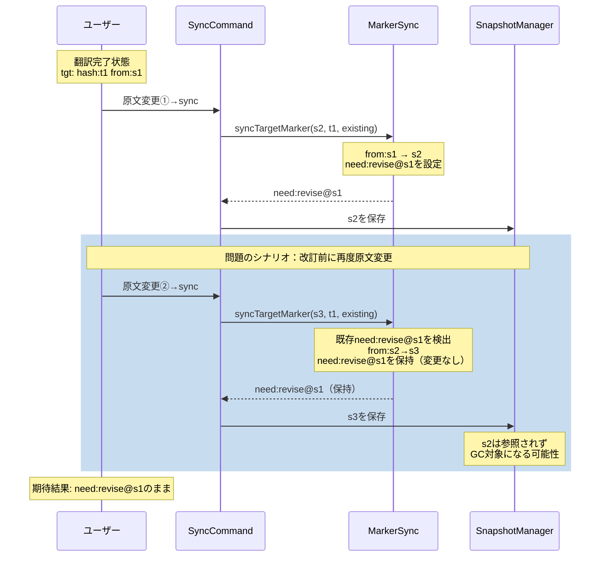

# 作業チケット: revise再変更時のneedフラグ保持

## 1. 概要と方針

改訂前（`need:revise@v1`状態）に原文が再変更された場合、現状は`need:revise@v2`に上書きされてしまう問題を修正する。改訂が完了するまでは最初のスナップショットハッシュ（v1）を保持し続けるべき。

## 2. シーケンス図

## 3. 考慮事項

- スナップショットはハッシュ:内容が1:1対応（CRC32で実質保証）
- `need:revise@v1`が保持される限り、v1のスナップショットは参照され続けGC対象外
- v2などは参照されなくなればGC時に削除される可能性があり、それで問題ない
- `syncTargetMarker`と`syncMarkerPair`の両方で同様の修正が必要
- 既存の`need:translate`ケースには影響しないこと
- frontmatter翻訳時の動作も同様に修正すること

## 4. 実装計画と進捗

- [x] テストケース追加: 「revise前に原文が再変更された場合、need:revise@v1が保持されること」
- [x] `syncTargetMarker`修正: 既存`need:revise@{hash}`がある場合、そのhashを保持
- [x] `syncMarkerPair`修正: 同上
- [x] テスト実行: すべてのテストがパスすることを確認
- [x] 設計書更新: [command_sync.md](../design/command_sync.md)にrevise再変更時の仕様を明記
