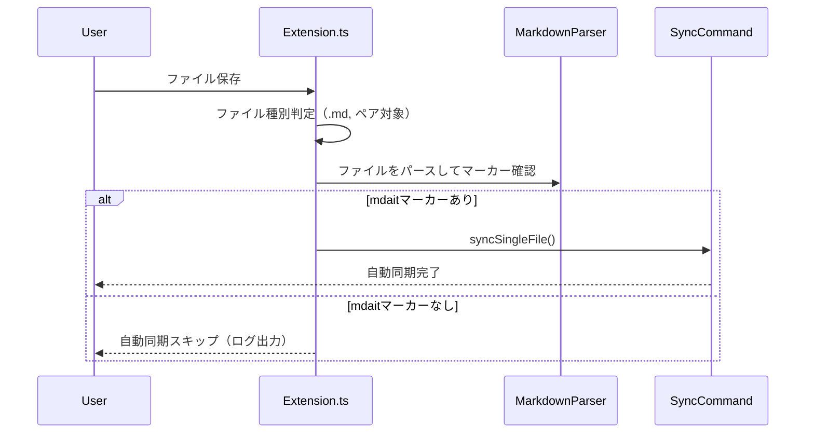

# 作業チケット: 保存時sync除外条件追加

## 1. 概要と方針

保存時の自動sync機能で、まだ一度もsyncしていないファイル（mdaitマーカーが存在しないファイル）を除外するよう修正する。これにより、意図しないファイルの自動同期を防止し、ユーザーの予期しない動作を回避する。

## 2. シーケンス図

## 3. 考慮事項

- **判定条件**: ユニットに1つ以上mdaitマーカーが存在する、またはフロントマターに`mdait.front`マーカーが存在する
- **パフォーマンス**: ファイル保存のたびにパース処理が走るため、エラーハンドリングを適切に行う
- **ログ出力**: マーカーなしでスキップした場合は`console.debug`で記録し、トラブルシューティングに活用
- **設計ドキュメント更新**: `design/ui.md`の保存時sync説明を更新

## 4. 実装計画と進捗

- [x] `extension.ts`の`onDidSaveTextDocument`イベントハンドラを修正
  - [x] mdaitマーカー存在チェック処理を追加
  - [x] ユニットのマーカー有無を確認（`parsed.units.some(unit => unit.marker !== null)`）
  - [x] フロントマターのマーカー有無を確認（`parseFrontmatterMarker()`を使用）
  - [x] マーカーが存在しない場合は早期リターン
- [x] 必要なインポートを追加（`markdownParser`, `parseFrontmatterMarker`）
- [x] `design/ui.md`の保存時sync説明を更新
- [x] テスト実行と動作確認
