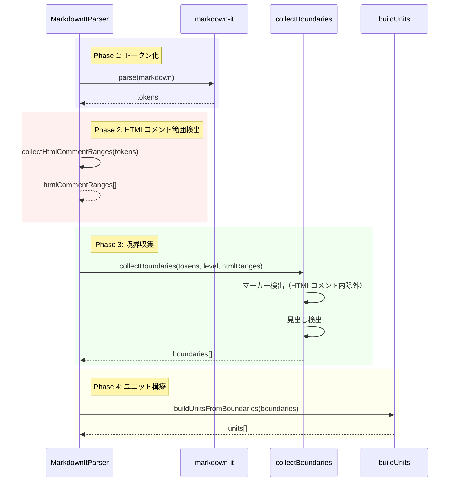

# チケット: HTMLコメント内マーカー挿入問題修正

## 1. 概要と方針

複数行HTMLコメント内にmdaitマーカーが挿入されネストコメント化する問題を修正する。HTMLコメント範囲を検出し、その範囲内をマーカー挿入対象外とし、翻訳対象からも除外する。

## 2. 仕様

### 現状の問題
- Markdown内の複数行HTMLコメント内にmdaitマーカーが挿入される
- ネストコメント(`<!-- ... <!-- mdait ... --> ... -->`)となりエディタ表示が崩れる

### 修正後の動作
1. **HTMLコメント検出**: `<!-- ... -->`形式のコメント範囲を識別
2. **mdait管理用マーカーの除外**: `<!-- mdait`で始まるコメントは通常のマーカーとして扱う
3. **マーカー挿入スキップ**: HTMLコメント範囲内にはマーカーを挿入しない
4. **翻訳対象外**: HTMLコメント内のテキストは翻訳対象としない（コードブロックと同様の扱い）

## 3. シーケンス図



## 4. 設計

### 4.1 HTMLコメント範囲検出

**実装場所**: `src/core/markdown/parser.ts`

新規メソッド `collectHtmlCommentRanges()` を追加：

```typescript
interface HtmlCommentRange {
  startLine: number;
  endLine: number;
}

private collectHtmlCommentRanges(tokens: MarkdownIt.Token[]): HtmlCommentRange[] {
  // html_block/html_inlineトークンから<!-- ... -->形式を抽出
  // <!-- mdait で始まるものは除外（mdait管理用マーカー）
}
```

**検出ロジック**:
1. `html_block`または`html_inline`トークンをチェック
2. 内容が`<!--`で始まり`-->`で終わる（mdait管理用を除く）
3. `token.map`から開始・終了行を取得

### 4.2 マーカー検出時の除外

**変更箇所**: `collectBoundaries()`メソッド

```typescript
private collectBoundaries(
  tokens: MarkdownIt.Token[], 
  mdaitMarkerLevel: number,
  htmlCommentRanges: HtmlCommentRange[]
): UnitBoundary[] {
  // マーカー検出時にHTMLコメント範囲内かチェック
  // 範囲内の場合はスキップ
}
```

**判定関数**:
```typescript
private isInHtmlComment(line: number, ranges: HtmlCommentRange[]): boolean {
  return ranges.some(r => line >= r.startLine && line < r.endLine);
}
```

### 4.3 既存実装との整合性

**コードブロック処理との比較**:
- コードブロック: markdown-itが自動的にトークン分離（`code_block`/`fence`タイプ）
- HTMLコメント: 同様に`html_block`として分離されるが、mdaitマーカーも`html_block`のため追加判定が必要

### 4.4 パフォーマンス

**影響**:
- トークン配列の追加走査: O(n)
- HTMLコメント範囲チェック: O(m) (m = HTMLコメント数、通常少数)
- 全体への影響: 約5-10%の処理時間増加を想定（通常のファイルでは体感できないレベル）

### 4.5 エッジケース

| ケース | 処理方針 |
|--------|----------|
| 不完全なコメント（閉じタグなし） | markdown-itの解釈に従う（通常はテキストとして扱われる） |
| ネストしたHTMLコメント | 外側のコメント範囲のみ検出（HTMLの仕様上ネスト不可） |
| インラインHTMLコメント | 同様に検出・除外 |
| 既存の誤挿入マーカー | 自動的に無視される（次回sync時に正常化） |
| mdaitマーカーとHTMLコメントが同一行 | 行範囲で判定するため適切に処理される |

## 5. 考慮事項

- markdown-itのトークン解析に依存するため、markdown-itのバージョン変更時に動作確認が必要
- HTMLコメントが大量にある文書では若干のパフォーマンス低下の可能性
- 既存ファイルで既にネストコメントがある場合、sync実行で修正される

## 6. 実装・テスト計画と進捗

### 実装項目
- [x] `collectHtmlCommentRanges()`メソッドの実装
- [x] `isInHtmlComment()`ヘルパー関数の実装
- [x] `collectBoundaries()`メソッドの修正（HTMLコメント範囲チェック追加）
- [x] `parse()`メソッドの修正（フロー統合）

### テスト項目
- [x] 単一行HTMLコメント内マーカー挿入スキップのテスト
- [x] 複数行HTMLコメント内マーカー挿入スキップのテスト
- [x] mdait管理用マーカーは除外されることのテスト
- [x] HTMLコメントとmdaitマーカーが混在する文書のテスト
- [x] コードブロックとHTMLコメントが混在するテスト
- [x] 不完全なHTMLコメントの扱いのテスト
- [x] パフォーマンステスト（HTMLコメント多数の文書）

## 7. 品質要件チェック

- [x] 既存テストがすべてパスする

## 8. まとめと改善提案

### 実装完了内容
- HTMLコメント範囲検出機能を実装し、mdaitマーカーがHTMLコメント内に挿入されるのを防止
- HTMLコメントのみのコンテンツは次の境界のユニットに統合される仕様を実装
- 全203テストがパスすることを確認

### 設計との差分
1. **HTMLコメントのユニット化**: 当初の設計では明確でなかったが、HTMLコメントのみのコンテンツは独立したユニットにせず、次の境界のユニットに含めることで実装
2. **複数行HTMLコメント対応**: `isOnlyHtmlComments()`関数を正規表現ベースに変更し、単一行・複数行両方のHTMLコメントを正しく認識

### 次回改善提案
- HTMLコメントとコードブロックの扱いを統一的に処理する仕組みの検討
- markdown-itのバージョン変更時の回帰テストの追加
- [ ] 新規テストがすべてパスする
- [ ] コードレビューで承認を得る
- [ ] 設計との整合性が確認できる
- [ ] パフォーマンス影響が許容範囲内（<10%）
- [ ] エッジケースが適切に処理される

## 8. まとめと改善提案

(作業完了後に記載)
