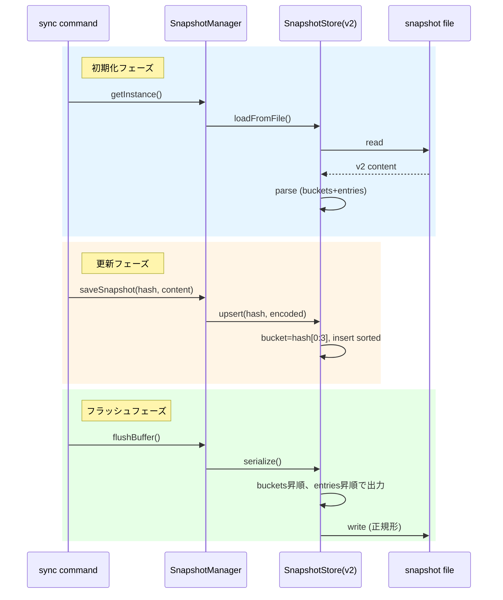

# チケット: Snapshot v2 区画化によるgit競合回避

## 1. 概要と方針

snapshotファイルをCRC32ハッシュの先頭3桁（000〜fff）で区画化し、決定的な順序（バケット昇順＋エントリ昇順）で出力することで、並行開発時のgit競合を軽減する。v1形式との互換性は切り捨て、v2形式のみをサポートする。

## 2. 仕様

### フォーマット変更
- **v1（廃止）**: `<8桁hash> <encoded_content>` の羅列
- **v2（新規）**:
  - バケット行: `<3桁hex> `（末尾スペース、payloadなし）
  - エントリ行: `<8桁hash> <encoded_content>`
  - バケット行の直後に、そのバケットに属するエントリが続く
  - 空バケットのバケット行も出力（全4096バケット常に出力）

### 正規化規則
- hex表記は小文字に統一
- バケット=3桁固定（000〜fff）、CRC32=8桁固定
- バケット昇順、バケット内エントリはハッシュ昇順
- 重複キーなし

### 動作
- 読み込み: バケット行を検出し、後続のエントリをそのバケットに帰属
- 書き込み: 常に全体を正規形で書き戻し（部分追記しない）

## 3. シーケンス図



## 4. 設計

### 新規クラス: SnapshotStore
インメモリでバケット構造を管理し、パース・シリアライズを担当。

```typescript
class SnapshotStore {
  // bucketId(3桁hex) -> Map<hash(8桁), encodedContent>
  private buckets: Map<string, Map<string, string>>;

  // ファイルからv2形式をパース
  parse(content: string): void;
  
  // エントリを挿入/更新
  upsert(hash: string, encoded: string): void;
  upsertMany(entries: [hash: string, encoded: string][]): void;
  
  // エントリを取得
  get(hash: string): string | null;
  
  // GC: activeHashesに含まれないエントリを削除
  retainOnly(activeHashes: Set<string>): void;
  
  // 正規形でシリアライズ
  serialize(): string;
  
  // バケットIDを算出
  private getBucketId(hash: string): string;
}
```

### SnapshotManager変更
- `loadAllSnapshots()` → `SnapshotStore`を使用
- `flushBuffer()` → `SnapshotStore.serialize()`で書き出し
- v1読み込みは削除（互換性なし）

## 5. 考慮事項

- **既存snapshotファイルとの互換性**: v1形式は読み込めなくなる。初回sync時にエラー出力し、ユーザーに削除を促すか自動削除する
- **パフォーマンス**: 200エントリ程度の一括更新で問題ないことを確認
- **エラーハンドリング**: 形式不正（バケットなしでエントリ出現等）はエラーログ出力し、ファイル全体を無視

## 6. 実装・テスト計画と進捗

- [x] SnapshotStore クラス実装
  - [x] parse() - v2形式パース
  - [x] upsert() / upsertMany() - エントリ挿入/更新
  - [x] get() - エントリ取得
  - [x] retainOnly() - GC
  - [x] serialize() - 正規形出力
- [x] SnapshotStore 単体テスト（23テスト）
- [x] SnapshotManager改修
  - [x] SnapshotStore統合
  - [x] v1互換コード削除
- [x] 統合テスト確認（既存のsnapshot関連テストすべてパス）
- [x] 200エントリベンチマーク（100ms以内で完了）

## 7. 品質要件チェック

- [x] バケット昇順、エントリ昇順で出力される
- [x] 同じ入力からは常に同じ出力（決定的）
- [x] 重複キーなし
- [x] 200エントリ一括更新が現実的な時間で完了

## 8. まとめと改善提案

### 実装結果
- `SnapshotStore` クラスを新規作成し、v2形式のバケット化ストレージを実装
- `SnapshotManager` を改修し、`SnapshotStore` を統合
- 全23テストケースを作成し、すべてパス
- v1形式との互換性は切り捨て、パースエラー時は警告出力して空ストアで継続

### 作成・変更ファイル
- `src/core/snapshot/snapshot-store.ts` - 新規作成
- `src/core/snapshot/snapshot-manager.ts` - 改修
- `src/test/core/snapshot/snapshot-store.test.ts` - 新規作成
- `design/core.md` - Snapshot管理セクション更新

### 改善提案
1. **パフォーマンステスト閾値**: CI環境では100ms閾値が不安定になる可能性あり。追加時は余裕を持った値に調整を検討
2. **ユーザー通知**: 旧形式ファイル検出時のユーザー通知（vscode.window.showWarningMessage）を将来検討

### レビュー結果
- **判定**: ✅ 承認
- **レビュアー**: mdait.reviewer
- **指摘**: 🔴重大: 0 🟠優先: 0 🟡推奨: 2 🟢任意: 1
- **評価**: 設計の明確さ、決定的出力、堅牢なパース処理、テストカバレッジを高く評価
