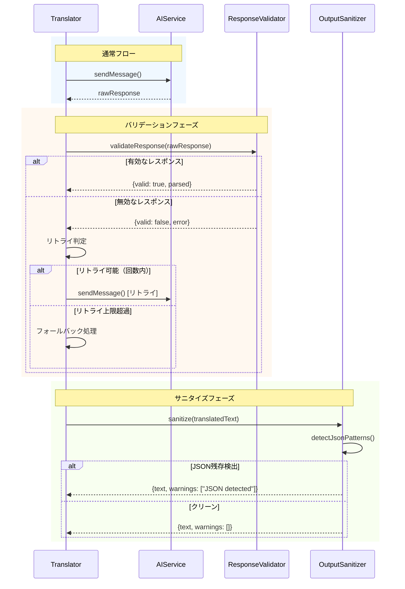
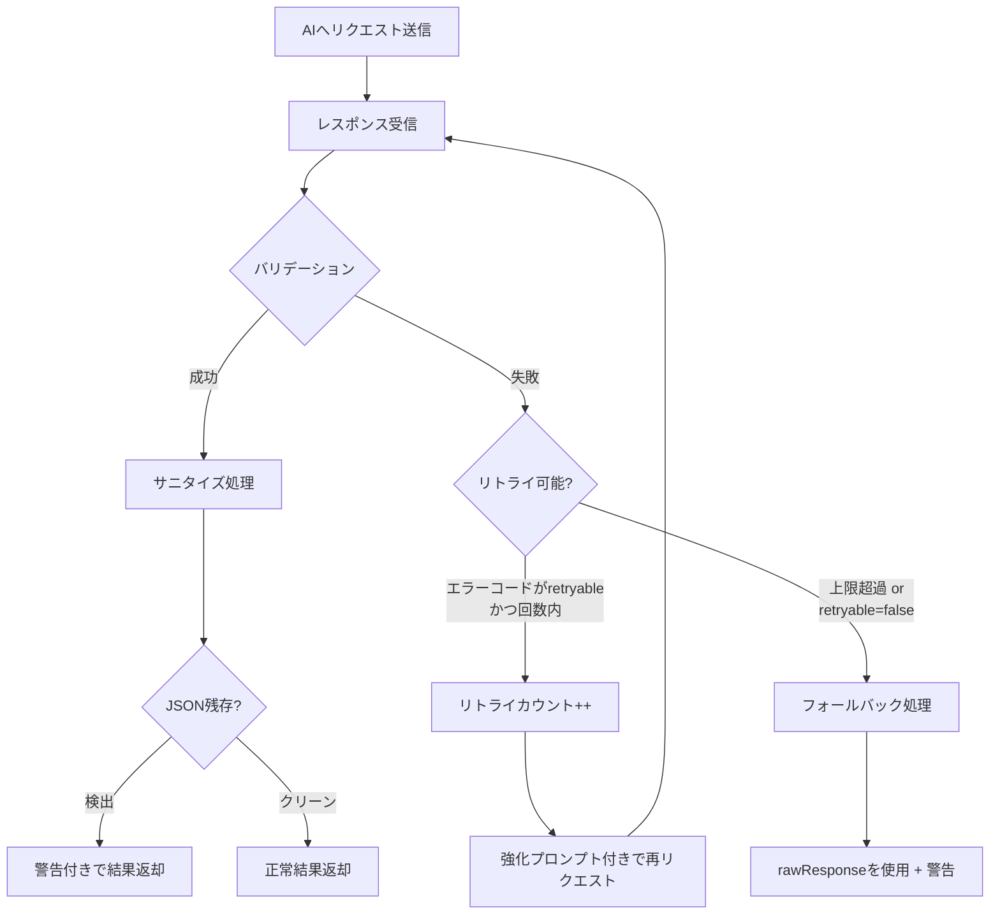
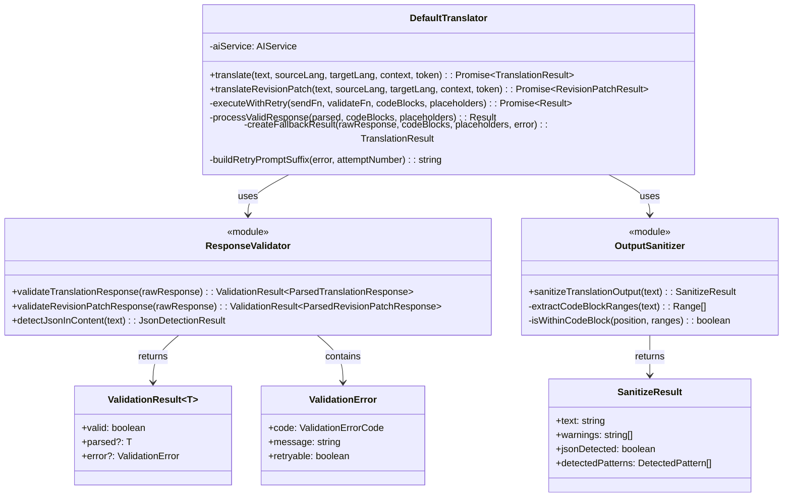

# チケット: 翻訳結果JSON混入防止

## 1. 概要と方針

翻訳・改訂実行時にJSONがそのまま翻訳結果として出力されてしまう問題を、複数レベルの防御策で対処する。プロンプト強化、レスポンスバリデーション、リトライ機構、フォールバック検出、サニタイズ処理の5層で防御する。

## 2. 仕様

### 2.1 問題の発生パターン
| パターン | 状況 | 結果 |
|---------|------|------|
| A | AIが`{ "translation": "..." }`ではなく生テキストを返す | パース失敗→rawResponseがそのまま出力 |
| B | AIがJSONを返すが`translation`キーがない | `parsed.translation`がundefined→rawResponseが使われる |
| C | AIがネストされたJSONを返す | `translation`がオブジェクトになり不正な結果 |
| D | AIがJSON内の`translation`にJSON文字列を含めて返す | JSONエスケープされた文字列がそのまま表示 |
| E | AIが複数のJSONブロックを返す | 最初のマッチのみ使用され不完全 |

### 2.2 対策レベル
| レベル | 対策 | 効果 |
|--------|------|------|
| L1 | プロンプト強化 | 根本原因の発生確率低減 |
| L2 | レスポンスバリデーション | 不正形式の検出 |
| L3 | リトライ機構 | 一時的なAI出力エラーからの回復 |
| L4 | フォールバック検出 | ユーザーへの問題通知 |
| L5 | サニタイズ処理 | 最終出力の品質保証 |

### 2.3 期待される動作
1. AIが正しいJSON形式で返す→正常に処理
2. AIが不正な形式で返す→バリデーション失敗を検出
3. バリデーション失敗→リトライ（最大2回）
4. リトライ後も失敗→JSON検出警告をユーザーに表示
5. 最終出力時→JSON残存パターンを検出・警告

## 3. シーケンス図



## 4. 設計

### 4.1 新規モジュール

#### 4.1.1 ResponseValidator（`src/commands/trans/response-validator.ts`）

AIレスポンスの形式検証を行うモジュール。

```typescript
/**
 * バリデーション結果
 */
export interface ValidationResult<T> {
  /** バリデーション成功フラグ */
  valid: boolean;
  /** パース済みデータ（valid=true時のみ） */
  parsed?: T;
  /** エラー詳細（valid=false時のみ） */
  error?: ValidationError;
}

/**
 * バリデーションエラー詳細
 */
export interface ValidationError {
  /** エラーコード */
  code: ValidationErrorCode;
  /** エラーメッセージ */
  message: string;
  /** リトライ可能か */
  retryable: boolean;
}

/**
 * バリデーションエラーコード
 */
export type ValidationErrorCode =
  | "JSON_PARSE_ERROR"      // JSONパース失敗
  | "MISSING_REQUIRED_FIELD" // 必須フィールド欠落
  | "INVALID_FIELD_TYPE"    // フィールド型不正
  | "JSON_IN_CONTENT"       // コンテンツ内にJSON混入
  | "NESTED_JSON";          // ネストされたJSON構造

/**
 * 翻訳レスポンスの内部表現
 */
interface ParsedTranslationResponse {
  translation: string;
  termSuggestions?: TermSuggestion[];
  warnings?: string[];
}

/**
 * 改訂パッチレスポンスの内部表現
 */
interface ParsedRevisionPatchResponse {
  targetPatch: string;
  termSuggestions?: TermSuggestion[];
  warnings?: string[];
}
```

**バリデーションロジック詳細：**

```typescript
/**
 * 翻訳レスポンスをバリデート
 * @param rawResponse AIからの生レスポンス
 * @returns バリデーション結果
 */
export function validateTranslationResponse(
  rawResponse: string
): ValidationResult<ParsedTranslationResponse> {
  // Step 1: マークダウンコードブロック除去
  const jsonString = extractJsonFromResponse(rawResponse);

  // Step 2: JSONパース
  let parsed: unknown;
  try {
    parsed = JSON.parse(jsonString);
  } catch (e) {
    return {
      valid: false,
      error: {
        code: "JSON_PARSE_ERROR",
        message: `JSON parse failed: ${e instanceof Error ? e.message : String(e)}`,
        retryable: true, // パースエラーはリトライ可能
      },
    };
  }

  // Step 3: スキーマ検証
  if (!isObject(parsed)) {
    return {
      valid: false,
      error: {
        code: "INVALID_FIELD_TYPE",
        message: "Response must be an object",
        retryable: true,
      },
    };
  }

  if (!("translation" in parsed) || typeof parsed.translation !== "string") {
    return {
      valid: false,
      error: {
        code: "MISSING_REQUIRED_FIELD",
        message: "Missing or invalid 'translation' field",
        retryable: true,
      },
    };
  }

  // Step 4: translationフィールド内のJSON混入検出
  const jsonInContent = detectJsonInContent(parsed.translation);
  if (jsonInContent.detected) {
    return {
      valid: false,
      error: {
        code: "JSON_IN_CONTENT",
        message: `JSON structure detected in translation: ${jsonInContent.pattern}`,
        retryable: true, // JSON混入はプロンプト強化後リトライで改善可能
      },
    };
  }

  return {
    valid: true,
    parsed: {
      translation: parsed.translation,
      termSuggestions: Array.isArray(parsed.termSuggestions) 
        ? parsed.termSuggestions 
        : undefined,
      warnings: Array.isArray(parsed.warnings) 
        ? parsed.warnings 
        : undefined,
    },
  };
}

/**
 * 改訂パッチレスポンスをバリデート
 * @param rawResponse AIからの生レスポンス
 * @returns バリデーション結果
 */
export function validateRevisionPatchResponse(
  rawResponse: string
): ValidationResult<ParsedRevisionPatchResponse> {
  // 翻訳レスポンスと同様のロジック（targetPatchフィールドを検証）
  // ...
}
```

**ヘルパー関数：**

```typescript
/**
 * レスポンスからJSON部分を抽出
 */
function extractJsonFromResponse(rawResponse: string): string {
  // パターン1: ```json ... ``` または ``` ... ```
  const codeBlockMatch = rawResponse.match(/```(?:json)?\s*(\{[\s\S]*?\})\s*```/);
  if (codeBlockMatch) {
    return codeBlockMatch[1];
  }
  // パターン2: 生のJSON
  return rawResponse.trim();
}

/**
 * オブジェクト型ガード
 */
function isObject(value: unknown): value is Record<string, unknown> {
  return typeof value === "object" && value !== null && !Array.isArray(value);
}
```

#### 4.1.2 OutputSanitizer（`src/commands/trans/output-sanitizer.ts`）

翻訳結果テキスト内のJSON残存を検出・警告するモジュール。

```typescript
/**
 * サニタイズ結果
 */
export interface SanitizeResult {
  /** 処理後テキスト */
  text: string;
  /** 検出された警告 */
  warnings: string[];
  /** JSON検出フラグ */
  jsonDetected: boolean;
  /** 検出されたパターン詳細 */
  detectedPatterns: DetectedPattern[];
}

/**
 * 検出パターン詳細
 */
export interface DetectedPattern {
  /** パターン種別 */
  type: JsonPatternType;
  /** マッチした文字列（先頭50文字まで） */
  sample: string;
  /** 出現位置（開始インデックス） */
  position: number;
}

/**
 * JSONパターン種別
 */
export type JsonPatternType =
  | "FULL_JSON_OBJECT"     // {"key": "value"} 形式
  | "TRANSLATION_WRAPPER"  // {"translation": ...} 形式
  | "ESCAPED_JSON"         // エスケープされたJSON
  | "NESTED_BRACES";       // 連続するネストブレース
```

**JSON検出パターン（正規表現）：**

```typescript
/**
 * JSON検出パターン定義
 * 優先度順に評価（早期マッチで終了）
 */
const JSON_DETECTION_PATTERNS: Array<{
  type: JsonPatternType;
  pattern: RegExp;
  description: string;
}> = [
  {
    // パターン1: {"translation": "..."} ラッパー検出
    // 最も致命的なパターン - AIが応答形式自体を出力してしまった場合
    type: "TRANSLATION_WRAPPER",
    pattern: /\{\s*"(?:translation|targetPatch)"\s*:\s*"/,
    description: "AI response wrapper structure detected",
  },
  {
    // パターン2: 完全なJSONオブジェクト検出
    // 行頭から始まり、key-valueペアを含むJSONオブジェクト
    // ただし、コードブロック内は除外（後述のフィルタで処理）
    type: "FULL_JSON_OBJECT",
    pattern: /^\s*\{[^}]*"[^"]+"\s*:\s*(?:"[^"]*"|[\d.]+|true|false|null|\[|\{)/m,
    description: "JSON object structure detected",
  },
  {
    // パターン3: エスケープされたJSON
    // \"key\": \"value\" のようなエスケープシーケンス
    type: "ESCAPED_JSON",
    pattern: /\\"\w+\\":\s*\\"/,
    description: "Escaped JSON structure detected",
  },
  {
    // パターン4: 深くネストされたブレース
    // 3レベル以上のネスト {{{}}} は通常のテキストでは稀
    type: "NESTED_BRACES",
    pattern: /\{\s*\{\s*\{/,
    description: "Deeply nested braces detected",
  },
];
```

**サニタイズ処理ロジック：**

```typescript
/**
 * 翻訳出力をサニタイズ
 * @param text 翻訳結果テキスト
 * @returns サニタイズ結果
 */
export function sanitizeTranslationOutput(text: string): SanitizeResult {
  const detectedPatterns: DetectedPattern[] = [];
  const warnings: string[] = [];

  // コードブロック内のJSONは除外対象として抽出
  const codeBlockRanges = extractCodeBlockRanges(text);

  for (const patternDef of JSON_DETECTION_PATTERNS) {
    let match: RegExpExecArray | null;
    const regex = new RegExp(patternDef.pattern.source, 
      patternDef.pattern.flags + (patternDef.pattern.flags.includes("g") ? "" : "g"));
    
    while ((match = regex.exec(text)) !== null) {
      // コードブロック内のマッチは除外
      if (isWithinCodeBlock(match.index, codeBlockRanges)) {
        continue;
      }

      detectedPatterns.push({
        type: patternDef.type,
        sample: match[0].substring(0, 50),
        position: match.index,
      });
      
      warnings.push(
        `[JSON混入警告] ${patternDef.description} at position ${match.index}`
      );
    }
  }

  return {
    text, // 現バージョンではテキスト変更なし（警告のみ）
    warnings,
    jsonDetected: detectedPatterns.length > 0,
    detectedPatterns,
  };
}

/**
 * コードブロック範囲を抽出
 */
function extractCodeBlockRanges(text: string): Array<{ start: number; end: number }> {
  const ranges: Array<{ start: number; end: number }> = [];
  const regex = /```[\s\S]*?```/g;
  let match: RegExpExecArray | null;
  
  while ((match = regex.exec(text)) !== null) {
    ranges.push({ start: match.index, end: match.index + match[0].length });
  }
  
  return ranges;
}

/**
 * 位置がコードブロック内かチェック
 */
function isWithinCodeBlock(
  position: number, 
  ranges: Array<{ start: number; end: number }>
): boolean {
  return ranges.some(r => position >= r.start && position < r.end);
}
```

### 4.2 リトライ機構設計

#### 4.2.1 リトライ戦略

```typescript
/**
 * リトライ設定
 */
interface RetryConfig {
  /** 最大リトライ回数（デフォルト: 2） */
  maxRetries: number;
  /** リトライ対象エラーコード */
  retryableErrors: ValidationErrorCode[];
}

const DEFAULT_RETRY_CONFIG: RetryConfig = {
  maxRetries: 2,
  retryableErrors: [
    "JSON_PARSE_ERROR",
    "MISSING_REQUIRED_FIELD", 
    "INVALID_FIELD_TYPE",
    "JSON_IN_CONTENT",
  ],
};
```

#### 4.2.2 リトライフロー



#### 4.2.3 リトライ時のプロンプト強化

リトライ時は、失敗した理由を含む補足指示を追加：

```typescript
/**
 * リトライ用補足プロンプト生成
 */
function buildRetryPromptSuffix(error: ValidationError, attemptNumber: number): string {
  return `

RETRY INSTRUCTION (Attempt ${attemptNumber}):
The previous response was invalid: ${error.message}

CRITICAL REMINDER:
- Return ONLY a valid JSON object with the required fields.
- The "translation" field must contain PLAIN TEXT, not JSON.
- Do NOT nest JSON inside the translation field.`;
}
```

### 4.3 既存ファイル変更

#### 4.3.1 translator.ts 変更点

**インポート追加：**
```typescript
import { 
  validateTranslationResponse, 
  validateRevisionPatchResponse,
  type ValidationResult,
  type ValidationError,
} from "./response-validator";
import { sanitizeTranslationOutput } from "./output-sanitizer";
```

**translate メソッド変更：**

```typescript
async translate(
  text: string,
  sourceLang: string,
  targetLang: string,
  context: TranslationContext,
  cancellationToken?: vscode.CancellationToken,
): Promise<TranslationResult> {
  // ... コードブロック処理（既存）...

  // リトライ付きでAI呼び出し
  const result = await this.executeWithRetry(
    async (retryPromptSuffix) => {
      const finalSystemPrompt = systemPrompt + retryPromptSuffix;
      return await this.aiService.sendMessage(finalSystemPrompt, messages, cancellationToken);
    },
    (raw) => validateTranslationResponse(raw),
    codeBlocks,
    placeholders,
  );

  return result;
}
```

**新規プライベートメソッド：**

```typescript
/**
 * リトライ付きAI呼び出し実行
 */
private async executeWithRetry<T extends { translation?: string; targetPatch?: string }>(
  sendFn: (retryPromptSuffix: string) => Promise<string>,
  validateFn: (raw: string) => ValidationResult<T>,
  codeBlocks: string[],
  placeholders: string[],
): Promise<TranslationResult | RevisionPatchResult> {
  const maxRetries = 2;
  let lastError: ValidationError | undefined;
  let lastRawResponse = "";

  for (let attempt = 0; attempt <= maxRetries; attempt++) {
    const retryPromptSuffix = attempt > 0 && lastError
      ? this.buildRetryPromptSuffix(lastError, attempt)
      : "";

    lastRawResponse = await sendFn(retryPromptSuffix);
    const validation = validateFn(lastRawResponse);

    if (validation.valid && validation.parsed) {
      // バリデーション成功 → サニタイズ処理
      return this.processValidResponse(validation.parsed, codeBlocks, placeholders);
    }

    lastError = validation.error;
    
    // リトライ不可能なエラーは即座にフォールバック
    if (!lastError?.retryable) {
      break;
    }

    console.warn(`Validation failed (attempt ${attempt + 1}): ${lastError.message}`);
  }

  // フォールバック処理
  return this.createFallbackResult(lastRawResponse, codeBlocks, placeholders, lastError);
}

/**
 * 有効なレスポンスを処理
 */
private processValidResponse<T extends { translation?: string; targetPatch?: string }>(
  parsed: T,
  codeBlocks: string[],
  placeholders: string[],
): TranslationResult | RevisionPatchResult {
  let content = parsed.translation ?? parsed.targetPatch ?? "";
  
  // プレースホルダー復元
  for (let i = 0; i < placeholders.length; i++) {
    content = content.replaceAll(placeholders[i], codeBlocks[i]);
  }

  // サニタイズ処理
  const sanitized = sanitizeTranslationOutput(content);

  if (parsed.translation !== undefined) {
    return {
      translatedText: sanitized.text,
      termSuggestions: (parsed as any).termSuggestions ?? [],
      warnings: [...(sanitized.warnings), ...((parsed as any).warnings ?? [])],
    };
  } else {
    return {
      targetPatch: sanitized.text,
      termSuggestions: (parsed as any).termSuggestions ?? [],
      warnings: [...(sanitized.warnings), ...((parsed as any).warnings ?? [])],
    };
  }
}

/**
 * フォールバック結果生成
 */
private createFallbackResult(
  rawResponse: string,
  codeBlocks: string[],
  placeholders: string[],
  error?: ValidationError,
): TranslationResult {
  let text = rawResponse;
  for (let i = 0; i < placeholders.length; i++) {
    text = text.replaceAll(placeholders[i], codeBlocks[i]);
  }

  const sanitized = sanitizeTranslationOutput(text);

  return {
    translatedText: sanitized.text,
    termSuggestions: [],
    warnings: [
      `AI response format was unexpected: ${error?.message ?? "unknown error"}`,
      ...sanitized.warnings,
    ],
  };
}

/**
 * リトライ用補足プロンプト生成
 */
private buildRetryPromptSuffix(error: ValidationError, attemptNumber: number): string {
  return `

RETRY INSTRUCTION (Attempt ${attemptNumber}):
The previous response was invalid: ${error.message}

CRITICAL REMINDER:
- Return ONLY a valid JSON object with the required fields.
- The "translation" field must contain PLAIN TEXT, not JSON.
- Do NOT nest JSON inside the translation field.`;
}
```

### 4.4 プロンプト強化（defaults.ts）

#### 4.4.1 TRANS_TRANSLATE プロンプト追加セクション

既存プロンプトの `Response Format:` セクションの前に以下を挿入：

```
CRITICAL OUTPUT FORMAT RULES (READ CAREFULLY):

1. The "translation" field must contain ONLY the translated plain text.
2. Do NOT include any JSON structure inside the "translation" value.
3. Do NOT escape quotes or add backslashes in the translation.
4. If the source text contains JSON examples in code blocks, translate them as-is but NEVER confuse them with your output format.

COMMON MISTAKES TO AVOID:

❌ BAD (nested JSON - DO NOT DO THIS):
{
  "translation": "{\"translation\": \"翻訳されたテキスト\"}"
}

❌ BAD (escaped JSON - DO NOT DO THIS):
{
  "translation": "{\\\"key\\\": \\\"value\\\"}"
}

❌ BAD (missing translation field - DO NOT DO THIS):
{
  "translated_text": "翻訳されたテキスト"
}

✅ GOOD (correct format):
{
  "translation": "翻訳されたテキスト",
  "termSuggestions": []
}

FINAL CHECK before responding:
- Is "translation" a plain string without JSON syntax?
- Is the JSON structure valid with proper quotes?
- Did you use the exact field name "translation" (not "translated" or "text")?
```

#### 4.4.2 TRANS_REVISE_PATCH プロンプト追加セクション

同様に `Response Format:` セクションの前に以下を挿入：

```
CRITICAL OUTPUT FORMAT RULES (READ CAREFULLY):

1. The "targetPatch" field must contain ONLY the unified diff patch text.
2. Do NOT include any JSON structure inside the "targetPatch" value.
3. Do NOT escape quotes or add backslashes in the patch.

COMMON MISTAKES TO AVOID:

❌ BAD (nested JSON - DO NOT DO THIS):
{
  "targetPatch": "{\"targetPatch\": \"--- content\\n+++ content\"}"
}

✅ GOOD (correct format):
{
  "targetPatch": "--- content\n+++ content\n@@ -1,3 +1,3 @@\n...",
  "termSuggestions": []
}

FINAL CHECK before responding:
- Is "targetPatch" a plain diff string without JSON syntax?
- Is the JSON structure valid?
- Did you use the exact field name "targetPatch"?
```

### 4.5 クラス図



### 4.6 インターフェース互換性

既存の公開インターフェースへの影響：

| インターフェース | 変更 | 詳細 |
|-----------------|------|------|
| `TranslationResult` | 変更なし | `warnings`フィールドは既存 |
| `RevisionPatchResult` | 変更なし | `warnings`フィールドは既存 |
| `Translator` | 変更なし | メソッドシグネチャ維持 |

内部変更のみで後方互換性を維持。

## 5. 考慮事項

### 5.1 パフォーマンス
- リトライは最大2回に制限し、無限ループを防止
- バリデーション処理は正規表現マッチのみで軽量（O(n)）
- サニタイズ処理はコードブロック範囲のキャッシュで効率化
- リトライ時のAPI呼び出しコスト増加は許容（品質優先）

### 5.2 ユーザー体験
- 警告は`warnings`配列で返し、UIで適切に表示
- JSON混入検出時は具体的な位置情報を含める
- フォールバック時も可能な限り翻訳結果を返す（空文字よりは良い）

### 5.3 後方互換性
- 既存の`TranslationResult`/`RevisionPatchResult`インターフェースを変更しない
- `warnings`フィールドは既存で定義済みなので追加の型変更不要
- 外部から呼び出される`Translator`インターフェースのシグネチャは維持

### 5.4 テストカバレッジ
- 各パターン（A〜E）に対するユニットテスト必須
- ResponseValidatorの各エラーコードに対するテスト
- OutputSanitizerの各パターンタイプに対するテスト
- リトライ機構のモックテスト（1回目失敗→2回目成功など）
- コードブロック内JSONの除外テスト

### 5.5 ログ出力
- バリデーション失敗時は`console.warn`で詳細ログを出力
- リトライ発生時はリトライ回数とエラー内容をログ
- サニタイズでJSON検出時は検出パターンをログ

### 5.6 将来の拡張性
- `ValidationErrorCode`の追加は容易（union typeへの追加）
- `JsonPatternType`も同様に拡張可能
- リトライ回数を設定可能にする場合は`Configuration`クラスへの追加のみ

## 6. 実装・テスト計画と進捗

### L1: プロンプト強化
- [x] `TRANS_TRANSLATE`プロンプトにアンチパターン追記
- [x] `TRANS_REVISE_PATCH`プロンプトにアンチパターン追記

### L2: レスポンスバリデーション
- [x] `response-validator.ts`新規作成
- [x] `validateTranslationResponse`関数実装
- [x] `validateRevisionPatchResponse`関数実装
- [x] バリデーションユニットテスト作成

### L3: リトライ機構
- [x] `translator.ts`にリトライロジック追加
- [x] 設定可能なリトライ回数（デフォルト2回）

### L4: フォールバック検出
- [x] フォールバック時の警告メッセージ生成
- [x] 警告のUI表示対応確認

### L5: サニタイズ処理
- [x] `output-sanitizer.ts`新規作成
- [x] JSON残存検出パターン実装
- [x] サニタイズユニットテスト作成

### 統合テスト
- [x] パターンA〜Eの統合テスト作成
- [x] 正常系のリグレッションテスト確認

## 7. 品質要件チェック

- [x] 全ユニットテストパス
- [x] 既存テストのリグレッションなし（今回の変更に無関係な11件の失敗は既存）
- [x] TypeScript型エラーなし
- [x] biome lint/formatエラーなし
- [ ] 実際の翻訳実行で動作確認

## 8. まとめと改善提案

### 作成・変更したファイル
| ファイル | 種別 | 説明 |
|---------|------|------|
| `src/commands/trans/response-validator.ts` | 新規 | AIレスポンスのバリデーションモジュール |
| `src/commands/trans/output-sanitizer.ts` | 新規 | 出力テキストのJSON検出モジュール |
| `src/commands/trans/translator.ts` | 変更 | リトライ機構とバリデーション統合 |
| `src/prompts/defaults.ts` | 変更 | TRANS_TRANSLATE/TRANS_REVISE_PATCHプロンプト強化 |
| `src/test/commands/trans/response-validator.test.ts` | 新規 | バリデーションのユニットテスト |
| `src/test/commands/trans/output-sanitizer.test.ts` | 新規 | サニタイズのユニットテスト |
| `src/test/commands/trans/translator-retry.test.ts` | 新規 | リトライ機構のユニットテスト |

### テスト結果
- 新規テスト: 43件全てパス
- 既存テストに影響なし

### 実装の特徴
1. **5層防御**: プロンプト強化→バリデーション→リトライ→フォールバック→サニタイズ
2. **後方互換性**: 既存のインターフェースを変更せず内部実装のみ変更
3. **テスト容易性**: モックAIServiceによるリトライ機構の完全なテストカバレッジ
