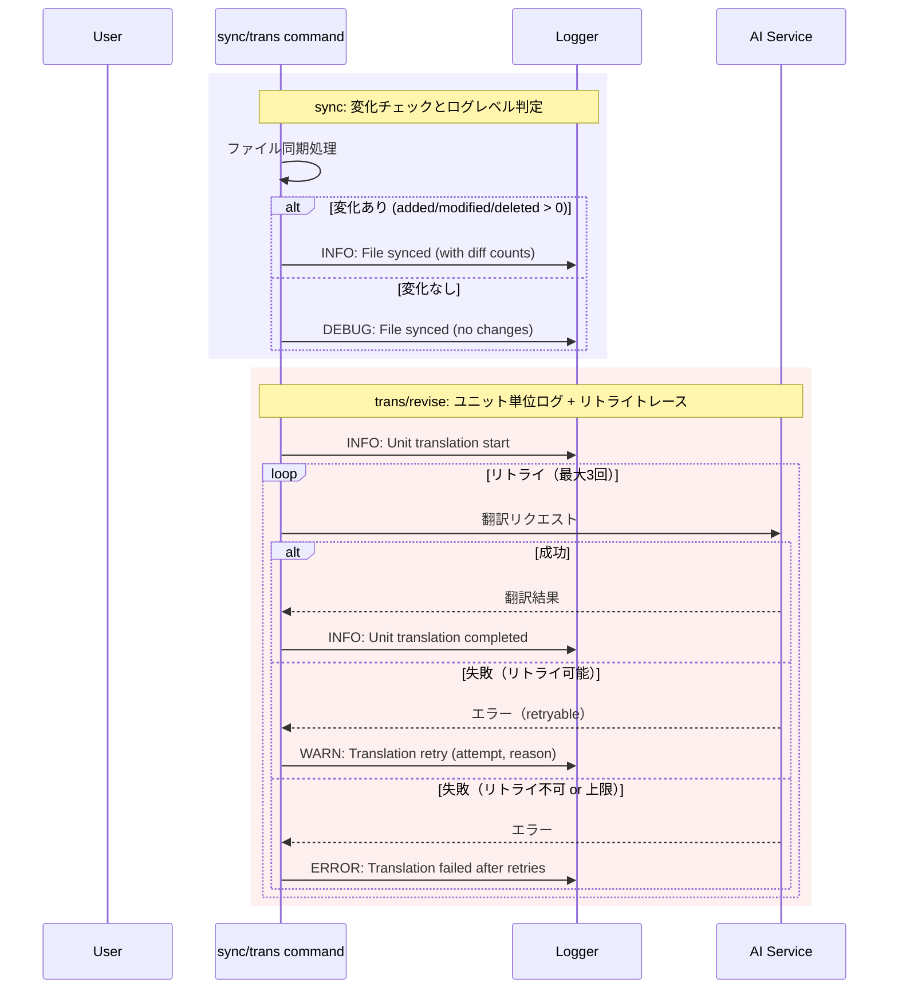

# チケット: ロギング改善

## 1. 概要と方針

ログ戦略実装後の運用知見を元に、syncコマンドの大規模サイトでのログ量削減と、trans/reviseコマンドでのデバッグ性向上を実現する。

**方針**:
1. sync: 正常系で変化がないファイルはINFOレベルでログ出力しない（DEBUGでは出力）
2. trans/revise: ユニット単位でのログ出力を強化し、LLM処理の確率的な問題を追跡可能にする
3. 異常系（特にリトライ）のログを充実させ、再現困難な問題の初期解析をサポート

## 2. 仕様

### sync コマンド
- **INFO レベル**: 変化があったファイル（added/modified/deleted > 0）のみログ出力
- **DEBUG レベル**: 全ファイルのログを出力（変化の有無に関わらず）
- **WARN/ERROR レベル**: 異常系は必ず出力

### trans/revise コマンド
- **INFO レベル**: 
  - ユニット翻訳開始時: `Unit translation start` (unitHash, title)
  - ユニット翻訳完了時: `Unit translation completed` (unitHash, duration, needsReview)
  - パッチ翻訳成功時: `Patch translation succeeded` (unitHash)
  - フォールバック時: `Fallback to full translation` (unitHash, reason)
- **DEBUG レベル**:
  - コンテキスト構築: `Building translation context` (unitHash, termsCount, surroundingUnits)
  - diff生成: `Generated diff for revision` (oldhash, newhash)
- **WARN レベル**:
  - リトライ発生時: `Translation retry` (attempt, reason, unitHash)
  - パッチ適用失敗: `Patch apply failed` (unitHash)
- **ERROR レベル**:
  - 翻訳失敗（リトライ上限到達後）: `Translation failed after retries` (unitHash, attempts, lastError)

## 3. シーケンス図



## 4. 設計

### 変更対象ファイル

1. **src/commands/sync/sync-command.ts**
   - `syncCommand()`: ファイル同期結果をチェックし、変化の有無でログレベルを切り替え
   - `syncSingleFile()`: 同様にログレベルを切り替え

2. **src/commands/trans/trans-command.ts**
   - `translateUnit()`: ユニット翻訳開始・完了時のINFOログを追加
   - `transFile_CoreProc()`: 処理全体のログを調整

3. **src/commands/trans/translator.ts**
   - `executeTranslationWithRetry()`: リトライ時のWARNログを追加
   - `executeRevisionPatchWithRetry()`: 同上
   - リトライ上限到達時のERRORログを追加

### ログレベル判定ロジック（sync）

```typescript
// 変化の有無を判定
const hasChanges = diffResult.added > 0 || diffResult.modified > 0 || diffResult.deleted > 0;

if (hasChanges) {
    logger.info("sync", "File synced", { ... });
} else {
    logger.debug("sync", "File synced (no changes)", { ... });
}
```

### ユニット単位ログ（trans）

```typescript
// 翻訳開始
logger.info("trans", "Unit translation start", {
    unitHash: unit.marker?.hash,
    title: unit.title,
    patchMode: isPatchTranslation
});

// 翻訳完了
logger.info("trans", "Unit translation completed", {
    unitHash: newHash,
    duration: (Date.now() - startTime) / 1000,
    needsReview: checkResult.needsReview
});
```

### リトライログ（translator）

```typescript
// リトライ発生時
logger.warn("trans", "Translation retry", {
    attempt: attempt + 1,
    maxRetries: this.maxRetries,
    reason: lastError.message,
    retryable: lastError.retryable,
    unitContext: "..." // 可能なら追加
});

// リトライ上限到達
logger.error("trans", "Translation failed after retries", {
    attempts: this.maxRetries,
    lastError: formatError(lastError),
    unitContext: "..."
});
```

## 5. 考慮事項

- **パフォーマンス**: DEBUG時のログ出力はI/Oコストがあるため、DEBUGレベルは開発・トラブルシュート時のみ有効化を推奨
- **ログの一貫性**: 既存のログフォーマット規約（`[YYYY-MM-DD HH:mm:ss][LEVEL][scope] message | context(JSON)`）を維持
- **ユーザー通知**: ログはあくまで開発者・デバッグ用。ユーザー向けエラーメッセージは別途`vscode.window.showErrorMessage`で対応
- **後方互換性**: 既存のログ出力を壊さないよう、追加のみを基本とする

## 6. 実装・テスト計画と進捗

- [x] sync: ファイル同期結果の変化有無によるログレベル切り替え実装
- [x] trans: ユニット翻訳開始・完了時のINFOログ追加
- [x] translator: リトライ時のWARN/ERRORログ追加
- [ ] 手動テスト: 大規模サイトでのsyncログ量確認
- [ ] 手動テスト: trans/reviseでのリトライ時ログ確認
- [ ] 既存テストが壊れていないことを確認

## 7. 品質要件チェック

- [ ] syncコマンドで正常同期（変化なし）のファイルがINFOレベルで出力されない
- [ ] DEBUGレベルでは全ファイルのログが出力される
- [ ] trans/reviseコマンドでユニット単位のログが出力される
- [ ] リトライ時にWARNログが出力され、attempt数と理由が記録される
- [ ] リトライ上限到達時にERRORログが出力される
- [ ] ログフォーマット規約に準拠している
- [ ] 既存のテストが全てパスする

## 8. まとめと改善提案

(作業完了後に記載)
