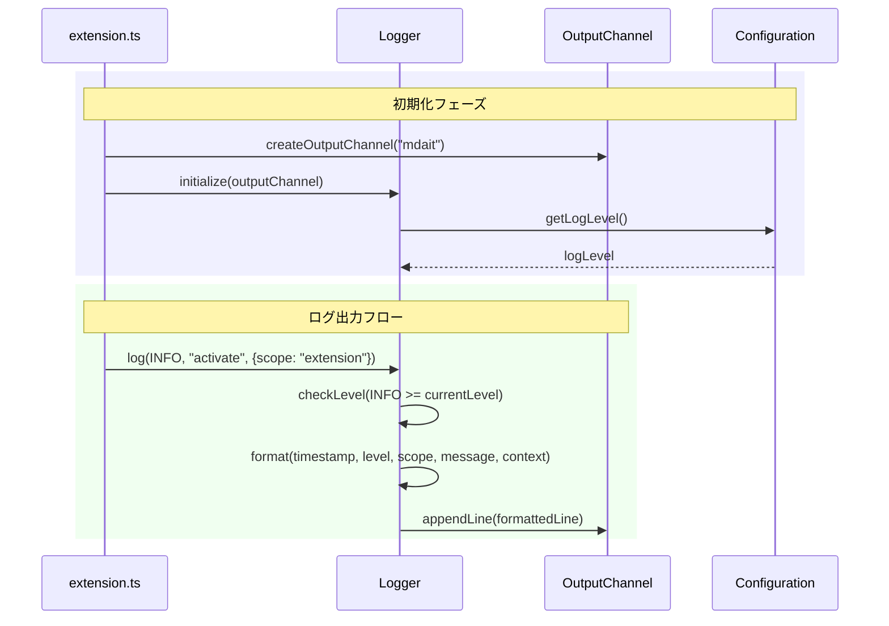

# チケット: ログ戦略実装

## 1. 概要と方針

VSCode拡張全体に一貫したログ出力戦略を導入する。OutputChannel + Loggerクラスに集約し、中長期保守に耐えるログ基盤を構築する。既存のAI統計・RequestResponse詳細ログ（`AIStatsLogger`）は別系統として独立維持する。

**方針**:
1. ログは「将来の自分・他人・AI」が読む設計
2. ユーザー通知とログは完全分離
3. OutputChannelを唯一の正式ログ出口
4. ログレベルと構造を固定
5. 処理の「境界」で必ずログを残す

## 2. 仕様

### ログレベル定義
| レベル | 値 | 意味 |
|--------|-----|------|
| DEBUG | 10 | 内部状態・詳細フロー（通常OFF） |
| INFO | 20 | 正常系の重要イベント |
| WARN | 30 | 回復可能・想定内の異常 |
| ERROR | 40 | 想定外・バグ・処理中断 |

### フォーマット規約
```
[YYYY-MM-DD HH:mm:ss][LEVEL][scope] message | context(JSON)
```

### 設定
- `mdait.logLevel`: string（"DEBUG" | "INFO" | "WARN" | "ERROR"）
- デフォルト: "INFO"

### 必須ログポイント
- activate 開始・完了: INFO
- コマンド開始・終了: INFO
- 外部I/O開始・失敗: INFO / ERROR
- 設定読み込み: INFO / WARN
- 例外catch: ERROR
- 状態遷移: INFO

## 3. シーケンス図



## 4. 設計

### 4.1 ファイル構成
```
src/
  utils/
    logger.ts        # Logger クラス（新規）
  extension.ts       # OutputChannel作成・Logger初期化
```

### 4.2 Logger API
```typescript
enum LogLevel {
  DEBUG = 10,
  INFO = 20,
  WARN = 30,
  ERROR = 40,
}

class Logger {
  private static instance: Logger | undefined;
  private channel: vscode.OutputChannel;
  private level: LogLevel;

  static getInstance(): Logger;
  initialize(channel: vscode.OutputChannel): void;
  setLevel(level: LogLevel): void;

  debug(scope: string, message: string, context?: object): void;
  info(scope: string, message: string, context?: object): void;
  warn(scope: string, message: string, context?: object): void;
  error(scope: string, message: string, context?: object): void;
}
```

### 4.3 package.json 設定追加
```json
{
  "contributes": {
    "configuration": {
      "properties": {
        "mdait.logLevel": {
          "type": "string",
          "default": "INFO",
          "enum": ["DEBUG", "INFO", "WARN", "ERROR"],
          "description": "Set the log level for mdait extension"
        }
      }
    }
  }
}
```

### 4.4 既存console.log置換
- `console.log` → `logger.info` or `logger.debug`
- `console.warn` → `logger.warn`
- `console.error` → `logger.error`

## 5. 考慮事項

1. **AI統計ログとの共存**: `AIStatsLogger`は別系統として維持。Loggerとは独立
2. **テストへの影響**: テスト内のconsole.logは置換対象外（サンプルコンテンツ内含む）
3. **パフォーマンス**: DEBUGレベル時のみ詳細ログ出力（通常OFF）
4. **国際化**: ログメッセージは英語で統一（内部用途のため）
5. **エラーフォーマット**: Errorオブジェクトを適切にシリアライズするユーティリティ

## 6. 実装・テスト計画と進捗

### Phase 1: 基盤実装
- [x] `src/utils/logger.ts` 新規作成（LogLevel, Logger class）
- [x] `package.json` に `mdait.logLevel` 設定追加
- [x] `package.nls.json` / `package.nls.ja.json` に説明文追加
- [x] `extension.ts` でOutputChannel作成・Logger初期化

### Phase 2: 既存コード置換
- [x] `extension.ts` の console.log/warn を Logger に置換
- [x] 主要コマンド（sync/trans）にログ追加

### Phase 3: テスト
- [x] Logger単体テスト作成
- [x] 結合テスト確認（221 passing）

## 7. 品質要件チェック

- [x] console.log を使っていない（テスト・サンプル除く）
- [x] ERROR に context がある
- [x] INFO が多すぎない
- [x] DEBUG がデフォルトで出ていない
- [x] ユーザー通知とログが混ざっていない
- [x] フォーマットが規約通り

## 8. まとめと改善提案

### 完了した作業
1. **Logger基盤**: `src/utils/logger.ts`に`Logger`シングルトンクラスを実装。LogLevel enum（DEBUG=10, INFO=20, WARN=30, ERROR=40）、`parseLogLevel`関数、`formatError`ユーティリティを含む。
2. **設定追加**: `package.json`に`mdait.logLevel`設定（デフォルト: INFO）を追加。`package.nls.json`/`package.nls.ja.json`にローカライズ済み説明文を追加。
3. **extension.ts初期化**: activate時にOutputChannel("mdait")作成、Logger初期化、設定からlogLevel読み込み、設定変更時のlogLevel更新を実装。
4. **既存console文置換**: extension.ts（6箇所）、sync-command.ts（9箇所）、trans-command.ts（15箇所）のconsole.log/warn/errorをLoggerに置換。
5. **テスト作成**: `src/test/utils/logger.test.ts`にLogLevel、parseLogLevel、formatErrorのテストを実装（17テストケース、すべてパス）。

### 作成・変更したファイル一覧
- **新規作成**:
  - [src/utils/logger.ts](src/utils/logger.ts) - Loggerクラス、LogLevel enum、formatError
  - [src/test/utils/logger.test.ts](src/test/utils/logger.test.ts) - Loggerテスト

- **変更**:
  - [package.json](package.json) - configuration追加、テストコマンド更新
  - [package.nls.json](package.nls.json) - logLevel説明文追加
  - [package.nls.ja.json](package.nls.ja.json) - logLevel説明文追加（日本語）
  - [src/extension.ts](src/extension.ts) - Logger初期化、console文置換
  - [src/commands/sync/sync-command.ts](src/commands/sync/sync-command.ts) - Logger import、console文置換
  - [src/commands/trans/trans-command.ts](src/commands/trans/trans-command.ts) - Logger import、console文置換

### 改善提案
1. **term系コマンドへの拡張**: 今回はsync/transに注力。term系コマンドにもログを追加すると良い。
2. **構造化ログの検討**: JSON形式での構造化ログ出力オプションを検討（外部解析ツール連携用）。
3. **ログローテーション**: 長期利用時のOutputChannel肥大化対策として、ファイル出力オプションを検討。
