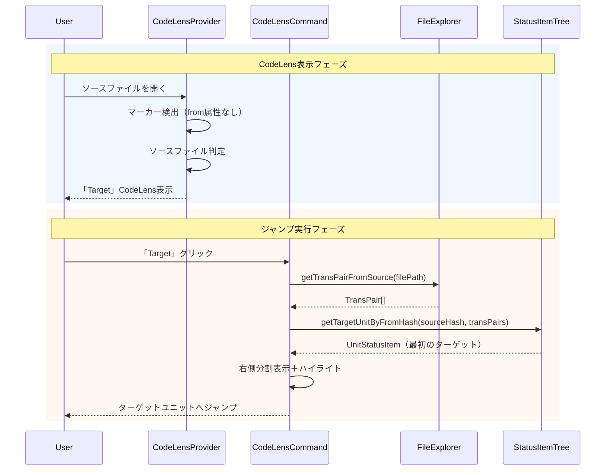

# チケット: 原文から訳文へのジャンプCodeLens追加

## 1. 概要と方針

原文マーカー上に「Target」CodeLensを追加し、対応する訳文ユニットへジャンプする機能を実装する。複数訳文が存在する場合はTransPair設定順で最初のものを選択する。

## 2. 仕様

- ソースファイル（原文）のmdaitマーカー行に「$(symbol-reference) Target」CodeLensを表示
- クリックすると対応するターゲットファイル（訳文）の該当ユニットにジャンプ
- 複数言語への翻訳がある場合、`transPairs`設定順で最初のターゲットを選択
- ジャンプ時は既存の「Source」CodeLensと同様に右側分割表示＋ハイライト＋スクロール同期を行う

## 3. シーケンス図



## 4. 設計

### 4.1 FileExplorer拡張
```typescript
// 新規追加メソッド
public getTransPairsFromSource(filePath: string, config: Configuration): TransPair[]
```
- ソースファイルパスから対応するTransPair配列を取得（設定順を維持）

### 4.2 StatusItemTree拡張
```typescript
// 新規追加メソッド
public getTargetUnitByFromHash(fromHash: string, preferredFilePath?: string): UnitStatusItem | undefined
```
- `from`属性が指定ハッシュと一致するユニットを検索
- preferredFilePathがある場合はそのファイルを優先

### 4.3 CodeLensProvider拡張
- ソースファイルのマーカーに対して「Target」CodeLensを追加
- `from`属性がなく、かつソースファイルの場合に表示

### 4.4 CodeLensCommand拡張
```typescript
// 新規追加関数
export async function codeLensJumpToTargetCommand(range: vscode.Range): Promise<void>
```
- 既存の`codeLensJumpToSourceCommand`の逆方向ジャンプを実装
- ハイライト・スクロール同期は既存コードを再利用

## 5. 考慮事項

- **パフォーマンス**: ソースファイル判定とターゲットユニット検索の効率性
  - 現状: StatusItemTree全体をスキャンする必要がある
  - 将来: unit-registryにfromハッシュのインデックスを持たせることで高速化可能
- **複数ターゲット**: TransPair設定順で最初のものを選択することで一貫性を確保
- **l10n**: 新規文言はl10nシステムで管理

## 6. 実装・テスト計画と進捗

- [x] FileExplorer: `getTransPairsFromSource`メソッド追加
- [x] StatusItemTree: `getTargetUnitByFromHash`メソッド追加
- [x] CodeLensProvider: ソースファイル用「Target」CodeLens追加
- [x] CodeLensCommand: `codeLensJumpToTargetCommand`関数追加
- [x] l10n: 新規文言追加（bundle.l10n.json, bundle.l10n.ja.json）
- [ ] テスト: 既存テストパターンに準じたテスト追加（推奨事項として将来対応）

## 7. 品質要件チェック

- [x] 既存の「Source」CodeLensと同等のUX（ハイライト・スクロール同期）
- [x] 複数ターゲット時の一貫した動作
- [x] エラーハンドリング（対応ターゲットがない場合の警告表示）
- [x] l10n対応（日本語/英語）
- [x] 既存テスト通過

## 8. まとめと改善提案

### 実装サマリ
原文マーカー上に「Target」CodeLensを追加し、訳文ユニットへのジャンプ機能を実装。既存の「Source」CodeLensと対称的なパターンで実装し、ハイライト・スクロール同期も同様に動作する。

### パフォーマンス考察

#### 現状の実装
1. **CodeLensProvider**: ドキュメントを開くたびに`FileExplorer.isSourceFile()`を呼び出してソースファイル判定を行う
   - TransPair配列をループしてパス比較：O(transPairs数)
   - 通常は数件程度なので問題なし

2. **ジャンプ実行時**: `StatusItemTree.getTargetUnitByFromHash()`でターゲットユニットを検索
   - 優先ファイル検索：O(優先ファイル数 × ユニット数)
   - 全体フォールバック検索：O(全ユニット数)
   - 大規模プロジェクト（数百〜千ファイル）では数十ms程度の遅延が発生する可能性

#### 将来の最適化案: unit-registry活用

現在の`unit-registry`はソースハッシュ→コンテンツのマッピングを管理しているが、以下の拡張により高速化が可能：

```
改善案1: fromHashインデックスの追加
- unit-registryに `fromHash → [targetFilePath, unitHash]` のインデックスを追加
- sync時にインデックスを更新
- O(1)でターゲットユニットの位置を特定可能

改善案2: StatusItemTree構築時のインデックス作成
- StatusItemTree構築時に `fromHash → UnitStatusItem` のMapを作成
- メモリ使用量は増加するが、検索はO(1)に

改善案3: 遅延インデックス構築
- 初回のTargetジャンプ時にインデックスを構築
- 以降のジャンプはO(1)で実行
```

現時点では、一般的なプロジェクト規模で問題になる可能性は低いため、パフォーマンス問題が顕在化した場合に改善案を検討する。

### その他の改善提案
- CodeLens関連のユニットテスト追加（推奨）
- 設計書（ui.md）にCodeLens機能一覧を追記（任意）
