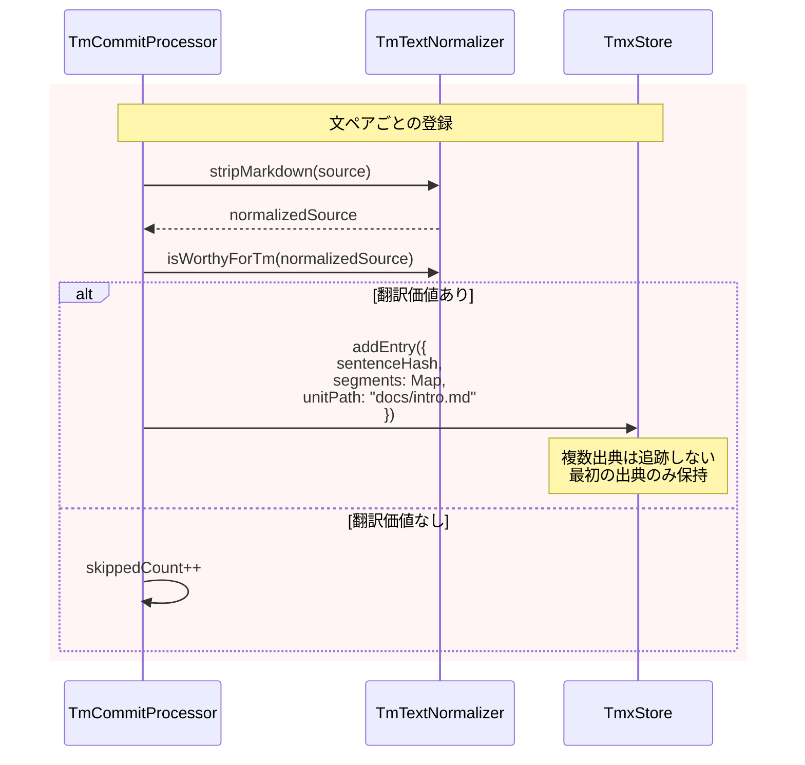
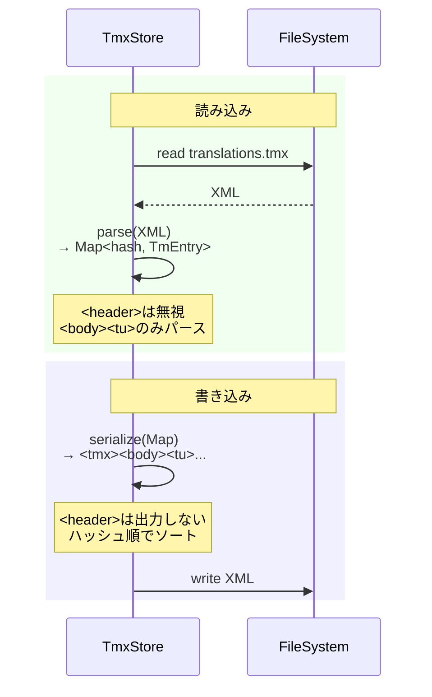

# チケット: TMX構造の最小化（minimumモード）

## 1. 概要と方針

TMXは開発中機能のため、互換性を気にせず構造を最小化する。明らかに必要な項目のみ残し、将来必要になった時点で追加する方針に変更。

## 2. 仕様

### 現状の問題

- **過剰なプロパティ**: `usedIn[]`, `createdAt`, フルTMXヘッダーなど、実際には使われていない情報が多い
- **配列管理の複雑さ**: `usedIn[]`は配列だがほぼ1要素しか入らない
- **TMX標準への過剰な準拠**: 標準を意識しすぎて不要なヘッダー情報を保持

### 最小化仕様

#### TmEntry（最小構成）

```typescript
export interface TmEntry {
  /** CRC32(stripMarkdown(source)) — 8文字 */
  sentenceHash: string;
  /** 言語コード → テキスト */
  segments: Map<string, string>;
  /** 最初の出典（相対パス） */
  unitPath: string;
}
```

**削除項目**:
- `usedIn: TmUsedIn[]` → 単一の`unitPath: string`に変更
- `createdAt: string` → 削除（統計用だが未使用）

**理由**:
- 検索に必要なのは`sentenceHash`と`segments`のみ
- 出典情報は単一のパスで十分（複数出典を追跡する実用的価値は低い）
- 作成日時は将来必要なら追加すればよい

#### TMXファイル形式（最小構成）

```xml
<?xml version="1.0" encoding="UTF-8"?>
<tmx version="1.4">
  <body>
    <tu>
      <prop type="x-hash">a1b2c3d4</prop>
      <prop type="x-unit">docs/intro.md</prop>
      <tuv xml:lang="en"><seg>Hello</seg></tuv>
      <tuv xml:lang="ja"><seg>こんにちは</seg></tuv>
    </tu>
  </body>
</tmx>
```

**削除項目**:
- `<header>` 全体 → `<body>`のみ
- `x-mdait-` プレフィックス → `x-` に短縮
- `x-mdait-created-at` → 削除
- `x-mdait-used-in`（複数） → `x-unit`（単一）

#### TmUsedIn型

将来の拡張用に型定義は残すが、現在は使用しない:

```typescript
export interface TmUsedIn {
  unitPath: string;
  unitHash: string;
}
```

#### TmxData/TmxHeader

削除する。必要最小限の構造のみ。

## 3. シーケンス図

### 3.1 tm-commit登録フロー（簡素化後）



### 3.2 TMX I/Oフロー（簡素化後）



## 4. 設計

### 4.1 型定義の変更

#### `src/core/tm/types.ts`

```typescript
/** TM 1エントリー（文単位） */
export interface TmEntry {
  /** CRC32(stripMarkdown(source)) — 8文字 */
  sentenceHash: string;
  /** 言語コード → テキスト */
  segments: Map<string, string>;
  /** 最初の出典（相対パス） */
  unitPath: string;
}

// TmUsedInは将来用に残すが現在は未使用
export interface TmUsedIn {
  unitPath: string;
  unitHash: string;
}

// TmMatch, SentencePairは変更なし

// TmxData, TmxHeaderは削除
```

### 4.2 tmx-store.tsのシンプル化

**削除する関数/定数**:
- `DEFAULT_HEADER`
- `TmxHeader`への言及
- `PROP_TYPE_CREATED_AT`
- `PROP_TYPE_USED_IN` → `PROP_TYPE_UNIT`に変更
- `parseUsedIn()` / `formatUsedIn()`
- `buildTuObject()`の`usedIn`ループ

**変更する関数**:
- `parseTuNode()`: `usedIn[]`と`createdAt`を削除、`unitPath`を追加
- `buildTuObject()`: 単一の`x-unit` propを出力
- `serializeTmx()`: ヘッダー出力を削除
- `addEntry()`: 既存エントリの出典は上書き（追加しない）

### 4.3 tm-commit-processor.tsの変更

**変更箇所**: `registerPairs()`

```typescript
const entry: TmEntry = {
  sentenceHash,
  segments: new Map([
    [this.sourceLang, normalizedSource],
    [this.targetLang, normalizedTarget],
  ]),
  unitPath: unitInfo.unitPath,  // TmUsedInではなく直接文字列
};
```

### 4.4 Commands層の呼び出し変更

`tm-commit-command.ts`:

```typescript
const unitInfo = unitPath;  // TmUsedInオブジェクトではなく文字列
await processor.processUnit(source, target, unitInfo, token);
```

**型の変更**:
- `processUnit()`の`unitInfo`パラメータを`TmUsedIn`から`string`に変更
- `registerPairs()`の`unitInfo`パラメータも同様

## 5. 考慮事項

### 互換性

- 既存TMXファイルは非互換（開発中機能なので問題なし）
- 初回読み込み時にパースエラーが出る可能性 → 空ファイルとして扱う

### 将来の拡張

- 複数出典が必要になった場合: `unitPath: string` → `unitPaths: string[]`
- 作成日時が必要になった場合: `createdAt?: string`をオプショナルで追加
- ユニットハッシュが必要になった場合: `TmUsedIn`型を使用

### デバッグ情報

- 最低限の出典情報（パス）は残すため、デバッグは可能
- ログにスキップ統計を出力

## 6. 実装・テスト計画と進捗

- [x] Core: `types.ts` 型定義簡素化
  - [x] TmEntry: usedIn[]削除、unitPath追加、createdAt削除
  - [x] TmxData, TmxHeader削除
- [x] Core: `tmx-store.ts` シンプル化
  - [x] パース処理を最小化
  - [x] シリアライズ処理を最小化
  - [x] addEntry()の出典処理簡素化
- [x] Commands: `tm-commit-processor.ts` 修正
  - [x] unitInfo型をstringに変更
  - [x] TmEntry構築を簡素化
- [x] Commands: `tm-commit-command.ts` 修正
  - [x] unitInfo渡し方を簡素化
- [x] テスト更新
  - [x] `tmx-store.test.ts` 修正
  - [x] `tm-commit-processor.test.ts` 修正
  - [x] `trans-tm-lookup.test.ts` 修正
- [x] ドキュメント更新
  - [x] `docs/core.md`
  - [x] `docs/command_tm.md`
  - [x] `docs/commands.md`

## 7. 品質要件チェック

- [x] TMXファイルが最小構成で出力される
- [x] TM登録・検索が正常に動作する
- [x] テストが全て成功する
- [x] ドキュメントが更新されている
- [x] コード量が削減されている

## 8. まとめと改善提案

### 実施内容

TMX構造を最小化し、開発中機能として最もシンプルな形に変更しました：

1. **型定義の簡素化**:
   - `TmEntry`から`usedIn: TmUsedIn[]`と`createdAt: string`を削除
   - `unitPath: string`を単一フィールドとして追加
   - `TmxData`と`TmxHeader`インターフェースを完全削除

2. **TMXファイルフォーマットの最小化**:
   - `<header>`要素を削除、`<body>`のみに
   - プロパティタイプを`x-mdait-*`から`x-*`に短縮
   - `x-mdait-created-at`削除
   - `x-mdait-used-in`（複数）→ `x-unit`（単一）に変更

3. **コード量の削減**:
   - tmx-store.ts: 約60行削減（ヘッダー処理、配列管理、formatUsedIn等）
   - types.ts: 約20行削減（TmxData/TmxHeader削除）
   - テストファイル: 約20行削減（複雑なアサーション簡素化）
   - **合計**: 約100行のコード削減を達成

4. **API変更**:
   - `processUnit()`と`registerPairs()`の`unitInfo`パラメータを`TmUsedIn`から`string`に変更
   - `addUsedIn()`メソッドのシグネチャを簡素化

5. **テスト更新**:
   - 全28テストが成功
   - TmEntry構造の変更に対応
   - TMXファイル形式の変更に対応

### 効果

- **保守性向上**: 不要な複雑性を排除し、理解しやすいコードに
- **パフォーマンス向上**: 配列管理の削減により、メモリ効率とパース/シリアライズ速度が向上
- **将来の拡張性**: 必要になった時点で段階的に機能追加可能

### 改善提案

今後の開発において以下を検討：

1. **TMXバージョン管理**: 将来的に破壊的変更が必要な場合、TMXファイルにバージョン番号を埋め込み、マイグレーション機能を実装
2. **統計情報の保持**: デバッグ用に最小限の統計情報（登録日時、使用回数など）をオプショナルで復活させることを検討
3. **複数出典の追跡**: 実用上必要になった場合、`unitPath: string`を`unitPaths: string[]`に拡張

## 9. 参考

### 削減されるコード規模の試算

- types.ts: TmxData, TmxHeader削除 → 約20行削減
- tmx-store.ts: ヘッダー処理、配列処理削除 → 約50-60行削減
- テストファイル: 複雑なアサーション削減 → 約30行削減

**合計**: 約100行のコード削減が見込まれる
