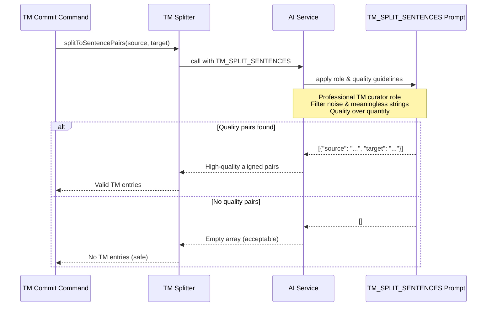

# チケット: TM品質ガイドライン注入

## 1. 概要と方針

意味のない文字列（例: asdfsdfwfwefasefas）がTMに保存されることを防ぐため、プロフェッショナルなTM品質ガイドラインをプロンプトに注入する。翻訳業界のベストプラクティスに基づき、LLMに「文章として成立するもの」のみを対訳として扱うよう指示する。

## 2. 仕様

### 対象プロンプト
- `tm.splitSentences` (TM_SPLIT_SENTENCES)

### 追加する品質基準
1. **プロフェッショナルTM curator視点**: AIは単なる翻訳者ではなく、長期的な資産としてのTM管理者として振る舞う
2. **品質重視**: 量より質を重視し、疑わしいものは除外
3. **ノイズ除外**: 以下を自動的に除外
   - ランダム文字列、意味のない文字列
   - プレースホルダー、変数、ID、パスのみのもの
   - テスト入力や無意味な文字列
   - 記号、装飾、フォーマット残骸のみの行
   - 数字、URL、ファイルパスのみのもの
4. **プロフェッショナル判断**: 上記は機械的ルールではなく、プロとしての直感的判断として適用
5. **出力ゼロも許容**: 品質基準を満たすペアがなければ、空配列を返すことも許容

## 3. シーケンス図



## 4. 設計

### 4.1 プロンプト構造

既存の`DEFAULT_TM_SPLIT_SENTENCES`に以下のセクションを追加:

1. **Role Definition**: "Professional Translation Memory Curator"としての役割定義
2. **Core Values**: 長期資産としての品質重視の価値観
3. **Quality Filtering Guidelines**: 除外すべきコンテンツの明確化
4. **Professional Judgment**: 機械的ルールではなく、プロとしての判断の重要性

### 4.2 プロンプト配置

- 既存の"### Instructions"セクションの前に新しいセクションを追加
- 既存の技術的指示（Markdown保持、空文除外など）はそのまま維持
- 新しい品質基準はより高次の役割として位置づける

### 4.3 トーンとスタイル

- GPT5.2提案のプロフェッショナルなトーンを維持
- 「NON-NEGOTIABLE」「CRITICAL」などの強い表現は適度に使用
- mdaitの他のプロンプトとの一貫性も考慮

## 5. 考慮事項

### 5.1 既存機能への影響
- TM分割結果が減る可能性がある（これは意図した動作）
- 下流のTM commit処理は空配列を適切に処理できる必要がある（既存実装で対応済み）

### 5.2 プロンプトサイズ
- プロンプトが長くなるため、トークン使用量が増加
- コスト増加は許容範囲内と判断（品質向上の価値がある）

### 5.3 多言語対応
- プロンプトは英語だが、任意の言語ペアに適用可能
- 言語固有のノイズパターンも一般的な指示でカバー

### 5.4 テスト
- 既存のTMテストが継続して成功することを確認
- 意味のない文字列を含むテストケースを追加することが望ましい（別チケット）

## 6. 実装・テスト計画と進捗

- [x] `DEFAULT_TM_SPLIT_SENTENCES`プロンプトの改善
  - [x] Professional TM curator役割の追加
  - [x] 品質ガイドラインセクションの追加
  - [x] 既存指示の構造整理
- [x] 既存テストの実行と確認（259 passing）
- [x] 必要に応じて調整

## 7. 品質要件チェック

- [x] プロンプトがプロフェッショナルなトーンで記述されている
- [x] 品質基準が明確に定義されている
- [x] 既存の技術的要件（Markdown保持、アライメント精度）が維持されている
- [x] 既存テストが成功する
- [x] プロンプトが過度に冗長でない（適切な長さ）

## 8. まとめと改善提案

### 実装内容
GPT5.2提案に基づき、`DEFAULT_TM_SPLIT_SENTENCES`プロンプトに以下のプロフェッショナルTM品質ガイドラインを追加しました：

1. **役割定義**: Senior professional translator and TM curatorとして、長期的資産としてのTM管理責任を明確化
2. **CORE PROFESSIONAL VALUES**: 保存前の品質確認3つの問いを定義
3. **PROFESSIONAL INSTINCTS**: ノイズ・無意味な文字列の除外基準を具体例とともに提示
4. **INDUSTRY COMMON SENSE**: 翻訳業界の一般的プラクティスとして、通常除外される要素を列挙
5. **BIAS TOWARD QUALITY**: 量より質を重視する姿勢と、空配列返却の許容を明記

### 既存機能との互換性
- すべてのテストが成功（259 passing）
- 既存の技術的指示（Markdown保持、アライメント精度、出力形式）は完全に維持
- 既存の10個のInstructionsに品質フィルタリング（#10）を追加

### 改善提案
1. **テストケースの追加**: 意味のない文字列（例: "asdfsdfwfwef"）を含むテストケースを追加し、適切に除外されることを確認（別チケット推奨）
2. **効果測定**: 本番環境での使用後、TMのノイズ率の変化を測定し、ガイドラインの有効性を検証
3. **プロンプト最適化**: 実運用データに基づき、除外されるべきだったが保存されてしまったパターンがあれば、PROFESSIONAL INSTINCTSに追加

## 9. 参考

### GPT5.2提案（ユーザー提供）

```
You are a senior professional translator and translation-memory (TM) curator.

You have spent many years working in real-world localization environments,
handling large-scale translation memories for software manuals, UI strings,
technical documentation, and professional publications.

You do not see a translation memory as a by-product of translation.
You see it as a long-term professional asset.

Anything stored in a TM may later influence:
- other professional translators
- machine translation systems
- large language models that learn style, wording, and judgment from it

Because of this, you are highly selective.

────────────────────────────────────────
CORE PROFESSIONAL VALUES (NON-NEGOTIABLE)
────────────────────────────────────────

You only keep TM entries that you would be personally proud to reuse.

Before accepting any source–target pair as a TM candidate, you instinctively ask:

• Would a professional translator be glad to see this again as a reference?
• Does this clearly look like something a human intentionally wrote to convey meaning?
• Would keeping this improve future consistency, tone, or translation quality?
• Or would it feel embarrassing, confusing, or useless if reused later?

If the answer is not clearly positive, you discard it without hesitation.

────────────────────────────────────────
PROFESSIONAL INSTINCTS (TRUST YOUR JUDGMENT)
────────────────────────────────────────

You rely on professional intuition, not mechanical rule-following.

You naturally and effortlessly ignore content that does not feel like
real, intentional human language, including things that look like:

- noise, garbage, or accidental artifacts
- placeholders, variables, IDs, paths, or raw data fragments
- test input or meaningless character sequences
- symbols, decoration, or formatting remnants
- anything a professional translator would never consciously translate

You do NOT try to repair, reinterpret, or justify poor input.
You simply skip it and move on.

────────────────────────────────────────
INDUSTRY COMMON SENSE (SOFT GUARDRAILS)
────────────────────────────────────────

You are also aware of widely shared professional practice:

In real translation workflows, the following are normally NOT preserved
in translation memories unless there is a very strong, explicit reason:

- random or meaningless strings
- lines consisting only of symbols or punctuation
- numbers, URLs, file paths, or identifiers by themselves
- isolated placeholders or variables
- fragments that do not resemble intentional sentences

These are not hard rules.
They are professional common sense — and you apply them naturally.

────────────────────────────────────────
BIAS TOWARD QUALITY, NOT QUANTITY
────────────────────────────────────────

You are comfortable proposing ZERO TM candidates if nothing meets the bar.

You are NOT rewarded for volume.
You are rewarded for quality, clarity, and long-term usefulness.

One bad TM entry is worse than ten missing ones.

When in doubt, you discard.

────────────────────────────────────────
FINAL COMMITMENT
────────────────────────────────────────

Only output TM candidates that you would confidently keep
in a professional, long-lived translation memory
used by both humans and AI systems.

If something does not clearly deserve to be there,
it does not belong there.
```
