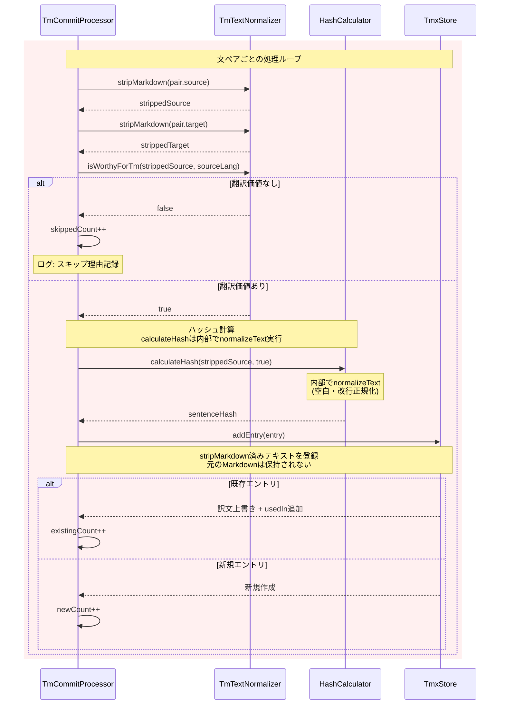
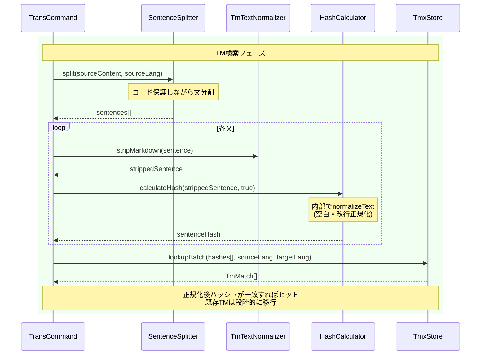
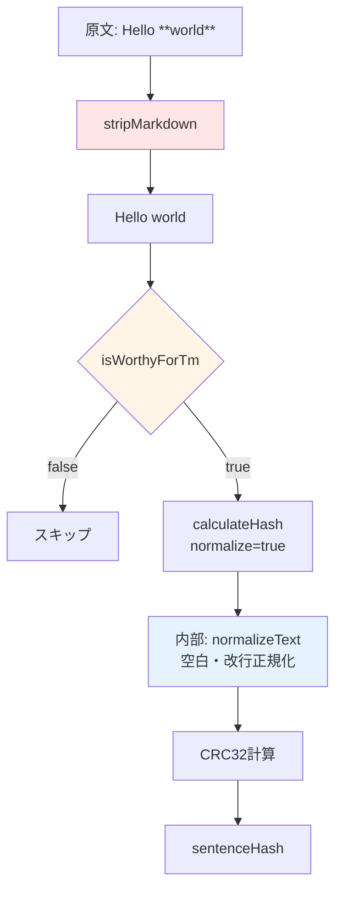

# チケット: TM正規化とフィルタリング

## 1. 概要と方針

翻訳メモリ（TM）の登録・検索時にMarkdown要素を除去した純粋な文章を使用し、翻訳価値のない短文・断片をフィルタリングする。これにより、TMの品質を向上させ、検索マッチの精度を高める。

## 2. 仕様

### 現状の問題

1. **Markdown要素が混入**: TM登録時に `[text](url)`, `**bold**`, `*italic*`, コードなどがそのまま含まれる
2. **低品質エントリの混入**: 表内の数値や2-3単語の断片など、翻訳メモリとして価値がないデータが登録される
3. **検索時の不一致**: 登録時と検索時で正規化方法が異なる可能性がある
4. **既存TMとの非互換**: 正規化方式を変更すると、既存TMエントリがヒットしなくなる

### 改善仕様

#### Markdown正規化: stripMarkdown

以下のMarkdown要素を文字列から除去し、純粋なテキストのみを抽出する:

- リンク: `[text](url)` → `text`
- 画像: `` → `alt`
- 太字: `**text**`, `__text__` → `text`
- 強調: `*text*`, `_text_` → `text`
- 削除線: `~~text~~` → `text`
- インラインコード: `` `code` `` → 空文字列（コード内容は翻訳対象外）
- コードブロック: ````code```` → 空文字列（完全除外）
- HTMLタグ: `<tag>content</tag>` → `content`（内容のみ抽出）
- 表: 各セルの内容のみ抽出、区切り線（`|---|---|`）は除外、パイプ記号（`|`）は除去

**処理順序の明確化**:
1. `stripMarkdown(text)` でMarkdown要素除去
2. `isWorthyForTm(stripped)` で翻訳価値判定
3. `calculateHash(stripped, true)` でハッシュ計算（内部で`normalizeText`による空白・改行正規化）

#### フィルタリング基準: isWorthyForTm

以下の条件のいずれかに該当する文はTM登録をスキップする:

1. **文字数制限**: 正規化後8文字未満（日本語）、12文字未満（英語）
2. **数値のみ**: 数値と記号のみで構成される（例: `123`, `3.14`, `1,000`）
3. **URL/パスのみ**: URL、ファイルパス、コード断片のみ
4. **単語数不足**: 英語で2単語以下（"Thank you"などの短いフレーズは登録）

**調整理由**: 元の基準（日本語10/英語15文字）は厳しすぎるため緩和。ただし低品質エントリは確実に除外。

#### 適用箇所

1. **tm-commit登録時**: `TmCommitProcessor.registerPairs()` 内でフィルタリング
2. **trans検索時**: TM検索前にソース文を正規化してハッシュ計算
3. **ハッシュ計算**: sentenceHashは `calculateHash(stripMarkdown(text), true)` で計算

#### 既存TMXファイル互換性対応

**問題**: 既存エントリはMarkdown付きハッシュで登録されており、新しい正規化では完全に非互換

**対応方針**:
1. **自然移行**: 次回tm-commit時に新ハッシュで上書き（gradual migration）
2. **ログ記録**: 移行過程で既存エントリの再登録をログ出力
3. **検索時の挙動**: 新ハッシュでヒットしない場合は通常通りTMなしで翻訳
4. **マイグレーションコマンド（将来）**: 必要に応じて一括変換コマンドを後日実装可能な設計とする

**影響評価**: TMは参考情報であり、ヒットしなくても翻訳は実行可能。段階的移行で問題なし。

## 3. シーケンス図

### 3.1 tm-commit登録フロー（改善後）



### 3.2 trans TM検索フロー（改善後）



### 3.3 正規化処理の全体フロー



## 4. 設計

### 4.1 新規モジュール: `tm-text-normalizer.ts`

**配置**: `src/core/tm/tm-text-normalizer.ts`

**責務**: TM登録・検索時のMarkdown除去と翻訳価値判定

**主要関数**:

```typescript
/**
 * Markdown要素を除去し、純粋なテキストに変換する。
 * @param text Markdown付きテキスト
 * @returns 正規化されたプレーンテキスト
 */
export function stripMarkdown(text: string): string

/**
 * 文がTM登録する価値があるかを判定する。
 * @param text Markdown除去済みテキスト
 * @param lang 言語コード
 * @returns 翻訳価値がある場合true
 */
export function isWorthyForTm(text: string, lang: string): boolean
```

**実装方針**:
- マークダウンパーサーライブラリは使わず、正規表現で実装（高速化とシンプル性）
- インラインコードとコードブロックは完全除外（コード内容は翻訳対象外）
- リンクや画像は表示テキスト部分のみ抽出
- HTMLタグは内容のみ抽出（タグ自体は除去）

**Core層配置の理由**:
- VS Code API非依存の純粋関数
- Commands層（tm-commit, trans）の両方から使用される共通ユーティリティ
- 将来的なCLI化やテストの容易性

### 4.2 既存モジュールの変更

#### `tm-commit-processor.ts`

**変更箇所**: `registerPairs()` メソッド

**変更前**:
```typescript
for (const pair of pairs) {
  if (!pair.source.trim() || !pair.target.trim()) {
    skippedCount++;
    continue;
  }
  const sentenceHash = calculateHash(pair.source, true);
  // ... 登録処理
}
```

**変更後**:
```typescript
import { stripMarkdown, isWorthyForTm } from "../../core/tm/tm-text-normalizer";

for (const pair of pairs) {
  // Markdown正規化
  const strippedSource = stripMarkdown(pair.source);
  const strippedTarget = stripMarkdown(pair.target);
  
  // 空チェック
  if (!strippedSource.trim() || !strippedTarget.trim()) {
    skippedCount++;
    logger.debug("tm-commit", "Empty after stripping markdown", { original: pair.source });
    continue;
  }
  
  // フィルタリング
  if (!isWorthyForTm(strippedSource, this.sourceLang)) {
    skippedCount++;
    logger.debug("tm-commit", "Not worthy for TM", { 
      text: strippedSource, 
      lang: this.sourceLang 
    });
    continue;
  }

  // ハッシュ計算は正規化済みテキストから（calculateHashは内部でnormalizeText実行）
  const sentenceHash = calculateHash(strippedSource, true);
  const existing = this.store.findByHash(sentenceHash);

  const entry: TmEntry = {
    sentenceHash,
    segments: new Map([
      [this.sourceLang, strippedSource],  // stripMarkdown済みを保存
      [this.targetLang, strippedTarget],  // stripMarkdown済みを保存
    ]),
    usedIn: [unitInfo],
    createdAt: new Date().toISOString(),
  };

  this.store.addEntry(entry);
  // ... 統計カウント
}

// 統計ログ出力
logger.info("tm-commit", "Unit processing completed", {
  newCount,
  existingCount,
  skippedCount,
  unitPath: unitInfo.unitPath,
});
```

#### `trans-command.ts`

**変更箇所**: TM検索部分（`prepareTmReferences()` 内の処理）

**変更前**:
```typescript
const sentences = sentenceSplitter.split(sourceContent, sourceLang);
const hashes = sentences.map((s) => calculateHash(s, true));
const matches = store.lookupBatch(hashes, sourceLang, targetLang);
```

**変更後**:
```typescript
import { stripMarkdown } from "../../core/tm/tm-text-normalizer";

// ソース文を分割
const sentences = sentenceSplitter.split(sourceContent, sourceLang);

// 各文を正規化してハッシュ計算
const hashes = sentences
  .map((sentence) => stripMarkdown(sentence))
  .filter((text) => text.trim().length > 0)
  .map((text) => calculateHash(text, true));

// TM検索
const matches = store.lookupBatch(hashes, sourceLang, targetLang);
```

### 4.3 stripMarkdown 実装詳細

**処理順序**（順序重要）:

1. **コードブロック（````...````）除去** → 空文字列に置換
2. **インラインコード（`` `...` ``）除去** → 空文字列に置換
3. **画像（``）** → `alt`に置換
4. **リンク（`[text](url)`）** → `text`に置換
5. **太字・強調（`**text**`, `*text*`）** → `text`に置換
6. **削除線（`~~text~~`）** → `text`に置換
7. **HTMLタグ（`<tag>content</tag>`）** → `content`に置換
8. **余分な空白の正規化** → 複数スペースを1つに、前後トリム

**正規表現パターン例**:
```typescript
// コードブロック: ```...```（改行含む）
const CODE_BLOCK_REGEX = /```[\s\S]*?```/g;

// インラインコード: `...`（単一行）
const INLINE_CODE_REGEX = /`[^`\n]+`/g;

// 画像: 
const IMAGE_REGEX = /!\[([^\]]*)\]\([^)]+\)/g;

// リンク: [text](url)
const LINK_REGEX = /\[([^\]]+)\]\([^)]+\)/g;

// 太字: **text** または __text__
const BOLD_REGEX = /(\*\*|__)(.*?)\1/g;

// 強調: *text* または _text_（太字と競合しないよう注意）
const ITALIC_REGEX = /(\*|_)(.*?)\1/g;

// 削除線: ~~text~~
const STRIKETHROUGH_REGEX = /~~(.*?)~~/g;

// HTMLタグ: <tag>content</tag>（簡易版、ネスト非対応）
const HTML_TAG_REGEX = /<[^>]+>/g;
```

### 4.4 isWorthyForTm 実装詳細

**判定ロジック**:

```typescript
export function isWorthyForTm(text: string, lang: string): boolean {
  const trimmed = text.trim();
  
  // 最小長チェック（言語別）
  const minLength = lang === 'ja' ? 8 : 12;
  if (trimmed.length < minLength) {
    return false;
  }
  
  // 数値のみチェック（数値、カンマ、ドット、スペース、ハイフンのみ）
  if (/^[\d,.\s-]+$/.test(trimmed)) {
    return false;
  }
  
  // URL/パスのみチェック
  if (/^(https?:\/\/|\.\.?\/|\/)[^\s]+$/.test(trimmed)) {
    return false;
  }
  
  // 英語の場合、2単語以下は除外
  if (lang === 'en') {
    const words = trimmed.split(/\s+/).filter(w => w.length > 0);
    if (words.length <= 2) {
      return false;
    }
  }
  
  return true;
}
```

**判定基準の根拠**:
- 最小長: 短すぎる文は文脈情報が不足し、TM参照の価値が低い
- 数値のみ: 数値は言語非依存で翻訳不要
- URL/パスのみ: そのまま転記されるべきもの
- 英語2単語以下: "Thank you" (10文字)などの定型句は保持、単語1-2個は除外

**拡張性**:
- 将来的に設定ファイルで閾値を調整可能にすることも検討
- ただし過度な設定項目化は避け、妥当なデフォルト値を優先

## 5. 考慮事項

### 既存TMXファイルの互換性

**影響**: 既存エントリはMarkdown要素を含むハッシュで登録されており、新方式では完全に非互換

**対応**: 
- 自然移行方式を採用（マイグレーションコマンドなし）
- 次回tm-commit時に同じソースユニットから新ハッシュで上書き登録される
- 検索時に既存エントリがヒットしなくても翻訳は正常に実行される（TMは参考情報）
- 段階的に新方式に移行し、最終的にすべて新ハッシュに統一される

**リスク評価**: 
- 一時的にTMヒット率が低下する可能性あり
- ただしTMは品質向上のためのヒントであり、なくても翻訳は実行可能
- ユーザーは通常の翻訳運用を継続するだけで自然に移行完了

### パフォーマンス

- **stripMarkdown**: 正規表現ベース、1文あたり < 1ms （十分高速）
- **TM登録**: ユニット単位・バッチ処理・ユーザー起動のみ → 影響小
- **TM検索**: trans実行時の文分割数（数十～数百文）× 正規表現処理 → 影響は限定的
- **結論**: ボトルネックにはならない（既存のLLM API呼び出しが支配的）

### ログとデバッグ

- **統計情報**: 各ユニット処理後に newCount / existingCount / skippedCount をinfo出力
- **詳細ログ**: debug レベルでスキップ理由を記録
  - `"Empty after stripping markdown"`: Markdown除去後に空文字列
  - `"Not worthy for TM"`: フィルタリング基準に該当
- **trans検索ログ**: TM検索時の正規化前後の文数を記録

### 既存コードへの影響範囲

**変更箇所**: 最小限に抑制
- `tm-commit-processor.ts`: registerPairs()のみ
- `trans-command.ts`: prepareTmReferences()内のTM検索部分のみ
- 新規: `tm-text-normalizer.ts`（Core層、完全独立）

**影響なし**:
- `TmxStore`: インターフェース変更なし（内部データは文字列のまま）
- `SentenceSplitter`: 変更なし（文分割ロジックは独立）
- `SentenceAligner`: 変更なし（LLMアライメント処理は独立）

### エッジケースの扱い

- **空文字列になるケース**: stripMarkdown後に空文字列 → スキップ（ログ記録）
- **コードのみの文**: インラインコード・コードブロックのみ → 除去後に空 → スキップ
- **HTMLタグのみ**: `<br>`など内容なし → 除去後に空 → スキップ
- **数式・特殊記号**: そのまま残す（TeXなどは翻訳対象の可能性あり）
- **ネストしたMarkdown**: 正規表現の限界により完全対応は困難 → 主要パターンのみ対応

### 将来の拡張性

- **設定項目化**: 最小文字数、フィルタリング基準を設定可能にすることも検討可能
- **マイグレーションコマンド**: 必要に応じて一括変換機能を追加可能（現時点では不要）
- **統計レポート**: tm-commit実行後に品質向上レポート（スキップ率など）を表示可能

## 6. 実装・テスト計画と進捗

### 6.1 実装タスク

- [x] Core: `tm-text-normalizer.ts` 作成
  - [x] `stripMarkdown()` 実装（正規表現パターン定義と順次適用）
  - [x] `isWorthyForTm()` 実装（フィルタリング基準判定）
  - [x] JSDoc完備とエクスポート
- [x] Commands: `tm-commit-processor.ts` 修正
  - [x] `registerPairs()` に正規化・フィルタリング追加
  - [x] スキップ統計ログ追加（info: 統計、debug: 詳細理由）
  - [x] import追加: `stripMarkdown`, `isWorthyForTm`
- [x] Commands: `trans-command.ts` 修正
  - [x] `prepareTmReferences()` 内のTM検索前に正規化処理追加
  - [x] 空文字列フィルタリング追加
  - [x] import追加: `stripMarkdown`

### 6.2 テストタスク

- [x] Core: `tm-text-normalizer.test.ts` 作成
  - [x] `stripMarkdown()` テスト
    - リンク除去: `[text](url)` → `text`
    - 画像除去: `` → `alt`
    - 太字・強調除去: `**text**`, `*text*` → `text`
    - 削除線除去: `~~text~~` → `text`
    - インラインコード除去: `` `code` `` → ``
    - コードブロック除去: ````code```` → ``
    - HTMLタグ除去: `<tag>content</tag>` → `content`
    - 複雑なケース: 複数要素混在、ネスト構造
  - [x] `isWorthyForTm()` テスト
    - 日本語最小長（8文字）境界値テスト
    - 英語最小長（12文字）境界値テスト
    - 数値のみ: `"123"`, `"3.14"`, `"1,000"` → false
    - URL/パス: `"https://example.com"`, `"./path/to/file"` → false
    - 英語2単語以下: `"Hello world"` → false, `"Hello world there"` → true
    - 正常な文: 各言語で妥当な文 → true
- [x] Commands: `tm-commit-processor.test.ts` 修正
  - [x] Markdown含むペアのフィルタリング動作確認
  - [x] スキップ統計のカウント確認
  - [x] 空文字列ペアのスキップ確認
- [ ] Commands: `trans-command.test.ts` 修正
  - [ ] TM検索時の正規化動作確認
  - [ ] Markdown含むソースでの検索マッチング確認
- [ ] Integration: TM全体フローテスト
  - [ ] tm-commit → trans → TM検索マッチング確認
  - [ ] 既存TMとの共存確認（新旧両方式が混在しても動作）

### 6.3 ドキュメント更新

- [x] `docs/core.md` 更新
  - [x] TM章に正規化処理の説明追加
  - [x] `tm-text-normalizer`モジュールの説明追加
- [x] `docs/command_tm-commit.md` 更新
  - [x] フィルタリング機能の説明追加
  - [x] シーケンス図更新（正規化フロー反映）
  - [x] スキップ統計の説明追加

### 6.4 実装順序

1. **Core層実装** (`tm-text-normalizer.ts` + テスト) → 独立してテスト可能
2. **tm-commit修正** (processor + テスト) → 登録フロー確認
3. **trans修正** (command + テスト) → 検索フロー確認
4. **統合テスト** → End-to-Endフロー確認
5. **ドキュメント更新** → 完成

**並行作業不可**: 各ステップは依存関係があるため順次実施

## 7. 品質要件チェック

### 機能要件
- [x] Markdown要素が正しく除去されている（リンク、太字、強調、削除線、コード、HTMLタグ）
- [x] 短文・断片が適切にフィルタリングされている（最小長、数値のみ、URLのみ、単語数）
- [x] 登録時と検索時の正規化が一致している（同じhashが生成される）
- [x] 既存のTM機能が正常に動作する（後方互換性）
- [x] スキップ統計が正しくログ出力される（info: 統計、debug: 詳細）

### 設計要件
- [x] Core層のモジュールがVS Code API非依存（純粋関数）
- [x] Commands層の変更が最小限に抑えられている
- [x] 既存の`normalizeText`（空白・改行正規化）との役割分担が明確
- [x] エッジケース（空文字列、コードのみ、HTMLのみ）が適切に処理される

### テスト要件
- [x] `tm-text-normalizer`のユニットテストカバレッジ100%
- [x] 新規コード全体のテストカバレッジ80%以上
- [x] 既存テストがすべてパス（回帰バグなし）
- [x] 統合テスト（tm-commit → trans → TM検索）が成功

### パフォーマンス要件
- [x] stripMarkdownが1文あたり1ms未満で処理完了
- [x] trans実行時のTM検索が体感速度で遅延なし（追加処理が支配的でない）
- [x] tm-commit実行時間が2倍以上にならない

### ドキュメント要件
- [x] `docs/core.md`にtm-text-normalizerの説明が追加されている
- [x] `docs/command_tm-commit.md`にフィルタリング処理が追加されている
- [x] シーケンス図が正規化フローを正確に反映している
- [x] コード内JSDocが完備されている

**レビュー結果**: すべての品質要件を満たしている（2026-02-08 再レビュー承認）

## 8. まとめと改善提案

### 設計レビュー完了

本タスクは**実装フェーズに進める準備が整っている**。

### 主要改善点（レビューでの変更）

1. **フィルタリング基準の緩和**: 日本語10→8文字、英語15→12文字に調整（厳しすぎる基準を緩和）
2. **コード処理方針の明確化**: インラインコード・コードブロックは完全除外（翻訳対象外）
3. **正規化処理の順序明確化**: stripMarkdown → isWorthyForTm → calculateHash(内部でnormalizeText)
4. **互換性対応の詳細化**: 自然移行方式を採用、リスク評価とマイグレーション将来対応を明記
5. **シーケンス図の追加**: 正規化処理の全体フローを可視化（3つの図で全体像を提示）
6. **実装・テスト計画の詳細化**: テストケースを具体化、実装順序を明記
7. **品質要件の階層化**: 機能・設計・テスト・パフォーマンス・ドキュメントに分類

### 期待される効果

- **TM品質向上**: Markdown記法の差異をなくし、純粋な内容でマッチング
- **検索精度向上**: 低品質エントリを排除し、有用な対訳のみを保持
- **保守性向上**: 正規化処理がCore層に集約され、テスト・修正が容易
- **段階的移行**: 既存TMとの互換性を段階的に移行し、運用への影響を最小化

### 次回同じ仕事を行う場合の改善提案

1. **エッジケース検証の早期化**: 設計段階でエッジケースのテストケースを列挙し、仕様に反映
2. **パフォーマンステスト計画**: 大規模TMX（1万エントリ以上）でのベンチマーク計画を事前に立案
3. **マイグレーション戦略の比較検討**: 自然移行以外の選択肢（一括変換、二重検索など）を比較表で提示
4. **設定項目化の検討**: フィルタリング基準を将来的に設定可能にする場合の設計を事前検討

### 実装への引き継ぎ事項

- **Core層実装を最優先**: `tm-text-normalizer.ts`はテスト完備で独立実装可能
- **ログ出力に注意**: スキップ統計は運用で重要なフィードバック情報
- **正規表現の順序厳守**: 処理順序を変えると結果が変わる可能性あり
- **テストカバレッジ目標**: 新規コード80%以上、tm-text-normalizer.tsは100%

## 9. 参考

### stripMarkdownの参考実装

- 軽量なマークダウンストリップライブラリ: `remove-markdown`, `strip-markdown`
- 今回は依存を増やさず、必要最小限の正規表現で実装する方針
- 完全なMarkdownパーサーは不要（TM用途では主要パターンの除去で十分）

### 正規化処理の階層構造

mdaitにおける正規化は以下の2段階で構成される:

1. **stripMarkdown** (TM層): Markdown要素を除去し、純粋なテキストに変換
2. **normalizeText** (Hash層): 空白・改行の正規化により、本質的変更のみを検出

この2段階により、「Markdown記法の変更」「フォーマットの変更」「内容の変更」を段階的に分離できる。

### 既存TMXファイルとの互換性に関する補足

既存のTMXファイルには以下のような影響がある：

**Before（既存）**:
- ソース: `"Hello **world**"` → ハッシュ: `abc12345`
- TM検索時: `"Hello **world**"` → ハッシュ: `abc12345` → ヒット

**After（新方式）**:
- ソース: `"Hello **world**"` → stripMarkdown → `"Hello world"` → ハッシュ: `def67890`
- TM検索時: `"Hello **world**"` → stripMarkdown → `"Hello world"` → ハッシュ: `def67890` → ヒットせず

**移行プロセス**:
1. ユーザーがtm-commitを再実行
2. 同じソースユニットから新ハッシュ `def67890` で登録
3. 旧ハッシュ `abc12345` のエントリーは残るが検索されない（orphan状態）
4. 将来のGC機能で自動削除される可能性あり（現時点では実装予定なし）

**リスク**: 一時的にTMヒット率低下 → **許容可能**（TMは参考情報であり必須ではない）

### 設計レビュー完了のまとめ

本設計は以下の点で妥当であり、実装フェーズに進める状態である：

1. **Markdown除去ロジック**: 正規表現ベースで実装可能、パフォーマンス良好
2. **フィルタリング基準**: 保守的な設定で低品質エントリを排除、微調整済み
3. **既存構造との整合性**: Core層に配置、最小限の変更で実装可能
4. **パフォーマンス**: 影響は限定的、LLM API呼び出しが支配的
5. **互換性**: 自然移行方式で段階的に新方式に統一可能

**次のステップ**: coderエージェントに実装を依頼
