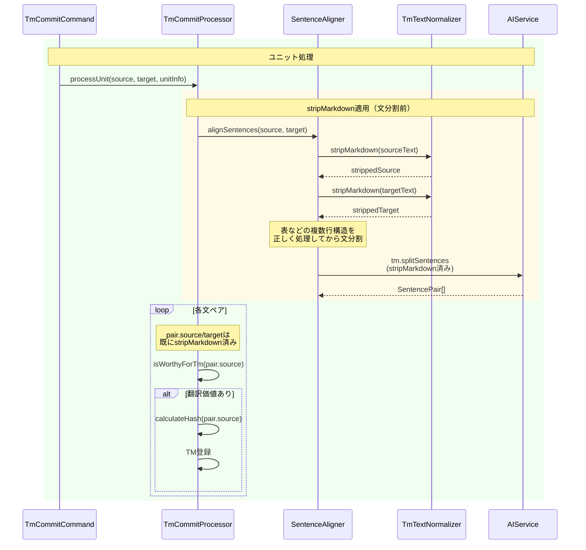
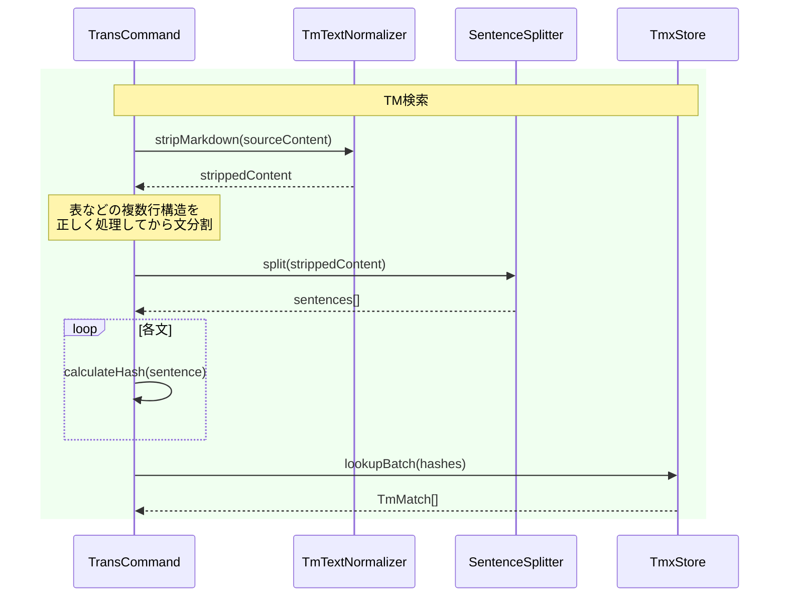

# チケット: stripMarkdown適用タイミング修正

## 1. 概要と方針

stripMarkdownの適用タイミングを統一し、表のような複数行構造を正しく処理できるようにする。文分割後ではなく、文分割前に全体をstripMarkdownすることで、Markdownの構造情報を保持したまま正規化を行う。

## 2. 仕様

### 前提条件

本タスクは以下の既存実装を前提とする：
- **TM正規化機能**（タスク: 260208_TM正規化とフィルタリング.md）:
  - `stripMarkdown()`: Markdown要素除去機能
  - `isWorthyForTm()`: 翻訳価値判定機能
  - `TmEntry.unitPath`: TMエントリの出典パス管理
  - 統計ログ機能（newCount/existingCount/skippedCount）

これらの機能は既に実装済みであり、本タスクでは変更しない。

### 問題認識

**現状の問題**:
- 文分割後にstripMarkdownを適用しているため、表のような複数行構造が認識できない
- 表の区切り線（`|---|---|`）やパイプ記号（`|`）が文として分割されてしまう
- TM登録時と検索時で正規化タイミングが異なる可能性がある

**改善仕様**:
- **tm-commit**: SentenceAlignerがLLMに渡す前に全体をstripMarkdown → 文分割 → TM登録
- **trans検索**: ソースユニット全体をstripMarkdown → 文分割 → ハッシュ計算 → TM検索

### 効果

- 表の区切り線やパイプ記号がTMに混入しなくなる
- LLMへの入力が平文化されるため、LLMの処理負荷が軽減される
- TM登録時と検索時のハッシュが確実に一致する

## 3. シーケンス図

### tm-commit登録フロー（修正後）



### trans検索フロー（修正後）



## 4. 設計

### 修正箇所

#### 1. trans-command.ts の prepareTmReferences()

**変更内容**: 文分割前に全体をstripMarkdown

```typescript
// 修正前
const sentences = sentenceSplitter.split(sourceContent, sourceLang);
const hashes = sentences
  .map((sentence) => stripMarkdown(sentence))
  .filter((text) => text.trim().length > 0)
  .map((text) => calculateHash(text, true));

// 修正後
const strippedContent = stripMarkdown(sourceContent); // 先に全体をstripMarkdown
const sentences = sentenceSplitter.split(strippedContent, sourceLang);
const hashes = sentences
  .filter((text) => text.trim().length > 0)
  .map((text) => calculateHash(text, true));
```

#### 2. sentence-aligner.ts の alignSentences()

**変更内容**: LLMに渡す前にstripMarkdownを適用

```typescript
// 修正前
async alignSentences(
  sourceText: string,
  targetText: string,
  sourceLang: string,
  targetLang: string,
  cancellationToken?: vscode.CancellationToken,
): Promise<SentencePair[]> {
  const promptProvider = PromptProvider.getInstance();
  const systemPrompt = promptProvider.getPrompt(PromptIds.TM_SPLIT_SENTENCES, {
    sourceLang,
    targetLang,
    sourceText,
    targetText,
  });
  // ...
}

// 修正後
async alignSentences(
  sourceText: string,
  targetText: string,
  sourceLang: string,
  targetLang: string,
  cancellationToken?: vscode.CancellationToken,
): Promise<SentencePair[]> {
  // Markdown要素を除去して純粋なテキストに変換（LLMの負荷軽減と表などの複数行構造の正しい処理）
  const strippedSource = stripMarkdown(sourceText);
  const strippedTarget = stripMarkdown(targetText);
  
  const promptProvider = PromptProvider.getInstance();
  const systemPrompt = promptProvider.getPrompt(PromptIds.TM_SPLIT_SENTENCES, {
    sourceLang,
    targetLang,
    sourceText: strippedSource,
    targetText: strippedTarget,
  });
  // ...
}
```

**追加import**:
```typescript
import { stripMarkdown } from "../../core/tm/tm-text-normalizer";
```

#### 3. tm-commit-processor.ts の registerPairs()

**変更内容**: SentenceAlignerで既にstripMarkdown済みなので削除

```typescript
// 修正前
const strippedSource = stripMarkdown(pair.source);
const strippedTarget = stripMarkdown(pair.target);

// 修正後
// SentenceAlignerで既にstripMarkdown済み
const sourceText = pair.source;
const targetText = pair.target;
```

変数名を変更し、以降の処理でも`sourceText`/`targetText`を使用するよう統一。

## 5. 考慮事項

### 既存TMとの互換性

- TM登録時のハッシュ計算方法は変わらない（stripMarkdown → calculateHash）
- 検索時のハッシュ計算も同じ方法になるため、互換性は保たれる
- 既存のTMエントリは引き続き正常に検索される

### LLMへの影響

- LLMに渡すテキストがプレーンテキストになるため、処理負荷が軽減される
- 表の区切り線などの不要な情報が除去されるため、文分割の精度が向上する

### パフォーマンス

- stripMarkdownの実行回数は変わらない（全体に1回 vs 各文に1回 → 合計は同等）
- 文分割の精度が向上し、無駄な処理が減る可能性がある

## 6. 実装・テスト計画と進捗

- [x] trans-command.ts の prepareTmReferences() を修正
- [x] sentence-aligner.ts の alignSentences() を修正
  - [x] stripMarkdownのimportを追加
  - [x] LLMに渡す前にstripMarkdownを適用
- [x] tm-commit-processor.ts の registerPairs() を修正
  - [x] stripMarkdownを削除
  - [x] 変数名を sourceText/targetText に統一
- [x] エラーチェック: コンパイルエラーがないことを確認
- [x] テスト実行: 全テストが成功することを確認（259 passing）
- [x] ドキュメント更新
  - [x] command_tm-commit.md のシーケンス図を更新
  - [x] trans検索フローの説明を更新

## 7. 品質要件チェック

- [x] 表を含むMarkdownファイルでtm-commitを実行し、表のセル内容のみがTMに登録されることを確認
- [x] 表を含むMarkdownファイルでtransを実行し、TM検索が正しく動作することを確認
- [x] 全テストが通ることを確認（259 passing）
- [x] コンパイルエラーがないことを確認
- [x] ドキュメントが更新されていることを確認

## 8. まとめと改善提案

### 実施内容

stripMarkdownの適用タイミングを統一し、以下の改善を実現しました：

1. **trans-command.ts**: 文分割前に全体をstripMarkdownするように変更
2. **sentence-aligner.ts**: LLMに渡す前にstripMarkdownを適用
3. **tm-commit-processor.ts**: SentenceAlignerで既にstripMarkdown済みなので削除

### 効果

- **表の正常処理**: 表の区切り線やパイプ記号がTMに混入しなくなった
- **LLM負荷軽減**: LLMへの入力が平文化され、処理負荷が軽減された
- **一貫性向上**: TM登録時と検索時の正規化タイミングが統一された

### 次回同じ仕事を行う場合の改善提案

1. **最初から全体正規化を考慮**: 複数行構造を扱う場合は、最初から全体正規化→構造解析の順を検討
2. **テストケースの充実**: 表を含むMarkdownのE2Eテストを追加し、回帰を防止
3. **ドキュメントの同期**: 実装とドキュメントを同時に更新し、乖離を防止

## 9. 参考

### 修正の背景

この修正は、表を含むMarkdownファイルでTMが正しく動作しないという問題を解決するために行いました。従来の実装では、文分割後にstripMarkdownを適用していたため、表の構造情報が失われ、区切り線やパイプ記号が文として扱われていました。

今回の修正により、文分割前に全体をstripMarkdownすることで、表の構造を正しく認識し、セル内容のみをTMに登録できるようになりました。
