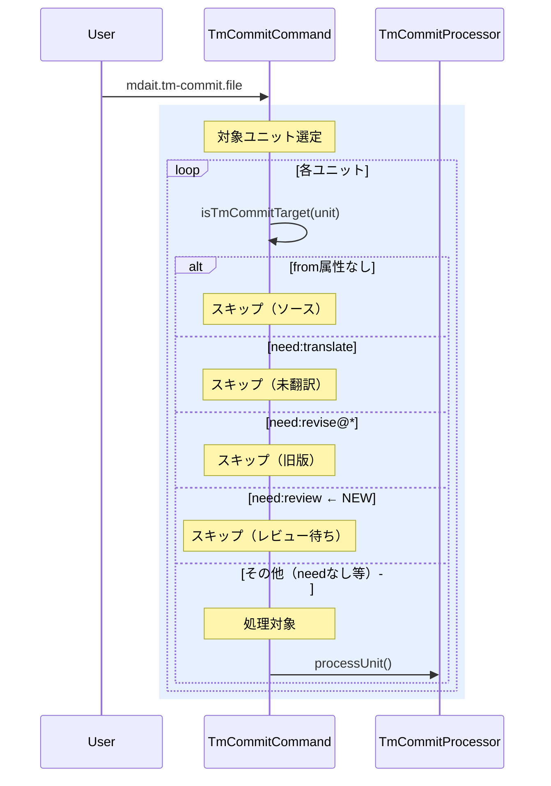

# チケット: tm-commit need:review除外

## 1. 概要と方針

tm-commitコマンドの処理対象判定において、`from属性あり + need:review`の場合をスキップ対象に変更する。現在は処理対象となっているが、レビュー待ちの訳文はTMに登録すべきでないという仕様変更。

## 2. 仕様

### 変更前
| 条件 | 判定 | 理由 |
|---|---|---|
| `from`属性あり + `need:review` | 処理対象 | 翻訳済み（レビュー待ち） |

### 変更後
| 条件 | 判定 | 理由 |
|---|---|---|
| `from`属性あり + `need:review` | スキップ | レビュー待ち（未承認） |

## 3. シーケンス図



## 4. 設計

### 変更対象
- **ファイル**: `src/commands/tm-commit/tm-commit-command.ts`
- **関数**: `isTmCommitTarget(unit: MdaitUnit): boolean` (51-62行目)
- **ドキュメント**: `docs/command_tm-commit.md` (30行目の表)

### 実装詳細
`isTmCommitTarget`関数に以下のチェックを追加:
```typescript
if (unit.marker.need === "review") {
    return false;
}
```

## 5. 考慮事項

- **既存テストへの影響**: `src/test/commands/tm-commit/`配下のテストがあればチェックが必要
- **ドキュメント整合性**: `docs/command_tm-commit.md`の仕様表を必ず更新
- **後方互換性**: 既存のTMファイルには影響なし（判定ロジックのみ変更）
- **UI表示**: StatusTreeでの表示は変更不要（tm-commit対象判定のみの変更）

## 6. 実装・テスト計画と進捗

- [x] explorerエージェントで影響範囲の確認
- [x] coderエージェントで実装
  - [x] `isTmCommitTarget`関数の修正（別ファイルに分離）
  - [x] `docs/command_tm-commit.md`の仕様表の更新
  - [x] 既存テストの実行と必要に応じた修正
- [x] reviewerエージェントでコードレビュー
- [x] レビュー指摘への対応（JSDoc更新・テスト追加）
- [x] 最終レビュー（承認）

## 7. 品質要件チェック

- [x] 仕様変更が正しく実装されている
- [x] ドキュメントが更新されている
- [x] 既存テストが通過する（277個すべて成功）
- [x] 変更が最小限である

## 8. まとめと改善提案

### 実装サマリ
`need:review`付きユニットをTM登録対象から除外する仕様変更を実装。レビュー待ち訳文の品質担保を明確化。

### 技術的工夫
1. **関数分離**: `isTmCommitTarget`を`tm-commit-filter.ts`に分離し、VS Code非依存でテスト可能に
2. **包括的テスト**: 6つのテストケースで各`need`状態の判定を網羅的に検証
3. **設計書更新**: `need:review`ワークフローを追記し、仕様の透明性を向上

### 今後の改善提案
- Commands層のテスト戦略を明確化（VS Code依存とCore層の分離方針）
- `isTmCommitTarget`のような判定ロジックは積極的に分離し、テスタビリティを確保

## 9. 参考

- 関連ドキュメント: `docs/command_tm-commit.md`
- 関連実装: `src/commands/tm-commit/tm-commit-command.ts`
