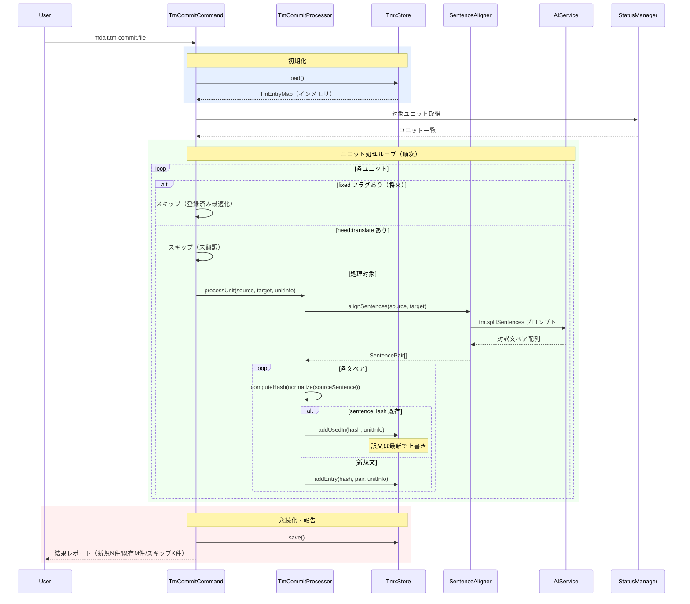
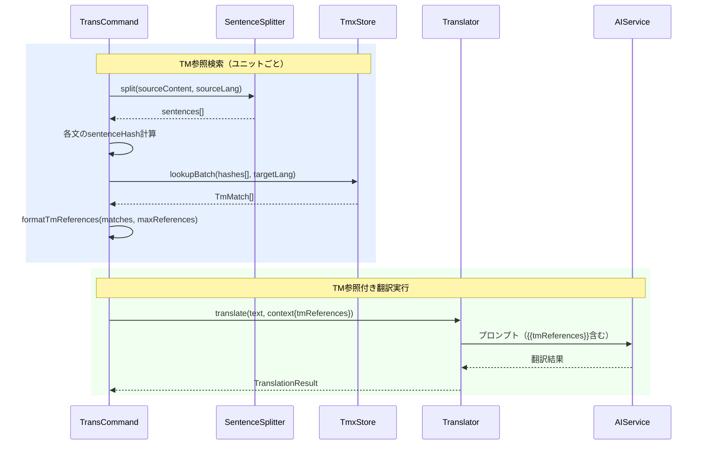
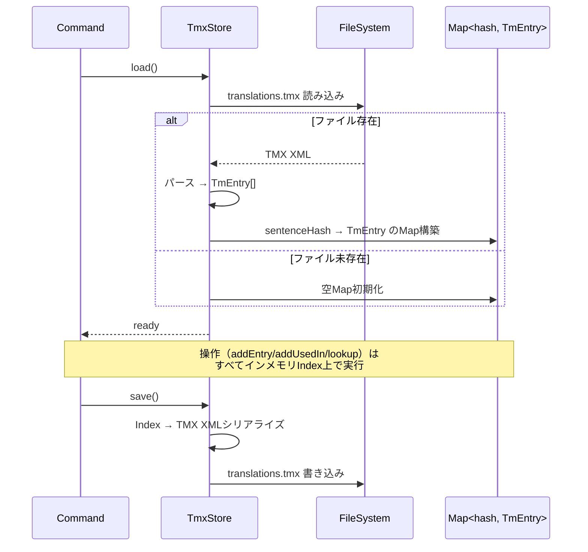

# チケット: 翻訳メモリ（TM）機能の実装

## 1. 概要と方針

翻訳メモリ（Translation Memory）をmdaitに導入し、過去の翻訳を文単位で蓄積・参照することで、翻訳表現の一貫性を向上させる。TMX標準に準拠した格納形式を採用し、既存の翻訳フローとは明確に分離して設計する。

## 2. 仕様

wishlist.mdの「翻訳メモリ（TM: Translation Memory）のサポート」セクションに詳細仕様あり。主要な仕様は以下：

### 格納形式
- TMX（Translation Memory eXchange）標準準拠
- `.mdait/translations.tmx` として保存
- 肥大化対策（インデックス、キャッシュ戦略）

### tm-commitコマンド
- `mdait.tm-commit.unit` / `mdait.tm-commit.file` / `mdait.tm-commit.directory`
- fixedフラグのあるユニットはスキップ
- LLMによる文単位分割 → TMXに登録
- 文ハッシュによる重複防止

### 文単位分割戦略
- tm-commit時（書き込み）: LLMで高精度分割
- trans時（検索）: 正規表現で高速分割

### trans実行時のTM参照
- 翻訳対象ユニットの原文を文分割し、TMから類似文を検索
- 過去対訳をLLMプロンプトに参考情報として提示

## 3. シーケンス図

### 3.1 tm-commit 全体フロー



### 3.2 trans実行時のTM参照連携



### 3.3 TmxStore ライフサイクル



## 4. 設計

### 4.1 モジュール構造

TM機能は独立したモジュールとして設計し、既存翻訳フローとの結合を最小化する。

```
src/
  core/
    tm/                          # TM Core層（純粋ロジック、VS Code非依存）
      types.ts                   # TmEntry, TmUsedIn 等の型定義
      tmx-store.ts               # TMXファイル読み書き + インメモリインデックス
      sentence-splitter.ts       # 正規表現ベースの文分割（trans検索用）
  commands/
    tm-commit/                   # tm-commitコマンド
      tm-commit-command.ts       # コマンドエントリーポイント（unit/file/directory）
      tm-commit-processor.ts     # ユニット処理のコアロジック
      sentence-aligner.ts        # LLMベースの対訳文アライメント
    trans/
      translation-context.ts     # (変更) tmReferencesフィールド追加
      trans-command.ts            # (変更) TM検索ステップ追加
  prompts/
    defaults.ts                  # (変更) TM関連プロンプトID追加
```

**層の配置根拠**:
- `TmxStore`, `SentenceSplitter` → Core層: VS Code非依存の純粋ロジック。ファイルI/Oは含むがNode.js標準のみ使用
- `SentenceAligner` → Commands層: AIService（LLM）に依存するためCore層には配置不可
- `TmCommitProcessor` → Commands層: ワークフロー制御、エラーハンドリング、進捗管理

### 4.2 データモデル

#### TMXファイル構造 (`.mdait/translations.tmx`)

```xml
<?xml version="1.0" encoding="UTF-8"?>
<tmx version="1.4">
  <header
    creationtool="mdait"
    creationtoolversion="0.0.1"
    datatype="Markdown"
    segtype="sentence"
    o-tmf="mdait"
    srclang="*all*"
  />
  <body>
    <tu>
      <prop type="x-mdait-hash">a1b2c3d4</prop>
      <prop type="x-mdait-created-at">2026-02-08T12:00:00Z</prop>
      <prop type="x-mdait-used-in">docs/guide.md#abc12345</prop>
      <prop type="x-mdait-used-in">docs/api.md#def67890</prop>
      <tuv xml:lang="en"><seg>Download the installer</seg></tuv>
      <tuv xml:lang="ja"><seg>インストーラーをダウンロード</seg></tuv>
    </tu>
  </body>
</tmx>
```

- **TMX 1.4準拠**: 外部ツールとのインポート/エクスポート互換性を確保
- **`x-mdait-hash`**: sentenceHash。ソース文の正規化後CRC32（8文字）。検索キー
- **`x-mdait-used-in`**: 出典情報。`相対パス#ユニットハッシュ` 形式。複数可
- **`x-mdait-created-at`**: 初回登録日時（ISO 8601）
- **多言語TUV**: 1つのTUに複数言語のTUVを格納可能（複数transPair対応）
- **srclang="*all*"**: TMX標準で「ソース言語は各TUで異なる」を示す

#### インメモリ型定義

```typescript
/** TM 1エントリー（文単位） */
interface TmEntry {
  sentenceHash: string;             // CRC32(normalize(source_sentence))
  segments: Map<string, string>;    // lang code → text (例: "en" → "...", "ja" → "...")
  usedIn: TmUsedIn[];              // 出典ユニット一覧
  createdAt: string;                // ISO 8601
}

/** 出典情報 */
interface TmUsedIn {
  unitPath: string;    // ワークスペースからの相対パス
  unitHash: string;    // mdaitユニットハッシュ
}

/** TM検索結果 */
interface TmMatch {
  sentenceHash: string;
  source: string;        // ソース文
  target: string;        // ターゲット文（要求言語）
  firstUsedIn: string;   // 最初の出典（表示用）
}

/** LLM文アライメント結果 */
interface SentencePair {
  source: string;    // ソース文
  target: string;    // ターゲット文
}
```

### 4.3 設計判断

#### sentenceHash
- **ソース文のみからハッシュ計算**: trans検索時にはソースしかないため
- **既存HashCalculatorを再利用**: CRC32、8文字。衝突リスクは既存ユニットハッシュと同等
- **正規化**: 既存`normalizeText()`を使用。文レベルでも空白正規化が有効

#### 重複時の動作（最新優先）
- 同一sentenceHashが既に存在する場合、ターゲット訳文を最新で上書き
- usedIn[]に新しい出典を追加（既存なら何もしない）
- **理由**: tm-commitは明示的なユーザー操作。ユーザーが最後にcommitした訳が「現在の正解」

#### 文分割の非対称戦略
- **tm-commit時（書き込み）**: LLMで高精度アライメント。バッチ処理で遅延許容
- **trans時（検索）**: 正規表現で高速分割。即時性重視
- **トレードオフの受容**: 両者の分割結果が異なる場合、ハッシュ不一致でTM参照が見つからないことがある。これは「参照が欠落する」だけで「誤った参照を提示する」ことはないため、安全側に倒れる

#### TMXパーサー
- TMXは構造が単純なXMLサブセット。必要な要素は`<tmx>`, `<header>`, `<body>`, `<tu>`, `<tuv>`, `<seg>`, `<prop>`のみ
- 軽量XMLライブラリ使用またはTMXサブセット専用パーサーの実装は実装者判断
- XMLエスケープ（`&amp;` `&lt;` `&gt;`等）の正確な処理は必須

#### TMファイル管理
- `.mdait/translations.tmx` はgitにコミットされる（unit-registryと同じ運用）
- .mdait/.gitignoreでは除外されない（翻訳資産として共有すべき）
- TMXファイルの自動削除・GCは行わない（ユーザーが管理）

#### パフォーマンス戦略
- **初回ロード**: TMXを全件パースしてMap<sentenceHash, TmEntry>を構築
- **検索**: ハッシュ直引きでO(1)
- **キャッシュ**: コマンド実行単位でロード。mtime比較で再ロード判定
- **将来対応**: TMXが大規模化（>10MB）した場合はストリーミングパーサーやインデックスファイルの導入を検討

### 4.4 Core層: TmxStore

**責務**: TMXファイルのI/OとインメモリCRUD

**主要メソッド**:
- `load(filePath)`: TMX読み込み → インメモリMap構築
- `save(filePath)`: インメモリMap → TMX書き込み
- `addEntry(hash, segments, usedIn)`: 新規エントリー追加
- `addUsedIn(hash, usedIn)`: 既存エントリーに出典追加
- `updateTarget(hash, lang, text)`: 既存エントリーのターゲット訳文を更新
- `lookupByHash(hash, targetLang)`: 単一検索 → TmMatch | undefined
- `lookupBatch(hashes[], targetLang)`: バッチ検索 → TmMatch[]
- `getEntryCount()`: 登録エントリー数

**冪等性**: load→操作→saveを繰り返しても結果は同一

### 4.5 Core層: SentenceSplitter

**責務**: 正規表現による高速文分割（trans検索用）

**分割ルール**:
1. **前処理**: コードブロック（```）、インラインコード（`）をプレースホルダーに置換
2. **日本語**: `[。！？]` の後で分割。ただし数値内ドット（3.14）は保護
3. **英語**: `[.!?]\s+(?=[A-Z])` で分割。略語（e.g., Dr., Mr.）は保護
4. **リスト項目**: 各項目を独立文として扱う
5. **後処理**: 各文をトリム、空文字列除去

**言語判定**: transPairのsourceLangから決定

### 4.6 Commands層: tm-commitコマンド

**コマンド体系**:
- `mdait.tm-commit.unit` — CodeLensから呼び出し
- `mdait.tm-commit.file` — StatusTreeから呼び出し
- `mdait.tm-commit.directory` — StatusTreeから呼び出し

**TM処理対象の判定**:
1. ターゲットファイルのユニットであること（`from`属性あり）
2. `need:translate`でないこと（翻訳済みであること）
3. `fixed`でないこと（将来の最適化。現時点では常にfalse）

**共通設計方針の遵守**:
- **冪等性**: 何度実行しても同一結果（既存ハッシュはusedIn追加のみ）
- **キャンセル対応**: ユニット単位でCancellationTokenチェック
- **進捗表示**: `withProgress`パターン。"X/Y units" 形式
- **エラーハンドリング**: ユニット単位のLLMエラーは記録して続行

### 4.7 Commands層: SentenceAligner

**責務**: LLMによる対訳文の高精度アライメント

**プロンプトID**: `tm.splitSentences`

**入力変数**:
- `{{sourceLang}}`: ソース言語コード
- `{{targetLang}}`: ターゲット言語コード  
- `{{sourceText}}`: ソースユニット本文
- `{{targetText}}`: ターゲットユニット本文

**出力形式**:
```json
[
  {"source": "ソース文1", "target": "ターゲット文1"},
  {"source": "ソース文2", "target": "ターゲット文2"}
]
```

**設計意図**:
- ソースとターゲットの1:1アライメントを実現
- 非1:1対応（1文→複数文など）の場合は結合して1ペアにまとめる
- LLMには原文の忠実な保持を指示（改変・意訳禁止）
- Markdown構造（リンク、太字、コード等）は文内で保持
- インラインコードはSentenceSplitterによる読み込み時と整合性が取れるようプレースホルダーに置換して処理

### 4.8 Commands層: trans連携

**TranslationContextの拡張**:
- `tmReferences?: string` フィールドを追加

**trans-command.tsの変更**:
1. コマンド開始時にTmxStoreをロード（tm.enabledかつTMXファイル存在時のみ）
2. 各ユニット処理で:
   - SentenceSplitter.split(sourceContent, sourceLang)
   - 各文のsentenceHashを計算
   - TmxStore.lookupBatch(hashes, targetLang)
   - TM参照をフォーマットしてcontext.tmReferencesに設定
3. TMが無効またはTMX未存在の場合はこのステップをスキップ（パフォーマンス影響ゼロ）

**プロンプトへの統合**:
`trans.translate` および `trans.revisePatch` に条件ブロック追加:
```
{{#tmReferences}}
## Translation Memory Reference

The following are past translations of similar sentences.
Use them as reference for consistency, but prioritize accuracy and context.

{{tmReferences}}
{{/tmReferences}}
```

**TM参照のフォーマット例**:
```
1. Source: "Download the installer"
   Translation: "インストーラーをダウンロード"
   (from: docs/guide.md)

2. Source: "Run the installer"
   Translation: "インストーラーを実行"
   (from: docs/api.md)
```

**maxReferencesによる参照数制限**: プロンプト肥大化を防止（デフォルト: 5）

### 4.9 Config

`mdait.json`に`tm`セクションを追加:

```json
{
  "tm": {
    "enabled": true,
    "maxReferences": 5
  }
}
```

| フィールド | 型 | デフォルト | 説明 |
|---|---|---|---|
| `tm.enabled` | boolean | `true` | TM機能の有効/無効。無効時はtm-commitとtrans TM参照の両方が非活性化 |
| `tm.maxReferences` | number | `5` | trans実行時にプロンプトに含めるTM参照の最大数 |

### 4.10 UI連携

#### CodeLens
- **翻訳済みユニット**（from属性あり、needなし、fixedなし）に「📝 TM登録」アクションを表示
- `mdait.tm-commit.unit`コマンドを呼び出し
- 将来の`fix --tm`実装時は、fix CodeLensから同じロジックを呼び出し可能

#### StatusTree
- ファイルノード・ディレクトリノードのコンテキストメニューに「TM登録」を追加
- `mdait.tm-commit.file` / `mdait.tm-commit.directory`コマンドを呼び出し

### 4.11 fixコマンドとのインターフェース境界

`fix`コマンドは将来実装。現時点では以下のインターフェースを確保:
- `TmCommitProcessor`は独立したクラスとして設計し、fixコマンドからも呼び出し可能
- `processUnit(sourceContent, targetContent, unitInfo)` メソッドがTM登録の核
- fixコマンド実装時は `fix --tm` → `TmCommitProcessor.processUnit()` と委譲

## 5. 考慮事項

- **既存設計との分離**: TM機能はcore/tm/とcommands/tm-commit/に閉じて実装。trans連携はTranslationContextの拡張とプロンプト変数追加のみで、既存翻訳ロジックへの侵入は最小限
- **アーキテクチャ整合性**: 
  - **層の分離**: Core層（TmxStore, SentenceSplitter）はVS Code非依存
  - **冪等性**: tm-commitを繰り返し実行しても結果は同一
  - **プライバシー**: LLM通信はtm-commit（文分割）とtrans（翻訳）のみ。いずれもユーザーの明示的操作時のみ
  - **マーカー最小主義**: TMデータはマーカーに含めない。TMXファイルに分離
- **パフォーマンス**: インメモリHashMapによるO(1)検索。コマンド単位でのロード/キャッシュ
- **文分割の非対称性**: LLM（高精度）と正規表現（高速）の使い分けは安全側に倒れる設計
- **fixコマンドとの連携**: TmCommitProcessorを独立クラスとし、将来のfix --tmで再利用可能
- **マーカーへの影響**: fixedフラグ（`<!-- mdait {hash} [from:{hash}] [need:{flag}] [fixed] -->`）はtm-commit対象判定でのみ参照。TMマーカーへの追記は行わない

## 6. 実装・テスト計画と進捗

### Phase 1: Core層（TM基盤）
- [x] Core: TM型定義 (`src/core/tm/types.ts`)
- [x] Core: TMXパーサー/ライター (`src/core/tm/tmx-store.ts`)
- [x] Core: 正規表現文分割 (`src/core/tm/sentence-splitter.ts`)
- [x] テスト: TmxStore 読み書き・CRUD
- [x] テスト: SentenceSplitter 日本語/英語/Markdown保護

### Phase 2: Prompts（プロンプト定義）
- [x] Prompts: PromptIds に `TM_SPLIT_SENTENCES` 追加
- [x] Prompts: defaults.ts に `tm.splitSentences` デフォルトプロンプト追加
- [x] Prompts: `trans.translate` に `{{tmReferences}}` 条件ブロック追加
- [x] Prompts: `trans.revisePatch` に `{{tmReferences}}` 条件ブロック追加

### Phase 3: Commands層（tm-commitコマンド）
- [x] Commands: SentenceAligner (`src/commands/tm-commit/sentence-aligner.ts`)
- [x] Commands: TmCommitProcessor (`src/commands/tm-commit/tm-commit-processor.ts`)
- [x] Commands: TmCommitCommand (`src/commands/tm-commit/tm-commit-command.ts`)
- [x] テスト: SentenceAligner（LLMモック）
- [x] テスト: TmCommitProcessor（統合テスト）

### Phase 4: Trans連携
- [x] Commands: TranslationContext に tmReferences 追加
- [x] Commands: trans-command.ts にTM検索ステップ追加
- [x] Commands: Translator プロンプト変数に tmReferences 追加
- [x] テスト: trans TM参照統合

### Phase 5: Config・UI
- [x] Config: mdait.json スキーマに `tm` セクション追加
- [x] Config: Configuration クラスにTM設定読み込み追加
- [x] UI: CodeLens TM登録アクション追加
- [x] UI: StatusTree TM commitコンテキストメニュー追加
- [x] package.json: tm-commitコマンド登録

### Phase 6: 全体テスト・レビュー
- [ ] 統合テスト: tm-commit → trans TM参照の一連のフロー
- [ ] レビュー

### 設計
- [x] 設計（architect）

## 7. 品質要件チェック

- [ ] architecture.mdの設計哲学に準拠
- [ ] 既存翻訳フローとの分離が十分
- [ ] 冪等性が保たれている
- [ ] プライバシー原則に準拠（暗黙的なAI通信なし）
- [ ] テストカバレッジが十分
- [ ] パフォーマンス考慮がなされている

## 8. まとめと改善提案

（作業完了後に記載）

## 9. 参考

- wishlist.md「翻訳メモリ（TM: Translation Memory）のサポート」セクション
- TMX標準: https://www.gala-global.org/tmx-14b
- 関連: wishlist.md「ユニット確定機能（fixコマンド）」（将来実装）
