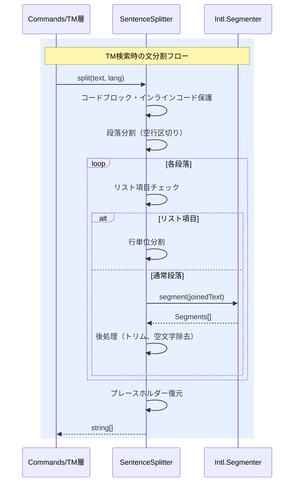

# チケット: TM参照向け Sentence Segmentation 導入（Intl.Segmenter）

## 1. 概要と方針

既存の `SentenceSplitter`（正規表現ベース）を `Intl.Segmenter` ベースに置き換え、日英中を含む多言語対応のSentence Segmentationを実現する。目的は「LLMに渡すTM候補の品質向上」と「多言語（日英中）を含む安定した分割」。既存のインターフェース（`split(text, lang)`）は維持し、後方互換性を確保する。

## 2. 仕様

### 変更対象
- `src/core/tm/sentence-splitter.ts`: `Intl.Segmenter` ベース実装に置換
- `src/test/core/tm/sentence-splitter.test.ts`: テストケースの大幅拡充

### 機能要件
- `Intl.Segmenter` の `granularity: "sentence"` を利用して文分割
- 日本語（ja）、英語（en）、中国語（zh）に最低限対応
- Markdown構造の保護（コードブロック、インラインコード）は既存ロジックを維持
- リスト項目の独立文分割も維持
- 数値内ドット（3.14）での誤分割を防止
- 既存の公開API `split(text: string, lang: string): string[]` は変更なし

### エッジケース
- 省略語（Dr., Mr., e.g., i.e., etc.）での誤分割防止
- URL/メールアドレス内のドットでの誤分割防止
- 括弧内の文末記号での誤分割
- 引用符を含む文の分割
- 日英混合文の適切な分割
- 中国語の句読点（。！？）での分割
- 改行を含むMarkdownの処理

## 3. シーケンス図

## 4. 設計

### `Intl.Segmenter` の利用方針
- `new Intl.Segmenter(lang, { granularity: "sentence" })` で言語ごとにセグメンターを生成
- セグメンター生成コストを考慮し、言語ごとにキャッシュ
- 既存のコードブロック/インラインコード保護機構は維持
- 段落分割→リスト判定→文分割の3段構造は維持

### 実装クラス構造（変更なし）
- `SentenceSplitter` クラスの内部実装のみ変更
- `split(text: string, lang: string): string[]` の公開APIは不変

## 5. 考慮事項

- `Intl.Segmenter` はNode.js 16+／V8エンジンでサポート。VS Code拡張としてはNode.js 18+を前提としているため問題なし
- `Intl.Segmenter` の分割精度は言語やICUデータに依存し、既存の正規表現ルールと結果が異なる場合がある
- 既存のTMXストアに保存済みのハッシュと互換性が崩れる可能性があるが、TM再構築（sync）で対応可能
- 中国語対応は新規追加のため、既存テストへの影響はない

## 6. 実装・テスト計画と進捗

- [x] `SentenceSplitter` を `Intl.Segmenter` ベースに書き換え
- [x] 既存テストがすべてPassすることを確認
- [x] 日英中の豊富なテストケース追加（エッジケース含む）
- [x] 全テストPass確認

## 7. 品質要件チェック

- [x] 既存テストすべてPass
- [x] 日本語テストケース（基本分割、省略、混合文）
- [x] 英語テストケース（基本分割、省略語、URL）
- [x] 中国語テストケース（基本分割、混合文）
- [x] Markdown保護（コードブロック、インラインコード）
- [x] リスト項目分割
- [x] エッジケース（空文字列、空白のみなど）

## 8. まとめと改善提案

（作業完了後に記載）

## 9. 参考

- [Intl.Segmenter MDN](https://developer.mozilla.org/en-US/docs/Web/JavaScript/Reference/Global_Objects/Intl/Segmenter)
- 既存実装: `src/core/tm/sentence-splitter.ts`
- 既存テスト: `src/test/core/tm/sentence-splitter.test.ts`
