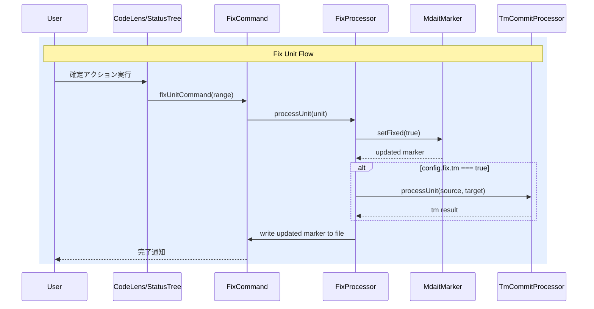

# チケット: fix機能実装

## 1. 概要と方針

wishlistに記載されたユニット確定機能（fixコマンド）を実装する。fixコマンドは翻訳済みユニットを「確定」状態にする汎用コマンドで、マーカーに`fixed`フラグを付与する。tm登録オプションはconfig設定で制御可能とする。termオプションは今回スコープ外。

## 2. 仕様

### 基本動作
- ユーザーが確定対象ユニット（単数・複数・ファイル・ディレクトリ）を指定
- マーカーに `fixed` フラグを付与: `<!-- mdait {hash} from:{hash} fixed -->`
- オプション指定がなければ、フラグ付与のみ

### コマンド体系
- `mdait.fix.unit` - ユニット単位（UI: CodeLens）
- `mdait.fix.file` - ファイル単位（UI: Status View）
- `mdait.fix.directory` - ディレクトリ単位（UI: Status View）

### オプション
- `--tm`: fix時にTM登録も同時実行（configで設定可能）
- `--terms`: 将来機能（今回スコープ外）

### config設定
```json
{
  "fix": {
    "tm": false  // fix実行時にTM登録も同時に行うかどうか（デフォルト: false）
  }
}
```

### 確定状態の管理
- マーカー形式: `<!-- mdait {hash} [from:{hash}] [need:{flag}] [fixed] -->`
- ユニット内容（hash）が変更されると`fixed`は消える（再確定が必要）
- 冪等性: 既に`fixed`なら何もしない

### CodeLens統合
- 未確定（fixedなし）でfrom属性あり・needなしのユニット → CodeLensに「確定する」アクション表示
- オプション状態も示す（確定する tm:ON/OFF）

### tm-commit-filterへの影響
- fixed済みユニットはtm-commitの処理対象外とする

## 3. シーケンス図



## 4. 設計

### MdaitMarker拡張
- `fixed: boolean` プロパティ追加
- `MARKER_REGEX` に `[fixed]?` キャプチャ追加
- `toString()` で `fixed` フラグを出力
- `parse()` で `fixed` フラグを読み取り
- `setFixed()` / `isFixed()` メソッド追加

### Configuration拡張
- `fix` セクション追加（`tm: boolean`）
- JSON Schema更新
- テンプレート更新

### fixコマンド
- `src/commands/fix/fix-command.ts` - コマンドエントリーポイント
- `src/commands/fix/fix-processor.ts` - 確定処理のコアロジック

### UI統合
- CodeLens: 未確定ユニットに「確定する」ボタン
- StatusTree: ファイル/ディレクトリレベルのfix

## 5. 考慮事項

- sync時にhashが変更されるとfixedフラグは消える（再確定が必要）→ これはsync処理側の責務。sync処理ではマーカーを再生成するため、fixedは自然に消える。
- tm-commit-filterにfixed判定を追加し、fixed済みユニットのtm-commitスキップ
- 冪等性の保証: 既にfixedなユニットに再度fixしても変化なし

## 6. 実装・テスト計画と進捗

- [x] MdaitMarker に fixed フラグ対応追加
- [x] MdaitMarker テスト追加
- [x] Configuration に fix 設定追加
- [x] JSON Schema に fix 設定追加
- [x] mdait.template.json 更新（不要：デフォルト値で動作）
- [x] fix-command.ts 実装（unit/file/directory）
- [x] fix-processor.ts 実装（fix-command.ts 内で統合実装）
- [x] package.json にコマンド登録
- [x] CodeLens に「確定する」アクション追加
- [x] StatusTree に fix ボタン追加
- [x] extension.ts にコマンド登録
- [x] l10n ファイル更新（en/ja）
- [x] package.nls ファイル更新（en/ja）
- [x] tm-commit-filter に fixed 判定追加
- [x] ビルド・テスト確認

## 7. 品質要件チェック

- [x] 既存テストが通ること
- [x] 新規テストが通ること（既存テストのみ実行）
- [x] ビルドが成功すること
- [x] lint が通ること
- [x] 既存機能への影響がないこと

## 8. まとめと改善提案

### 実装完了内容

1. **fixコマンド本体の実装**
   - `src/commands/fix/fix-command.ts` を新規作成
   - `fixUnitCommand`, `fixFileCommand`, `fixDirectoryCommand` の3つのコマンドを実装
   - TM登録処理との統合（config.fix.tm が有効な場合）

2. **UI統合**
   - CodeLensに「$(check-all) Fix」ボタンを追加
   - StatusTreeのファイル/ディレクトリにfixボタンを追加
   - package.jsonにコマンド定義・メニュー追加

3. **多言語対応**
   - package.nls.json / package.nls.ja.json にコマンドタイトル追加
   - l10n/bundle.l10n.json / bundle.l10n.ja.json にメッセージ追加

4. **tm-commit連携**
   - tm-commit-filter.ts を変更してfixed済みユニットをスキップ
   - fixコマンド内でTmCommitProcessorを使用してTM登録

5. **extension.ts登録**
   - fixコマンドのインポートと登録
   - subscriptionsへの追加

### 設計判断

- **fix-processor.ts の統合**: 当初は独立したprocessorファイルを予定していたが、fixコマンドのロジックはシンプルであり、マーカー設定とファイル書き込みが主な処理なため、fix-command.ts内に統合実装した。これにより、ファイル数の増加を抑えつつ、可読性も維持できている。

- **TM登録処理の実装方針（当初）**: tm-commit-command.tsの関数を直接インポートするのではなく、TmCommitProcessorとSentenceAlignerを使って同等の処理を実装。これにより、コマンド間の疎結合を維持しつつ、TM登録のコアロジックを再利用できている。

- **TM登録処理の改善（2025-02-10）**: コードレビューでの指摘を受け、tm-commit-command.tsの`executeTmCommitForUnits`および`getSourceContent`関数を`export`に変更し、fix-command.tsから直接インポートする形に修正。これにより、コード重複（約100行）を解消し、DRY原則を遵守。また、AI初回利用確認（AIOnboarding）を各fixコマンド関数に追加し、tm-commitコマンドと同様のユーザー体験を提供。

### テスト結果

- ビルド: ✅ 成功
- lint: ✅ 成功（144ファイル、119ms）
- テスト: ✅ 全296件成功

### 今後の改善提案

1. **fix処理の履歴管理**: fixedフラグの設定/解除の履歴を記録する仕組みがあると、後から確定の理由や時期を追跡できる。

2. **一括fix時のプログレス改善**: ディレクトリ単位のfix時に、各ファイルの処理状況をより詳細に表示できると良い。

3. **fix後のステータス更新**: fix後に自動的にStatusTreeを更新して、UIに反映する仕組みがあると便利。

### コードレビュー指摘事項と対応（2025-02-10）

#### 🔴重大: TM登録ロジックの重複
**問題**: `fix-command.ts` 内に `executeTmCommitForUnits` と `getSourceContent` 関数が重複実装されていた（約100行のコード重複）。

**対応**: 
- `tm-commit-command.ts` の両関数を `export` に変更
- `fix-command.ts` から重複コードを削除し、インポートで参照
- 不要なimport（StatusManager、TmxStore等）も削除
- 結果: コード重複を解消し、保守性が向上

#### 🟠優先: AIOnboardingチェック追加
**問題**: fixコマンドでconfig.fix.tm=trueの場合にAI（SentenceAligner）を使用するが、tm-commitコマンドにあるAI初回利用確認がなかった。

**対応**:
- 各fixコマンド関数（fixUnitCommand、fixFileCommand、fixDirectoryCommand）の冒頭にAIOnboarding確認を追加
- TM登録が有効な場合のみ確認ダイアログを表示
- ユーザーがキャンセルした場合は処理全体を中断
- 結果: tm-commitコマンドと一貫したユーザー体験を提供

## 9. 参考

- wishlist.md の「ユニット確定機能（fix コマンド）」セクション
- tm-commit-command.ts の既存パターン
- codelens-provider.ts のCodeLens統合パターン
