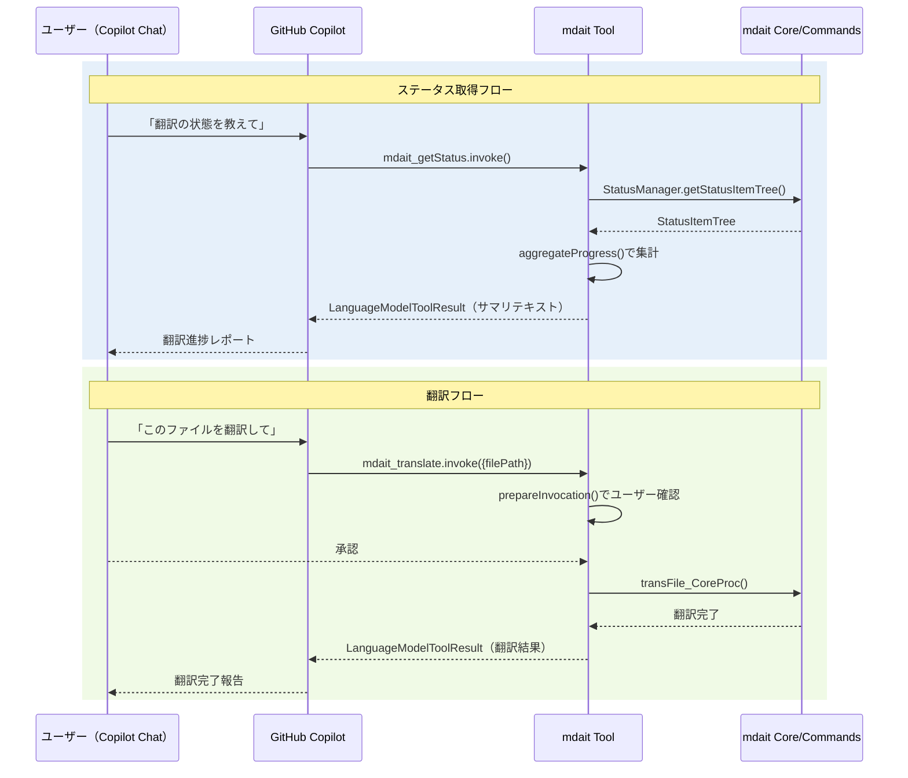

# チケット: LanguageModelTool API統合

## 1. 概要と方針

VS CodeのLanguageModelTool APIを利用して、mdaitの主要機能をGitHub Copilot Chatから呼び出せるようにする。まず基本的な3つのツール（ステータス取得、同期、翻訳）を実装し、拡張ガイド付きの設計書を作成する。

## 2. 仕様

### 公開するツール（Phase 1）

| ツール名 | 機能 | 入力 | 出力 |
|---------|------|------|------|
| `mdait_getStatus` | 翻訳ステータスの概要取得 | なし（オプション: filePath） | 翻訳進捗サマリ（総ユニット数、翻訳済み、未翻訳等） |
| `mdait_sync` | ユニット同期・差分検出 | なし | 同期結果サマリ |
| `mdait_translate` | ファイル/ユニットの翻訳実行 | filePath（必須） | 翻訳結果サマリ |

### package.json への追記

`contributes.languageModelTools` セクションに上記ツールを定義。各ツールに `inputSchema`、`modelDescription`、`toolReferenceName` を設定。

### ファイル構成

- `src/tools/` ディレクトリを新設
  - `get-status-tool.ts` - ステータス取得ツール
  - `sync-tool.ts` - 同期ツール  
  - `translate-tool.ts` - 翻訳ツール
- `docs/tools.md` - 設計書・拡張ガイド

### extension.ts への変更

`activate()` 内で `vscode.lm.registerTool()` を呼び出し、各ツールを登録。

## 3. シーケンス図



## 4. 設計

### 層構造の拡張

```
UI層 → Commands層 → Core層 → Utils層
              ↓
           API層
Tools層 ─────→ Commands層 / Core層
  ↑
GitHub Copilot
```

Tools層はCommands層やCore層の既存機能を薄くラップする。新しいビジネスロジックは持たない。

### 設計原則
- 既存コマンドの再利用: 内部的に `syncCommand()`, `transFile_CoreProc()` 等を呼び出す
- 読み取り専用優先: `getStatus` は副作用なし
- 確認UI: 変更を伴うツール（translate）は `prepareInvocation()` で確認メッセージを表示
- i18n対応: `vscode.l10n.t()` を使用

## 5. 考慮事項

- VS Code 1.99.0+ のAPI互換性（`@types/vscode` のバージョン確認）
- LanguageModelTool APIはproposed APIか stable APIかの確認
- 既存のテストフレームワーク（Mocha TDD）との整合性
- Tools層はCore層のように純粋にはできない（vscode APIに依存）

## 6. 実装・テスト計画と進捗

- [x] 設計レビュー
- [x] package.json に languageModelTools 定義追加
- [x] src/tools/get-status-tool.ts 実装
- [x] src/tools/sync-tool.ts 実装
- [x] src/tools/translate-tool.ts 実装
- [x] extension.ts にTool登録処理追加
- [ ] 単体テスト作成（このタスクではスキップ - VS Code API依存のため）
- [x] docs/tools.md 設計書作成
- [x] l10n リソース追加
- [x] ビルド・lint確認
- [x] レビュー（条件付き承認 → 指摘対応完了）

## 7. 品質要件チェック

- [x] ビルドが通ること
- [x] lint（Biome）が通ること
- [x] 既存テストが通ること（289 passing）
- [x] 設計書が完成していること
- [x] レビュー承認（条件付き承認 → 🟠優先3件対応済み）
- [x] CodeQLセキュリティチェック通過

## 8. まとめと改善提案

### 実装内容

LanguageModelTool APIを使用してmdaitの主要機能をGitHub Copilot Chatから呼び出せるようにしました。

**実装した3つのツール**:
1. **Get Status Tool** (`mdait_getStatus`): 翻訳ステータスの取得（読み取り専用）
2. **Sync Tool** (`mdait_sync`): 翻訳マーカーの同期（確認UI付き）
3. **Translate Tool** (`mdait_translate`): ファイルの翻訳（確認UI付き）

**ファイル構成**:
- `src/tools/get-status-tool.ts` - ステータス取得ツール実装
- `src/tools/sync-tool.ts` - 同期ツール実装
- `src/tools/translate-tool.ts` - 翻訳ツール実装
- `package.json` - `contributes.languageModelTools` セクションに各ツール定義を追加
- `extension.ts` - `vscode.lm.registerTool()` によるツール登録処理追加
- `l10n/bundle.l10n.json`, `l10n/bundle.l10n.ja.json` - 各ツールのメッセージ追加
- `docs/tools.md` - Tools層の設計書作成
- `docs/_index.md` - tools.mdへのリンク追加

### 設計のポイント

1. **既存機能の再利用**: Commands層やCore層の既存機能（`syncCommand()`, `transFile_CoreProc()` 等）を薄くラップし、新しいビジネスロジックは持たない
2. **確認UIの実装**: 変更を伴うツール（sync, translate）には `prepareInvocation()` で適切な確認メッセージを表示
3. **エラーハンドリング**: 全てのエラーをキャッチし、ユーザーフレンドリーなメッセージを返す
4. **国際化対応**: `vscode.l10n.t()` を使用してメッセージを国際化

### 技術的な解決策

- **空のインターフェース問題**: Biomeのlintエラーを回避するため、`SyncInput` を `Record<string, never>` として定義
- **Progress処理**: Tool API内では `vscode.window.withProgress` が使えないため、ダミーのprogressオブジェクトを作成して `transFile_CoreProc()` に渡す
- **StatusManager初期化**: Get Status Toolで `tree.isEmpty()` をチェックし、初期化されていない場合は `buildStatusItemTree()` を実行

### 今後の拡張可能性

設計書（`docs/tools.md`）に拡張ガイドを記載しました。将来的に追加可能なツール:
1. **Term Detection Tool**: 用語抽出の実行
2. **TM Commit Tool**: 翻訳メモリへの登録
3. **Validate Tool**: 設定ファイルの検証
4. **Search Tool**: 翻訳済み/未翻訳ユニットの検索

拡張時の手順も設計書に明記しています。

### 品質確認結果

- ✅ TypeScriptコンパイル成功
- ✅ Biome lint成功（146ファイルチェック）
- ✅ 既存テスト全て成功（289 passing）
- ✅ 設計書作成完了（`docs/tools.md`）
- ✅ 国際化リソース追加完了

### 改善提案

1. **統合テスト**: VS Code APIに依存するため単体テストは作成しませんでしたが、将来的には実際のCopilot Chatとの統合テストを検討
2. **Tool Metadata拡張**: `canBeReferencedInPrompt` や `tags` を活用して、Copilotがツールを適切に選択できるよう最適化
3. **エラーメッセージ充実**: より詳細なエラー情報（例: 翻訳失敗時のユニット位置など）を返すことで、ユーザー体験を向上

## 9. 参考

- [VS Code LanguageModelTool API](https://code.visualstudio.com/api/extension-guides/ai/tools)
- [vscode-extension-samples chat-sample](https://github.com/microsoft/vscode-extension-samples/tree/main/chat-sample)
