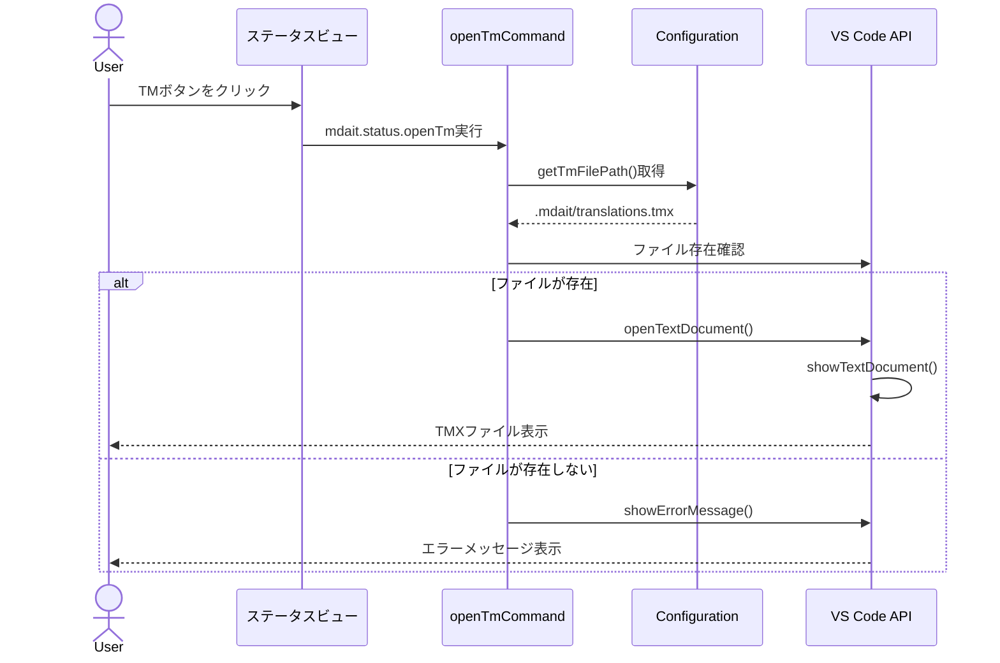

# チケット: TMをステータスビューから開く機能実装

## 1. 概要と方針

ステータスビューに用語集を開くボタンと同様のパターンでTM（Translation Memory）を開くボタンを追加する。また、TM関連のアイコンをすべて`$(database)`または類似アイコンに統一し、用語集（本のアイコン）との視覚的区別を明確にする。

## 2. 仕様

### 2.1 TMを開く機能
- **コマンド名**: `mdait.status.openTm`
- **配置場所**: ステータスビューのナビゲーションエリア（用語集ボタンの横）
- **動作**: `.mdait/translations.tmx`をVSCodeエディタで開く
- **表示条件**: `mdaitConfigured && mdaitHasStatus`（用語集ボタンと同じ）
- **アイコン**: `$(database)`

### 2.2 アイコンの統一
既存のTM関連コマンドのアイコンを`$(notebook)`から`$(database)`に変更:
- `mdait.tm-commit.unit`
- `mdait.tm-commit.file`
- `mdait.tm-commit.directory`

## 3. シーケンス図



## 4. 設計

### 4.1 ファイル構成
```
src/commands/tm/
  ├── command-open.ts (新規作成)
  └── (既存のTMコミット関連ファイルは別ディレクトリ)
```

### 4.2 実装詳細

#### 4.2.1 コマンド実装 (`src/commands/tm/command-open.ts`)
```typescript
import * as path from "node:path";
import * as vscode from "vscode";

/**
 * TMファイルを開くコマンド
 * 用語集を開くコマンドと同様のパターン
 */
export async function openTmCommand(): Promise<void> {
  try {
    const workspaceRoot = vscode.workspace.workspaceFolders?.[0]?.uri.fsPath;
    if (!workspaceRoot) {
      vscode.window.showErrorMessage(vscode.l10n.t("Workspace not found"));
      return;
    }

    const tmFilePath = path.join(workspaceRoot, ".mdait", "translations.tmx");
    
    // ファイル存在確認
    try {
      await vscode.workspace.fs.stat(vscode.Uri.file(tmFilePath));
    } catch {
      // ファイルが存在しない場合はメッセージを表示して終了
      vscode.window.showInformationMessage(vscode.l10n.t("TM file does not exist: {0}", tmFilePath));
      return;
    }
    
    // ファイルを開く
    const document = await vscode.workspace.openTextDocument(tmFilePath);
    await vscode.window.showTextDocument(document);
  } catch (error) {
    vscode.window.showErrorMessage(vscode.l10n.t("Failed to open TM file: {0}", (error as Error).message));
    console.error("Failed to open TM file:", error);
  }
}
```

#### 4.2.2 package.jsonへの追加

**コマンド定義** (commands配列に追加):
```json
{
  "command": "mdait.status.openTm",
  "title": "%mdait.status.openTm.title%",
  "icon": "$(database)",
  "category": "mdait"
}
```

**メニュー定義** (menus > "view/title"に追加):
```json
{
  "command": "mdait.status.openTm",
  "when": "view == mdait.status && mdaitConfigured && mdaitHasStatus",
  "group": "navigation"
}
```

**アイコン変更** (既存コマンド修正):
```json
// 3箇所の$(notebook)を$(database)に変更
{
  "command": "mdait.tm-commit.unit",
  "icon": "$(database)"
},
{
  "command": "mdait.tm-commit.file",
  "icon": "$(database)"
},
{
  "command": "mdait.tm-commit.directory",
  "icon": "$(database)"
}
```

#### 4.2.3 extension.tsへの登録
```typescript
// 既存のopenTermCommandの近くに追加
import { openTmCommand } from "./commands/tm/command-open";

// activate関数内で登録
const openTmStatusDisposable = vscode.commands.registerCommand(
  "mdait.status.openTm",
  openTmCommand
);
context.subscriptions.push(openTmStatusDisposable);
```

#### 4.2.4 ローカライゼーション

**package.nls.json**:
```json
"mdait.status.openTm.title": "Open Translation Memory"
```

**package.nls.ja.json**:
```json
"mdait.status.openTm.title": "翻訳メモリを開く"
```

## 5. 考慮事項

- **TMファイルパスの取得方法**: `tm-commit-command.ts`と同じロジック（`vscode.workspace.workspaceFolders`を直接使用し、`.mdait/translations.tmx`を構築）を使用。Configurationクラスには`getTmFilePath()`メソッドは存在しない
- **ファイル未作成時の挙動**: TMXファイルがまだ作成されていない場合、エラーメッセージを表示（用語集と同じ挙動）
- **ボタンの表示順序**: 用語集ボタンの後に配置するため、`group: "navigation"`の順序を確認
- **TMXファイル形式**: XML形式のため、VSCodeのデフォルトエディタで読めるが、シンタックスハイライトは標準のXMLとして扱われる

## 6. 実装・テスト計画と進捗

- [x] `Configuration`クラスを確認し、`getTmFilePath()`メソッドの有無を確認
- [x] `src/commands/tm/command-open.ts`を作成
- [x] `package.json`にコマンド定義とメニュー定義を追加
- [x] `package.json`の既存TM関連コマンドのアイコンを`$(database)`に変更
- [x] `package.nls.json`と`package.nls.ja.json`にローカライゼーションを追加
- [x] `extension.ts`にコマンドを登録
- [x] ビルド確認（`npm run compile`）
- [ ] 動作確認（実際にボタンをクリックしてTMファイルが開くことを確認）
- [ ] アイコンの視覚的確認（全てのTM関連アイコンが$(database)になっているか）
- [ ] スクリーンショット撮影

## 7. 品質要件チェック

- [x] コードスタイルが既存コード（特に`command-open.ts`）と一致
- [x] エラーハンドリングが適切
- [x] ローカライゼーションが完全（英語・日本語）
- [x] 既存機能への影響なし（用語集ボタンなど）
- [x] ビルドエラーなし
- [x] TMアイコンが全て統一されている
- [ ] ボタンがステータスビューに適切に表示される

## 8. まとめと改善提案

### 実装完了内容

以下の実装を完了しました：

1. **TMを開くコマンドの実装** (`src/commands/tm/command-open.ts`)
   - 用語集を開くコマンド（`command-open.ts`）と同じパターンで実装
   - `.mdait/translations.tmx`を開く機能
   - 適切なエラーハンドリング（ワークスペース未検出、ファイル未作成時）

2. **package.jsonの更新**
   - `mdait.status.openTm`コマンド定義を追加（`$(database)`アイコン）
   - `view/title`メニューに配置（用語集ボタンの後）
   - 既存のTM関連コマンド（unit/file/directory）のアイコンを`$(notebook)`から`$(database)`に変更

3. **ローカライゼーション**
   - `package.nls.json`: "Open Translation Memory"
   - `package.nls.ja.json`: "翻訳メモリを開く"

4. **extension.tsへの登録**
   - `openTmCommand`のimport追加
   - コマンド登録とsubscriptions追加

5. **設計書の更新**
   - `docs/ui.md`: ナビゲーションボタンセクションを追加
   - `docs/command_tm-commit.md`: TMファイル操作セクションを追加

6. **ビルド確認**
   - `npm run compile`成功を確認

### 技術的な意思決定

- **TMファイルパス取得**: `Configuration.getRootPath()`メソッドが存在しないため、`tm-commit-command.ts`と同じパターン（`vscode.workspace.workspaceFolders`を直接使用）で実装
- **アイコン統一**: TM関連機能を`$(database)`に統一することで、用語集（`$(repo)`）との視覚的区別を明確化

### 残作業

実際の動作確認とスクリーンショット撮影は、VS Code拡張機能のGUI環境が必要なため、ユーザーによる実施が必要です：
- [ ] 動作確認（ボタンクリックでTMファイルが開くことを確認）
- [ ] アイコンの視覚的確認
- [ ] スクリーンショット撮影

### 改善提案

#### 完了した改善（2025-02-10レビュー対応）

**🟠優先-1: Configurationパターンの統一**
- `Configuration`クラスに`getTmFilePath()`メソッドを追加
- `command-open.ts`と`tm-commit-command.ts`でConfigurationパターンを使用
- コード重複を解消し、用語集と同じパターンで統一

**🟡推奨-1: コメントの多言語化**
- `command-open.ts`のコメントを英語に統一

**🟡推奨-2: ドキュメントの粒度統一**
- `docs/command_term.md`に用語集を開くコマンドのドキュメントを追加

#### 長期的な改善課題

**🟠優先-2: TM機能のディレクトリ構造見直し**

**現状の問題**:
- `src/commands/tm/`に`command-open.ts`のみ存在（閲覧機能）
- `src/commands/tm-commit/`に既存のTM登録機能が存在
- TM機能が2つのディレクトリに分散している

**提案**:
以下のいずれかのリファクタリングを検討：

**オプションA（推奨）**: `tm-commit/`を`tm/`にリネーム
```
src/commands/tm/
  ├── command-open.ts          (閲覧機能)
  ├── tm-commit-command.ts     (登録機能)
  ├── tm-commit-processor.ts
  ├── sentence-aligner.ts
  └── tm-commit-filter.ts
```

**オプションB**: `command-open.ts`を`tm-commit/`に統合
```
src/commands/tm-commit/
  ├── tm-open-command.ts       (command-open.ts をリネーム)
  ├── tm-commit-command.ts
  ├── ...
```

**理由**:
- ユーザー視点では「TM機能」は一つの機能単位
- 機能が分散していると、関連コードの発見が困難
- `tm-commit`はコマンド名であり、ディレクトリ名としては限定的

**優先度**: 中期（TM機能の拡張時に実施を推奨）

---

特に他の改善提案はありません。設計通りに実装が完了しています。

## 9. 参考

### 参考ファイル
- `/home/runner/work/mdait/mdait/src/commands/term/command-open.ts` - 用語集を開くコマンドの実装
- `/home/runner/work/mdait/mdait/src/commands/tm-commit/tm-commit-command.ts` - TMファイルパス取得ロジック
- `/home/runner/work/mdait/mdait/package.json` - コマンド・メニュー定義
- `/home/runner/work/mdait/mdait/src/extension.ts` - コマンド登録

### TMファイルパス
```typescript
// tm-commit-command.tsより（30行目）
const tmxFilePath = path.join(config.getRootPath(), ".mdait", "translations.tmx");
```
