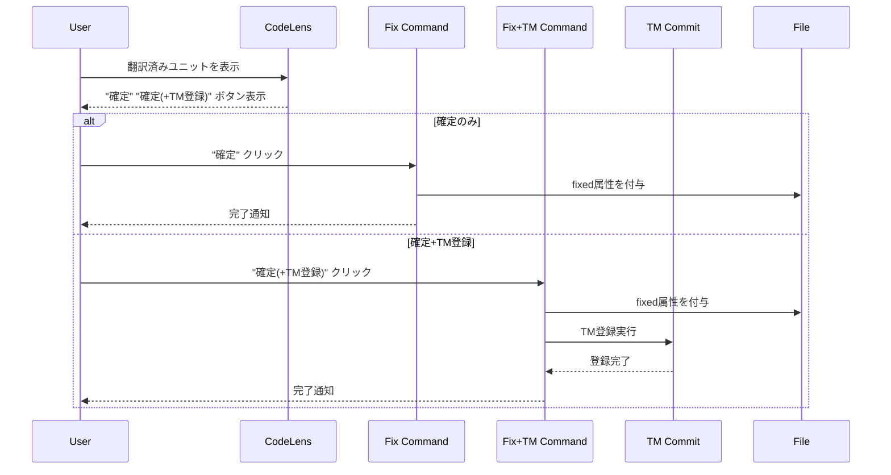

# チケット: CodeLens Fix確定分割

## 1. 概要と方針

CodeLensのボタン表示を変更し、Fix確定を"確定のみ"と"確定+TM登録"の2つに分割する。TM登録単独のCodeLensとfix.tmオプションは削除する。

## 2. 仕様

### 2.1 CodeLens表示の変更
- **削除**: TM登録CodeLens（`mdait.tm-commit.unit`）
- **変更**: Fix確定を2つに分割
  - "確定": `mdait.fix.unit` - AI処理なし、確定のみ
  - "確定(+TM登録)": `mdait.fix.unit.with-tm` - AI処理あり、TM登録も実行

### 2.2 設定の変更
- `fix.tm`オプションを削除
- CodeLensに常に2つのボタンを表示

### 2.3 表示条件
- 翻訳済みユニット（`from`属性あり、`need`なし、`fixed`なし）に2つのボタンを表示
- frontmatterユニットは対象外（既存仕様を維持）

## 3. シーケンス図

## 4. 設計

### 4.1 変更ファイル
- [src/ui/codelens/codelens-provider.ts](../src/ui/codelens/codelens-provider.ts)
  - TM登録CodeLensを削除
  - Fix CodeLensを2つに分割
  - `getFixLabelAndTooltip`メソッドを削除（不要）
  
- [src/commands/fix/fix-command.ts](../src/commands/fix/fix-command.ts)
  - `fixUnitCommand`: TM登録処理を削除（確定のみ）
  - `fixUnitWithTmCommand`: 新規作成（確定+TM登録）
  - File/Directoryコマンドも同様に分割
  
- [src/extension.ts](../src/extension.ts)
  - 新しいコマンドを登録
  
- [src/config/configuration.ts](../src/config/configuration.ts)
  - `fix.tm`プロパティを削除
  - `getFixTmEnabled()`メソッドを削除
  
- [package.json](../package.json)
  - 新しいコマンドを追加
  - TM登録コマンドはStatusTreeからの呼び出しのため維持
  
- l10nファイル（日本語・英語）
  - 新しいラベルを追加

### 4.2 コマンド定義
| コマンドID | 説明 | 呼び出し元 |
|-----------|------|-----------|
| `mdait.fix.unit` | 確定のみ（AI処理なし） | CodeLens |
| `mdait.fix.unit.with-tm` | 確定+TM登録（AI処理あり） | CodeLens |
| `mdait.fix.file` | ファイル単位確定のみ | StatusTree |
| `mdait.fix.file.with-tm` | ファイル単位確定+TM | StatusTree |
| `mdait.fix.directory` | ディレクトリ単位確定のみ | StatusTree |
| `mdait.fix.directory.with-tm` | ディレクトリ単位確定+TM | StatusTree |

## 5. 考慮事項
- TM登録のStatusTreeコマンドは維持（単独操作として必要）
- 既存のテストへの影響確認が必要
- Config typesのバリデーション確認
- l10n対応の完全性確認

## 6. 実装・テスト計画と進捗
- [x] CodeLensProviderの変更
- [x] Fix Commandの変更
- [x] extension.tsの変更
- [x] Configurationの変更
- [x] package.jsonの変更
- [x] l10nファイルの更新
- [x] 動作確認（ビルドエラーなし）
- [ ] テストの確認・修正（実行時に確認）

## 7. 品質要件チェック
- [x] CodeLensに2つのボタンが正しく表示される（実装完了）
- [x] "確定"がAI処理なしで動作する（実装完了）
- [x] "確定(+TM登録)"がTM登録を実行する（実装完了）
- [x] fix.tmオプションが完全に削除されている（実装完了）
- [x] ビルドエラーがない（確認済み）
- [ ] 既存テストが通過する（実行時に確認）

## 8. まとめと改善提案

### 実装完了サマリ
- CodeLensの"TM登録"ボタンを削除し、"確定"を2つに分割（確定のみ／確定+TM登録）
- `fix.tm`オプションを削除し、常に2つのボタンを表示する仕様に変更
- ユニット/ファイル/ディレクトリの各レベルでコマンドを分割
- AI処理の有無を明確にするため、アイコンを使い分け（$(check) / $(check-all)）
- l10n対応を完全に実装（日本語・英語）

### 設計の工夫点
- AI処理を伴うコマンド（with-tm）のみAIOnboarding確認を実施
- File/DirectoryコマンドにもTMオプション版を追加し、一貫性を保持
- CodeLensの表示条件を維持（翻訳済み、needなし、fixedなし）

### 今後の改善提案
- StatusTreeからの呼び出し時にも2つのボタン（確定/確定+TM）を選択可能にする検討
- ショートカットキーの設定を検討（特に頻繁に使う「確定のみ」）

## 9. 参考
なし
