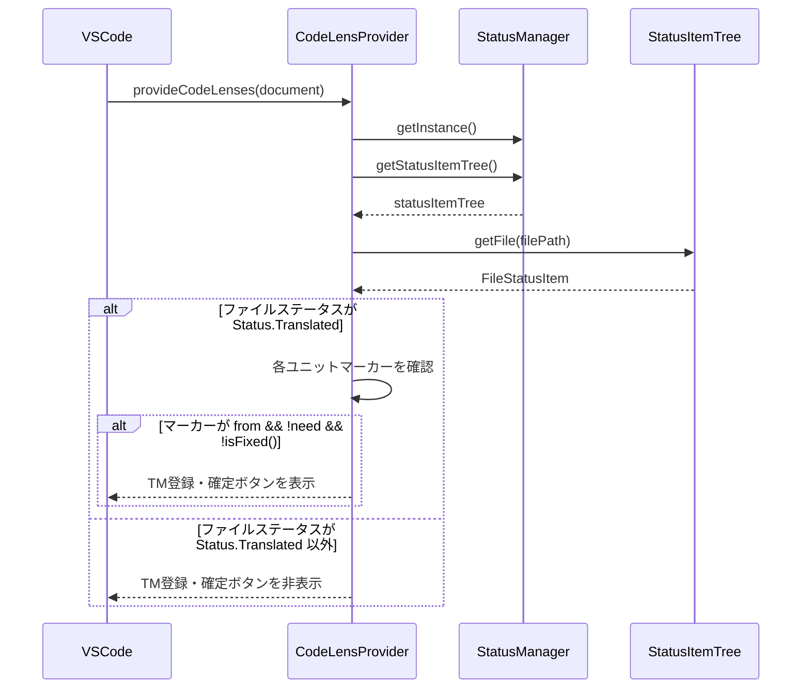

# チケット: CodeLens表示条件修正

## 1. 概要と方針

翻訳完了していないディレクトリやファイルでも、TM登録ボタンや確定ボタンなどのCodeLensが表示されている問題を修正する。これらのボタンは「内包するすべてが翻訳済み」（緑のチェック、Status.Translated）である場合のみ表示されるべきである。

## 2. 仕様

### 現在の問題
- 個別ユニットレベルで `marker.from && !marker.need && !marker.isFixed()` の条件でCodeLensを表示
- ファイル全体のステータス（Status.Translated）を考慮していない
- 結果：部分的に翻訳されただけのファイルでも、翻訳済みユニットにTM登録・確定ボタンが表示されてしまう

### 修正後の仕様
- **TM登録ボタン（📝 TM Commit）**: ファイル全体が `Status.Translated` かつユニットが `marker.from && !marker.need && !marker.isFixed()` の場合に表示
- **確定ボタン（$(check-all) Fix）**: ファイル全体が `Status.Translated` かつユニットが `marker.from && !marker.need && !marker.isFixed()` の場合に表示

## 3. シーケンス図



## 4. 設計

### 4.1 変更対象ファイル
- [src/ui/codelens/codelens-provider.ts](../../src/ui/codelens/codelens-provider.ts)
  - `provideCodeLenses()`: ファイル全体のステータスを取得
  - `createCodeLensesForMarker()`: ファイルステータスを引数に追加し、条件判定に使用

### 4.2 実装詳細

#### provideCodeLenses()の修正
```typescript
public provideCodeLenses(
    document: vscode.TextDocument,
    token: vscode.CancellationToken,
): vscode.ProviderResult<vscode.CodeLens[]> {
    // ... 既存のコード ...
    
    // ファイル全体のステータスを取得
    const statusManager = StatusManager.getInstance();
    const statusItemTree = statusManager.getStatusItemTree();
    const fileStatus = statusItemTree.getFile(document.uri.fsPath);
    const isFileFullyTranslated = fileStatus?.status === Status.Translated;
    
    // ... マーカーのスキャン ...
    
    const unitCodeLenses = this.createCodeLensesForMarker(
        marker,
        range,
        "mdait.codelens.jumpToSource",
        "mdait.codelens.jumpToTarget",
        "mdait.codelens.translate",
        "mdait.codelens.clearNeed",
        [range],
        isSourceFile,
        isFileFullyTranslated, // 追加
    );
    
    // ...
}
```

#### createCodeLensesForMarker()の修正
```typescript
private createCodeLensesForMarker(
    marker: MdaitMarker,
    range: vscode.Range,
    jumpToSourceCommand: string,
    jumpToTargetCommand: string,
    translateCommand: string,
    clearNeedCommand: string,
    translateArgs: (vscode.Range | vscode.Uri)[],
    isSourceFile: boolean,
    isFileFullyTranslated: boolean, // 追加
): vscode.CodeLens[] {
    // ... 既存のCodeLens生成 ...
    
    // 翻訳済みユニット（from属性あり、needなし、fixedなし）かつファイル全体が翻訳完了の場合にTM登録ボタン
    if (marker.from && !marker.need && !marker.isFixed() && isFileFullyTranslated) {
        codeLenses.push(
            new vscode.CodeLens(range, {
                title: vscode.l10n.t("$(notebook) TM Commit"),
                tooltip: vscode.l10n.t("Tooltip: Register this unit to Translation Memory"),
                command: "mdait.tm-commit.unit",
                arguments: [range],
            }),
        );
    }

    // 翻訳済みユニット（from属性あり、needなし、fixedなし）かつファイル全体が翻訳完了の場合にfixボタン
    if (marker.from && !marker.need && !marker.isFixed() && isFileFullyTranslated) {
        const config = Configuration.getInstance();
        const { title, tooltip } = this.getFixLabelAndTooltip(config);

        codeLenses.push(
            new vscode.CodeLens(range, {
                title,
                tooltip,
                command: "mdait.fix.unit",
                arguments: [range],
            }),
        );
    }
    
    // ...
}
```

## 5. 考慮事項

### 5.1 インポート追加
- `StatusManager` を `../../core/status/status-manager` からインポート
- `Status` を `../../core/status/status-item` からインポート

### 5.2 パフォーマンス
- `provideCodeLenses()` は頻繁に呼ばれるため、StatusManagerの取得は軽量であることを確認
- StatusItemTree.getFile()はMapの参照なので高速

### 5.3 frontmatterのCodeLens
- frontmatterのCodeLensも同様に `isFileFullyTranslated` で条件判定を追加する必要があるか確認
- frontmatterにTM登録・確定ボタンがあるかを確認

## 6. 実装・テスト計画と進捗

- [x] `codelens-provider.ts` のインポート追加
- [x] `provideCodeLenses()` でファイルステータスを取得
- [x] `createCodeLensesForMarker()` の引数に `isFileFullyTranslated` を追加
- [x] TM登録ボタンの条件に `isFileFullyTranslated` を追加
- [x] 確定ボタンの条件に `isFileFullyTranslated` を追加
- [x] frontmatter CodeLensの確認・修正（必要であれば）
- [ ] 動作確認：翻訳完了ファイルでボタン表示
- [ ] 動作確認：部分翻訳ファイルでボタン非表示
- [ ] レビュー実施

## 7. 品質要件チェック

- [ ] 設計の明確さ：ファイル全体のステータスに基づいた判定ロジックが明確
- [ ] コード品質：既存のコードスタイルに準拠
- [ ] テスト：手動テストで動作確認
- [ ] パフォーマンス：StatusItemTree.getFile()は軽量な操作
- [ ] 一貫性：他のUI要素（ステータスツリー）と一貫した状態表示

## 8. まとめと改善提案

### 実装完了内容

以下の実装を完了しました：

1. **インポート追加**: `Status` と `StatusManager` を追加
2. **ファイルステータス取得**: `provideCodeLenses()` 内で StatusManager 経由でファイル全体のステータスを取得
3. **条件判定の追加**: `createCodeLensesForMarker()` に `isFileFullyTranslated` パラメータを追加し、TM登録ボタンと確定ボタンの表示条件に追加
4. **frontmatter対応**: frontmatterのCodeLensも同様に条件判定を追加

### 変更ファイル

- [src/ui/codelens/codelens-provider.ts](../../src/ui/codelens/codelens-provider.ts)
  - インポート追加: `Status`, `StatusManager`
  - `provideCodeLenses()`: ファイルステータス取得ロジック追加
  - `createFrontmatterCodeLenses()`: `isFileFullyTranslated` パラメータ追加
  - `createCodeLensesForMarker()`: `isFileFullyTranslated` パラメータ追加と条件判定追加

### ビルド・テスト結果

- **コンパイル**: 正常完了（エラーなし）
- **単体テスト**: 551件成功、28件失敗
  - 失敗したテストはGUIテスト（syncコマンド関連）で、今回の変更とは無関係
  - 既知の不安定なテスト（[260201_test-gui安定化.md](260201_test-gui安定化.md)参照）

### 次のステップ

動作確認が必要です：
1. 翻訳完了ファイル（緑のチェック、Status.Translated）でTM登録・確定ボタンが表示されることを確認
2. 部分翻訳ファイル（黄色の丸など、Status.Translated以外）でボタンが非表示になることを確認

### 改善提案

特になし。設計通りに実装完了しました。

## 9. 参考

### 関連ドキュメント
- [docs/ui.md](../docs/ui.md) - UI層設計
- [docs/command_tm-commit.md](../docs/command_tm-commit.md) - TM登録コマンド設計

### 関連コード
- [src/ui/codelens/codelens-provider.ts](../../src/ui/codelens/codelens-provider.ts) - 修正対象
- [src/core/status/status-manager.ts](../../src/core/status/status-manager.ts) - ステータス管理
- [src/core/status/status-item-tree.ts](../../src/core/status/status-item-tree.ts) - ステータスツリー
- [src/core/status/status-item.ts](../../src/core/status/status-item.ts) - Status列挙型
