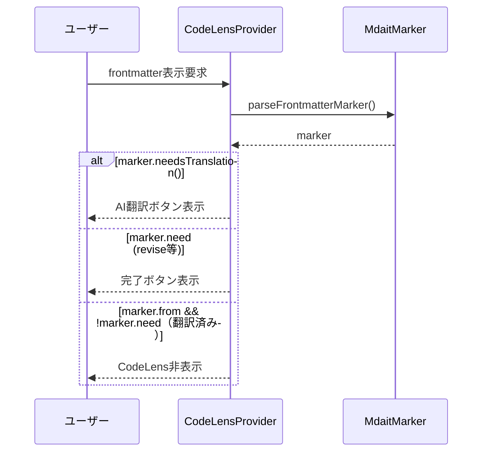

# チケット: frontmatter CodeLens表示改善

## 1. 概要と方針

フロントマターの翻訳完了後は CodeLens を非表示にする。TM登録・確定・原文移動は不要であり、未翻訳時のみ AI翻訳ボタンを表示する。

## 2. 仕様

### 現状
- フロントマターも通常ユニットと同じ CodeLens 表示ロジックを使用
- 翻訳完了後、TM登録ボタン・確定ボタン・ソースジャンプボタンが表示される

### 変更後
- **未翻訳時（need:translate）**: AI翻訳ボタンのみ表示（従来通り）
- **翻訳完了後（from属性あり、needなし）**: CodeLens を一切表示しない
- **need待ち（need:revise等）**: 完了ボタンを表示（従来通り）

### 理由
- フロントマターのTM登録・確定は非対応
- 原文は同じファイルのすぐ下にあるため移動ボタンは不要
- 翻訳完了後は視覚的にシンプルに保つ

## 3. シーケンス図

## 4. 設計

### 4.1 変更対象ファイル
- [src/ui/codelens/codelens-provider.ts](../../src/ui/codelens/codelens-provider.ts)
  - `createFrontmatterCodeLenses()`: フロントマター専用の CodeLens 生成ロジックを実装

### 4.2 実装内容

`createFrontmatterCodeLenses()` メソッドで、通常ユニットと異なる表示ロジックを実装:

1. **翻訳が必要な場合** (`marker.needsTranslation()`): AI翻訳ボタンを表示
2. **need待ちの場合** (`marker.need`): 完了ボタンを表示
3. **翻訳完了の場合** (`marker.from && !marker.need`): CodeLens を返さない（空配列）

通常ユニット用の `createCodeLensesForMarker()` は使用せず、専用ロジックを実装する。

## 5. 考慮事項

- フロントマター以外のユニットの動作に影響を与えないこと
- 既存のテストケースを確認し、必要に応じて更新
- ドキュメント（`docs/ui.md`）に仕様変更を記載

## 6. 実装・テスト計画と進捗

- [x] `createFrontmatterCodeLenses()` の実装変更
- [x] 手動テスト: 未翻訳フロントマターで AI翻訳ボタンが表示されることを確認
- [x] 手動テスト: 翻訳済みフロントマターで CodeLens が非表示になることを確認
- [x] 手動テスト: need待ちフロントマターで完了ボタンが表示されることを確認
- [x] `docs/ui.md` の更新
- [x] レビュー実施

## 7. 品質要件チェック

- [x] 設計と実装の整合性
- [x] フロントマター以外のユニットに影響がないこと
- [x] ユーザビリティの改善
- [x] ドキュメントの更新

## 8. まとめと改善提案

**実装完了:**
- フロントマターの翻訳完了後はCodeLensを非表示にする実装が完了
- `createFrontmatterCodeLenses()`メソッドを通常ユニットから独立させ、専用ロジックを実装
- ドキュメント（docs/ui.md）を更新し、仕様変更を明記

**レビュー結果:** ✅承認（⭐⭐⭐⭐ 4/5）

**主な評価点:**
- 設計意図が明確で一貫性のある実装
- 通常ユニットとfrontmatterのCodeLens生成を適切に分離
- ドキュメントが正確に更新されている

**推奨事項（将来の改善）:**
1. 自動テストの追加（UI層のリグレッション防止）
2. 条件判定の明示性向上（現状でも十分理解可能）

**設計哲学への示唆:**
- 特殊ケースの扱い: frontmatterのような特殊要素は、通常ユニットと異なる要件を持つため、専用ロジックで実装すること
- UI表示の簡潔性: 不要なボタンや機能は表示せず、ユーザビリティを優先する

## 9. 参考

- 関連タスク: [260211_確定CodeLensラベル改善](done/260211_確定CodeLensラベル改善.md)
