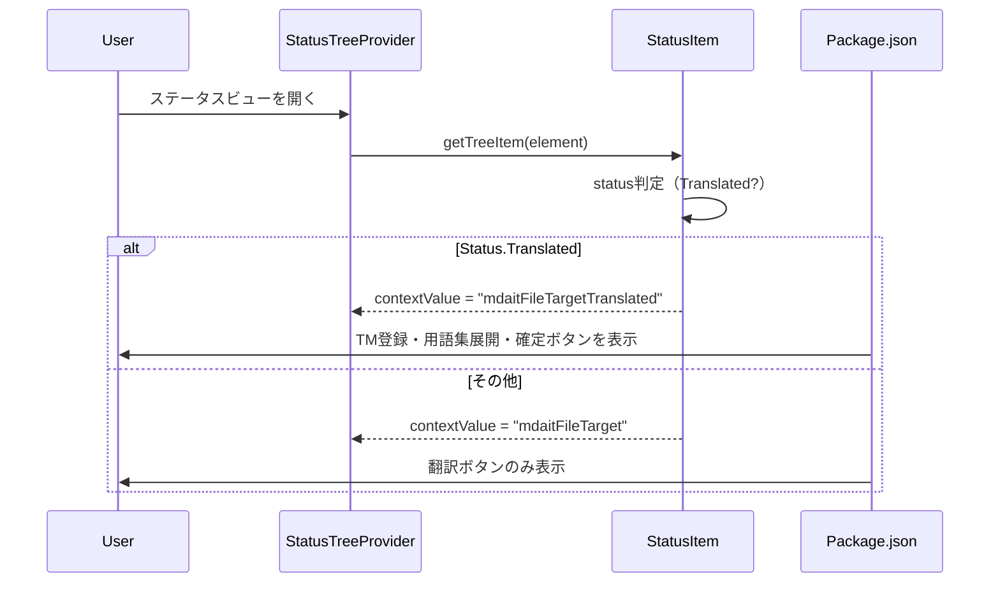

# チケット: ステータスビューアイコン表示条件修正

## 1. 概要と方針

ステータスビュー上で、翻訳未完了のディレクトリ/ファイルに対してTM登録・用語集展開・確定ボタンが表示される問題を修正する。これらのボタンは「内包するすべてが翻訳済み」（緑チェック = `Status.Translated`）の場合のみ表示されるべき。

## 2. 仕様

- TM登録（`mdait.tm-commit`）、用語集展開（`mdait.term.expand`）、確定（`mdait.fix`）のコマンドは、ディレクトリ/ファイルが`Status.Translated`の場合のみ表示する
- CodeLensは今回の対象外
- 翻訳実行ボタンは従来通り（`Status.NeedsTranslation`でも表示）

## 3. シーケンス図

## 4. 設計

### 変更対象ファイル

1. **src/core/status/status-item-tree.ts** - ディレクトリのcontextValue設定
2. **src/core/status/status-collector.ts** - ファイルのcontextValue設定
3. **package.json** - コマンド表示条件の更新

### contextValue命名規則

- Source側：変更なし
- Target側：ステータスに応じて変更
  - 翻訳完了: `mdaitDirectoryTargetTranslated` / `mdaitFileTargetTranslated`
  - それ以外: `mdaitDirectoryTarget` / `mdaitFileTarget`

### package.jsonの条件変更

以下のコマンドの`when`条件を更新：
- `mdait.term.expand.directory` → `viewItem == mdaitDirectoryTargetTranslated`
- `mdait.term.expand.file` → `viewItem == mdaitFileTargetTranslated`
- `mdait.tm-commit.directory` → `viewItem == mdaitDirectoryTargetTranslated`
- `mdait.tm-commit.file` → `viewItem == mdaitFileTargetTranslated`
- `mdait.fix.directory` → `viewItem == mdaitDirectoryTargetTranslated`
- `mdait.fix.file` → `viewItem == mdaitFileTargetTranslated`

翻訳実行コマンドは従来通り：
- `mdait.translate.directory` → `viewItem == mdaitDirectoryTarget`（両方のcontextValueで表示）
- `mdait.translate.file` → `viewItem == mdaitFileTarget`（両方のcontextValueで表示）

## 5. 考慮事項

- contextValueの変更により、既存のwhen条件が動作しなくなる可能性があるため、すべてのコマンド表示条件を確認する
- 翻訳実行コマンドは`Status.NeedsTranslation`でも表示する必要があるため、両方のcontextValueにマッチするようにする
- Frontmatterは影響を受けない（独自のcontextValueを持つ）

## 6. 実装・テスト計画と進捗

- [x] `status-item-tree.ts`のディレクトリcontextValue設定を修正
- [x] `status-collector.ts`のファイルcontextValue設定を修正
- [x] `package.json`のコマンド表示条件を更新
- [ ] 手動テスト: 未翻訳ディレクトリ/ファイルでボタンが非表示になることを確認
- [ ] 手動テスト: 翻訳済みディレクトリ/ファイルでボタンが表示されることを確認

## 7. 品質要件チェック

- [x] 設計は明確で、変更内容が理解しやすい
- [x] 変更範囲が最小限で、影響範囲が明確
- [x] 既存の翻訳実行コマンドの動作に影響しない
- [x] ユーザー体験が向上する（不要なボタンが非表示になる）
- [x] レビュー完了（条件付き承認→修正完了）

## 8. まとめと改善提案

（作業完了後に記入）

## 9. 参考

- ユーザーからの要求：添付画像で未翻訳ファイルにもボタンが表示されている問題を指摘
- 緑チェックの判定は既に実装済み（`Status.Translated`）
