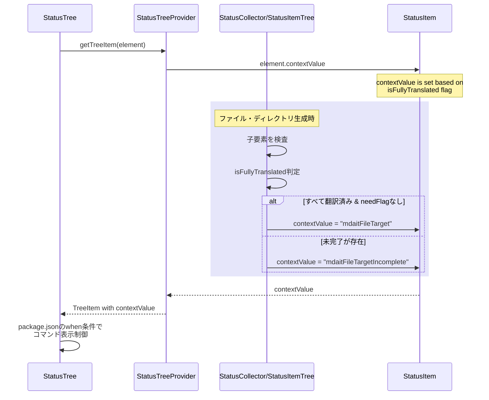

# チケット: 未完了項目のTM登録・用語集展開・確定ボタンを非表示にする

## 1. 概要と方針

StatusTreeで表示されるディレクトリやファイルのコンテキストメニューにおいて、内包するすべてが翻訳済みである場合のみTM登録・用語集展開・確定ボタンを表示する。未翻訳・要レビューなどが残っている場合は非表示にする。

## 2. 仕様

### 対象コマンド
- `mdait.tm-commit.directory` / `mdait.tm-commit.file`
- `mdait.term.expand.directory` / `mdait.term.expand.file`  
- `mdait.fix.directory` / `mdait.fix.file`

### 表示条件
以下の条件をすべて満たす場合のみ表示：
- ディレクトリ/ファイル配下のすべてのユニットが翻訳済み（`status === Status.Translated`）
- すべてのユニットが`needFlag`なし、または`needFlag`が空
- frontmatterも同様に完了状態である

### 非表示条件（一つでも該当すれば非表示）
- `status === Status.NeedsTranslation` のユニットが存在
- `needFlag === "review"` のユニットが存在
- `needFlag.startsWith("revise@")` のユニットが存在
- `needFlag === "translate"` のユニットが存在

## 3. シーケンス図

## 4. 設計

### 4.1 StatusItemの拡張
`StatusItem`インターフェースに`isFullyTranslated?: boolean`フラグを追加（オプショナル）。

### 4.2 contextValueの複数値設計（レビュー指摘対応）
翻訳コマンドが未完了時に非表示になる問題を解決するため、contextValueを複数持たせる方式に変更：
- ターゲットファイル/ディレクトリは常に`mdaitFileTarget`/`mdaitDirectoryTarget`を持つ（翻訳コマンド用）
- 完了状態の場合は追加で`mdaitFileTargetComplete`/`mdaitDirectoryTargetComplete`も持つ（TM登録・確定用）
- 例: `"mdaitFileTarget mdaitFileTargetComplete"`のように空白区切りで設定

### 4.3 ファイルレベルの判定ロジック
`status-collector.ts`の`buildFileStatusItem`メソッドで：
1. すべての子ユニット（`children`）を検査
2. すべてのユニットが`status === Status.Translated`かつ`needFlag`が空/nullであることを確認
3. frontmatterも同様に確認
4. 上記条件を満たす場合`isFullyTranslated = true`
5. `contextValue`を以下のように設定：
   - `isFullyTranslated === true`: `"mdaitFileTarget mdaitFileTargetComplete"`
   - それ以外: `"mdaitFileTarget"`

**エッジケース**:
- 空ファイル: 翻訳すべき内容がないため完了扱い（`isFullyTranslated: true`）
- エラーファイル: パースエラーがあるため不完全扱い（`isFullyTranslated: false`）

### 4.4 ディレクトリレベルの判定ロジック
`status-item-tree.ts`の`buildDirectoryStatusItem`メソッドで：
1. 直下のすべてのファイルとサブディレクトリを検査
2. すべてのファイル/サブディレクトリが`isFullyTranslated === true`であることを確認
3. 上記条件を満たす場合`isFullyTranslated = true`
4. `contextValue`を以下のように設定：
   - `isFullyTranslated === true`: `"mdaitDirectoryTarget mdaitDirectoryTargetComplete"`
   - それ以外: `"mdaitDirectoryTarget"`

**エッジケース**:
- 空ディレクトリ: ファイルもサブディレクトリもない場合は不完全扱い（`isFullyTranslated: false`）

### 4.5 package.jsonの更新
`when`条件を正規表現マッチングに変更：
- 翻訳コマンド: `viewItem =~ /mdaitFileTarget/` （完了・未完了関係なく表示）
- TM登録・用語集展開・確定コマンド: `viewItem =~ /Complete/` （完了時のみ表示）

## 5. 考慮事項

- **既存のcontextValueとの整合性**: SourceファイルやSourceディレクトリは影響を受けない
- **パフォーマンス**: ディレクトリの判定は再帰的に行われるため、大規模プロジェクトでの性能影響を注視
- **StatusManager更新**: ファイル更新時に`isFullyTranslated`も再計算される必要がある
- **CodeLens**: ユニットレベルのCodeLensは既に適切な判定ロジックがあるため、変更不要

## 6. 実装・テスト計画と進捗

- [x] `StatusItem`インターフェースに`isFullyTranslated`フラグ追加
- [x] `status-collector.ts`にファイルレベルの`isFullyTranslated`判定ロジック実装
- [x] `status-item-tree.ts`にディレクトリレベルの`isFullyTranslated`判定ロジック実装
- [x] `contextValue`の設定ロジック修正（ファイル・ディレクトリ）
- [x] **レビュー指摘対応**: contextValueを複数持たせる方式に変更（翻訳コマンド非表示問題を解決）
- [x] **レビュー指摘対応**: 空ファイル・エラーファイルのcontextValue適切に設定
- [x] **レビュー指摘対応**: 空ディレクトリを不完全扱いに修正
- [x] **レビュー指摘対応**: package.jsonのwhen条件を正規表現マッチングに修正
- [x] **レビュー指摘対応**: docs/ui.mdとdocs/core.mdに実装内容を反映
- [ ] 手動テスト：未翻訳ユニットが含まれるファイル/ディレクトリで翻訳ボタンが表示されること（重要！）
- [ ] 手動テスト：未翻訳ユニットが含まれるファイル/ディレクトリでTM登録・確定ボタンが非表示になること
- [ ] 手動テスト：`needFlag: "review"`のユニットが含まれる場合にTM登録・確定ボタンが非表示になること
- [ ] 手動テスト：すべて翻訳済みの場合にすべてのボタンが表示されること
- [ ] 手動テスト：空ファイル・エラーファイルの動作確認

## 7. 品質要件チェック
- [x] 設計が明確で、実装方針が具体的である
- [x] 既存機能への影響が最小限である
- [x] エッジケース（空ファイル、エラーファイル、空ディレクトリ）が考慮されている
- [x] 設計書が更新されている（docs/ui.md, docs/core.md）
- [ ] 手動テストで動作確認が完了している

## 8. まとめと改善提案

### 実装内容
1. **StatusItemインターフェース拡張**
   - `BaseStatusItem`に`isFullyTranslated?: boolean`フラグを追加
   - すべての翻訳が完了しているかを示すフラグ

2. **contextValue設計の見直し（レビュー指摘対応）**
   - **問題**: 旧実装では`mdaitFileTarget`が完了時のみ設定され、翻訳コマンドも非表示になっていた
   - **修正**: contextValueを複数持たせる方式に変更
     - ターゲットは常に`mdaitFileTarget`/`mdaitDirectoryTarget`を持つ
     - 完了時は追加で`~Complete`も持つ（例: `"mdaitFileTarget mdaitFileTargetComplete"`）
   - **package.json**: 正規表現マッチング（`viewItem =~ /pattern/`）で制御
     - 翻訳コマンド: `/mdaitFileTarget/` で常に表示
     - TM登録・確定: `/Complete/` で完了時のみ表示

3. **ファイルレベルの判定ロジック（status-collector.ts）**
   - `isFileFullyTranslated`メソッドを新規実装
   - すべてのターゲットユニットが`status === Status.Translated`かつ`needFlag`なしであることを確認
   - frontmatterも同様にチェック
   - `buildFileStatusItem`でcontextValueを動的に設定
   - **エッジケース対応**:
     - 空ファイル: 完了扱い（`isFullyTranslated: true`、`"mdaitFileTarget mdaitFileTargetComplete"`）
     - エラーファイル: 不完全扱い（`isFullyTranslated: false`、`"mdaitFileTarget"`）

4. **ディレクトリレベルの判定ロジック（status-item-tree.ts）**
   - `isDirectoryFullyTranslated`メソッドを新規実装
   - 直下のすべてのファイルとサブディレクトリを再帰的にチェック
   - すべての子要素が`isFullyTranslated === true`であることを確認
   - `createDirectoryStatusItem`と`recalcDirectoryAggregate`でcontextValueを動的に設定
   - **エッジケース対応**:
     - 空ディレクトリ: 不完全扱い（`isFullyTranslated: false`、`"mdaitDirectoryTarget"`）

5. **設計書の更新**
   - `docs/ui.md`: contextValueの複数値設計を文書化
   - `docs/core.md`: isFullyTranslatedフラグとエッジケースの扱いを明記

### 手動テスト手順
1. **未翻訳ユニット含むファイル/ディレクトリ**
   - StatusTreeで未翻訳ユニットを含むファイル/ディレクトリを右クリック
   - **翻訳ボタンが表示される**ことを確認（重要！旧実装では非表示になっていた）
   - TM登録・用語集展開・確定ボタンが表示されないことを確認

2. **needFlag付きユニット含むファイル/ディレクトリ**
   - `needFlag: "review"`などのフラグ付きユニットを含むファイル/ディレクトリを右クリック
   - 翻訳ボタンが表示されることを確認
   - TM登録・用語集展開・確定ボタンが表示されないことを確認

3. **すべて翻訳済みのファイル/ディレクトリ**
   - すべてのユニットが翻訳済み（`needFlag`なし）のファイル/ディレクトリを右クリック
   - 翻訳・TM登録・用語集展開・確定ボタンすべてが表示されることを確認

4. **空ファイル・エラーファイル**
   - 空ファイルで完了扱い（TM登録・確定ボタンが表示）されることを確認
   - エラーファイルで不完全扱い（TM登録・確定ボタンが非表示）されることを確認

### 既存機能への影響
- `isFullyTranslated`はオプショナルフラグのため、既存コードへの影響なし
- ソースファイル・ソースディレクトリは`mdaitFileSource`/`mdaitDirectorySource`のcontextValueで区別され、影響なし
- contextValueの変更により翻訳コマンドが正常に動作するようになった（既存のバグを修正）

### 改善提案
- 将来的に、UI上で「未完了項目がある」理由（未翻訳・要レビューなど）をツールチップで表示できるとさらに親切
- 自動テスト（GUIテスト）の追加を検討（`src/test-gui/ui/status/status-tree-context-menu.test.ts`など）

## 9. 参考

- [src/ui/status/status-tree-provider.ts](src/ui/status/status-tree-provider.ts)
- [src/core/status/status-collector.ts](src/core/status/status-collector.ts)
- [src/core/status/status-item-tree.ts](src/core/status/status-item-tree.ts)
- [src/core/status/status-item.ts](src/core/status/status-item.ts)
- [package.json](package.json) - コンテキストメニュー定義
