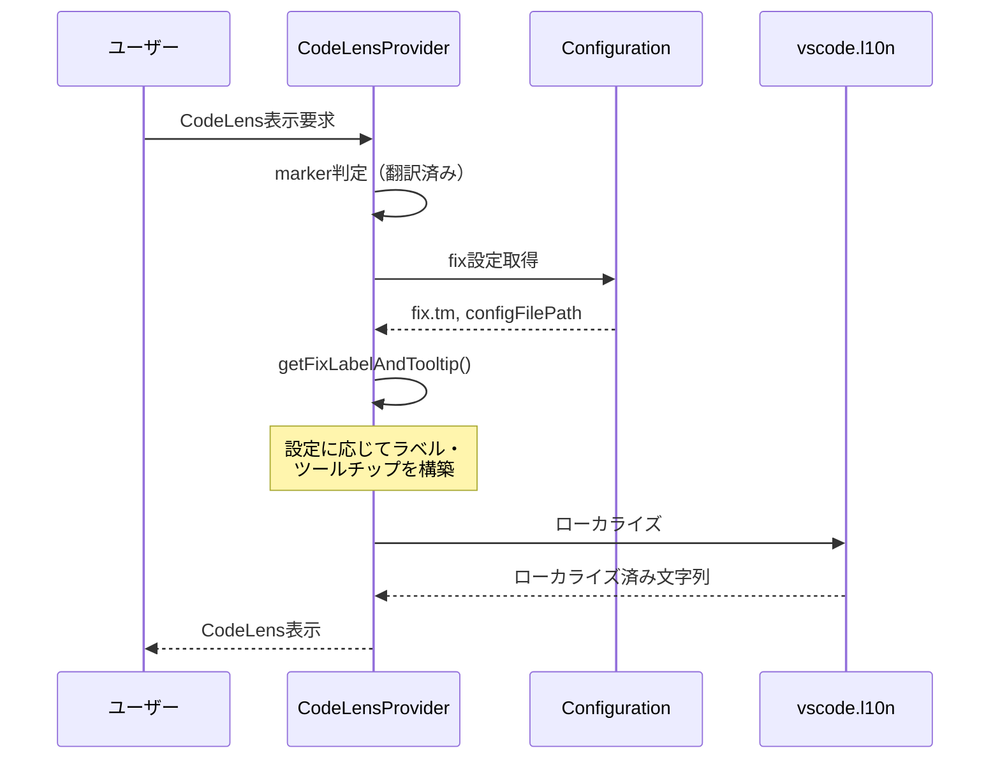

# チケット: 確定CodeLensラベル改善

## 1. 概要と方針

翻訳済みユニットに表示される確定CodeLensについて、設定でTM登録が有効な場合にラベルとツールチップにその旨を表示する。将来的に用語集展開などの機能が追加されても拡張可能なシンプルな設計とする。

## 2. 仕様

### 現在の実装
- 確定CodeLensは `mdait.fix.unit` コマンドを呼び出す
- ラベル: `$(check-all) Fix`
- ツールチップ: `Tooltip: Fix this unit (mark as confirmed)`
- 表示条件: `marker.from && !marker.need && !marker.isFixed()`

### 新仕様
#### ラベル
- TM登録OFF（デフォルト）: `$(check-all) Fix`
- TM登録ON: `$(check-all) Fix (+TM)`
- 将来的な拡張例: `$(check-all) Fix (+TM +Term)`

#### ツールチップ
```
翻訳を確定させます。また、以下も行います。
- TM登録 (設定項目)

設定ファイル: <設定ファイルパス>
```

将来的な拡張例:
```
翻訳を確定させます。また、以下も行います。
- TM登録 (設定項目)
- 用語集展開 (設定項目)

設定ファイル: <設定ファイルパス>
```

**重要**: 追加アクションがない場合は「また、以下も行います。」セクション自体を表示しない

### 設定項目
- `fix.tm`: TM登録を行うか (boolean, デフォルト: false)
- 将来追加予定: `fix.term`: 用語集展開を行うか

## 3. シーケンス図



## 4. 設計

### 4.1 ラベル・ツールチップ生成ロジック

新しいメソッド `getFixLabelAndTooltip()` を追加（拡張可能設計）:

```typescript
/**
 * Fix確定CodeLensのラベルとツールチップを取得する
 * @param config Configuration
 * @returns ラベルとツールチップ
 */
private getFixLabelAndTooltip(config: Configuration): { title: string; tooltip: string } {
	// 追加アクションを収集（拡張可能）
	// label: ツールチップ表示用の詳細名, shortLabel: ボタンラベル表示用の短縮名
	const actions: Array<{label: string, shortLabel: string}> = [];
	
	if (config.fix.tm) {
		actions.push({
			label: vscode.l10n.t("TM Commit"),
			shortLabel: "TM"
		});
	}
	
	// 将来の拡張例:
	// if (config.fix.term) {
	//   actions.push({
	//     label: vscode.l10n.t("Term Expansion"),
	//     shortLabel: "Term"
	//   });
	// }
	
	// ラベル構築
	let title = "$(check-all) " + vscode.l10n.t("Fix");
	if (actions.length > 0) {
		const shortLabels = actions.map(a => a.shortLabel).join(" +");
		title += ` (+${shortLabels})`;
	}
	
	// ツールチップ構築
	let tooltip = vscode.l10n.t("Fix this unit (mark as confirmed).");
	
	if (actions.length > 0) {
		tooltip += "\n\n" + vscode.l10n.t("The following actions will also be performed:") + "\n";
		for (const action of actions) {
			tooltip += `- ${action.label} (` + vscode.l10n.t("Configuration") + ")\n";
		}
		
		const configPath = config.getConfigFilePath();
		if (configPath) {
			tooltip += "\n" + vscode.l10n.t("Configuration file: {0}", configPath);
		}
	}
	
	return { title, tooltip };
}
```

### 4.2 既存コードの修正箇所

`codelens-provider.ts` の `createCodeLensesForMarker()` メソッド内:

```typescript
// 翻訳済みユニット（from属性あり、needなし、fixedなし）にfixボタン
if (marker.from && !marker.need && !marker.isFixed()) {
	const config = Configuration.getInstance();
	const { title, tooltip } = this.getFixLabelAndTooltip(config);
	
	codeLenses.push(
		new vscode.CodeLens(range, {
			title,
			tooltip,
			command: "mdait.fix.unit",
			arguments: [range],
		}),
	);
}
```

### 4.3 新規l10nキー

以下のキーを追加:
- `"TM Commit"`: "TM登録"
- `"Term Expansion"`: "用語集展開"（将来用）
- `"The following actions will also be performed:"`: "また、以下も行います。"
- `"Configuration"`: "設定項目"
- `"Configuration file: {0}"`: "設定ファイル: {0}"
- `"Fix this unit (mark as confirmed)."`: "翻訳を確定させます。"

## 5. 考慮事項

### 設計原則
- **単一責任**: ラベル・ツールチップ生成ロジックを1つのメソッドに集約
- **開放閉鎖原則**: 新機能追加時、既存コードへの影響を最小化
- **拡張性**: 配列ベースで追加アクションを管理し、容易に拡張可能

### パフォーマンス
- CodeLensは頻繁に再生成されるため、`Configuration.getInstance()` の呼び出しはキャッシュ済みのインスタンスを返す
- l10n呼び出しも軽量

### ローカライゼーション
- すべてのユーザー向けメッセージは `vscode.l10n.t()` でローカライズ
- `package.nls.json` と `package.nls.ja.json` の両方に新規キーを追加

## 6. 実装・テスト計画と進捗

- [x] `codelens-provider.ts` に `getFixLabelAndTooltip()` メソッドを追加
- [x] `createCodeLensesForMarker()` メソッドを修正して新ロジックを統合
- [x] `package.nls.json` に新規l10nキーを追加
- [x] `package.nls.ja.json` に新規l10nキーを追加
- [ ] 手動テスト: TM登録OFFの場合、ラベルとツールチップが期待通りか
- [ ] 手動テスト: TM登録ONの場合、ラベルとツールチップが期待通りか
- [ ] 手動テスト: 設定ファイルパスが正しく表示されるか

## 7. 品質要件チェック

- [ ] コードの可読性: メソッド名・変数名が明確
- [ ] 拡張性: 新しいアクションを追加する際、既存コードへの影響が最小限
- [ ] ローカライゼーション: すべてのユーザー向けメッセージがローカライズ対応
- [ ] 設計整合性: 既存のCodeLens生成パターンと一貫性がある
- [ ] テストカバレッジ: 手動テストで主要なシナリオを確認

## 8. まとめと改善提案

（実装完了後に記載）

## 9. 参考

### 関連ファイル
- [src/ui/codelens/codelens-provider.ts](../src/ui/codelens/codelens-provider.ts)
- [src/config/configuration.ts](../src/config/configuration.ts)
- [package.nls.json](../package.nls.json)
- [package.nls.ja.json](../package.nls.ja.json)

### 設定スキーマ
- `fix.tm` (boolean): 確定時にTM登録を行うか
- 将来追加予定: `fix.term` (boolean): 確定時に用語集展開を行うか
