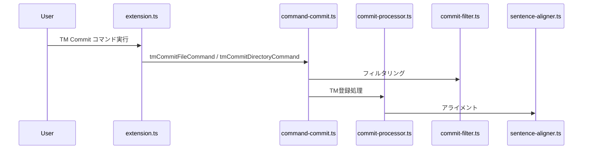

# チケット: tm-commitフォルダをtmフォルダに統合

## 1. 概要と方針

`src/commands/tm-commit/` と `src/commands/tm/` が併存している状態を解消し、tm-commit配下のすべてのファイルをtmフォルダに統合する。`tm-commit-command.ts` は他のtmコマンド（`command-open.ts`）の命名規則に倣い `command-commit.ts` にリネームする。コマンドID も `mdait.tm-commit.*` から `mdait.tm.commit.*` へ変更し一貫性を保つ。

## 2. 仕様

- `src/commands/tm-commit/` フォルダを廃止し全ファイルを `src/commands/tm/` に移動
- ファイル名は他のtmコマンド（`command-open.ts`）に合わせリネーム
- コマンドID: `mdait.tm-commit.file` → `mdait.tm.commit.file`、`mdait.tm-commit.directory` → `mdait.tm.commit.directory`
- すべての参照（extension.ts、package.json、nls等）を更新
- ビルド・テストが通ること

## 3. シーケンス図

## 4. 設計

### ファイル移動・リネーム計画

| 移動前 | 移動後 |
|--------|--------|
| `src/commands/tm-commit/tm-commit-command.ts` | `src/commands/tm/command-commit.ts` |
| `src/commands/tm-commit/sentence-aligner.ts` | `src/commands/tm/sentence-aligner.ts` |
| `src/commands/tm-commit/tm-commit-filter.ts` | `src/commands/tm/commit-filter.ts` |
| `src/commands/tm-commit/tm-commit-processor.ts` | `src/commands/tm/commit-processor.ts` |

フォルダ削除: `src/commands/tm-commit/`

### コマンドID変更

| 変更前 | 変更後 |
|--------|--------|
| `mdait.tm-commit.file` | `mdait.tm.commit.file` |
| `mdait.tm-commit.directory` | `mdait.tm.commit.directory` |

### 変更対象ファイル一覧

1. **`src/extension.ts`**（import文・コマンドID変更）
2. **`package.json`**（commands定義・menus定義のコマンドID変更）
3. **`package.nls.json`**（NLSキー名変更: `mdait.tm-commit.*.title` → `mdait.tm.commit.*.title`）
4. **`package.nls.ja.json`**（NLSキー名変更）
5. **`src/commands/tm/command-commit.ts`**（新規作成: 旧 `tm-commit-command.ts` の内容、internal importパス更新）
6. **`src/commands/tm/sentence-aligner.ts`**（移動: パス変更があればimport修正）
7. **`src/commands/tm/commit-filter.ts`**（新規作成: 旧 `tm-commit-filter.ts` の内容）
8. **`src/commands/tm/commit-processor.ts`**（新規作成: 旧 `tm-commit-processor.ts` の内容、internal importパス更新）
9. テストファイルがあれば対応

## 5. 考慮事項

- `tm-commit-*.ts` 内の相対importパスが変わるため注意（特に `commit-processor.ts` → `sentence-aligner.ts` の参照など）
- `command-commit.ts` 内のimportが `./commit-filter`, `./commit-processor` 等の短い名前に変わる
- コマンドID変更はbreaking changeだが、feature-tmブランチ開発中のため問題なし
- テストファイル（`src/test/` や `src/test-gui/`）に `tm-commit` 関連があれば合わせて更新
- ビルド後エラーなし、テスト通過を確認

## 6. 実装・テスト計画と進捗

- [x] `src/commands/tm/sentence-aligner.ts` 作成（移動）
- [x] `src/commands/tm/commit-filter.ts` 作成（リネーム・移動）
- [x] `src/commands/tm/commit-processor.ts` 作成（リネーム・移動）
- [x] `src/commands/tm/command-commit.ts` 作成（リネーム・移動・import更新）
- [x] `src/extension.ts` の import文とコマンドID更新
- [x] `package.json` のコマンドID更新（commands, menus）
- [x] `package.nls.json` のNLSキー更新
- [x] `package.nls.ja.json` のNLSキー更新
- [x] `src/commands/tm-commit/` フォルダ削除
- [x] テストファイル確認・更新（`src/test/commands/tm/` に移動・import更新）
- [x] ビルド確認（`npm run compile` エラーなし）
- [x] テスト実行確認（19テスト全通過）

## 7. 品質要件チェック

- [x] TypeScript型エラーなし
- [x] すべてのimportが解決済み
- [x] コマンドIDが package.json と extension.ts で一致
- [x] NLSキーが一致
- [x] `src/commands/tm-commit/` が削除済み
- [x] テスト通過
- [x] 不要な `export` の除去（`executeTmCommitForUnits`・`getSourceContent`）
- [x] ロガーコンテキスト文字列を `"tm-commit"` → `"tm.commit"` に統一（3ファイル）

## 8. まとめと改善提案

（完了後記入）

## 9. 参考

### 現状調査結果（参照箇所一覧）

**extension.ts の参照:**
- `import { tmCommitDirectoryCommand, tmCommitFileCommand } from "./commands/tm-commit/tm-commit-command";` (L9)
- `vscode.commands.registerCommand("mdait.tm-commit.file", ...)` (L187)
- `vscode.commands.registerCommand("mdait.tm-commit.directory", ...)` (L190)

**package.json の参照箇所:**
- L138: `"command": "mdait.tm-commit.file"`
- L144: `"command": "mdait.tm-commit.directory"`
- L257: context menu `"command": "mdait.tm-commit.directory"`
- L262: context menu `"command": "mdait.tm-commit.file"`

**package.nls.json:**
- `"mdait.tm-commit.file.title"`: `"✨TM Commit File"`
- `"mdait.tm-commit.directory.title"`: `"✨TM Commit Directory"`

**package.nls.ja.json:**
- `"mdait.tm-commit.file.title"`: `"✨ TM登録（ファイル）"`
- `"mdait.tm-commit.directory.title"`: `"✨ TM登録（ディレクトリ）"`
