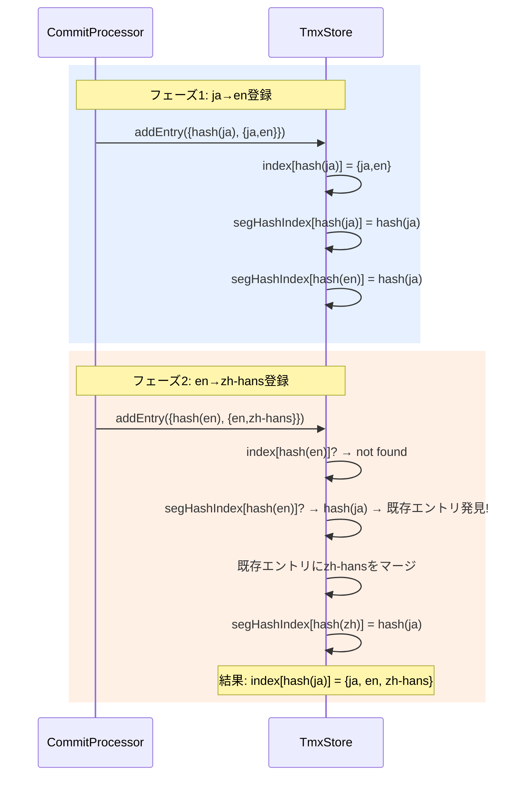

# チケット: TM多言語統合

## 1. 概要と方針

ja→en→zh-hansなど複数言語を対象としたTM登録時、ja/enとen/zh-hansが別エントリになる問題を修正する。
セグメントテキストのハッシュによるセカンダリインデックスを導入し、既存エントリのセグメントに含まれるテキストを検出して同一エントリにマージする。

## 2. 仕様

- TM登録時、新規ペアのソーステキストが既存エントリのいずれかのセグメントと一致する場合、新しい言語ペアを既存エントリにマージする
- TM検索時、sentenceHashで直接見つからない場合もセグメントハッシュインデックスから解決する
- TMXファイルロード時、セグメントが重複する分離エントリを自動マージする
- 結果: ja→en登録後にen→zh-hans登録すると、1つのエントリに{ja, en, zh-hans}が統合される

## 3. シーケンス図

## 4. 設計

### TmxStoreの変更

1. **segmentHashIndex追加**: `Map<string, string>` — `calculateHash(segmentText, true)` → `entry.sentenceHash`
2. **addEntry修正**: セグメントハッシュインデックスで既存エントリを検索→マージ
3. **findByHash修正**: セグメントハッシュインデックスをフォールバックとして使用
4. **lookupByHash修正**: findByHashと同様のフォールバック
5. **load修正**: ロード後にセグメント重複エントリのマージパスを実行
6. **clear/loadIfNeeded修正**: segmentHashIndexのクリアを追加

### commit-processor.tsの変更

- registerPairsのfindByHash呼び出し → TmxStoreのfindByHash修正により自動的に機能

## 5. 考慮事項

- CRC32ハッシュ衝突: 確率は極めて低い。衝突時はfalse mergeが発生するが、実用上問題なし
- 既存TMXファイル互換性: ロード時マージにより自動修復される
- パフォーマンス: セカンダリインデックスはO(1)検索。メモリ追加量はエントリ×言語数分のMapエントリ

## 6. 実装・テスト計画と進捗

- [x] TmxStore: segmentHashIndex追加とaddEntry修正
- [x] TmxStore: findByHash/lookupByHash修正
- [x] TmxStore: load時マージとclear修正
- [x] commit-processor: registerPairsのマージ対応確認
- [x] テスト: 多言語統合シナリオのユニットテスト
- [x] 既存テスト通過確認

## 7. 品質要件チェック

- [x] 既存テスト全件パス
- [x] 多言語統合テストパス
- [x] TMXファイルの永続化・再読込でマージ維持

## 8. まとめと改善提案

TmxStoreにセグメントハッシュインデックスを導入し、多言語エントリの自動マージを実現した。変更はTmxStoreに閉じており、既存APIの呼び出し元への影響はない。レビューでmergeOverlappingEntriesのメタデータ消失を指摘され修正。推移的マージ（3エントリ以上の連鎖）は将来課題として残置。CRC32衝突リスクは認識しつつ、エントリ数の規模から実用上問題なしと判断。

## 9. 参考

### 根本原因分析

`commit-processor.ts`の`registerPairs`で`sentenceHash = calculateHash(sourceText, true)`としてソースのテキストからハッシュを計算。ja→enではhash(ja)、en→zh-hansではhash(en)が生成され、異なるキーで別エントリとして保存されていた。
