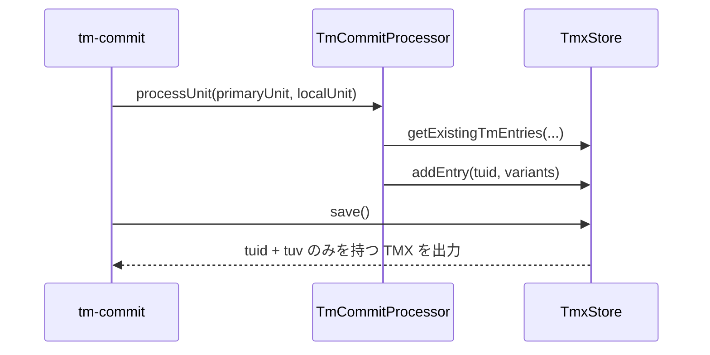

# チケット: TMX補助prop廃止

## 1. 概要と方針

TMX に埋め込んでいる x-primary / x-source-hash を廃止し、出力・保持・スキップ判定から除去する。TM の正準性は引き続き tuid と各言語 variant で維持し、必要な primary は tuid と variant から扱う。

## 2. 仕様

- translations.tmx に x-primary を出力しない
- translations.tmx に x-source-hash を出力しない
- x-source-hash ベースの再処理スキップを撤去する
- primary sentence は TMX 上の専用 prop ではなく tuid と variant から復元・保持する
- 既存 TMX の読み込みは壊さず、旧 prop が存在しても通常読込できる状態を維持する

## 3. シーケンス図

## 4. 設計

- TmxStore の prop パース/シリアライズから x-primary / x-source-hash を削除する
- sourceHash 二次インデックスと hasSourceHash() を削除する
- tm-commit の事前スキップ判定を削除し、通常の guarded upsert に一本化する
- 旧 TMX 互換として、primary は従来どおり tuid に一致する variant から復元できるよう維持する

## 5. 考慮事項

- 既存の unitPath / unitHash provenance は維持する
- x-primary 不在前提の既存テストは残しつつ、保存結果に補助 prop が出ないことを明示的に検証する
- 設計書に x-source-hash スキップ前提の記述が残らないよう更新する

## 6. 実装・テスト計画と進捗

- [x] TmxStore の prop 読込/書込から補助 prop を除去する
- [x] tm-commit の sourceHash スキップ経路を削除する
- [x] 単体テストとサンプル TMX を更新する
- [x] 関連設計書の説明を補正する
- [x] レビューを実施して完了扱いにする

## 7. 品質要件チェック

- [x] 既存 TMX 読込互換が維持されている
- [x] 保存後 TMX に x-primary / x-source-hash が出力されない
- [x] tm-commit の主要テストが成功する
- [x] 設計書の説明が実装と一致している

## 8. まとめと改善提案

TMX の補助 prop 出力を停止し、tm-commit は sourceHash 事前スキップを廃止して guarded upsert に一本化した。旧 TMX の x-primary / x-source-hash は読み込み互換を維持し、保存後の TMX とサンプルは補助 prop を含まない形へ更新した。

改善提案として、VS Code 側の型診断が変更追従に遅れるケースがあったため、必要に応じて型サーバー再起動手順を開発手順書へ追記すると調査時間を減らせる。

## 9. 参考

- src/core/tm/tmx-store.ts
- src/commands/tm/command-commit.ts
- src/commands/tm/commit-processor.ts
- src/test/core/tm/tmx-store.test.ts
- docs/design/command_tm.md