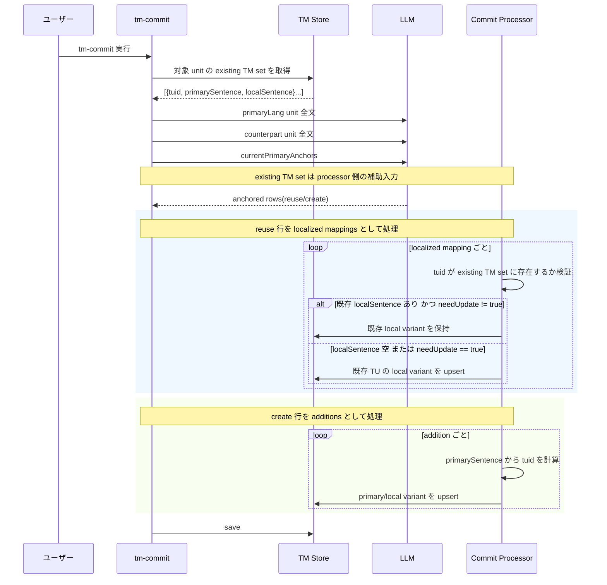

# チケット: TMコミットLLM応答分離設計更新

## 1. 概要と方針

TMコミットのLLM入出力契約を見直し、既存primary sentenceへのローカライズ展開と、新規TM追加を明示的に分離する。あわせて、既存local sentenceを含む入力セットと、必要時のみ更新を宣言できる戻り値を取り入れ、改訂時にも頑健に扱える設計へ整理する。

## 2. 仕様
- processor が扱う入力は `primaryLang` ユニット全文、counterpart言語ユニット全文、既存TMセットを基本とする
- authoritative な Prompt 入力は承認済み契約どおり `primaryLangUnit` / `counterpartUnit` / `currentPrimaryAnchors` に留め、既存TMセットは processor 側の補助情報として扱う
- 既存TMセットの各要素は `tuid / primarySentence / localSentence` を持ち、`localSentence` 未登録時は空を許容する
- authoritative な LLM出力は承認済みの anchor-aware row 群とし、processor がこれを `localizedMappings` と `additions` に後段分類する
- `localizedMappings` は既存 `tuid` に対する `localSentence` 展開として解釈し、既存local sentenceの更新が必要な場合のみ `needUpdate=true` を明示できる
- `additions` は `anchorAction=create` 行から導かれる新しい `primarySentence / localSentence` として扱う
- 後段処理はローカライズ展開系と新規追加系で責務を分離し、cleanup責務は増やさない
- authoritative な保存側契約は承認済みの `tm.alignWithPrimaryAnchors` を維持し、本チケットはその入力解釈と後段処理の整理として扱う

## 3. シーケンス図

## 4. 設計

- 旧 `anchored alignment` を置き換えるのではなく、承認済みの anchor-aware 契約に従属する。`localizedMappings` と `additions` は `anchorAction = reuse/create` の後段区分として扱い、既存TUへの展開と新規TM追加が同一処理で混線しないようにする。
- 正準入力は `primaryLangUnit`、`counterpartUnit`、`existing TM set` とする。`existing TM set` は `tuid / primarySentence / localSentence` の集合であり、改訂ケースでは既存 `localSentence` が入っていることを正規ケースとして扱う。
- `localizedMappings` は既存 TU にのみ作用する。既存 `localSentence` がある場合はそれを保持し、LLM が更新を要求する場合だけ `needUpdate=true` を付けて更新宣言させる。
- `additions` は新しい primary sentence を持つ候補だけを表し、ここでだけ新規 TU 追加を許可する。primary sentence の決定、`tuid` 計算、primary/local 両 variant の upsert はこの系統で行う。
- omission 規則を固定する。既存 `localSentence` ありの `tuid` が未返却なら no-op として保持し、既存 `localSentence` なしの `tuid` が未返却なら未解決 no-op とし、`needUpdate=true` なしで既存値と異なる `localSentence` を返した場合は無効扱いとする。
- cleanup は obsolete な旧 TU の除去責務に留め、localized mapping / addition 分離に伴う新たな cleanup 責務は追加しない。
- 原則は維持する。`primaryLang` 中心、保存と参照の分離、sentence segmentation を行うのは `tm-commit` のみ、という境界は変えない。

## 5. 考慮事項
- `TM.md` の概念設計と矛盾しないこと
- 既存TMにlocal sentenceがある改訂ケースを設計上の正規ケースとして扱うこと
- `needUpdate` は常時更新ではなく、明示的更新要求として扱うこと

## 6. 実装・テスト計画と進捗
- [x] 関連設計の影響範囲を確認
- [x] `TM.md` のLLM契約とシーケンスを更新
- [x] 必要な設計書へ要点を反映
- [x] レビュー完了

## 7. 品質要件チェック
- [x] 入出力契約が曖昧でない
- [x] ローカライズ展開と新規追加の責務が分離されている
- [x] 既存local sentenceの再利用・更新条件が明示されている
- [x] `primaryLang` 中心・保存/参照分離・tm-commitのみが segmentation を担う原則を維持している
- [x] cleanup 責務を増やしていない
- [x] 承認済みの anchor-aware 契約と競合しない位置づけに整理されている

## 8. まとめと改善提案

TMコミットの概念設計を、承認済みの anchor-aware 契約を維持したまま、既存 `tuid` への local 展開と新規TM追加を後段で明示分離する形に更新した。これにより、改訂時に既存local sentenceを正規ケースとして保持しつつ、必要時だけ明示更新できる契約になった。

残課題はレビューである。実装段階では PromptId と内部コンポーネント命名を新モデルへ揃え、localized mappings 系と additions 系の後段フローをログ・テスト観点でも独立に追跡できるようにするのが望ましい。

## 9. 参考
- [TM.md](TM.md)
- [docs/design/command_tm.md](../docs/design/command_tm.md)
- [docs/design/prompt.md](../docs/design/prompt.md)
- [docs/design/core.md](../docs/design/core.md)