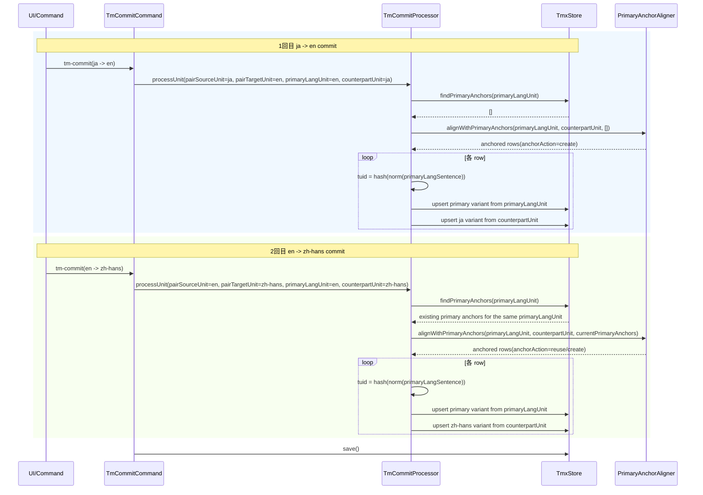

# チケット: TM多言語マージ再設計修正

## 1. 概要と方針

primaryLang 正本管理へ再設計した TM 登録について、multi-hop multilingual merge の成立条件が設計上不足していたため、同一 primary sentence が既存 TU に集約されず、pair 相対の source/target を誤って正本視する不整合が残っていた。本チケットでは tm-commit を primary anchor 再利用前提へ再構成し、primaryLangUnit を軸にした anchored alignment と variant ごとの更新規則を定義し直す。

互換性は不要とし、pair 相対の source/target はコマンド境界の補助語彙に限定する。保存側設計と prompt 契約では `primaryLangUnit` / `counterpartUnit` / `primary anchor` を正準語彙として採用する。

## 2. 仕様

### 2.1 根本原因

- 既存の tm-commit 入力契約は `source` / `target` の pair 相対情報しか持たず、保存側が「今回の正本 unit はどちらか」を明示的に受け取れない
- `SentenceAligner` は既存 primary sentence anchor を受け取らず、毎回 source/target 対称に再分割するため、`ja -> en` で確定した primary sentence 列を `en -> zh-hans` で再利用できない
- `pair source = 保存側 source` のような読み替えが残ると、primaryLang が target 側にある commit で `x-unit-path` / `x-unit-hash` を誤更新しやすい
- `x-unit-path` / `x-unit-hash` の更新規則が variant 単位で明示されておらず、どの言語の metadata をどの commit が更新してよいかが曖昧だった

### 2.2 tm-commit 入力契約

- tm-commit のコマンド境界では従来どおり trans pair の `pairSourceUnit` / `pairTargetUnit` を扱ってよい
- ただし commit processor と aligner に渡す保存側正準入力は以下へ再編する
	- `primaryLangUnit`: 今回の pair のうち `lang === primaryLang` の unit。`lang`, `content`, `unitPath`, `unitHash` を必須とする
	- `counterpartUnit`: 今回追加・更新する non-primary 側 unit。`lang`, `content`, `unitPath`, `unitHash` を必須とする
	- `currentPrimaryAnchors`: 同一 `primaryLangUnit` に属する既存 primary sentence 群。repository から取得する
- pair に `primaryLang` が含まれない commit は本設計の対象外とし、従来どおり skip または未対応扱いとする

### 2.3 primary anchor と anchored alignment

- `primary anchor` とは、同一 `primaryLangUnit` に属する既存 TU の primary `tuv.seg` である
- `anchored alignment` とは、`primaryLangUnit` と `counterpartUnit` の文対応を決めるとき、既存 `primary anchor` があればそれを優先して再利用し、不足分だけ新しい primary sentence を生成するアラインメントである
- aligner の出力は pair 相対の `source` / `target` ではなく、少なくとも以下を返す
	- `primaryLangSentence`
	- `counterpartSentence`
	- `anchorAction`: `reuse` または `create`
- `anchorAction = reuse` の行は既存 primary anchor をそのまま使い、`anchorAction = create` の行だけが新規 TU 候補になる

### 2.4 merge 規則

- TU 一意性は常に `tuid = hash(norm(primaryLangSentence))` で与える
- 同一 normalized `primaryLangSentence` が既存 TU にあれば、その TU に `counterpartUnit.lang` の variant を upsert する
- 既存 anchor にない primary sentence が今回の `primaryLangUnit` から確定した場合のみ、新規 TU を作成する
- `x-unit-path` / `x-unit-hash` は各 `tuv` ごとの metadata であり、更新規則は次に固定する
	- primary variant の `x-unit-path` / `x-unit-hash` は `primaryLangUnit` だけが更新する
	- non-primary variant の `x-unit-path` / `x-unit-hash` はその `counterpartUnit` だけが更新する
	- pair の source 側だからという理由で primary variant metadata を更新してはならない
	- primaryLang が pair target 側でも、primary variant は常に primaryLangUnit の path/hash を保持する

### 2.5 prompt 契約

- `tm.splitSentences` の拡張ではなく、別 PromptId `tm.alignWithPrimaryAnchors` を追加する方針とする
- 理由は以下のとおり
	- 既存 `tm.splitSentences` は source/target 対称の pairwise split 契約であり、primary anchor 再利用という保存側の truth source を表現できない
	- anchored alignment は必須入力として `currentPrimaryAnchors` を持ち、出力も `primaryLangSentence` 基準へ変わるため、入出力契約が本質的に別物である
	- 1 つの PromptId を条件分岐で多態化すると、カスタム prompt 利用時に merge 保証を壊しやすい
	- 互換性不要のため、責務の異なる prompt を分けて曖昧さをなくす方が保守しやすい

### 2.6 cleanup との責務境界

- cleanup は引き続き obsolete TU の削除だけを担当し、sentence segmentation や anchor 決定を行わない
- tm-commit は current primary anchors を再利用して current state を upsert するだけで、obsolete anchor の削除判断は行わない
- これにより `sync/cleanup` と tm-commit の責務境界は維持される

## 3. シーケンス図

## 4. 設計

### 4.1 用語の正規化

- `pairSourceUnit` / `pairTargetUnit`
	- trans pair 上の相対概念としてのみ使用する
	- UI 層やファイル探索では有用だが、保存側設計の正準語彙にはしない
- `primaryLangUnit`
	- 保存側で唯一の truth source となる unit
	- primary sentence 決定、primary anchor 取得、primary variant metadata 更新の基準
- `counterpartUnit`
	- 今回追加・更新したい non-primary 言語の unit
- `primary anchor`
	- repository 内にすでに存在する current `primaryLangUnit` 由来の primary sentence
- `anchored alignment`
	- current `primaryLangUnit` と `counterpartUnit` を、`primary anchor` 再利用前提で対応付ける処理

### 4.2 コンポーネント責務

- `command-commit.ts`
	- pairSource/pairTarget を取得し、`primaryLangUnit` と `counterpartUnit` を構成する
	- pair に primaryLang がない場合はここで skip できる
- `commit-processor.ts`
	- repository から `currentPrimaryAnchors` を取得し、aligner と upsert を統括する
	- pair 相対の source/target 語彙を内部 API に持ち込まない
- `sentence-aligner.ts`
	- `tm.alignWithPrimaryAnchors` を呼び出し、anchor-aware な行集合を返す
	- 既存 anchor を破壊する再分割を許さない
- `tmx-store.ts`
	- `primaryLangUnit` スコープで primary anchors を取得できる repository API を持つ
	- variant 単位の metadata 更新規則を保持する
- `types.ts`
	- `TranslationUnitInput` / `SentencePair` を primaryLang 基準の命名へ再編する

### 4.3 merge アルゴリズムの設計要点

1. commit processor は `primaryLangUnit` を必須入力として受ける
2. repository から同一 `primaryLangUnit` の existing primary anchors を取得する
3. aligner は `primaryLangUnit` の sentence を truth source とし、existing anchor があれば再利用する
4. 各 aligned row について `tuid = hash(norm(primaryLangSentence))` を計算する
5. repository は同一 `tuid` に対し、primary variant と counterpart variant をそれぞれの unit metadata で upsert する

この設計により、`ja -> en` で作成した TU に対して、`en -> zh-hans` は primary anchor を再利用しながら zh-hans variant だけを追加できる。

### 4.4 変更対象の設計反映先

- task: 本チケット
- 概念設計: [TM.md](../../TM.md)
- コマンド設計: [docs/design/command_tm.md](../../docs/design/command_tm.md)
- Core 設計: [docs/design/core.md](../../docs/design/core.md)
- Prompt 設計: [docs/design/prompt.md](../../docs/design/prompt.md)

## 5. 考慮事項

- `ja -> en -> zh-hans` の順で登録しても、同一 primary sentence は同一 TU に集約されること
- `x-unit-path` は各 `tuv` の実際の言語・ファイルに一致すること
- LLM が既存 primary sentence 群を知らないまま再分割するとマージ保証を失う点を設計に反映すること
- `tm.splitSentences` は保存側の authoritative prompt として使わず、専用 PromptId に分離すること
- `primaryLangUnit` という語へ統一し、旧称を残さないこと
- cleanup と tm-commit の責務境界を維持し、tm-commit に obsolete TU 削除を持ち込まないこと

## 6. 実装・テスト計画と進捗

- [x] 既存不具合の再現条件と根本原因を特定する
- [x] multi-hop TM commit の再設計を確定する
- [x] 関連 docs / ticket を更新する
- [x] TM 登録処理と prompt 契約を修正する
- [x] 名称 `primaryLangUnit` へ統一する
- [x] 多言語マージの回帰テストを追加する
- [x] review 指摘の schema / anchor lookup 不備を修正する
- [x] review 指摘の設定済み判定 / tm-commit validate 漏れを修正する
- [x] レビューを実施する

## 7. 品質要件チェック

- [x] 同一 primary sentence が言語追加時に重複登録されない設計規則が明示されている
- [x] 各 `tuv.x-unit-path` / `x-unit-hash` の更新規則が variant 単位で定義されている
- [x] `ja -> en -> zh-hans` の順で commit しても 1 TU に多言語が正しく集約されるシーケンスが示されている
- [x] 設計が TM.md の原則と整合している
- [x] 実装とテストが設計どおり完了している

## 8. まとめと改善提案

tm-commit の失敗原因は、primaryLang 正本設計を採用しながら、入力契約と prompt 契約が依然として pair 相対の source/target 対称モデルに留まっていたことだった。再設計では `primaryLangUnit` と `primary anchor` を導入し、anchored alignment によって既存 primary sentence を再利用する保存フローへ組み替えた。

改善提案:

- 実装では `SentencePair` 系の命名を pair 相対語彙から primaryLang 基準語彙へ変更し、境界を型で強制する
- テストでは `ja -> en -> zh-hans` の順序依存回帰と、`x-unit-path` / `x-unit-hash` の言語別更新を別ケースで固定する

## 9. 参考

- [260315_TM正本管理と参照方式再設計.md](260315_TM正本管理と参照方式再設計.md)
- [TM.md](../../TM.md)
- [docs/design/command_tm.md](../../docs/design/command_tm.md)
- [docs/design/core.md](../../docs/design/core.md)
- [docs/design/prompt.md](../../docs/design/prompt.md)