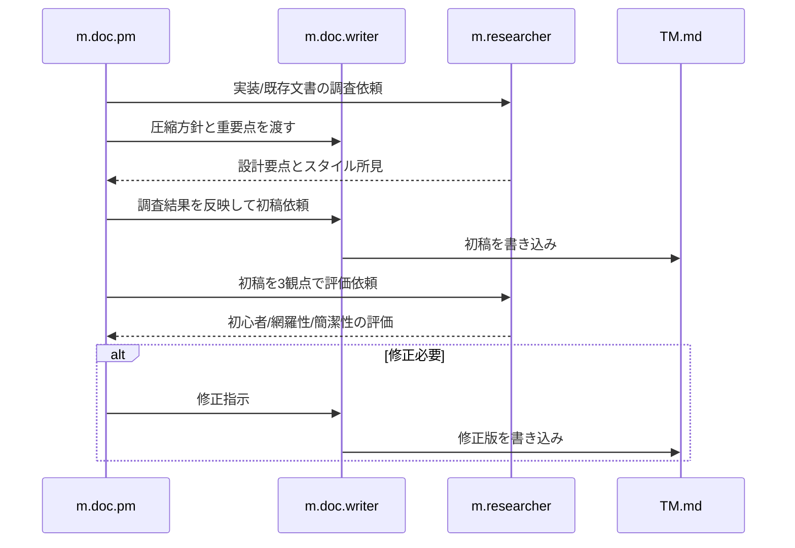

# チケット: TM概念設計メモ圧縮

## 1. 概要と方針

トップレベルのTM概念設計メモを、思想とガードレールを損なわずに短く再構成する。
保存側と参照側の境界、primaryLang中心設計、sync/cleanup/tm-commitの責務分離を核として残し、TM登録のシーケンス図は情報量を落とさず明確化する。

## 2. 仕様

- 対象は [TM.md](TM.md)
- 文量は現状より明確に圧縮する
- 次の本質は必ず保持する
  - `primaryLang` 基準
  - `tuid = hash(norm(primary_sentence))`
  - 保存側と参照側の分離
  - `tm-commit` のみが sentence segmentation を担う
  - `sync` は unit レベル責務に留まる
  - cleanup は候補抽出 + 実文照合の二段階
  - 参照側は exact lookup ではなく example retrieval
- TM登録シーケンス図は今回の重要項目として、既存TM再利用と新規追加の分離、保持条件、upsert条件が伝わること

## 3. シーケンス図

## 4. 設計

- 文書構造は「要約 → 原則 → 保存側 → `tm-commit` → `sync`/cleanup → 参照側 → 禁止事項 → シーケンス図」を基本とする
- 背景説明は重複を除き、箇条書き中心に圧縮する
- シーケンス図は `existing TM set`、`localized mappings`、`additions`、保持/no-op/更新条件を視認できる粒度にする

## 5. 考慮事項

- 詳細設計ではなくガードレール文書であることを維持する
- 新しい概念を増やさず、既存概念を整理して短くする
- シーケンス図の説明本文との二重記述を避ける
- 初稿200行以内、最終稿250行以内を目安とする

## 6. 実装・テスト計画と進捗

- [x] 作業チケット作成
- [x] フェーズ1: 実装コード調査（search_subagent）
- [x] フェーズ1: 既存ドキュメント調査（m.researcher）
- [x] フェーズ2: 初稿執筆（m.doc.writer）
- [x] フェーズ3: 3観点評価（m.researcher）
- [x] フェーズ4: 修正ループ（初心者観点の不足に対し、最小用語集と短い具体例を追加）
- [x] フェーズ5: 完了報告

## 7. 品質要件チェック

- [x] 冒頭で文書の役割と一文要約が分かる
- [x] 主要原則が短い箇条書きで把握できる
- [x] `tm-commit` の責務と非責務が分離されている
- [x] `sync`/cleanup/参照側の境界が明確である
- [x] TM登録シーケンス図が詳細かつ読みやすい

## 8. まとめと改善提案

- [TM.md](TM.md) を約182行まで圧縮し、重複説明を削減した
- TM登録シーケンス図を中心に keep / update / no-op / 未解決 / create / merge の分岐が読める構成へ整理した
- 初心者観点では最小用語集と改訂例が有効だった。今後の概念メモでも、圧縮時は短い用語集と1ケースの具体例を先に確保すると収束が早い

## 9. 参考

- [TM.md](TM.md)
- [tasks/260308_command-docs-style-improvement.md](tasks/260308_command-docs-style-improvement.md)