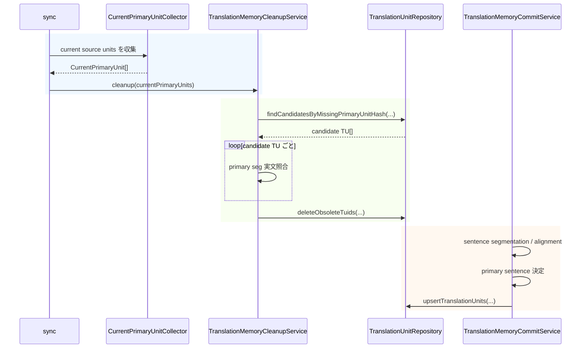
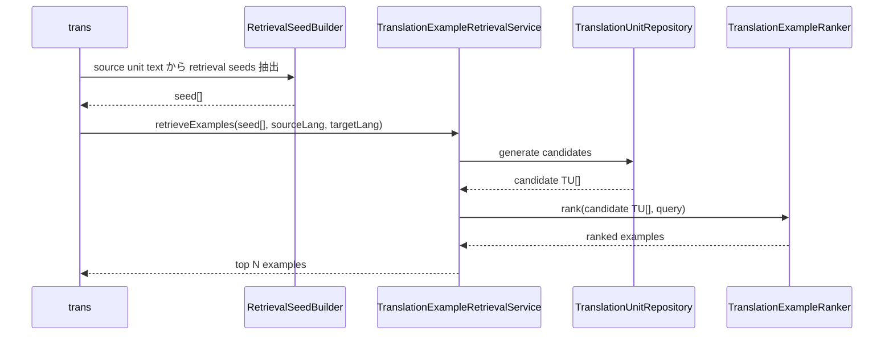

# チケット: TM正本管理と参照方式再設計

## 1. 概要と方針

TM を source sentence hash ベースの exact lookup 中心設計から見直し、primaryLang の sentence を正本として厳密に管理する構造へ再設計する。保存側・cleanup・参照側の責務を明確に分離し、互換性レイヤや段階移行アダプタは設けずに現行設計を置き換える。

本設計では TM.md の原則をそのまま拘束条件として採用する。特に以下を固定事項とする。

- primaryLang は top-level の基盤設定であり、用語集ローカル設定ではない
- 保存基準は primary sentence であり、`tuid = hash(norm(primary_sentence))` を唯一の保存キーとする
- sentence segmentation を行うのは `tm-commit` のみとし、`sync` は unit レベル責務に留める
- cleanup は `unit-hash 候補抽出 -> primary seg 実文照合` の二段階判定で obsolete TU を削除する
- 参照側は lookup ではなく translation example retrieval として再設計し、candidate generation と ranking を分離する

## 2. 仕様

### 2.1 基本仕様

- TM の正本は primary sentence 単位で保持する
- TU の一意性は `tuid = hash(norm(primary_sentence))` で与える
- TMX 全体の `srclang` は `primaryLang` とする
- 各 TU は primary の `tuv` を必須とし、primary を持たない TU は無効とする
- 各 `tuv` には少なくとも `seg`, `x-unit-path`, `x-unit-hash` を持たせる
- primary だけ特別なデータ構造は持たず、primary 性は `srclang=primaryLang` と primary `tuv` の存在で表現する

### 2.2 保存側仕様

- `tm-commit` のみが sentence segmentation / alignment / primary sentence 決定を行う
- 新規 TU を作成できるのは primary sentence を確定できたときだけとする
- non-primary 側だけを根拠に新規 TU を作成しない
- 同一 `tuid` が存在する場合は TU を更新し、存在しない場合のみ新規作成する
- `sourceHash` や source sentence hash を主キーや登録済み判定の基準に使わない

### 2.3 sync / cleanup 仕様

- `sync` は unit レベルの current state を構築するのみで、sentence の分解や sentence 集合比較は行わない
- cleanup は `sync` が渡す current primary units を入力として動作する
- cleanup Phase 1 は primary `tuv` の `x-unit-hash` を使って削除候補 TU を抽出する
- cleanup Phase 2 は候補 TU の primary `seg` が current primary 原稿群に実在するかを実文照合し、現存しないものだけを削除する
- changed unit は削除候補抽出のトリガにはなっても、一括削除・一括再作成の根拠にはしない

### 2.4 参照側仕様

- trans で使用する TM 参照は translation example retrieval とする
- retrieval は candidate generation と ranking の二段階で構成する
- 参照入口は `sourceLang` 起点とし、保存主キー `tuid` への直接 exact lookup に依存しない
- 初期 ranking は軽量ルールベースとし、完全一致、文字列類似度、長さの近さを最低限の評価軸とする
- trans 側では authoritative な sentence segmentation を行わず、retrieval seed 抽出だけを行う

### 2.5 設定仕様

- `primaryLang` は `mdait.json` の top-level へ移動する
- `terms.primaryLang` は廃止し、terms / trans / tm から共通利用する
- `primaryLang` は `transPairs` に含まれるいずれかの言語でなければならない
- 互換性考慮は不要のため、旧設定のフォールバックや移行補助は設けない

## 3. シーケンス図

### 3.1 sync -> cleanup -> tm-commit の責務分離



### 3.2 trans の retrieval フロー



## 4. 設計

### 4.1 変更対象ファイルの具体一覧

今回の再設計で実装対象になる主要ファイルは以下とする。詳細設計段階では、責務変更と改名方針までを確定する。

- 設定
    - `src/config/configuration.ts`
    - `schemas/mdait-config.schema.json`
    - `mdait.template.json`
- 保存側 / TM core
    - `src/core/tm/types.ts`
    - `src/core/tm/tmx-store.ts`
    - `src/core/tm/tm-text-normalizer.ts`
    - `src/core/tm/sentence-splitter.ts`
    - `src/core/tm/tm-reference-formatter.ts`
- コマンド層
    - `src/commands/tm/command-commit.ts`
    - `src/commands/tm/commit-processor.ts`
    - `src/commands/tm/sentence-aligner.ts`
    - `src/commands/trans/trans-command.ts`
    - `src/commands/trans/translator.ts`
    - `src/commands/sync/sync-command.ts`
- primaryLang 参照箇所
    - `src/commands/term/**`
    - `src/commands/trans-selection/**`
- テスト
    - `src/test/core/tm/**`
    - `src/test/commands/tm/**`
    - `src/test/commands/trans/**`
    - `src/test/commands/sync/**`
    - `src/test/workspace/mdait.json`

### 4.2 設定モデル再設計

`primaryLang` は top-level 基盤設定として `mdait.json` 直下へ配置する。これにより、TM 正本判定、terms の contextLang 決定、trans の補助文脈で同一概念を共有する。

想定設定形:

```json
{
    "primaryLang": "en",
    "transPairs": [
        {
            "sourceDir": "docs/ja",
            "targetDir": "docs/en",
            "sourceLang": "ja",
            "targetLang": "en"
        }
    ],
    "terms": {
        "filename": "terms.csv"
    },
    "tm": {
        "enabled": true,
        "maxReferences": 5
    }
}
```

設計方針:

- `Configuration` は `getPrimaryLang()` を提供し、`getTermsPrimaryLang()` は廃止する
- validation で `primaryLang` 必須チェックと `transPairs` 含有チェックを行う
- terms / trans / tm は共通して top-level `primaryLang` を参照する
- 互換性層を作らないため、`terms.primaryLang` の読み替えはしない

### 4.3 保存側モデルと主要クラス / 関数の再編方針

現行の `TmxStore` / `TmEntry` / `TmMatch` は source sentence hash exact lookup 中心の命名と責務になっているため、保存側と参照側で分離して再編する。

#### 保存側モデル

- `TmEntry` 相当は `TranslationUnitRecord` へ再編する
- 主キーは `sentenceHash` ではなく `tuid` とする
- 各言語データは `segments: Map<lang, TranslationUnitVariant>` 相当に変更し、variant ごとに `seg`, `unitPath`, `unitHash` を保持する
- 既存の `sourceHash` 単一保持は廃止する

保存側 repository の責務:

- TMX load / save
- `tuid` 主キーでの upsert / delete
- primary `tuv` metadata による cleanup candidate 抽出
- retrieval 用二次インデックスの構築元データ提供

再編方針:

- `src/core/tm/tmx-store.ts` は保存中心の repository へ責務を寄せる
- retrieval ロジックは repository から分離する
- `tm-reference-formatter.ts` は retrieval 結果専用 formatter に寄せる
- `sentence-splitter.ts` は authoritative segmentation ではなく retrieval seed 抽出用途へ責務を縮小し、命名も追従させる

#### `tm-commit` 再編

- `TmCommitProcessor` は `TranslationMemoryCommitService` 相当の責務へ変更する
- `registerPairs()` は `upsertAlignedTranslationUnits()` 相当へ再設計する
- `SentenceAligner` は alignment 結果に対して primary sentence 決定可能な情報を返す契約へ変える
- `command-commit.ts` の登録済みスキップは `sourceHash` 依存をやめ、unit 単位の事前スキップを廃止する

### 4.4 cleanup のデータフロー

cleanup は `sync` 後に呼ばれる unit レベル後処理として設計する。`sync` 自身は sentence を知らないまま、cleanup に必要な current primary units を渡す。

#### 入力データ

- `CurrentPrimaryUnit[]`
- 各要素は少なくとも `unitPath`, `unitHash`, `content` を持つ
- `content` は source 文書の unit 本文そのものとし、cleanup 側で `stripMarkdown` + normalize を適用する

#### Phase 1: 候補抽出

- current primary units から `currentUnitHashSet` を作る
- repository は primary `tuv.x-unit-hash` を参照して、`currentUnitHashSet` に存在しない TU を候補として返す
- この段階では delete しない

#### Phase 2: primary seg 実文照合

- cleanup 側で current primary units の本文を normalize 済み文字列へ変換する
- candidate TU の primary `seg` を normalize し、current primary corpus のいずれかに完全包含されるかを判定する
- 現存するものは keep、現存しないものだけ delete 対象にする

この設計により、changed unit で `x-unit-hash` が変化しても、primary sentence 自体が残っている TU は誤削除しない。

### 4.5 retrieval の最小ルールベース ranking 方針

retrieval は `candidate generation` と `ranking` を分離する。

#### candidate generation

- 入力は source unit text, `sourceLang`, `targetLang`
- trans 側は unit text から retrieval seeds を抽出する
- whole unit normalized text を必須 seed とし、必要に応じて近似 seed を追加する
- repository は以下で candidate を集める
    - `sourceLang` の normalized 完全一致 index
    - `sourceLang` の token / n-gram index による近似候補
- `targetLang` を持たない TU は候補から除外する

#### ranking

初期実装は軽量ルールベースとし、スコア軸は以下に限定する。

- normalized 完全一致: 最優先
- 文字列類似度: secondary
- 長さの近さ: tertiary

スコアリング方針:

- 完全一致がある場合は最上位固定
- 近似候補は文字列類似度と長さ近接度の合算で順位付け
- 同一 TU 由来の重複候補は `tuid` で集約する
- 最終的に `tm.maxReferences` 件へ切り詰める

初期設計で扱わないもの:

- 埋め込みベクトル検索
- 意味類似度モデル
- recency / usage count / domain score

### 4.6 コマンド責務の再定義

#### sync

- unit 対応付け
- need 判定
- current primary units の収集
- cleanup 呼び出しの起点

#### cleanup

- obsolete TU の候補抽出
- primary seg 実文照合
- repository delete

#### tm-commit

- sentence segmentation
- alignment
- primary sentence 決定
- `tuid` 算出
- TU upsert

#### trans

- retrieval seed 抽出
- translation example retrieval
- prompt 向け整形

### 4.7 primaryLang 再配置の影響範囲

影響は TM に閉じない。少なくとも以下を更新対象とする。

- 設定ロード / schema / template
- term 系の `contextLang` 決定
- trans / trans-selection の `contextLang` 決定
- docs 上の設定例と説明文

影響の明確化:

- `primaryLang` は「TM の正本言語」であると同時に「mdait 全体で基準にする言語」である
- `sourceLang` はジョブ単位、`primaryLang` はワークスペース単位の基盤概念として分離する
- `terms.primaryLang` 前提の文言はすべて top-level `primaryLang` 前提へ置換する

## 5. 考慮事項

- 互換性レイヤや段階的移行用アダプタは設けない
- changed unit を一括削除・一括再作成の根拠にしない
- non-primary 側だけで新規 TU を作らない
- `sync` に sentence segmentation を持ち込まない
- exact lookup 中心の参照設計を残さない
- repository に ranking ロジックを混在させない
- cleanup の最終判定を unit-hash にしない
- `primaryLang` と `sourceLang` を同義として扱わない

現時点の未解決論点は 1 点に留める。

- `primaryLang` を含まない trans pair に対して `tm-commit` を初期実装で許可するか。原則上は non-primary だけで新規 TU を作れないため、初期実装では `primaryLang` を含む pair の commit のみ正式対応とする案を第一候補とする

## 6. 実装・テスト計画と進捗

- [x] 既存 TM 実装と関連設計の調査
- [x] 詳細設計と docs 反映
- [x] `primaryLang` を top-level へ再配置し、設定 API と schema を更新
- [x] 保存側データモデルを `primary sentence -> tuid` 基準へ再編
- [x] `tm-commit` を primary-centered commit service へ再編
- [x] cleanup サービスを実装し、`sync` から current primary units を受け取るようにする
- [x] retrieval を lookup から candidate generation + ranking 方式へ再編
- [x] term / trans-selection / trans の primaryLang 参照を top-level へ統一
- [x] テストを保存側 / cleanup / retrieval / config migration なし前提で更新
- [x] 実装レビュー

### 実装順序

1. 設定面を先に固定する
2. 保存側データモデルと repository を先に作る
3. cleanup を保存側 API に合わせて実装する
4. `tm-commit` を保存側 API に接続する
5. retrieval を別サービスとして追加する
6. trans / term / trans-selection の参照点を差し替える
7. テストと docs を最終同期する

### テスト観点

- config
    - top-level `primaryLang` が必須であること
    - `primaryLang` が `transPairs` に含まれない場合は validation error になること
- repository / save
    - 同一 primary sentence が同一 `tuid` に集約されること
    - non-primary だけでは新規 TU が作成されないこと
    - TMX round-trip で primary `tuv` と metadata が保持されること
- cleanup
    - `x-unit-hash` 不一致だけでは削除されないこと
    - primary `seg` が current corpus に現存しない場合のみ削除されること
    - changed unit 内の残存 sentence が keep されること
- retrieval
    - 完全一致が最上位になること
    - 完全一致がなくても近似例が返ること
    - `targetLang` を持たない候補が除外されること
- command 責務
    - `sync` が sentence segmentation を呼ばないこと
    - `tm-commit` のみが segmentation を行うこと
    - trans が retrieval 結果をプロンプト整形へ渡すこと

## 7. 品質要件チェック

- [x] 詳細設計が TM.md の原則に反しない
- [x] source hash 主キー依存を除去する設計になっている
- [x] cleanup が二段階判定になっている
- [x] retrieval が candidate generation と ranking を分離している
- [x] `primaryLang` を top-level 基盤設定として扱う設計になっている
- [x] 変更対象ファイル、実装順序、テスト観点が明示されている
- [x] 実装とテストが設計どおり完了している

## 8. まとめと改善提案

TM を「正本管理」と「翻訳例参照」の二層へ分離し、保存側 API と retrieval API を分けて導入した。`sync -> cleanup -> tm-commit` の責務境界を維持したまま、`primaryLang` top-level 化、TU 正本管理、cleanup 二段階判定、retrieval ranking、関連テスト更新まで完了した。

改善提案:

- `tm-commit` の正式対応範囲を `primaryLang` を含む pair に限定しているため、non-primary pair の扱いは別タスクとして明示的に設計する
- retrieval の初期実装は軽量ルールベースに限定したため、将来の改善は ranking 高度化を独立タスクで進める

レビュー結果:

- [tasks/done/260315.review.TM正本管理と参照方式再設計.md](260315.review.TM正本管理と参照方式再設計.md) にて ✅承認

## 9. 参考

- [TM.md](../../TM.md)
- [tasks/wishlist.md](../wishlist.md)
- [tasks/done/260315.review.TM正本管理と参照方式再設計.md](260315.review.TM正本管理と参照方式再設計.md)
- [docs/design/command_tm.md](../../docs/design/command_tm.md)
- [docs/design/command_sync.md](../../docs/design/command_sync.md)
- [docs/design/command_trans.md](../../docs/design/command_trans.md)
- [docs/design/config.md](../../docs/design/config.md)