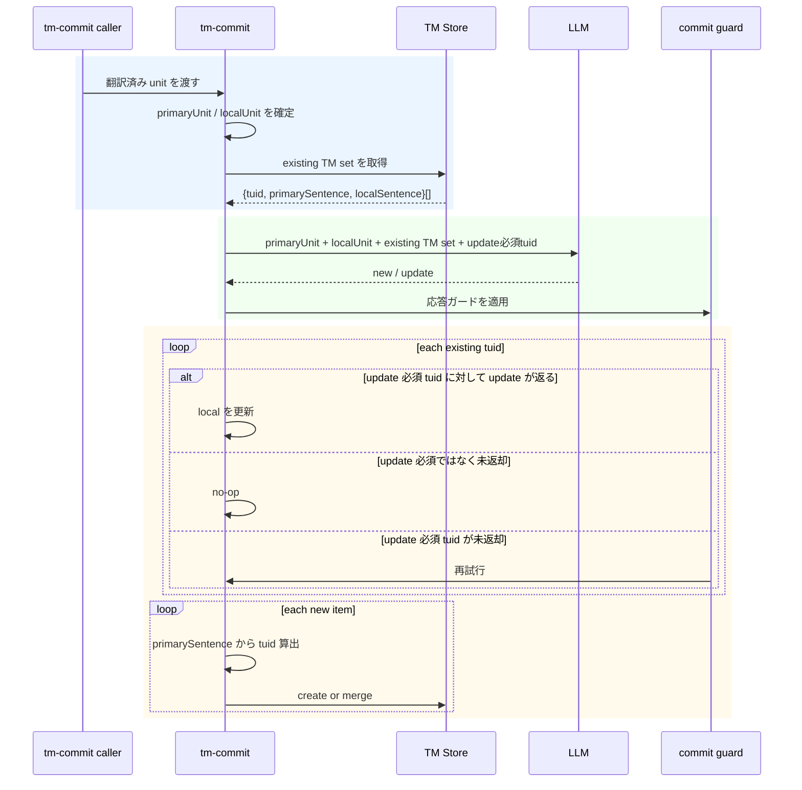

# チケット: TM登録primary基準化

## 1. 概要と方針

TM登録を sourceLang 起点の保存から primaryLang 起点の保存へ再設計する。TM.md の 4 章と 5 章に合わせ、tm-commit では primary sentence を正準キーとして既存TU更新と新規追加を分離し、LLM応答の欠落を fail-open で吸収しない。

## 2. 仕様
- TM登録の正準言語は primaryLang とする
- 1 TU = 1 primary sentence として扱う
- tuid は hash(norm(primary sentence)) を使用する
- tm-commit は primaryUnit / localUnit / existing TM set / update必須tuid をLLMへ渡す
- LLM出力は type=new|update, tuid, primary, local の配列とする
- existing TM set 上で update 必須の tuid が欠落した場合はガード違反として再試行する
- 追加候補は primary sentence から tuid を計算して upsert する
- non-primary側の情報だけを根拠に新規TUを作成しない

## 3. シーケンス図

## 4. 設計

### 4.1 設計の中心線

- tm-commit の正準軸は sourceLang / targetLang ではなく primaryLang / localLang とする。
- 1 TU = 1 primary sentence を維持し、TU 識別子は `tuid = hash(norm(primary sentence))` に統一する。
- `x-source-hash` によるユニットスキップは再処理最適化として維持するが、TU 同一性の判定には使わない。
- TM 登録は `primary sentence の確定`、`既存 TU への local 更新`、`新規 TU 追加` を分離して扱い、non-primary 側の情報だけで新規 TU を作らない。

### 4.2 primaryUnit / localUnit 解決戦略

- command 境界では、処理対象ユニットから `primaryUnit` と `localUnit` を必ず確定してから processor へ渡す。
- 対象ペアのいずれかが `primaryLang` なら、そのユニットを `primaryUnit`、反対側を `localUnit` とする。
- 対象ペアが非 primary 同士でも、TM 登録対象の `localUnit` は現在コミットするファイル側の言語とし、`primaryUnit` は `marker.from` と status tree を辿って `primaryLang` の祖先ユニットへ解決する。
- 追跡は「現在ユニット -> from 参照先ユニット -> さらに from を持つ場合は継続」の単方向チェーンで行い、最初に `primaryLang` へ到達したユニットを正とする。
- source 側と target 側の両方から primary 解決できる場合は、`unitPath` と `unitHash` が一致することを確認する。不一致なら lineage 破損として当該ユニットを警告付きスキップとする。
- `primaryUnit` を解決できない場合は local-only 推定へフォールバックせず、当該ユニットを警告付きスキップとする。primary 基準を崩しての登録は許容しない。

### 4.3 TU モデルと既存 TM set

- `TmxStore` の正準インデックスは `Map<tuid, TmEntry>` とし、`TmEntry` は primary 文面を必須、各言語の variant を任意で保持する。
- variant には少なくとも `text`、`unitPath`、`unitHash` を保持し、cleanup 後の anchor reuse と「今回の localUnit が既に反映済みか」の判定に使う。
- `existing TM set` は「現在の `primaryUnit` にアンカーされ、今回の `localLang` に関係する TU 群」とし、LLM には次の形で渡す。
  - `tuid`
  - `primarySentence`
  - `localSentence`（未 localize の場合は `null`）
- `update必須tuid` は `existing TM set` の部分集合であり、次のいずれかを満たす TU から導出する。
  - 当該 `localLang` の variant が存在しない
  - 当該 `localLang` の variant は存在するが `unitHash !== localUnit.unitHash` で、現在の local 文面がまだ反映されていない
- `existing TM set` 取得は current `unitHash` 完全一致に限定せず、同一 `primaryUnit` に属して cleanup 後も存続した TU を拾える API にする。改訂直後最初の tm-commit でも anchor reuse を失わないことを優先する。

### 4.4 LLM 入出力契約

- `SentenceAligner` は source/target の 1:1 文ペア生成器ではなく、`primaryUnit` と `localUnit` を入力に `new|update` の登録計画を返すコンポーネントとして再定義する。
- 1 回目の LLM 入力は以下とする。
  - `primaryLang`
  - `localLang`
  - `primaryUnit`
  - `localUnit`
  - `existing TM set`
  - `update必須tuid`
- 1 回目の LLM 出力は配列で、各要素は `type`, `tuid`, `primary`, `local` を持つ。
  - `type = update`: `tuid` は入力済みの既存 TU を必ず指す
  - `type = new`: `tuid` は `"-"` とし、commit 側で `primary` から正準 tuid を計算する
- `primary` は `stripMarkdown(primaryUnit)` の厳密な部分集合、`local` は `stripMarkdown(localUnit)` の厳密な部分集合でなければならない。
- `primary` / `local` は単一文であり、改行を含まず、`SentenceSplitter` 相当の検査で 2 文以上に分割されないことを guard で確認する。

### 4.5 ガード、再試行、継続条件

- ガードは JSON スキーマ検証の後に、以下の意味検証を行う。
  - `update必須tuid` の欠落がない
  - `update` の `tuid` が `existing TM set` 外を指していない
  - `primary` / `local` の subset 違反がない
  - 文粒度違反がない
- `update必須tuid` のうち欠落または違反で無効化されたものは、未充足集合として再試行対象に回す。
- 再試行では、初回応答から guard を通過した `new` / `update` は保持し、未充足 `tuid` だけを対象に `local` 補完を要求する。再試行の目的は全体再生成ではなく欠落補完である。
- 再試行でも `subset` または文粒度違反を繰り返す `tuid` は、上限到達後に warning として記録し、その `tuid` の update だけを no-op に落とす。tm-commit 全体は継続する。
- fail-closed の意味は「guard 未通過の項目を保存しない」であり、「1 件の失敗でファイル全体を abort する」ではない。保存は guard 通過済みの項目だけに限定する。

### 4.6 Upsert 方針

- `type = new` は `primary` から tuid を再計算し、同一 tuid が既に存在した場合は duplicate ではなく merge として扱う。
- `type = update` は既存 TU の `localLang` variant を追加または更新する。primary 側 variant は commit 時点の `primaryUnit` 情報で provenance を更新するが、primary 文面自体は tuid と一致するものだけを許可する。
- `new` / `update` のいずれでも、primary を持たない TU は生成しない。
- 保存粒度は引き続きファイル単位の tm-commit 完了時でよいが、警告付き no-op があっても guard 通過分は保存対象に含める。

### 4.7 ログと可観測性

- warning ログには `unitPath`、`localLang`、`tuid`、違反理由、試行回数を必ず含める。
- 集計結果には `new / updated / skipped / warned / errored` を分け、`warned` は「tm-commit 自体は継続したが一部 tuid を更新できなかった件数」として扱う。
- `primaryUnit` 解決失敗、lineage 不一致、guard 上限到達は user-facing summary でも件数を可視化し、silent skip を残さない。

## 5. 考慮事項
- 非 primary 言語からの TM 登録でも `primaryUnit` 解決に失敗したら登録しない。primary 基準を守ることを優先し、local-only 新規作成は許容しない。
- `existing TM set` の `localSentence = null` は「既存 TU はあるが今回の localLang が未登録」を意味する。空文字列との混同を避けるため null を採用する。
- `subset 違反` は raw Markdown ではなく `stripMarkdown` 後の比較で判定する。LLM 入力と guard の前提を一致させるためである。
- `文粒度違反` は改行有無だけでなく `SentenceSplitter` 相当の判定で 2 文以上を検出する。見かけ上 1 行でも複数文を拒否する。
- `sourceHash` はユニットスキップ用の最適化であり、tuid や variant の provenance と役割を混同しない。
- TMX の旧 `sentenceHash` 主体データとの互換レイヤは本設計では主目標にしない。必要なら再生成または別タスクでの移行を扱う。
- cleanup / retrieval の責務は維持し、今回の変更で触るのは tm-commit が必要とする query API と provenance 更新までに留める。
- retry 後も欠落が解消しない `update必須tuid` は warning で止め、ファイル全体失敗へ昇格させない。編集継続性を優先する。
- `primaryLang` 未設定や transPair 不整合は tm-commit 開始前に validation error とし、silent skip を残さない。

## 6. 実装・テスト計画と進捗
- [x] 設計方針と変更対象の確定
- [x] [src/commands/tm/command-commit.ts](src/commands/tm/command-commit.ts) に `primaryUnit` 解決ヘルパーと validation 失敗時の停止導線を追加する
- [x] [src/commands/tm/commit-processor.ts](src/commands/tm/commit-processor.ts) を「existing TM set 構築 -> update必須tuid 導出 -> guard/retry -> mutation 適用」のオーケストレータへ再編する
- [x] [src/commands/tm/sentence-aligner.ts](src/commands/tm/sentence-aligner.ts) と [src/prompts/defaults.ts](src/prompts/defaults.ts) の契約を `type/new/update/tuid/primary/local` ベースへ更新する
- [x] [src/core/tm/types.ts](src/core/tm/types.ts) の TM 型を `tuid + primary + variants + provenance` 前提へ整理する
- [x] [src/core/tm/tmx-store.ts](src/core/tm/tmx-store.ts) に primary anchor lookup、existing TM set 取得、variant provenance 更新、warning/no-op 前提の upsert API を追加する
- [x] update必須欠落・subset違反・文粒度違反を返す guard ヘルパーを tm-commit 内部へ追加し、retry 入力を欠落 tuid 補完専用に絞る
- [x] ログ集計を `warned` 含みへ更新し、silent skip を warning / error / skipped のいずれかへ明示分類する
- [x] 単体テストを `command-commit`, `commit-processor`, `sentence-aligner`, `tmx-store` の各層で追加する
  - [x] 非 primary pair から `primaryUnit` を遡及解決できる
  - [x] cleanup 後の改訂初回 commit でも existing TM set を再利用できる
  - [x] `update必須tuid` 欠落時に retry が欠落補完だけへ絞られる
  - [x] subset 違反 / 文粒度違反が保存されない
  - [x] retry 上限到達後も guard 通過分だけ保存され、未解決 tuid は warning になる
- [x] レビュー完了

## 7. 品質要件チェック
- [x] primaryLang を軸に多言語 TM 登録できる
- [x] update必須欠落時に fail-closed で再試行される
- [x] 既存 TM 検索への回帰がない
- [x] 関連テストが成功する
- [x] レビュー承認と再発防止テストが揃っている

## 8. まとめと改善提案

- primary sentence を唯一の正準キーにし、TM 登録を pair 相対の source/target 思考から切り離す。
- tm-commit の LLM は「文アライメント」ではなく「既存 TU 更新と新規 TU 追加の計画生成」として扱う。
- fail-closed は項目単位で適用し、warning 付き継続を許すことで品質と運用継続性の両立を狙う。
- existing TM set は file 単位の部分一致ではなく sentence 単位の anchor 判定で扱うべきで、同一ファイル再利用と別ユニット混入防止の両立には provenance と文粒度の両方が要る。
- 最終確認では TM 関連テスト 31 件成功と `npx tsc --noEmit` 成功を基準にし、review 指摘を回帰テストへ落とし込んだ。

## 9. 参考
- TM設計メモ: TM.md
- 関連レビュー: tasks/260315.review.TM多言語マージ再設計修正.md
- 関連レビュー: tasks/260315.review.TM多言語マージ再設計修正_再レビュー.md
- 関連レビュー: tasks/260315.review.TM登録リトライ戦略追記.md