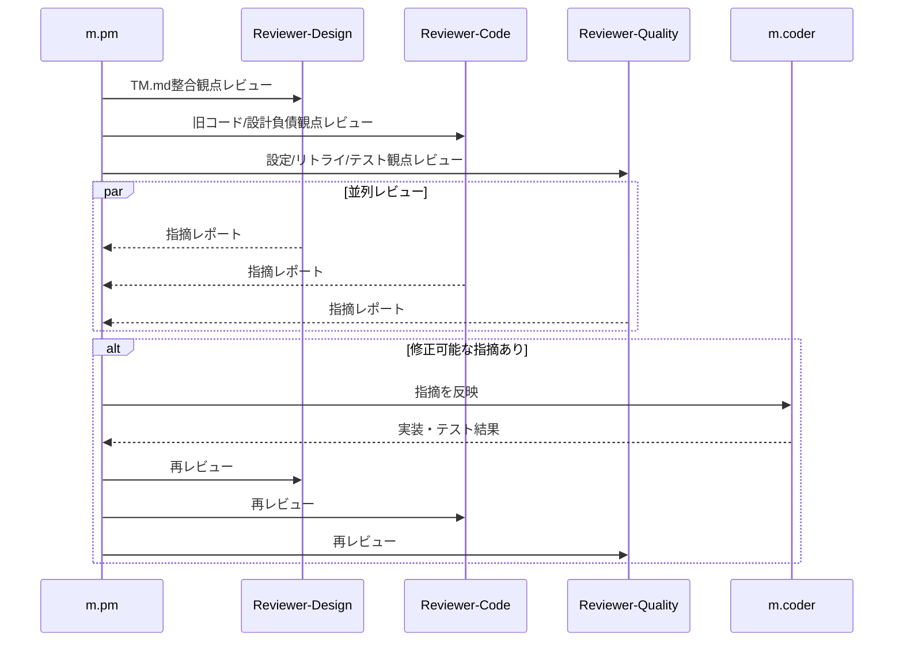

# チケット: TM登録primary総合レビュー修正

## 1. 概要と方針

未コミットの TM 登録 primary 基準化差分を対象に、TM.md の設計思想整合、不要な旧実装残存、局所リファクタ余地、TM 要件未充足を総合レビューする。大きな設計変更は今回は実施せず、軽微から中規模の修正をレビュー指摘ベースで実装し、3観点レビューが揃って承認相当になるまで反復する。

## 2. 仕様

- レビュー対象は未コミット差分一式とする
- レビュー観点は少なくとも 3 つに分離し、並列に評価する
- 観点には以下を含める
  - TM.md との設計整合性と要件充足
  - 不要な旧コード残存、責務過多、局所的なリファクタ余地
  - 設定・リトライ・テスト・警告導線を含む実装の堅牢性
- 重大な設計変更が必要な論点は今回の修正対象外として別途報告する
- 軽微から中規模の不備は coder に修正依頼し、再レビューする

## 3. シーケンス図

## 4. 設計

- PM が差分とレビュー観点を整理し、3 本の独立レビューへ委譲する
- レビュアーにはコード変更禁止、必要なら docs 更新のみ可の前提で依頼する
- 指摘は「今回直すもの」と「今回は報告のみ」の 2 系統に PM が振り分ける
- 修正実装は coder に限定して依頼する

## 5. 考慮事項

- TM 登録以外の cleanup / retrieval 未実装は許容だが、tm-commit 側がそこへ責務侵食していないかを確認する
- config 追加が必要な retry 定義は重点確認対象に含める
- 既存差分を不用意に巻き戻さない

## 6. 実装・テスト計画と進捗

- [x] レビュー対象差分の確認
- [x] ガイドライン確認
- [x] レビュー用チケット作成
- [x] 3観点レビュー実施
- [x] 修正要否の仕分け
- [x] coder による修正
- [x] 再レビュー完了
- [x] 完了報告

## 7. 品質要件チェック

- [x] TM.md と矛盾する実装が残っていない
- [x] retry / warning / config の導線が妥当
- [x] 不要な旧コード・互換コードの残存が最小化されている
- [x] テストで今回の重要論点をカバーしている

## 8. まとめと改善提案

総合レビュー指摘に対し、設計を広げない範囲で局所修正を実施した。主な修正は tm-commit retry の設定導線分離、sourceHash skip の順序見直し、existing TM set / required update 判定の精度改善、SentenceAligner 応答の fail-closed 化、未使用旧互換 API / 型の整理、duplicate new 応答時の件数安定化である。

今回の修正では、TM 関連テストに加えて trans 側の TM 検索回帰も実行し、関連 38 件成功と追加の commit-processor 単体 6 件成功を確認した。3観点レビューは最終的にすべて承認となり、未解消の重要指摘・推奨指摘は残っていない。

## 9. 参考

- [TM.md](../TM.md)
- [tasks/done/260315_TM登録primary基準化.md](done/260315_TM登録primary基準化.md)