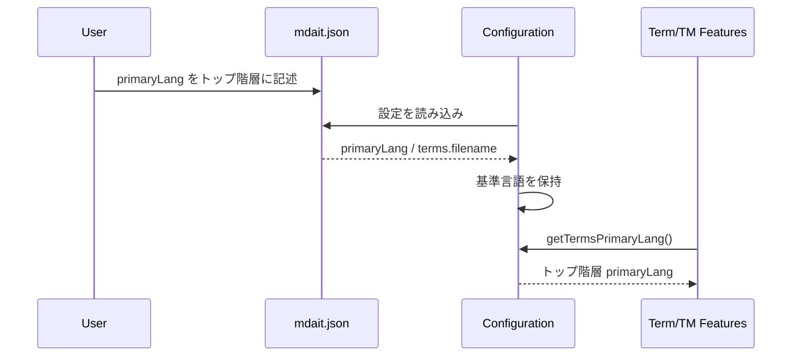

# チケット: primaryLangトップ階層移設

## 1. 概要と方針

`mdait.json` の `terms.primaryLang` をトップ階層の `primaryLang` へ移設する。
今回は TM 機能拡張の前提整備として設定配置だけを正し、既存の利用箇所は最小変更で新配置を読むように揃える。

## 2. 仕様

- 設定ファイルの基準言語は `primaryLang` をトップ階層で受け付ける
- `terms` 配下には `filename` のみを残す
- runtime では移行期間のため、top-level `primaryLang` が未設定の場合のみ旧 `terms.primaryLang` を互換読込する
- 設定読み込み・スキーマ・テンプレート・テスト用設定・設計ドキュメントを新配置へ同期する
- 既存の内部 API 名は今回変更しない

## 3. シーケンス図

## 4. 設計

- `MdaitConfig` にトップ階層 `primaryLang?: string` を追加する
- `Configuration` はトップ階層に `primaryLang` を保持する
- `getTermsPrimaryLang()` は後方の呼び出し側影響を抑えるため、そのままトップ階層値を返す
- 旧 `terms.primaryLang` は移行用の互換読込だけを残し、top-level `primaryLang` を常に優先する

## 5. 考慮事項

- 今回は設定配置変更のみを対象とし、TM 仕様変更や命名整理には踏み込まない
- スキーマとサンプル設定の不整合を残さない
- 単体テストでトップ階層読み込みを固定化する

## 6. 実装・テスト計画と進捗

- [x] 影響範囲とガイドライン確認
- [x] 作業チケット作成
- [x] 設定読み込みとスキーマを更新
- [x] テンプレート・テスト用設定・設計ドキュメントを更新
- [x] 単体テスト追加と実行
- [x] レビュー実施

## 7. 品質要件チェック

- [x] `primaryLang` がトップ階層から読まれる
- [x] `terms.primaryLang` がスキーマとサンプルから除去される
- [x] 関連ドキュメントが新配置と一致する
- [x] 単体テストで新配置を検証する

## 8. まとめと改善提案

- 設定の正準位置を top-level `primaryLang` に統一し、`terms` は用語集ファイル設定に責務を戻した
- runtime では旧 `terms.primaryLang` を一時互換読込し、既存設定の silent break を防いだ
- 今後 `getTermsPrimaryLang()` の命名を `getPrimaryLang()` へ整理する場合は、今回の移設と分離した別チケットで扱うと影響管理しやすい

## 9. 参考

- [src/config/configuration.ts](../src/config/configuration.ts)
- [schemas/mdait-config.schema.json](../schemas/mdait-config.schema.json)
- [docs/design/config.md](../docs/design/config.md)