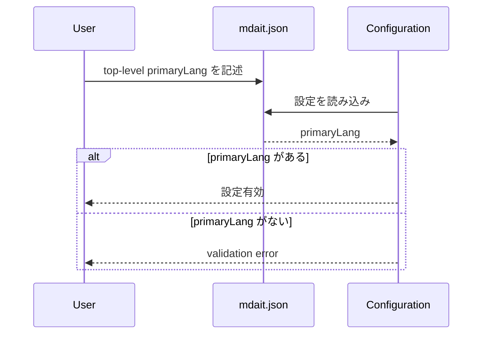

# チケット: primaryLang互換削除

## 1. 概要と方針

top-level `primaryLang` への移設で残していた旧 `terms.primaryLang` の互換読込を削除する。
互換痕跡を消す代わりに、`primaryLang` 未設定は明示的な設定不備として扱い、静かな誤動作を防ぐ。

## 2. 仕様

- runtime は `terms.primaryLang` を読まない
- `primaryLang` は top-level のみを正準キーとして扱う
- `primaryLang` 未設定は validation error とする
- 互換読込テストと移行メモは削除する

## 3. シーケンス図

## 4. 設計

- `MdaitConfig.terms` から `primaryLang` を除去する
- `Configuration.load()` は top-level `primaryLang` のみを読む
- `validate()` で `primaryLang` 未設定を検出する

## 5. 考慮事項

- 旧設定の自動救済は行わない
- schema と runtime の期待値を一致させる
- TM 本体仕様には踏み込まない

## 6. 実装・テスト計画と進捗

- [x] 影響箇所確認
- [x] 作業チケット作成
- [x] 互換読込を削除
- [x] validation と schema を必須化
- [x] テストとドキュメントを更新
- [x] レビュー実施

## 7. 品質要件チェック

- [x] runtime に `terms.primaryLang` の互換痕跡が残らない
- [x] `primaryLang` 未設定が validation error になる
- [x] 互換用ドキュメント記述が削除される
- [x] 単体テストが新仕様を検証する

## 8. まとめと改善提案

- runtime・UI・公開コマンド入口を top-level `primaryLang` 必須の契約に統一し、旧 `terms.primaryLang` の互換痕跡を除去した
- silent degradation を避けるため、旧設定の自動救済ではなく validation error と未構成 UI に揃えた
- 今後 `getTermsPrimaryLang()` の命名を実態に合わせて整理する場合は、今回の契約固定とは分離して扱うと差分管理しやすい

## 9. 参考

- [src/config/configuration.ts](../src/config/configuration.ts)
- [src/test/core/config/configuration.test.ts](../src/test/core/config/configuration.test.ts)
- [docs/design/config.md](../docs/design/config.md)