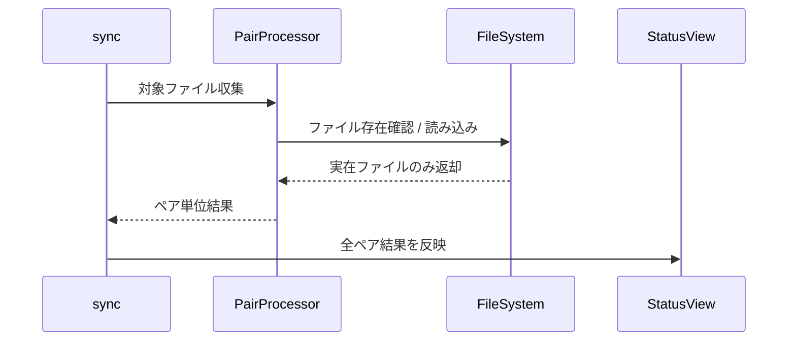

# チケット: sync empty.md ENOENT 調査修正

## 1. 概要と方針

sync 実行時に存在しない `empty.md` を開こうとして ENOENT が発生し、複数言語ペアの同期結果表示が途中で止まる問題を調査・修正する。未コミット変更に起因する退行として扱い、原因の特定、最小修正、関連テスト追加まで行う。

## 2. 仕様

- sync 実行時に存在しないファイルパスを処理対象へ残さない
- 1 つの言語ペアで不正な入力があっても、必要に応じて適切にスキップまたは明示エラー化し、途中状態で全体表示が壊れないようにする
- 今回の TM 再設計変更で混入した退行を解消する

## 3. シーケンス図

## 4. 設計

- 発生箇所を特定し、存在しないファイルが列挙される根本原因を修正する
- 必要なら sync 側で防御的に存在確認を追加する
- 回帰防止として再現テストを追加する

## 5. 考慮事項

- ユーザーの未コミット変更は巻き戻さない
- empty.md 参照がテストワークスペース固有か、一般的な列挙ロジックの欠陥かを切り分ける

## 6. 実装・テスト計画と進捗

- [x] 発生箇所と原因を特定する
- [x] 修正を実装する
- [x] 再現テストまたは関連テストを追加する
- [x] レビューを実施する

## 7. 品質要件チェック

- [x] sync が存在しないファイルで異常終了しない
- [x] 複数言語ペアの処理結果が最後まで表示される
- [x] 追加テストが退行を検知できる

## 8. まとめと改善提案

current primary units の収集条件が広すぎ、primaryLang が target 側の pair でも target 側未生成ファイルを cleanup 入力として読みに行っていた。修正では cleanup 用収集対象を primaryLang が source 側の pair に限定し、同一 primary source ファイルの重複収集も避けた。加えて、primary source 側が空になったケースでも cleanup を止めず、obsolete TU が残留しないよう補正した。

改善提案として、sync 全体の多言語ペア回帰ケースは GUI/統合テストで 1 本補強すると、途中結果停止の再発も検知しやすい。

## 9. 参考

- [tasks/done/260315_TM正本管理と参照方式再設計.md](tasks/done/260315_TM正本管理と参照方式再設計.md)