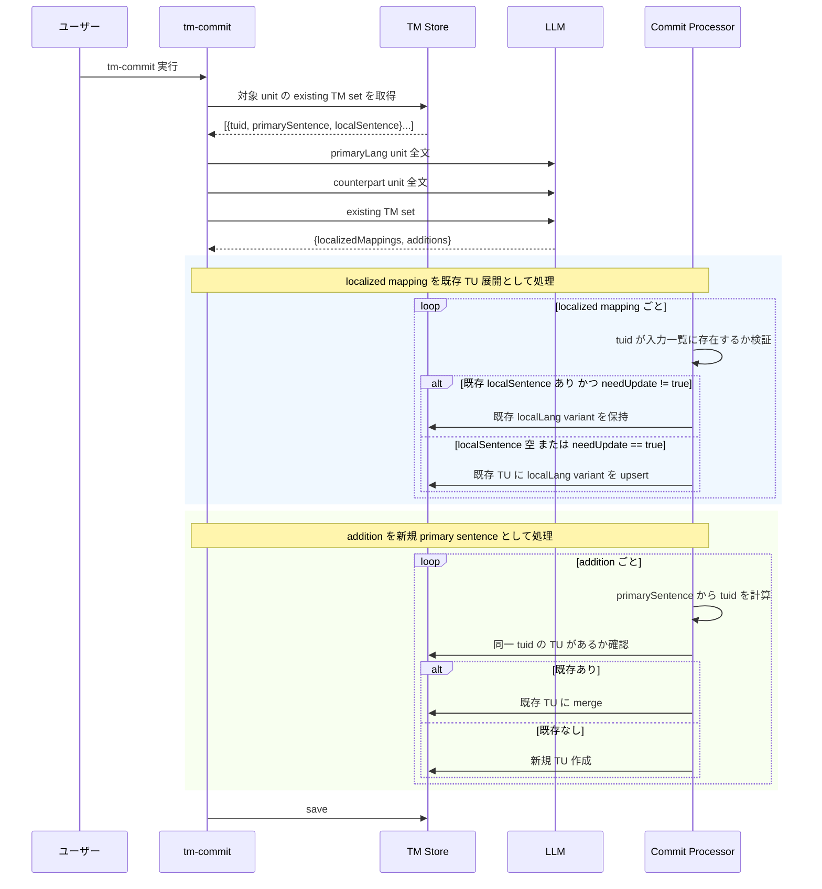

# チケット: tm-commit existing TM set 反映

## 1. 概要と方針

tm-commit の LLM 契約を、単純な anchor 再利用/新規作成の配列返却から、既存 TM set を明示的に入力し、localized mapping と addition を分離して返す構造へ改修する。primary sentence を正本とする既存方針は維持しつつ、既存 local sentence の保持と明示更新を扱えるようにする。

## 2. 仕様

- LLM 入力は `primaryLangUnit` 全文、`counterpartUnit` 全文、`existing TM set` を含む
- `existing TM set` の要素は `tuid` / `primarySentence` / `localSentence` を持つ
- LLM 出力は `localizedMappings` と `additions` の 2 要素に分離する
- `localizedMappings` は既存 `tuid` に対する local sentence の充足または更新を表す
- 既存 local sentence があり、`needUpdate=true` が無い場合は既存値を保持する
- `additions` は既存 `tuid` では表せない新しい `primarySentence` / `localSentence` を表す
- `tm-commit` 後段では localized mapping と addition を別フローで検証・upsert する
- non-primary 側の情報だけで新規 TU は作らない

## 3. シーケンス図

## 4. 設計

### 変更対象

- `src/core/tm/types.ts`
  - existing TM set / localized mapping / addition の型を追加
- `src/commands/tm/sentence-aligner.ts`
  - LLM 入出力契約を新形式へ変更
- `src/commands/tm/commit-processor.ts`
  - existing TM set 取得、localized mapping と addition の分岐処理を実装
- `src/core/tm/tmx-store.ts`
  - unit 単位で参照する existing TM set 取得 API と unit identity の絞り込みを追加
- `src/prompts/defaults.ts`
  - `tm.alignWithPrimaryAnchors` の説明を新契約に更新
- `src/test/commands/tm/*.test.ts`
  - 新契約と保持/更新ルールを検証するテストへ更新

### 設計要点

- existing TM set は `primaryLangUnit` に属する既存 TU 群の投影ビューとして扱う
- existing TM set の探索単位は file 単位ではなく unit 単位とし、改訂時 fallback には unit identity を使う
- existing TM set lookup と cleanup の実文照合は、旧文が新文へ部分一致するだけのケースを避けるため全文境界一致で行う
- localized mapping は既存 TU を前提とするため、未知 `tuid` や不正 primary sentence は無視する
- 既存 local sentence がある mapping は、`needUpdate=true` がある場合のみ更新する
- existing TM set に local sentence がない mapping は、LLM が local sentence を返した場合のみ補完する
- addition は `primarySentence` を基準に `tuid` を再計算し、既存 TU があれば merge、なければ新規作成する
- 1 回の commit で同じ `tuid` を重複処理しない

## 5. 考慮事項

- authoritative prompt は `tm.alignWithPrimaryAnchors` を維持し、旧配列レスポンスは parser 互換で受理する
- 既存 row 配列ベースのテストは JSON オブジェクトベースへ書き換える必要がある
- 既存 local sentence の保持が増えるため、更新件数の定義はテストで明確化する
- primary sentence の現存判定は部分一致に戻さず、existing TM set lookup / cleanup の両方で同じ全文境界一致契約を保つ

## 6. 実装・テスト計画と進捗

- [x] existing TM set 取得経路を整理する
- [x] LLM 契約用の型と parser を更新する
- [x] commit processor に localized mapping / addition 分岐を実装する
- [x] prompt 文面を更新する
- [x] 単体テストを更新する
- [x] 関連テストを実行する
- [x] レビューを実施する

## 7. 品質要件チェック

- [x] primary sentence 基準の一意性を維持している
- [x] existing local sentence の保持/明示更新が区別されている
- [x] localized mapping だけで新規 TU を作成しない
- [x] additions と localized mapping のフローが分離されている
- [x] 関連テストが成功する

## 8. まとめと改善提案

existing TM set を prompt 入力と parser/processor の契約に通し、既存 TU への localized mapping と新規 additions を別フローで処理する実装へ更新した。既存 local sentence の保持、needUpdate による明示更新、localizedMappings 側での新規 TU 抑止に加え、existing TM set lookup / cleanup の実文照合を全文境界一致へ揃え、旧文が新文に部分一致するだけの改稿で obsolete TU を誤保持しないことをテストで固定した。

今後の改善としては、カスタム prompt が旧配列形式を返したときの運用ログを増やし、互換モード利用状況を観測できるようにすると移行管理がしやすい。

## 9. 参考

- `TM.md`