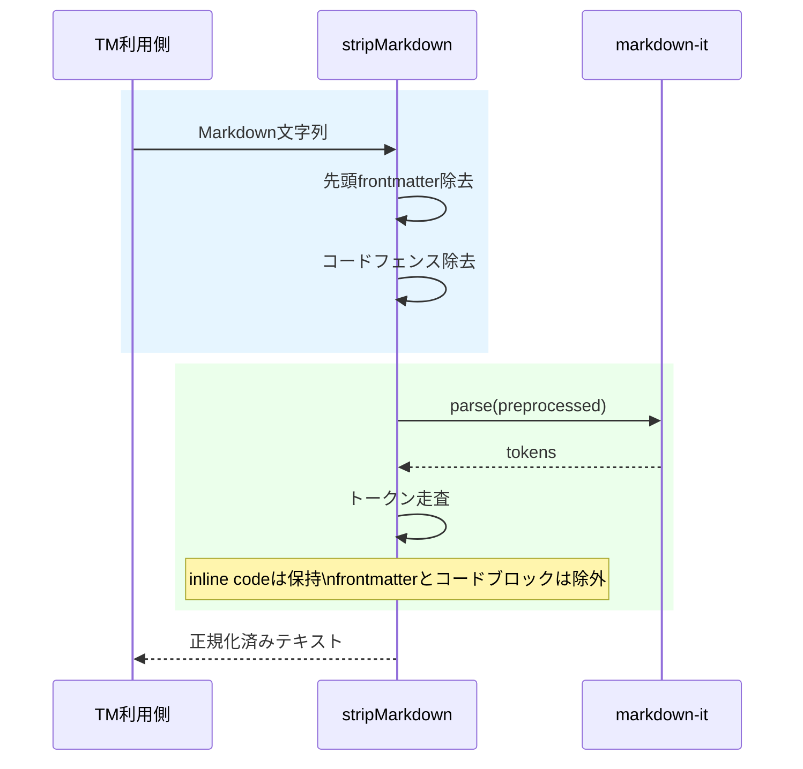

# チケット: TM正規化 inline保持とfrontmatter除外

## 1. 概要と方針

TM用Markdown正規化で、インラインコードを保持しつつ、frontmatterを正規化対象から除外する。既存のmarkdown-itベース実装を維持し、最小変更でstripMarkdownの入力前処理とトークン抽出方針を調整する。

## 2. 仕様

- stripMarkdownはインラインコードを除外せず、そのまま保持する。
- stripMarkdownはMarkdown先頭のYAML frontmatterを出力に含めない。
- 既存のコードブロック除外、リンク・画像・装飾除去、構造保持の挙動は維持する。

## 3. シーケンス図

## 4. 設計

- frontmatter除去はmarkdown-itのトークン処理に頼らず、stripMarkdownの前処理で先頭YAMLブロックを取り除く。
- インラインコードは`code_inline`を抽出対象へ変更し、コードブロック系のみ除外する。
- 既存テストにfrontmatterケースを追加し、inline保持の期待値変更と整合することを確認する。

## 5. 考慮事項

- frontmatter除去は文書先頭のみ対象とし、本文中の`---`区切り線には影響させない。
- inline code保持により、表セルや複合Markdownでの期待値差分を再確認する。
- 既存のユーザー差分があるため、無関係ファイルは変更しない。

## 6. 実装・テスト計画と進捗

- [x] tm-text-normalizerの前処理とトークン抽出を修正
- [x] inline保持とfrontmatter除外のテストを更新
- [x] 関連ユニットテストを実行して確認
- [x] レビューを実施して完了整理

## 7. 品質要件チェック

- [x] 既存のMarkdown構造保持挙動を破壊しない
- [x] frontmatterがTM正規化結果へ混入しない
- [x] inline codeが期待通り保持される
- [x] 対象テストが成功する

## 8. まとめと改善提案

inline code保持は `code_inline` トークンをバッククォート付きで再構成する最小差分で対応した。frontmatter除外は stripMarkdown の前処理で文書先頭の YAML ブロックのみを取り除き、本文中の区切り線や既存のコードブロック除外挙動は維持した。

改善提案として、将来 frontmatter の終端に `...` を許容する必要が出た場合は、frontmatter 前処理だけを専用ヘルパーへ切り出してテストを追加すると拡張しやすい。

## 9. 参考

- [src/core/tm/tm-text-normalizer.ts](src/core/tm/tm-text-normalizer.ts)
- [src/test/core/tm/tm-text-normalizer.test.ts](src/test/core/tm/tm-text-normalizer.test.ts)

## 10. 実施結果

- 変更は TM 正規化本体、関連ユニットテスト、チケット更新のみに限定した。
- 関連テスト `src/test/core/tm/tm-text-normalizer.test.ts` は 57 件成功した。
- downstream テスト `src/test/commands/trans/trans-tm-lookup.test.ts` を inline保持・frontmatter除外仕様に追従させた。
- docs はレビュー工程で `docs/design/core.md` に仕様反映を追加した。