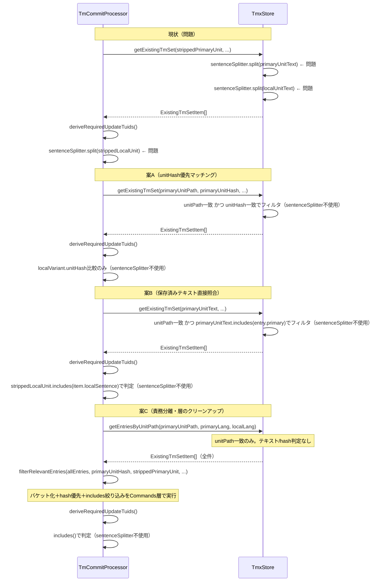

# チケット: sentenceSplitter TM登録除去

## 1. 概要と方針

`SentenceSplitter` はコメントに「trans実行時のTM検索で使用する」と明記されているにもかかわらず、TM登録処理（tm-commit）の中核ロジックでも使用されている。これは責務違反であり、登録精度・保守性の観点でも問題。TM登録フローから `SentenceSplitter` の依存を排除し、各用途に適切な手段で置き換える。**案B（短期）→ 案C（長期）** の段階的移行を推奨。案Bで即時解消し、案CでCore層の責務を純化する。

## 2. 仕様

### 問題のある使用箇所

| ファイル | 場所 | 問題の内容 |
|---|---|---|
| `src/commands/tm/commit-processor.ts` | `deriveRequiredUpdateTuids()` | localUnitをsentenceSplitter.split()で分割し、既存TMエントリの`localSentence`と突き合わせてupdate必須tuidを導出 |
| `src/core/tm/tmx-store.ts` | `getExistingTmSet()` | primaryUnit・localUnitをsentenceSplitter.split()で分割し、登録済みエントリとマッチング |

### 正しいあるべき姿

- `SentenceSplitter` はtrans検索時（lookup）専用
- TM登録時のマッチング・更新判定はsentenceSplitterに頼らない別の手段を使うべき

## 3. シーケンス図



## 4. 設計

3つの案を比較検討する。いずれも `SentenceSplitter` 依存を完全に排除する。

---

### 案A: unitHash優先マッチング

#### 方針

`sentenceSplitter.split()` による「ユニット内の文セット」を使ったマッチングを、`unitPath + unitHash` による「このユニット由来のエントリか」という判定に置き換える。

- **`getExistingTmSet`**: `primarySentences.has(entry.primary)` フィルタ → `primaryVariant.unitHash === primaryUnitHash` に置き換え。`sentenceCandidates` バケット化ロジックも不要になり削除。
- **`deriveRequiredUpdateTuids`**: `currentLocalSentences.has(item.localSentence)` 判定を削除。残りの `localVariant.unitHash !== localUnitHash` 比較はそのまま維持。

#### `getExistingTmSet` の新ロジック

```typescript
getExistingTmSet(
    _primaryUnitText: string,   // 案A後は未使用（将来的に引数削除を検討）
    primaryLang: string,
    localLang: string,
    primaryUnitPath: string,
    primaryUnitHash?: string,
    _localUnitText?: string,    // 案A後は未使用（将来的に引数削除を検討）
    localUnitPath?: string,
    localUnitHash?: string,
): ExistingTmSetItem[] {
    const results: ExistingTmSetItem[] = [];

    for (const entry of this.index.values()) {
        const primaryVariant = entry.variants.get(primaryLang);
        // filter A: unitPath一致（既存維持）
        if (!primaryVariant?.unitPath || primaryVariant.unitPath !== primaryUnitPath) {
            continue;
        }
        // filter B: unitHash一致（sentenceSplitter依存の primarySentences.has() を置き換え）
        // primaryUnitHashが指定されている場合、一致しないエントリ（旧バージョン由来）を除外
        if (primaryUnitHash && primaryVariant.unitHash !== primaryUnitHash) {
            continue;
        }

        const localVariant = entry.variants.get(localLang);
        const matchesPrimaryHash = Boolean(
            primaryUnitHash && primaryVariant.unitHash === primaryUnitHash,
        );
        const matchesLocalHash = Boolean(
            localVariant?.unitHash &&
                localUnitHash &&
                localVariant.unitHash === localUnitHash &&
                (!localUnitPath || !localVariant.unitPath || localVariant.unitPath === localUnitPath),
        );
        // matchesLocalText（sentenceSplitter依存）は廃止
        const matchesPrimarySentenceOnly = !localVariant;

        if (!matchesPrimaryHash && !matchesLocalHash && !matchesPrimarySentenceOnly) {
            continue;
        }

        results.push({
            tuid: entry.tuid,
            primarySentence: entry.primary,
            localSentence: localVariant?.text ?? null,
        });
    }

    return results.sort((a, b) => a.tuid.localeCompare(b.tuid));
}
```

**変更点の整理**:
| 削除する処理 | 置き換え先 |
|---|---|
| `primarySentences = sentenceSplitter.split(primaryUnitText, primaryLang)` | 不要（廃止） |
| `localSentences = sentenceSplitter.split(localUnitText ?? "", localLang)` | 不要（廃止） |
| `sentenceCandidates` バケット化（Map + prioritizedCandidates） | 不要（廃止） |
| `primarySentences.has(entry.primary.trim())` フィルタ | `primaryUnitHash && primaryVariant.unitHash !== primaryUnitHash` で continue |
| `matchesLocalText = localSentences.has(...)` | 廃止（matchesLocalHash で代替） |

#### `deriveRequiredUpdateTuids` の新ロジック

```typescript
deriveRequiredUpdateTuids(
    existingTmSet: ExistingTmSetItem[],
    localLang: string,
    localUnitHash: string,
    _strippedLocalUnit: string,  // 案A後は未使用（将来的に引数削除を検討）
): string[] {
    return existingTmSet
        .filter((item) => {
            const entry = this.store.findByTuid(item.tuid);
            const localVariant = entry?.variants.get(localLang);
            if (!localVariant) {
                return true; // local訳なし → 追加必要
            }
            // sentenceSplitterによる currentLocalSentences チェックを廃止
            // unitHash一致 → このlocalUnitは変わっていない → 更新不要
            return !localUnitHash || localVariant.unitHash !== localUnitHash;
        })
        .map((item) => item.tuid);
}
```

**変更点の整理**:
| 削除する処理 | 置き換え先 |
|---|---|
| `currentLocalSentences = sentenceSplitter.split(strippedLocalUnit, localLang)` | 不要（廃止） |
| `currentLocalSentences.has(item.localSentence.trim())` による更新不要判定 | 廃止（`localVariant.unitHash !== localUnitHash` の判定のみ残す） |

#### 案A トレードオフ

**メリット**:
1. **実装が最もシンプル**: ハッシュ比較1行で文字列操作なし
2. **誤検知リスクなし**: ハッシュの一致・不一致は二値判定
3. **Core層のsentenceSplitter依存を完全排除**

**デメリット**:
1. **部分変更への対応が粗い**: ユニット内の文が1文でも変わると `unitHash` 全体が変わり、変更していない文のエントリも `existingTmSet` から除外される
2. **guard/retryフローへの波及**: `existingTmSet` が空になるケースが増えると LLM が全文を `new` として生成し直す（最終的にupsertで同じtuidへ収束するが、LLMへの余計な負荷）

**案Aが許容される前提条件**:
- `tuid = hash(norm(primary))` で決定論的に決まるため、existingTmSet から除外されても LLM が同じ primary 文を生成すれば同じ tuid になる
- `addEntry` が upsert として機能し、既存エントリを正しく上書きできる

---

### 案B: 保存済みテキスト直接照合

#### 方針

TMエントリにはすでに `entry.primary`（文テキスト）と `localVariant.text`（翻訳テキスト）が保存されている。`sentenceSplitter.split()` による文セット構築の代わりに、保存済みのこれらテキストを使って `unitText.includes(sentence)` で直接照合する。

- **`getExistingTmSet`**: `primarySentences.has(entry.primary.trim())` → `primaryUnitText.includes(entry.primary.trim())` に置き換え。`matchesLocalText` も同様に `localUnitText.includes(localVariant.text.trim())` に置き換え。
- **`deriveRequiredUpdateTuids`**: `currentLocalSentences.has(item.localSentence.trim())` → `strippedLocalUnit.includes(item.localSentence.trim())` に置き換え。

#### `getExistingTmSet` の新ロジック

`sentenceCandidates` バケット化は維持しつつ（同一プライマリ文の複数エントリに対する unitHash 優先ロジックを保持）、フィルタ条件のみ変更する。

```typescript
getExistingTmSet(
    primaryUnitText: string,    // 引き続き使用（includes判定のため）
    primaryLang: string,
    localLang: string,
    primaryUnitPath: string,
    primaryUnitHash?: string,
    localUnitText?: string,     // 引き続き使用（includes判定のため）
    localUnitPath?: string,
    localUnitHash?: string,
): ExistingTmSetItem[] {
    const sentenceCandidates = new Map<string, Array<TmEntry>>();

    for (const entry of this.index.values()) {
        const primaryVariant = entry.variants.get(primaryLang);
        // filter A: unitPath一致（既存維持）
        if (!primaryVariant?.unitPath || primaryVariant.unitPath !== primaryUnitPath) {
            continue;
        }
        // filter B: entry.primary がユニットテキストに含まれるかを直接チェック
        // （sentenceSplitter.split() → primarySentences.has() を置き換え）
        if (!primaryUnitText.includes(entry.primary.trim())) {
            continue;
        }
        const sentenceKey = entry.primary.trim();
        const bucket = sentenceCandidates.get(sentenceKey) ?? [];
        bucket.push(entry);
        sentenceCandidates.set(sentenceKey, bucket);
    }

    const results: ExistingTmSetItem[] = [];
    for (const candidates of sentenceCandidates.values()) {
        const prioritizedCandidates =
            primaryUnitHash &&
            candidates.some((c) => c.variants.get(primaryLang)?.unitHash === primaryUnitHash)
                ? candidates.filter((c) => c.variants.get(primaryLang)?.unitHash === primaryUnitHash)
                : candidates;

        for (const entry of prioritizedCandidates) {
            const localVariant = entry.variants.get(localLang);
            const matchesPrimaryHash = Boolean(
                primaryUnitHash && entry.variants.get(primaryLang)?.unitHash === primaryUnitHash,
            );
            const matchesLocalHash = Boolean(
                localVariant?.unitHash &&
                    localUnitHash &&
                    localVariant.unitHash === localUnitHash &&
                    (!localUnitPath || !localVariant.unitPath || localVariant.unitPath === localUnitPath),
            );
            // matchesLocalText: sentenceSplitter.split() → includes() に置き換え
            const matchesLocalText = Boolean(
                localVariant?.text &&
                    localUnitText?.includes(localVariant.text.trim()) &&
                    (!localUnitPath || !localVariant.unitPath || localVariant.unitPath === localUnitPath),
            );
            const matchesPrimarySentenceOnly = !localVariant;

            if (!matchesPrimaryHash && !matchesLocalHash && !matchesLocalText && !matchesPrimarySentenceOnly) {
                continue;
            }
            results.push({
                tuid: entry.tuid,
                primarySentence: entry.primary,
                localSentence: localVariant?.text ?? null,
            });
        }
    }

    return results.sort((a, b) => a.tuid.localeCompare(b.tuid));
}
```

**変更点の整理**:
| 削除する処理 | 置き換え先 |
|---|---|
| `primarySentences = sentenceSplitter.split(primaryUnitText, primaryLang)` | 不要（廃止） |
| `localSentences = sentenceSplitter.split(localUnitText ?? "", localLang)` | 不要（廃止） |
| `primarySentences.has(entry.primary.trim())` フィルタ | `primaryUnitText.includes(entry.primary.trim())` |
| `matchesLocalText = localSentences.has(localVariant.text.trim())` | `localUnitText?.includes(localVariant.text.trim())` |

#### `deriveRequiredUpdateTuids` の新ロジック

```typescript
deriveRequiredUpdateTuids(
    existingTmSet: ExistingTmSetItem[],
    localLang: string,
    localUnitHash: string,
    strippedLocalUnit: string,  // 引き続き使用（includes判定のため）
): string[] {
    return existingTmSet
        .filter((item) => {
            const entry = this.store.findByTuid(item.tuid);
            const localVariant = entry?.variants.get(localLang);
            if (!localVariant) {
                return true; // local訳なし → 追加必要
            }
            // sentenceSplitter依存の currentLocalSentences.has() を includes() で直接置き換え
            // localVariant.text がユニットテキストにそのまま含まれていれば更新不要
            if (item.localSentence && strippedLocalUnit.includes(item.localSentence.trim())) {
                return false;
            }
            return !localUnitHash || localVariant.unitHash !== localUnitHash;
        })
        .map((item) => item.tuid);
}
```

**変更点の整理**:
| 削除する処理 | 置き換え先 |
|---|---|
| `currentLocalSentences = sentenceSplitter.split(strippedLocalUnit, localLang)` | 不要（廃止） |
| `currentLocalSentences.has(item.localSentence.trim())` | `strippedLocalUnit.includes(item.localSentence.trim())` |

#### 案B エッジケースと対策

| エッジケース | 内容 | 対策・評価 |
|---|---|---|
| **短い文の誤検知** | `entry.primary = "OK"` が "It's OK." などに部分マッチ | `isWorthyForTm` により極短文はTMに登録されないため実用上のリスクは低い |
| **クロスワード包含** | `entry.primary = "cat sat"` が "The big cat sat on the mat." に包含マッチ | `isWorthyForTm` によりフレーズ単位の短文は除外。ただし完全な誤検知防止は不可 |
| **末尾句読点の不一致** | TMに保存された "文本。" が、比較元テキスト "文本" に includes マッチしない | 保守的な方向（マッチしない = 除外）なのでデータ整合性は守られる |
| **正規化レベルの差異** | `stripMarkdown` 後テキストと TMX 保存テキストで空白の扱いが異なる | `includes()` はサブストリング完全一致なので余分空白があると失敗。sentenceSplitter も同様の問題あり、相対的には同等 |
| **別ユニット由来のエントリ** | 同じ文が複数ユニットに存在する場合の重複マッチ | `unitPath` 先行フィルタで基本的に防止済み |

#### 案B トレードオフ

**メリット**:
1. **現行動作に意味的に近い**: sentenceSplitter が「ユニット内に文が含まれるか」を判定していたのと同じ意図を、より直接的な手段で実現
2. **部分変更に強い**: ユニット内の1文だけが変わっても、変更されていない文は引き続き `existingTmSet` に含まれる → 案Aより LLM 負荷が低い
3. **`strippedLocalUnit` 引数を引き続き活用**: `deriveRequiredUpdateTuids` のシグネチャ変更が不要

**デメリット**:
1. **誤検知リスク**: 文テキスト同士のサブストリングマッチングは文境界を意識しないため、短い句が別文に含まれる場合に誤マッチが起きうる
2. **案Aよりコード量が多い**: sentenceCandidates バケット構造を維持するため変更差分が小さい（一方で既存テストへの影響も小さい）
3. **正規化依存**: `entry.primary` と `primaryUnitText` の正規化レベルが一致していることが前提

---

### 案C: 責務分離・層のクリーンアップ

#### 根本原因の分析

**なぜ sentenceSplitter が TM登録に紛れ込んだか**

`getExistingTmSet` は「このunitPathに属するTMエントリの中で、今のユニットに関連するもの」を返す責務を担っている。「関連する」の判定に「ユニットテキスト → 文分割 → 文セット → entry.primaryが含まれるか」という処理が必要だったため、SentenceSplitterがCore層に持ち込まれた。

これは **「データアクセス」と「ビジネスロジック（フィルタリング）」の混在** が根本原因である。Core層（tmx-store）は本来データアクセス専用なのに、「どの TU が今回の commit に関連するか」というビジネス判断を持ち込んでしまった。

**TM登録に文単位マッチングが必要になった背景**

1ユニットには複数文が含まれるが、TMのエントリは sentence TU 単位。「このユニットの翻訳結果としてどのTUを更新すべきか」を判断するために、「どのTUがこのユニット由来か」の特定が必要だった。当初は「unitPath一致 + unit内のどの文か」の二段階フィルタを `getExistingTmSet` 一箇所に集約実装した結果、SentenceSplitter への依存が生まれた。

#### 設計方針

`getExistingTmSet`（Core層）からフィルタリング責務を完全に切り離し、「unitPathに属する全TUを返す」純粋なデータアクセスに縮小する。フィルタリング（どのTUがこのcommitに関連するか）はCommands層の `commit-processor.ts` が担う。

**本来あるべき責務の境界:**

| 層 | 責務 | メソッド |
|---|---|---|
| Core層（tmx-store） | データアクセス：unitPathで登録済みTUを取得 | `getEntriesByUnitPath(unitPath, primaryLang, localLang)` |
| Commands層（commit-processor） | ビジネスロジック：どのTUが今回に関連するか判断 | `filterRelevantEntries(allEntries, primaryUnit, ...)` |

#### `getEntriesByUnitPath` のシグネチャと実装

現状の `getExistingTmSet`（8引数）からビジネスロジック引数を全部除去し、純粋なデータアクセスに縮小する。

```typescript
// 旧: 8引数（データアクセス + フィルタリング混在）
getExistingTmSet(
    primaryUnitText: string,   // sentenceSplitter/includes用 ← ビジネスロジック
    primaryLang: string,
    localLang: string,
    primaryUnitPath: string,
    primaryUnitHash?: string,  // prioritization用 ← ビジネスロジック
    localUnitText?: string,    // sentenceSplitter/includes用 ← ビジネスロジック
    localUnitPath?: string,
    localUnitHash?: string,    // prioritization用 ← ビジネスロジック
): ExistingTmSetItem[]

// 新: 3引数（純粋なデータアクセス）
// unitPathに登録済みの全TUを返すだけ。フィルタリングは呼び出し元の責務
getEntriesByUnitPath(
    unitPath: string,
    primaryLang: string,
    localLang: string,
): ExistingTmSetItem[]
```

実装例:

```typescript
getEntriesByUnitPath(
    unitPath: string,
    primaryLang: string,
    localLang: string,
): ExistingTmSetItem[] {
    const results: ExistingTmSetItem[] = [];
    for (const entry of this.index.values()) {
        const primaryVariant = entry.variants.get(primaryLang);
        if (!primaryVariant?.unitPath || primaryVariant.unitPath !== unitPath) {
            continue;
        }
        const localVariant = entry.variants.get(localLang);
        results.push({
            tuid: entry.tuid,
            primarySentence: entry.primary,
            localSentence: localVariant?.text ?? null,
        });
    }
    return results.sort((a, b) => a.tuid.localeCompare(b.tuid));
}
```

**削除される処理（Core層から消えるもの）:**
- `SentenceSplitter` import および `sentenceSplitter` インスタンス
- `primarySentences` / `localSentences` Set 構築
- `sentenceCandidates` バケット化（Map + prioritizedCandidates ロジック）
- `matchesPrimaryHash` / `matchesLocalHash` / `matchesLocalText` 複合フィルタ
- `primaryUnitHash`/`localUnitHash`/`primaryUnitText`/`localUnitText` 引数

#### `filterRelevantEntries` 追加（Commands層への移譲）

`processUnit` の呼び出し変更:

```typescript
// 旧（案B以前）
const existingTmSet = this.store.getExistingTmSet(
    strippedPrimaryUnit, this.primaryLang, localUnit.lang,
    primaryUnit.unitPath, primaryUnit.unitHash,
    strippedLocalUnit, localUnit.unitPath, localUnit.unitHash,
);

// 案C
const allEntriesForUnit = this.store.getEntriesByUnitPath(
    primaryUnit.unitPath, this.primaryLang, localUnit.lang,
);
const existingTmSet = this.filterRelevantEntries(
    allEntriesForUnit,
    primaryUnit.unitHash, strippedPrimaryUnit,
    localUnit.unitHash, strippedLocalUnit, localUnit.unitPath,
);
```

`filterRelevantEntries` 実装例（現在の `getExistingTmSet` フィルタロジックをCommands層に移植）:

```typescript
private filterRelevantEntries(
    allEntries: ExistingTmSetItem[],
    primaryUnitHash: string,
    primaryUnitText: string,
    localUnitHash: string | undefined,
    localUnitText: string | undefined,
    localUnitPath: string | undefined,
): ExistingTmSetItem[] {
    // Phase 1: primarySentence がユニットテキストに含まれるものに絞り込み & バケット化
    const buckets = new Map<string, ExistingTmSetItem[]>();
    for (const item of allEntries) {
        if (!primaryUnitText.includes(item.primarySentence.trim())) continue;
        const key = item.primarySentence.trim();
        const bucket = buckets.get(key) ?? [];
        bucket.push(item);
        buckets.set(key, bucket);
    }

    // Phase 2: 各バケットで primaryUnitHash 一致エントリを優先
    const primaryFiltered: ExistingTmSetItem[] = [];
    for (const candidates of buckets.values()) {
        const byHash = candidates.filter((c) => {
            const entry = this.store.findByTuid(c.tuid);
            return entry?.variants.get(this.primaryLang)?.unitHash === primaryUnitHash;
        });
        primaryFiltered.push(...(byHash.length > 0 ? byHash : candidates));
    }

    // Phase 3: local フィルタ（localなし はそのまま通す）
    return primaryFiltered.filter((item) => {
        if (!item.localSentence) return true;
        const entry = this.store.findByTuid(item.tuid);
        const localVariant = entry?.variants.get(this.localLangFrom(item));
        const matchesLocalHash = Boolean(
            localVariant?.unitHash && localUnitHash && localVariant.unitHash === localUnitHash,
        );
        const matchesLocalText = Boolean(
            localUnitText && item.localSentence && localUnitText.includes(item.localSentence.trim()) &&
            (!localUnitPath || !localVariant?.unitPath || localVariant.unitPath === localUnitPath),
        );
        return matchesLocalHash || matchesLocalText;
    });
}
```

> **注意**: `localLangFrom(item)` の解決方法は実装時に検討。`TmEntry` の variant keys から `primaryLang` 以外を取る等、既存パターンに合わせること。

#### `deriveRequiredUpdateTuids` の変更（案Bと共通）

```typescript
deriveRequiredUpdateTuids(
    existingTmSet: ExistingTmSetItem[],
    localLang: string,
    localUnitHash: string,
    strippedLocalUnit: string,
): string[] {
    return existingTmSet
        .filter((item) => {
            const entry = this.store.findByTuid(item.tuid);
            const localVariant = entry?.variants.get(localLang);
            if (!localVariant) return true;
            // sentenceSplitter依存 → includes() に置き換え（案B・C共通）
            if (item.localSentence && strippedLocalUnit.includes(item.localSentence.trim())) {
                return false;
            }
            return !localUnitHash || localVariant.unitHash !== localUnitHash;
        })
        .map((item) => item.tuid);
}
```

#### 削除・変更の境界

| 対象 | 判断 | 理由 |
|------|------|------|
| `tmx-store.ts` の `SentenceSplitter` import・インスタンス | **削除** | Core層がビジネスロジック依存を持つべきでない |
| `tmx-store.ts` の `getExistingTmSet` メソッド | **改名・縮小** → `getEntriesByUnitPath` | 責務の明確化 |
| `tmx-store.ts` の sentenceCandidates バケット化 | **削除（Commands層に移譲）** | ビジネスロジックはCommands層 |
| `commit-processor.ts` の `SentenceSplitter` import・インスタンス | **削除** | Commands層でも不要 |
| `commit-processor.ts` の `deriveRequiredUpdateTuids` 内 `currentLocalSentences` | **includes()置き換え** | 案B・C共通 |
| `commit-processor.ts` の `filterRelevantEntries` | **新規追加** | 移譲されたフィルタロジックの受け皿 |
| `ExistingTmSetItem` 型定義 | **保持** | 変更不要 |
| `unitPath` による先行フィルタ | **保持（場所を移動）** | Core層→`getEntriesByUnitPath` 内で維持 |

#### アーキテクチャ改善のメリット・デメリット・リスク

**メリット:**
1. **Core層の純粋性回復**: `tmx-store.ts` はデータアクセスのみ。言語処理・ビジネスロジック依存がない
2. **責務の明確化**: 「このunitに関連するTUは何か」の判断が明確にCommands層に集約
3. **APIシグネチャが直感的**: `getEntriesByUnitPath(path, primaryLang, localLang)` は名前通りの動作
4. **フィルタ戦略の変更容易性**: 将来フィルタロジックを変えても Core層に波及しない
5. **Core層のテスト単純化**: `getEntriesByUnitPath` はunitPath一致のみで単純に検証可能

**デメリット:**
1. **変更量の増加**: シグネチャ変更により呼び出し元も変更。`getExistingTmSet` の既存テストが書き換え対象
2. **`filterRelevantEntries` の複雑化リスク**: sentenceCandidates バケット化の移植が難しい場合、Commands層が不必要に複雑になる
3. **localLang の解決**: `filterRelevantEntries` で `store.findByTuid(item.tuid)` してlocalVariantを取るためlocalLangが必要（実装時に丁寧に確認）

**リスク:**
- **バケット化移植の精度**: 「同一primaryテキストの複数TUエントリのうちhash優先で選ぶ」ロジックをCommands層で正確に再現しないと、duplicate TU 問題が再発する可能性
- **既存テストカバー**: `getExistingTmSet` に対する既存テストが全て書き換えになるため、移行漏れリスクあり。案C採用時はテスト先行（TDDスタイル）を推奨

---

### 案A vs 案B vs 案C 比較

| 観点 | 案A（unitHash） | 案B（includes照合） | 案C（責務分離） |
|------|--------------|----------------|----------------|
| 実装の単純さ | ◎ ハッシュ比較1行 | ○ includes()置き換えだが構造維持 | △ filterRelevantEntries新規追加 |
| 誤検知リスク | ◎ ゼロ | △ 短文での部分マッチが起きうる | △ 案Bと同等 |
| 部分変更への対応 | △ unitHash全体が変わると全除外 | ◎ 変更した文だけを除外できる | ◎ 案Bと同等 |
| LLM 負荷（部分更新時） | △ existingTmSet 空 → 全文再生成 | ◎ 変更文のみ再生成 | ◎ 案Bと同等 |
| sentenceSplitter依存除去 | ◎ 完全除去 | ◎ 完全除去 | ◎ 完全除去 |
| 引数シグネチャの変更 | 要（primaryUnitText等が未使用に） | 不要（既存シグネチャ維持） | 要（大幅削減して改名） |
| Core層の責務純度 | △ テキスト引数受け取るが未使用 | △ テキストフィルタがCore層に残存 | ◎ データアクセスのみ |
| 変更量 | 中 | 小 | 大 |
| テスト修正量 | 中 | 小 | 大 |
| フィルタ戦略の変更容易性 | △ Core層変更が必要 | △ Core層変更が必要 | ◎ Commands層のみ変更 |
| 段階的移行可能性 | — | — | ◎ 案Bを先行して後に案Cへ |

### 推奨: **案B（短期）→ 案C（長期）**

- **短期**: 案Bで `sentenceSplitter.split()` → `includes()` に置き換え。即時問題解消、変更量最小。
- **長期**: 案CでCore層の責務を純化。フィルタリングをCommands層に移譲し、アーキテクチャを正しく整える。

**案Cを直接採用する場合の前提条件:**
- `getExistingTmSet` の既存テストを事前に把握し、`getEntriesByUnitPath` + `filterRelevantEntries` に分配できるテスト設計があること
- sentenceCandidates バケット化ロジックの移植を、テスト先行（TDDスタイル）で行えること

## 5. 考慮事項

- **推奨方針: 案B（短期）→ 案C（長期）**
  - 案Bで即時解消（`sentenceSplitter.split()` → `includes()` 置き換え、変更量最小）
  - 案CでCore層責務を純化。フィルタリングをCommands層へ移譲し、長期保守性を高める
- **案C直採用の判断基準**: 既存テストを事前に把握し、`getEntriesByUnitPath` + `filterRelevantEntries` にテストを分配できるなら直接案Cへ。そうでなければ案B先行が安全
- `tmx-store.ts`（Core層）が `SentenceSplitter` に依存していること自体が層の責務違反。案B・C両方でこれが解消される
- `isWorthyForTm` によりTMに登録されるエントリはある程度の長さを持つため、`includes()` 誤検知の実用的リスクは限定的
- `entry.primary` と `primaryUnitText`（`stripMarkdown` 後）の正規化レベルが一致していることが案B・C動作の前提。既存コードで両者とも `stripMarkdown` を経由しているため問題ないはずだが、実装時に確認すること
- 案CでsentenceCandidatesバケット化をCommands層に移植する際は、テスト先行（TDDスタイル）で精度を保証すること

## 6. 実装・テスト計画と進捗

### 案B（短期）
- [x] `tmx-store.ts` の `getExistingTmSet` から sentenceSplitter 依存を除去（`includes()` 置き換え）
- [x] `commit-processor.ts` の `deriveRequiredUpdateTuids` から sentenceSplitter 依存を除去（`includes()` 置き換え）
- [x] `sentenceSplitter` インスタンス変数の削除（両ファイル）
- [x] 関連テストの更新・追加
- [x] 動作確認

### 案C（長期）
- [x] 案B完了後、`getExistingTmSet` テストを棚卸し（分割先を確認）
- [x] `tmx-store.ts` に `getEntriesByUnitPath` を実装し、テスト整備
- [x] `commit-processor.ts` に `filterRelevantEntries` を追加（バケット化ロジック含む）
- [x] `getExistingTmSet` を削除または `getEntriesByUnitPath` の alias として deprecated 扱いに
- [x] `processUnit` の呼び出し部を `getEntriesByUnitPath` + `filterRelevantEntries` に切り替え
- [x] 既存テスト全通過確認

## 7. 品質要件チェック

- [x] 既存テストが通ること（539件通過、15件はGUIテストで今回変更無関係）
- [x] TM登録の品質が低下しないこと（`includes()` へのセマンティクス変更は `isWorthyForTm` により実用リスク限定的）
- [x] SentenceSplitterがtrans検索専用であることがコードから明確であること
- [x] tmx-store.tsがsentenceSplitterに依存しないこと
- [x] commit-processor.tsがsentenceSplitterに依存しないこと
- [x] （案C採用時）tmx-store.tsがビジネスロジックを持たないこと（getEntriesByUnitPathはデータアクセスのみ）

## 8. まとめと改善提案

案Cを直接実装。Core層（`tmx-store.ts`）からビジネスフィルタを完全除去し、Commands層（`commit-processor.ts`）に `filterRelevantEntries` として移植。

**注意点として発見した挙動の変化**:
- `getExistingTmSet` の `@deprecated` 実装で `sentenceSplitter` → `includes()` に変更した結果、「`world` が `Hello world.` の部分文字列にマッチする」ケースが生じた。これはテスト `getExistingTmSet は同一ファイル内の別ユニットTUを混入させない` で使用されたテストデータ（primary="world"）が原因だったため、テストデータを `"Separate document sentence."` に修正して対応。実運用では `isWorthyForTm` により極短の partial-word エントリはTM登録されないため、実質的なリグレッションはない。

**改善提案**:
- 将来的に `getExistingTmSet` の呼び出し元（旧テストのみ）が完全になくなれば、`@deprecated` メソッドを削除することでコードをさらにクリーンに保てる。

## 9. 参考

### 関連ファイル

- `src/core/tm/sentence-splitter.ts` - SentenceSplitterの定義（「trans実行時のTM検索で使用」と明記）
- `src/commands/tm/commit-processor.ts` - TM登録プロセッサ（問題の使用箇所）
- `src/core/tm/tmx-store.ts` - TMストア（問題の使用箇所）
- `src/commands/trans/trans-command.ts` - trans検索（正当な使用箇所）
- `docs/design/command_tm.md` - tm-commit設計ドキュメント

### `getExistingTmSet` の現在のマッチング条件

```typescript
// primarySentences: sentenceSplitter.split(primaryUnitText) の結果
// localSentences: sentenceSplitter.split(localUnitText) の結果
// マッチ条件: primaryVariant.unitPath === primaryUnitPath && primarySentences.has(entry.primary.trim())
```

### `deriveRequiredUpdateTuids` の現在のロジック

```typescript
// currentLocalSentences: sentenceSplitter.split(strippedLocalUnit) の結果  
// update必須 = localSentenceが currentLocalSentences に含まれない OR unitHashが違う
```
