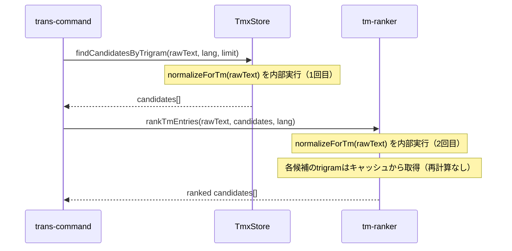
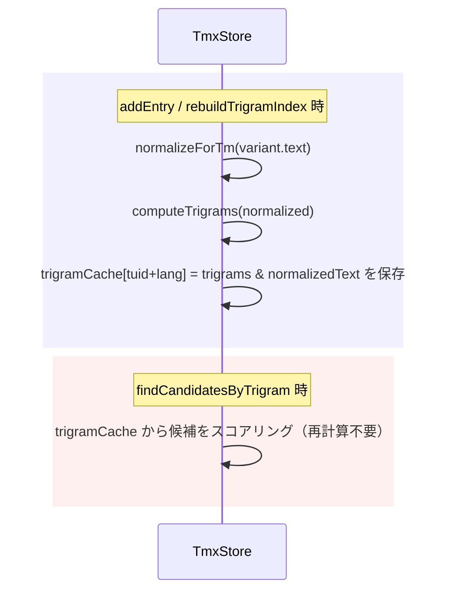

# チケット: TM normalize処理の一元化とtrigramキャッシュ

## 1. 概要と方針

TM検索・登録フローで `stripMarkdown`（markdown-it パース）が同一テキストに対して最大3回実行されており、さらにランキング時にtrigramが候補数分だけ毎回再計算されている。normalize処理を Store/Ranker 内部に集約し、trigram をキャッシュすることで冗長な計算を排除する。

## 2. 仕様

### 2.1 normalize一元化

- `findCandidatesByTrigram(query, ...)` および `rankTmEntries(query, candidates, ...)` は**生テキスト**を受け取る
- normalize（= `normalizeForTm`）は Store/Ranker の内部実装に閉じ込める
- 呼び出し側（`trans-command.ts`）が `stripMarkdown` を事前に呼ぶ必要をなくす

### 2.2 trigramキャッシュ

- `TmxStore` がエントリ登録時（`indexEntry`）に `normalizeForTm(variant.text)` の計算結果を保持する
- ランキング時（`tm-ranker.ts`）はキャッシュ済み trigram を使う（毎回の `normalizeForTm` + `computeTrigrams` を排除）

### 2.3 dead code削除

- `src/core/tm/translation-example-retrieval.ts` を削除
- `src/core/tm/translation-memory-cleanup-service.ts` を削除
  - **注意**: `sync時のTMクリーンアップ実装` wish の実装時に改めて再設計する。このファイルは現状コンパイルエラーかつ未参照のため先行削除する

### 2.4 変更しないこと

- `normalizeForTm` / `stripMarkdown` / `normalizeText` の各関数の実装自体は変更しない
- TM登録フロー（`commit-processor.ts`）の処理ロジックは変更しない（bonus: `normalizeText` と `stripMarkdown` の混在整理は任意）

## 3. シーケンス図

### TM検索フロー（変更後）



### trigramキャッシュ



## 4. 設計

### 4.1 TmxStore の変更

#### 新規フィールド

```
trigramCache: Map<string, Set<string>>
  キー: "${tuid}:${lang}"  例: "af3b2c1d:en"
  値:   computeTrigrams(normalizeForTm(variant.text)) の結果
```

`trigramIndex`（転置インデックス）と並列に保持するフォワードキャッシュ。ランカーが候補ごとの trigram を再計算せずに参照するために使う。

#### 変更メソッド

| メソッド | 変更内容 |
|---------|---------|
| `indexEntry()` | trigrams 計算後、`trigramCache.set("${tuid}:${lang}", trigrams)` を追加 |
| `clear()` | `trigramCache.clear()` を追加 |
| `rebuildTrigramIndex()` | `trigramIndex.clear()` に合わせて `trigramCache.clear()` を追加 |

#### 新規メソッド

```ts
// ReadonlySet にして外部からの Set 破壊を型レベルで防ぐ
getTrigramCache(): ReadonlyMap<string, ReadonlySet<string>>
```

ランカーに渡すための読み取り専用ビュー。trans-command がこれを `rankTmEntries` の `options.trigramCache` に渡す。

#### `findCandidatesByTrigram` のシグネチャ

変更なし: `findCandidatesByTrigram(query: string, lang: string, limit?: number): TmEntry[]`

内部では引き続き `normalizeForTm(query)` を呼ぶ。**呼び出し規約のみ変更**（呼び出し側が生テキストを渡す）。

---

### 4.2 tm-ranker の変更

#### `RankOptions` への追加

```ts
/** TmxStore.getTrigramCache() から渡されるキャッシュ（省略可）。
 *  キー: "${tuid}:${lang}" */
trigramCache?: ReadonlyMap<string, ReadonlySet<string>>;
```

既存フィールドはすべてそのまま。任意フィールドのため後方互換。

#### `rankTmEntries` 内の候補 trigram 取得ロジック

```ts
// 変更前
const trigrams = computeTrigrams(normalizeForTm(text));

// 変更後
const trigrams = options.trigramCache?.get(`${entry.tuid}:${lang}`)
    ?? computeTrigrams(normalizeForTm(text));
```

`trigramCache` がない場合は従来通りにフォールバックする（テスト用や将来の他呼び出し元への配慮）。

クエリ側の `normalizeForTm(query)` は変更なし（生テキストを受け取り内部で正規化）。

---

### 4.3 trans-command の変更

`lookupTmReferences` 内の差分:

```ts
// 削除
import { stripMarkdown } from "../../core/tm/tm-text-normalizer";
// ...
const strippedContent = stripMarkdown(sourceContent);

// 変更
// 旧: store.findCandidatesByTrigram(strippedContent, sourceLang, 200)
store.findCandidatesByTrigram(sourceContent, sourceLang, 200);

// 旧: rankTmEntries(strippedContent, candidates, { topK, lang: sourceLang })
rankTmEntries(sourceContent, candidates, {
    topK: maxReferences,
    lang: sourceLang,
    trigramCache: store.getTrigramCache(),  // 追加
});
```

---

### 4.4 types.ts への `CurrentPrimaryUnit` 復元

`CurrentPrimaryUnit` 型が `types.ts` から欠落しており、`src/commands/sync/current-primary-unit-collector.ts` でコンパイルエラーが発生している（既存障害）。dead code 削除後も残る問題のため、本タスクで合わせて修正する。

```ts
/** sync時のTMクリーンアップで参照される処理対象ユニット */
export interface CurrentPrimaryUnit {
    unitPath: string;
    unitHash: string;
    content: string;
}
```

`current-primary-unit-collector.ts` は本タスクでは削除しない（将来の「sync時のTMクリーンアップ実装」wishで再利用予定）。

---

### 4.5 影響ファイル一覧

| ファイル | 変更種別 | 変更概要 |
|---------|---------|---------|
| `src/core/tm/tmx-store.ts` | 変更 | `trigramCache` フィールド追加、`indexEntry`/`clear`/`rebuildTrigramIndex` 修正、`getTrigramCache()` 追加 |
| `src/core/tm/tm-ranker.ts` | 変更 | `RankOptions.trigramCache` 追加、候補 trigram 取得にキャッシュ活用 |
| `src/core/tm/types.ts` | 変更 | `CurrentPrimaryUnit` 型定義を復元（既存コンパイルエラー修正） |
| `src/commands/trans/trans-command.ts` | 変更 | `stripMarkdown` import/呼び出し削除、生テキスト渡し、`trigramCache` 渡し |
| `src/core/tm/translation-example-retrieval.ts` | **削除** | dead code（コンパイルエラー・未参照） |
| `src/core/tm/translation-memory-cleanup-service.ts` | **削除** | dead code（コンパイルエラー・未参照） |
| `src/test/core/tm/translation-memory-cleanup-service.test.ts` | **削除** | dead code のテスト |
| `src/test/commands/trans/trans-tm-lookup.test.ts` | 要確認 | `stripMarkdown` を直接テストする部分は Store 内部動作のテストに読み替え可。コメントの更新のみで実装変更不要の可能性が高い |
| `src/test/core/tm/tmx-store.test.ts` | 変更なし | テスト入力がプレーンテキストのため変化なし。キャッシュ検証テストを追加 |
| `src/test/core/tm/tm-ranker.test.ts` | 変更なし | `trigramCache` は省略可能なため既存テストは変更不要 |

**備考:** `src/core/tm/tm-text-matcher.ts` は `translation-memory-cleanup-service.ts` からのみ参照されており、削除後は dead code になる。本タスク外（スコープ外）として todo に残す。

## 5. 考慮事項

- `findCandidatesByTrigram` の引数 `query` が現在 `strippedContent` として渡されている箇所を全て生テキストに変更する
- `rankTmEntries` も同様。ただし `query` が normalize 前提の文字列として使われている箇所がないか確認要
- trigramキャッシュはメモリ使用量を増やすが、現実的な TU 件数（数千件）では問題ない
- `translation-memory-cleanup-service.ts` 削除後は cleanup 機能は未実装のまま残る。これは `sync時のTMクリーンアップ実装` wish で再実装する計画

## 6. 実装・テスト計画と進捗

### dead code 削除

- [x] `src/core/tm/translation-example-retrieval.ts` を削除
- [x] `src/core/tm/translation-memory-cleanup-service.ts` を削除
- [x] `src/test/core/tm/translation-memory-cleanup-service.test.ts` を削除
- [x] `src/core/tm/types.ts` に `CurrentPrimaryUnit` 型定義を追加（既存コンパイルエラー修正）
- [x] ビルド確認（上記4点で `translation-*` 関連のコンパイルエラーがなくなること）

### trigramキャッシュ追加（TmxStore）

- [x] `TmxStore` に `private trigramCache = new Map<string, Set<string>>()` フィールドを追加
- [x] `indexEntry()` 内で `trigramCache.set("${tuid}:${lang}", trigrams)` を追加
- [x] `clear()` に `trigramCache.clear()` を追加
- [x] `rebuildTrigramIndex()` に `trigramCache.clear()` を追加
- [x] `loadIfNeeded()` のファイル非存在パスにも `trigramCache.clear()` を追加（修正漏れ）
- [x] `getTrigramCache(): ReadonlyMap<string, ReadonlySet<string>>` メソッドを追加（`ReadonlySet` で外部からの Set 破壊を型レベルで防ぐ）

### normalize一元化（tm-ranker + trans-command）

- [x] `RankOptions` に `trigramCache?: ReadonlyMap<string, ReadonlySet<string>>` を追加
- [x] `rankTmEntries()` の候補 trigram 取得をキャッシュ優先に変更（フォールバック付き）
- [x] `lookupTmReferences()` から `stripMarkdown` 呼び出しを削除（import も削除）
- [x] `findCandidatesByTrigram` と `rankTmEntries` に `sourceContent`（生テキスト）を渡すよう変更
- [x] `rankTmEntries` の呼び出しに `trigramCache: store.getTrigramCache()` を追加

### テスト

- [x] `tmx-store.test.ts`: `getTrigramCache()` の動作確認テストを追加（キャッシュ構築・更新・クリアの確認）
- [x] `tmx-store.test.ts`: `findCandidatesByTrigram` に Markdown 含む生テキストを渡すテストケースを追加
- [x] `trans-tm-lookup.test.ts`: コメントを現行仕様に合わせて更新（処理が Store 内部化されたことを反映）
- [x] 全テスト通過確認（本タスク追加テスト29件全通過。pre-existing 2件失敗は本タスク外）
- [x] ビルド確認（`npx tsc --noEmit` エラーなし）

## 7. 品質要件チェック

- [x] `normalizeForTm` が同一テキストに複数回実行されていないことを確認
- [x] trigram キャッシュが正しく構築・参照されていることを確認
- [x] 既存のTM検索結果（スコア・順序）が変化していないことを確認
- [x] dead code 削除後にコンパイルエラーがないことを確認
- [x] 全テスト通過

## 8. まとめと改善提案

（作業完了後に記入）

## 9. 参考

### 現状の問題（調査結果）

#### 問題1: lookupTmReferences での stripMarkdown 3重適用

```typescript
// trans-command.ts
const strippedContent = stripMarkdown(sourceContent);   // ← 1回目

// tmx-store.ts findCandidatesByTrigram 内部
const norm = normalizeForTm(query);   // = stripMarkdown(strippedContent).toLowerCase() ← 2回目

// tm-ranker.ts rankTmEntries 内部
const queryTrigrams = computeTrigrams(normalizeForTm(query)); // ← 3回目
```

#### 問題2: rankTmEntries での各候補trigram毎回再計算

```typescript
// tm-ranker.ts -- 候補数分ループで毎回実行
const trigrams = computeTrigrams(normalizeForTm(text));
```

`TmxStore.trigramIndex` には同一計算でインデックス構築済みなのに、ランキング時に再計算している。

#### dead code

- `translation-example-retrieval.ts`: コンパイルエラー・未参照
- `translation-memory-cleanup-service.ts`: コンパイルエラー・未参照
