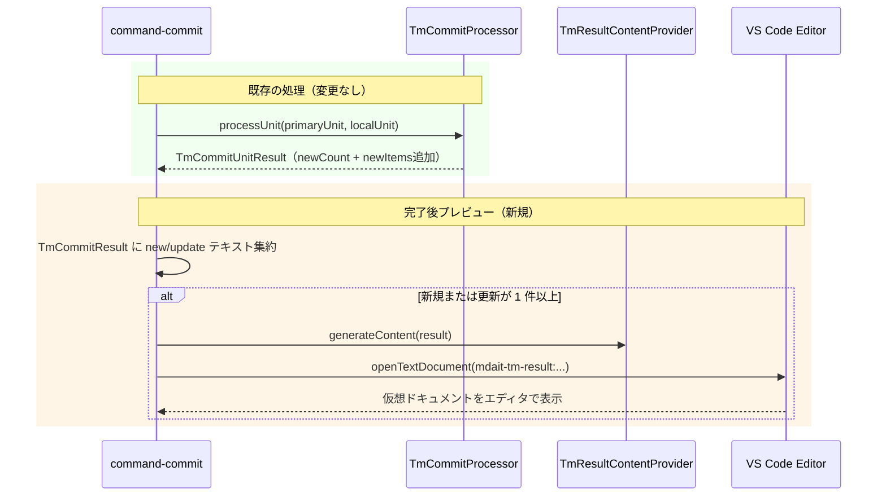

# チケット: tm-commit 完了後の登録内容プレビュー

## 1. 概要と方針

`tm-commit` 完了後、今回新規登録・更新された翻訳ペアを仮想ドキュメントとしてエディタに表示する。ファイルシステムには残さず、VS Code の `TextDocumentContentProvider` を使ったその場限りのプレビューとして実装する。

## 2. 仕様

- `tm-commit` 完了後、新規/更新件数が 1 件以上あれば仮想ドキュメントをエディタで開く
- 0 件の場合は従来通り件数通知のみ（ドキュメントは開かない）
- 表示内容: `[NEW]` / `[UPDATE]` タグ付きで primary → local の文ペアを一覧表示
- 仮想ドキュメントは readonly（編集不可）
- スキームは `mdait-tm-result:`

### 表示形式

```
# TM Commit Results - YYYY-MM-DD HH:mm

## New (N)
[NEW] "original sentence" → "translated sentence"
...

## Updated (M)
[UPDATE] "original sentence" → "translated sentence"
...
```

## 3. シーケンス図



## 4. 設計

### 変更が必要なファイル

| ファイル | 変更内容 |
|---------|---------|
| `src/commands/tm/commit-processor.ts` | `TmResultItem` 型追加。`TmCommitUnitResult` に `newItems`, `updatedItems` を必須フィールドとして追加。`applyPlanItems` の戻り値にも追加 |
| `src/commands/tm/command-commit.ts` | `TmCommitResult` に `newItems`, `updatedItems` 追加。`executeTmCommitForUnits` でユニット結果を集約。`showTmCommitPreview` 関数を追加 |
| `src/commands/tm/tm-result-provider.ts` | 新規: `TextDocumentContentProvider` の実装（シングルトン）。`generateContent` 純粋関数でコンテンツ生成 |
| `src/extension.ts` | `TmResultContentProvider.getInstance()` を `workspace.registerTextDocumentContentProvider("mdait-tm-result", ...)` で登録 |

### データフロー

```
applyPlanItems()
  ├→ commitEntry() で各エントリーを処理
  └→ { newCount, existingCount, newItems[], updatedItems[] } 返却  ← private なので外部影響なし
       ↓
processUnit() → TmCommitUnitResult（newItems, updatedItems を含む）
       ↓
executeTmCommitForUnits() → TmCommitResult に集約
       ↓
showTmCommitResult() → 件数通知
showTmCommitPreview() → 1件以上のとき provider.setContent() → openTextDocument → showTextDocument
```

### TmResultItem の型

`commit-processor.ts` に定義（`applyPlanItems` と `TmCommitUnitResult` の近傍に置くことで依存関係を最小化）。

```ts
export interface TmResultItem {
  primary: string;
  local: string;
}
```

### TmResultContentProvider の設計

既存の `Logger` / `StatusManager` と同様のシングルトンパターンを採用する。これにより `extension.ts` と `command-commit.ts` の双方から引数の受け渡しなしにアクセス可能。

**URI 戦略: 固定URI + `onDidChange` で上書き更新**

毎回同じ URI (`mdait-tm-result:tm-commit-result`) を使い、`onDidChange` イベントを発火することで既存タブの内容を上書き更新する。タイムスタンプ付き URI にすると実行のたびにタブが増殖するため不採用。

```
クラス TmResultContentProvider
  - static instance: TmResultContentProvider
  - latestContent: string（最後にセットされた内容）
  - _onDidChange: EventEmitter<Uri>
  + static getInstance(): TmResultContentProvider
  + setContent(result): void  ← latestContent を更新し onDidChange を発火
  + provideTextDocumentContent(uri): string  ← latestContent を返す
  + static openPreview(): Promise<void>  ← openTextDocument + showTextDocument(Beside)
---
generateContent(result): string  ← モジュール内純粋関数（テスト容易）
```

`extension.ts` での登録:
```
activate() 内:
  TmResultContentProvider.getInstance() を registerTextDocumentContentProvider("mdait-tm-result", ...) で登録
  → context.subscriptions.push(disposable)
```

`command-commit.ts` での呼び出し:
```
showTmCommitPreview(result: TmCommitResult): Promise<void>
  if result.newItems.length + result.updatedItems.length === 0: return
  TmResultContentProvider.getInstance().setContent(result)
  await TmResultContentProvider.openPreview()
```

### コンテンツ生成形式（generateContent）

```
# TM Commit Results - YYYY-MM-DD HH:mm

## New (N)
[NEW] "primary" → "local"
...

## Updated (M)
[UPDATE] "primary" → "local"
...
```

セクションは 0 件のとき `"(none)"` 一行を出力し、セクション自体は省略しない（一貫したフォーマット）。

## 5. 考慮事項

- **シングルトンパターンの採用理由**: `tmCommitFileCommand` / `tmCommitDirectoryCommand` はコマンドコールバック関数として直接登録されており、引数でプロバイダを渡せない。シングルトンが最もシンプルな解決策
- **固定URI採用の理由**: タイムスタンプ付き URI はタブが増殖するため UX が悪い。固定URI + `onDidChange` で既存タブを上書きする方が自然
- **既存テストへの影響**: `TmCommitUnitResult` の必須フィールド追加により、`commit-processor.ts` 内でスキップ時などに返す `{ newCount: 0, ..., skippedCount: 0, warnedCount: 0 }` の全てに `newItems: [], updatedItems: []` を追加する必要がある。テストコード自体（値の検証ロジック）は変更不要
- **件数が多い場合**: 100件超でもドキュメントとして問題なく開ける
- **ディレクトリ単位のプレビュー**: `tmCommitDirectoryCommand` はファイルループ後に `overallResult` を集約する1か所があり、`showTmCommitResult` と同じ場所で呼べばよい
- **l10n 対応**: ドキュメントのヘッダーやラベルは英語固定でよい（ログ的な性質のため `vscode.l10n.t` 不使用）
- **readonly 設定**: `showTextDocument` 時の `preview: true` は読み取り専用タブになるが、strictな readonly 化は追加でスキーマベースの言語モード設定が必要。vs code のデフォルト挙動（仮想ドキュメントは編集不可）に委ねる

## 6. 実装・テスト計画と進捗

- [x] `TmResultItem` 型追加（`commit-processor.ts`）
- [x] `applyPlanItems` の戻り値に `newItems` / `updatedItems` を追加
- [x] `TmCommitUnitResult` / `TmCommitResult` の型拡張
- [x] `executeTmCommitForUnits` での集約処理追加
- [x] `tm-result-provider.ts` 新規作成
- [x] `extension.ts` への provider 登録
- [x] `showTmCommitPreview` 関数追加（`command-commit.ts`）
- [x] ファイル単位 / ディレクトリ単位の両エントリーポイントにプレビュー呼び出し追加
- [x] テスト: `tm-result-provider` のコンテンツ生成ロジックのユニットテスト

## 7. 品質要件チェック

- [x] 0 件の場合はドキュメントが開かないこと（`showTmCommitPreview` の冒頭ガード）
- [x] readonly で開くこと（仮想ドキュメントは VS Code デフォルトで編集不可）
- [x] ファイル・ディレクトリ両方の入力経路で動作すること
- [x] キャンセル時でも処理済み分のプレビューが表示されること（`withProgress` 完了後に呼び出し）

## 8. まとめと改善提案

設計・実装・レビューを経て完了。`TextDocumentContentProvider` + 固定 URI + `onDidChange` の組み合わせは、VS Code 拡張でのログ/結果表示の定石として有効だった。シングルトンパターンによりコマンドコールバックからの参照を簡潔に実現できた。

レビューで指摘された `private constructor()` と EventEmitter の dispose は、同プロジェクトの他のシングルトンクラスとの規約統一の観点から重要だった。新規シングルトンクラス追加時はチェックリストに含めるとよい。

## 9. 参考

- Wish: `/tasks/wishlist.md` の「tm-commit 完了後の登録内容プレビュー」
- 関連設計: `/docs/design/command_tm.md`
- バグ修正済み（同日）: ファイル単位 tm-commit で `showTmCommitResult` が呼ばれない問題
