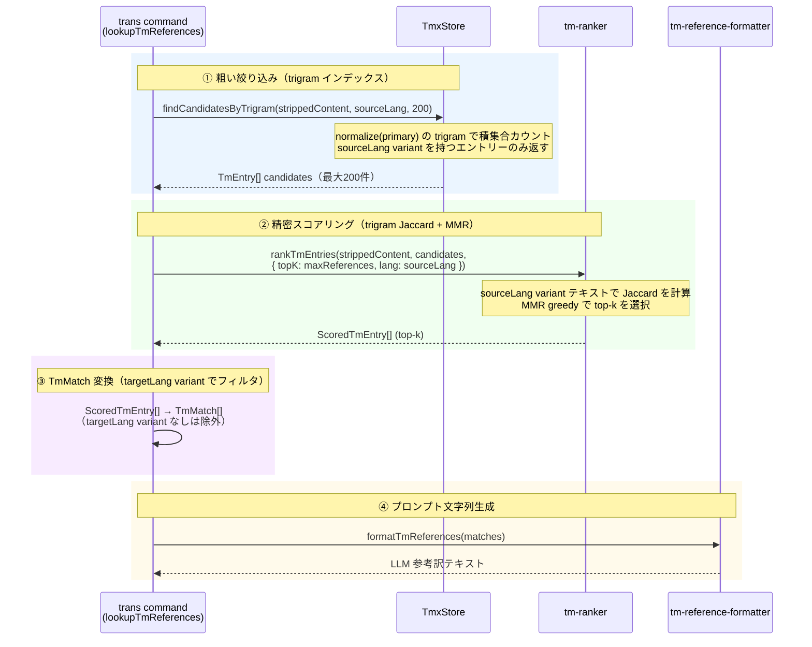

# チケット: TM スコアリングエンジン実装

## 1. 概要と方針

TM retrieval の品質向上のため、`TmxStore` に trigram 転置インデックスを追加し、`tm-ranker.ts` として trigram 類似度 + MMR によるスコアリングエンジンを新規実装する。trans 時の参考訳ランキングと将来の TM メンテ評価の共通基盤として設計する。

## 2. 仕様

### 2.1 TmxStore の拡張

- TmX ファイルロード時に trigram 転置インデックスを構築・キャッシュする
- `findCandidatesByTrigram(query: string, lang: string, limit: number): TmEntry[]` メソッドを追加
  - クエリ文字列の trigram（3-gram）を生成し、インデックスとの積集合が多い候補を `limit` 件以内で返す
  - 対象言語（`lang`）の variants を検索対象とする

### 2.2 tm-ranker の新規作成

- ファイル：`src/core/tm/tm-ranker.ts`
- インターフェース：`rankTmEntries(query: string, candidates: TmEntry[], options?: RankOptions): ScoredTmEntry[]`
- `ScoredTmEntry` = `TmEntry & { score: number }`
- `RankOptions`:
  - `topK: number`（返す最大件数、デフォルト 5）
  - `lambda: number`（MMR の関連度/多様性バランス、0〜1、デフォルト 0.7）
  - `lang: string`（スコアリング対象言語）

### 2.3 アルゴリズム

1. **trigram 類似度**：クエリと各 candidate の対象 variant テキストを trigram 集合に変換し、Jaccard 係数でスコアを計算
2. **MMR (Maximal Marginal Relevance)**：greedy に top-k を選択
   - スコア = λ × (クエリとの類似度) − (1 − λ) × max(既選候補との類似度)
   - λ が高いほど関連度重視、低いほど多様性重視

### 2.4 trans コマンドへの組み込み

- 既存の `searchBySource()` による retrieval を `findCandidatesByTrigram() → rankTmEntries()` パイプラインに置き換える
- `tm-reference-formatter.ts` による整形は変更なし

## 3. シーケンス図



## 4. 設計

### 4.1 TmxStore への追加箇所

#### 追加フィールド（`TmxStore` クラス内）

```
private trigramIndex = new Map<string, Set<string>>()  // trigram → Set<tuid>
```

`index`（tuid→TmEntry）と並列で保持。

#### 変更メソッド

| メソッド | 変更内容 |
|---------|---------|
| `load(filePath)` | `this.index = parseTmx(xml)` の直後に `rebuildTrigramIndex()` を呼ぶ |
| `addEntry(entry)` | upsert完了後に `indexEntry(normalizedEntry)` でインクリメンタル更新 |
| `clear()` | `this.trigramIndex.clear()` を追加 |

`loadIfNeeded` / `resetInstance` / `save` は変更不要。

#### 新規プライベートメソッド

- `rebuildTrigramIndex()` — `this.index` の全エントリーをスキャンして `trigramIndex` を一から構築。`load()` 専用
- `indexEntry(entry: TmEntry)` — 単一エントリーの主テキストを正規化・trigram化し `trigramIndex` に加算。`addEntry()` から呼ぶ

#### 新規パブリックメソッド

```typescript
findCandidatesByTrigram(query: string, lang: string, limit: number): TmEntry[]
```

1. `normalize(query)` → `stripMarkdown(query).toLowerCase().trim()`
2. `computeTrigrams(queryNorm)` → `Set<string>` （3文字スライド）
3. クエリ trigram が空なら `[]` を返す
4. `trigramIndex` を走査して tuid ごとのヒット数をカウント
5. ヒット数降順でソート
6. `entry.variants.has(lang)` でフィルタ（sourceLang variant を持つもののみ）
7. 先頭 `limit` 件の `TmEntry[]` を返す

**`limit` のデフォルト値 200 の根拠**: 後段 MMR の計算コストは O(topK × candidates) ≈ O(5 × 200) = O(1000) であり、trigram ヒット率と後段コストのトレードオフとして妥当。少なすぎると高再現率が損なわれ、多すぎると MMR 計算コスト増加につながる。

### 4.2 正規化パイプライン

```
rawText
  → stripMarkdown(text)      ← tm-text-normalizer.ts の既存関数を再利用
  → .toLowerCase()
  → .trim()
  → computeTrigrams()        ← Unicode 文字配列として 3 文字ずつスライド
```

- パディングなし（文字列が 3 文字未満は trigram 0件 → ヒット 0）
- trigram のキャラクタ単位の走査は `[...text]` のスプレッド展開で Unicode サロゲートに対応
- **`computeTrigrams` の定義先**: `src/core/tm/tm-text-normalizer.ts` にモジュールレベル関数としてエクスポートし、`TmxStore` と `tm-ranker.ts` の両方から import する（インデックス構築時とスコアリング時で同一の trigram 生成ロジックを保証するため）

**インデックスの対象テキスト**: `entry.primary`（正準ソース文）を使用。
- primary = 全エントリーで必ず存在し、`tuid` の元になるテキスト
- sourceLang と primaryLang が異なる構成では精度が下がる可能性があるが、現在の運用では問題ない

### 4.3 tm-ranker.ts インターフェース

```typescript
// src/core/tm/tm-ranker.ts

export type ScoredTmEntry = TmEntry & { score: number };

export interface RankOptions {
  topK?: number;    // デフォルト: 5
  lambda?: number;  // MMR λ、デフォルト: 0.7（関連度重視）
  lang: string;     // スコアリング対象言語（sourceLang を渡す）
}

export function rankTmEntries(
  query: string,
  candidates: TmEntry[],
  options: RankOptions,
): ScoredTmEntry[]
```

**内部処理**:
1. `normalize(query)` + `computeTrigrams()` → queryTrigrams
2. 各 candidate の `variants.get(lang)?.text` を正規化 → candidateTrigrams をキャッシュ
3. `lang` variant がない candidate は除外
4. Jaccard 係数: `|A ∩ B| / |A ∪ B|`（ゼロ除算時は 0）
5. MMR greedy 選択ループで top-k を選出。`score` = 最終 MMR スコア

#### MMR 選択ループ

```
selected = []
remaining = lang variant ありの candidates（querySim 降順にソート済み）

while selected.length < topK && remaining.length > 0:
  if selected が空:
    best ← remaining[0]（最高 querySim）
  else:
    best ← argmax over remaining:
              lambda * querySim(c) − (1−lambda) * max_{s∈selected}(sim(s, c))
  selected.push({ ...best, score: best_mmr_score })
  remaining から best を除去
```

- `lambda = 1.0` のとき MMR スコア = querySim → 純粋な類似度順と一致（品質要件に対応）
- `lambda = 0.0` のとき被選択候補とできるだけ異なるものを選択

### 4.4 trans コマンドへの組み込み

変更対象: `lookupTmReferences()` in `src/commands/trans/trans-command.ts`

#### 現在のフロー（削除対象部分）

```typescript
const sentences = sentenceSplitter.split(strippedContent, sourceLang);
const hashes = sentences.filter(...).map(text => calculateHash(text, true));
const matches = store.lookupBatch(hashes, sourceLang, targetLang);
```

#### 新しいフロー

```
strippedContent
  → store.findCandidatesByTrigram(strippedContent, sourceLang, 200)
  → rankTmEntries(strippedContent, candidates, { topK: maxReferences, lang: sourceLang })
  → filter: e.variants.has(targetLang)
  → convert to TmMatch[] (source/target テキスト抽出)
  → formatTmReferences(matches)
```

`TmMatch` への変換:
- `sentenceHash` ← `e.tuid`
- `source` ← `e.variants.get(sourceLang)!.text`
- `target` ← `e.variants.get(targetLang)!.text`
- `firstUsedIn` ← `e.variants.get(sourceLang)?.unitPath ?? ""`

**import 整理**: `SentenceSplitter` / `calculateHash` が不要になるが、他の箇所で使用されていないかをコーダーが確認の上で除去すること。`stripMarkdown` は既存使用があるため維持。

### 4.5 テスト方針

全テストは `src/test/core/tm/` に配置（VS Code 非依存の pure Node テスト）。

| ファイル | 種別 | 観点 |
|--------|----|----|
| `tmx-store.test.ts`（既存に追加） | 追加 | `findCandidatesByTrigram` の基本動作、limit 守守、lang フィルタ、`addEntry` 後のインデックス更新、`load()` でのインデックス構築 |
| `tm-ranker.test.ts`（新規） | 新規 | `rankTmEntries` — lambda=1.0 時に querySim 降順と一致、MMR が多様な候補を選択、空/lang なし候補のエッジケース |

`test-gui/` への追加は不要（UI 非依存のため）。

## 5. 考慮事項

- `TmxStore` はシングルトンのため、インデックスはメモリに保持。メモリ使用量は TM サイズに比例するが許容範囲内とする
- `addEntry()` でインクリメンタル更新（`indexEntry` 追記のみ）することで全再構築を避ける。primary 変更時も stale trigram が残るが、tuid は正常に存在するため検索品質への影響は軽微（コースフィルタの過近似は許容）
- 既存の `lookupByHash` / `lookupBatch` / `searchBySource` / `getEntriesByUnitPath` は変更なし（後方互換維持）
- `findCandidatesByTrigram` は sourceLang variant の**存在**のみをフィルタ条件とする。targetLang フィルタはコマンド層 (`lookupTmReferences`) の責務とし、Core と Commands の責務分離を維持する
- `sentenceSplitter` による文分割が不要になることで、ユニット全体が1つの検索クエリとなる。これは長い段落でも候補を見つけやすくなる一方、短文での精度は Jaccard スコアリングで保証する
- 初回は trans コマンドのみ組み込み。将来の TM メンテ用途では同じ `rankTmEntries` 関数を再利用できる

## 6. 実装・テスト計画と進捗

- [x] `TmxStore` に `trigramIndex` フィールドと `rebuildTrigramIndex()` / `indexEntry()` プライベートメソッドを追加
- [x] `TmxStore.load()` 末尾に `rebuildTrigramIndex()` 呼び出しを追加
- [x] `TmxStore.addEntry()` 末尾に `indexEntry()` 呼び出しを追加
- [x] `TmxStore.clear()` に `this.trigramIndex.clear()` を追加
- [x] `TmxStore.findCandidatesByTrigram()` 実装
- [x] `src/core/tm/tm-ranker.ts` 新規作成（`ScoredTmEntry`, `RankOptions`, `rankTmEntries`, 内部ヘルパー）
- [x] `trans-command.ts` の `lookupTmReferences()` を新パイプラインに差し替え・不要 import の整理
- [x] `src/test/core/tm/tm-ranker.test.ts` 新規作成
- [x] `src/test/core/tm/tmx-store.test.ts` に trigram インデックス関連テストを追加

## 7. 品質要件チェック

- [ ] 10万件規模でも trans の応答速度が実用的であること（体感で許容範囲内）
- [x] 既存テストがすべてパスすること（pre-existing 失敗5件は本チケット対象外）
- [x] `lambda=1.0` のとき MMR が純粋な類似度順と一致すること（`tm-ranker.test.ts` で検証済み）
- [x] クエリに近い候補が存在するとき、それが top-1 に選ばれること（`tm-ranker.test.ts` で検証済み）

## 8. まとめと改善提案

（完了後に記載）

## 9. 参考

- wishlist: [tasks/wishlist.md](../wishlist.md) - TMスコアリングエンジン節
- TM概念設計: [tasks/done/tm.md](../done/tm.md) - 7章・8.3節
- 関連ファイル：`src/core/tm/tmx-store.ts`, `src/core/tm/tm-reference-formatter.ts`, `src/core/tm/tm-text-normalizer.ts`
