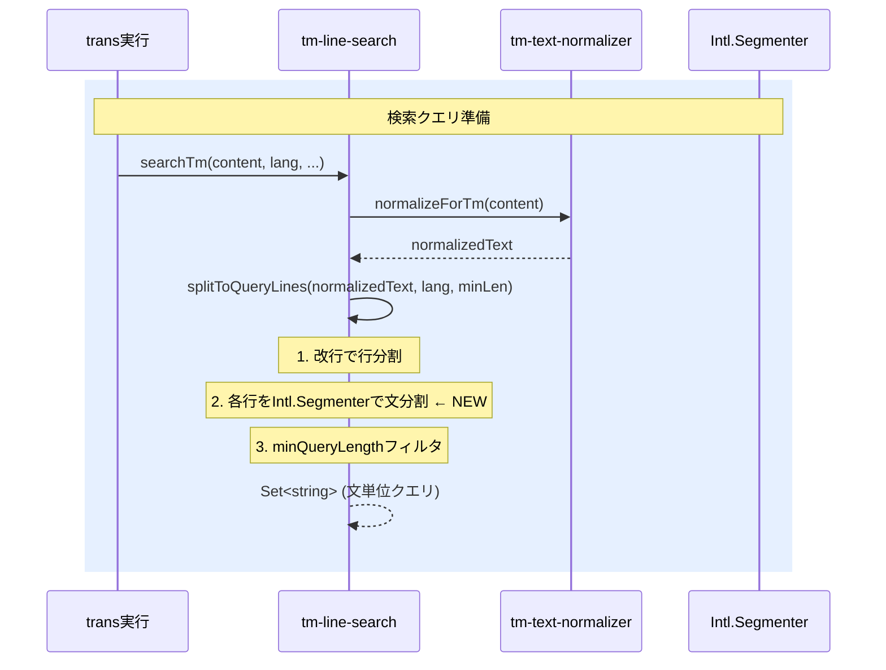

# チケット: TM検索クエリ文単位分割

## 1. 概要と方針

TM検索クエリの分割粒度を「行（段落）」から「文」に細分化し、TMエントリ（文単位）との粒度を揃えてJaccard類似度の精度を向上させる。付随してSentenceSplitterのCRLFバグを修正する。

## 2. 仕様

### 主要変更: splitToQueryLinesの文分割追加
- `tm-line-search.ts` の `splitToQueryLines` で、改行分割後の各行に対して `Intl.Segmenter(lang, { granularity: "sentence" })` を適用
- 既存の `minQueryLength` フィルタは文分割後にも適用
- 言語パラメータは `searchTm` の既存引数から取得

### バグ修正: SentenceSplitterのCRLF対応
- `sentence-splitter.ts` の `split(/\n\n+/)` を `/(\r?\n){2,}/` に修正

### 期待効果（chemistry.md実験結果）
- 60字超クエリ: 15件 → 7件
- 101字超クエリ: 4件 → 0件
- NMRデータ等の非文テキストは非分割（正しい挙動）

## 3. シーケンス図



## 4. 設計

### 変更対象ファイル

| ファイル | 変更内容 |
|---------|---------|
| `src/core/tm/tm-line-search.ts` | `splitToQueryLines`にIntl.Segmenter追加、langパラメータ追加 |
| `src/core/tm/sentence-splitter.ts` | CRLF対応の正規表現修正 |
| `src/test/core/tm/tm-line-search.test.ts` | 文分割の動作テスト追加 |
| `src/test/core/tm/sentence-splitter.test.ts` | CRLFテスト追加 |

### splitToQueryLines変更案

```typescript
// Before
function splitToQueryLines(normalizedText: string, minQueryLength: number): Set<string> {
    const lines = normalizedText.split("\n");
    // ...filter by minQueryLength
}

// After
function splitToQueryLines(normalizedText: string, lang: string, minQueryLength: number): Set<string> {
    const lines = normalizedText.split("\n");
    const segmenter = new Intl.Segmenter(lang, { granularity: "sentence" });
    const result = new Set<string>();
    for (const raw of lines) {
        const trimmed = raw.trim();
        // 各行をIntl.Segmenterで文分割
        for (const { segment } of segmenter.segment(trimmed)) {
            const s = segment.trim();
            if (s.length >= minQueryLength) {
                result.add(s);
            }
        }
    }
    return result;
}
```

### SentenceSplitter CRLF修正

```typescript
// Before
const paragraphs = protected_.split(/\n\n+/);
// After
const paragraphs = protected_.split(/(?:\r?\n){2,}/);
```

## 5. 考慮事項

- `splitToQueryLines`のシグネチャ変更（`lang`追加）により呼び出し元も修正が必要
- `Intl.Segmenter`はNode.js v16+で標準利用可能（VS Code Extension環境では問題なし）
- Segmenterインスタンスの生成コストを考慮し、関数内で1回だけ生成する

## 6. 実装・テスト計画と進捗

- [x] `splitToQueryLines`への文分割追加（tm-line-search.ts）
- [x] 呼び出し元への`lang`パラメータ追加
- [x] SentenceSplitterのCRLF対応修正（sentence-splitter.ts）
- [x] tm-line-searchの文分割テスト追加
- [x] sentence-splitterのCRLFテスト追加
- [x] 既存テスト全パス確認

## 7. 品質要件チェック

- [x] 既存テストが全てパスする（※本チケット変更分は全パス。既存10件の失敗はtm-cleanup/tm-reference-formatter/translation-memory-cleanup-serviceの既存問題）
- [x] 文分割が日本語・英語で正しく動作する
- [x] CRLFファイルでSentenceSplitterが正しく動作する
- [x] NMRデータ等の非文テキストが誤分割されない

## 8. まとめと改善提案

- レビューで正規表現のキャプチャグループ問題 `/(\ r?\n){2,}/` → `/(?:\r?\n){2,}/` を指摘され修正
- `splitToQueryLines` → `splitToQuerySentences` にリネーム（実態に合った命名）
- 改善提案: SentenceSplitterクラスは将来的にハイブリッドパイプラインに統合する余地がある

## 9. 参考

- chemistry.mdでの実験結果（長さ分布比較）は wishlist.md に記載
- Intl.Segmenter: https://developer.mozilla.org/en-US/docs/Web/JavaScript/Reference/Global_Objects/Intl/Segmenter
- Intl.Segmenter: https://developer.mozilla.org/en-US/docs/Web/JavaScript/Reference/Global_Objects/Intl/Segmenter
